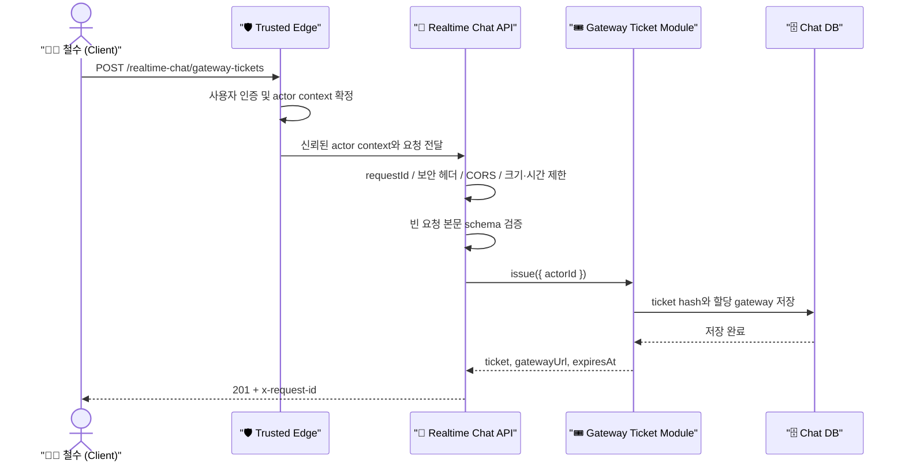
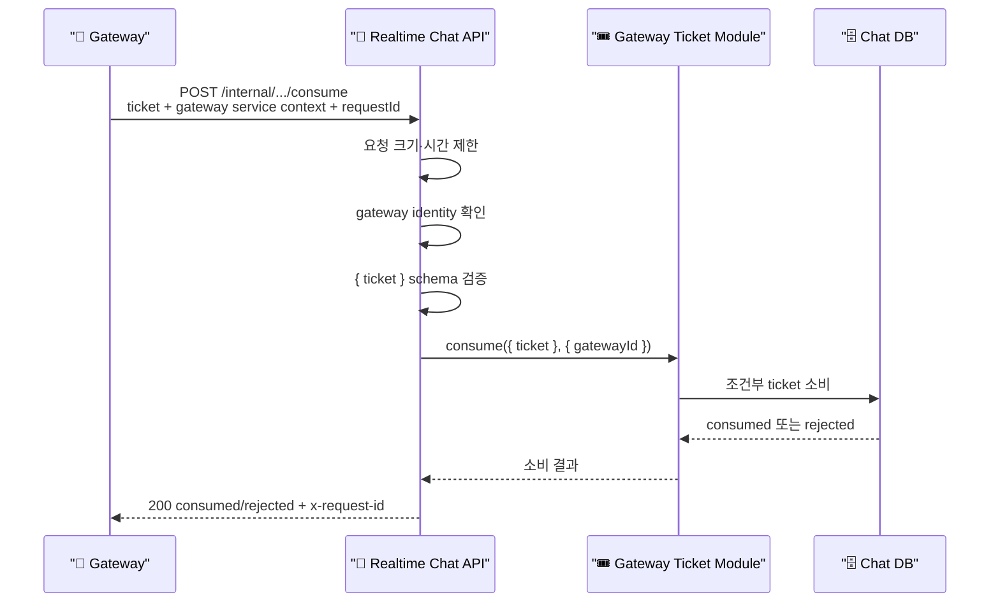
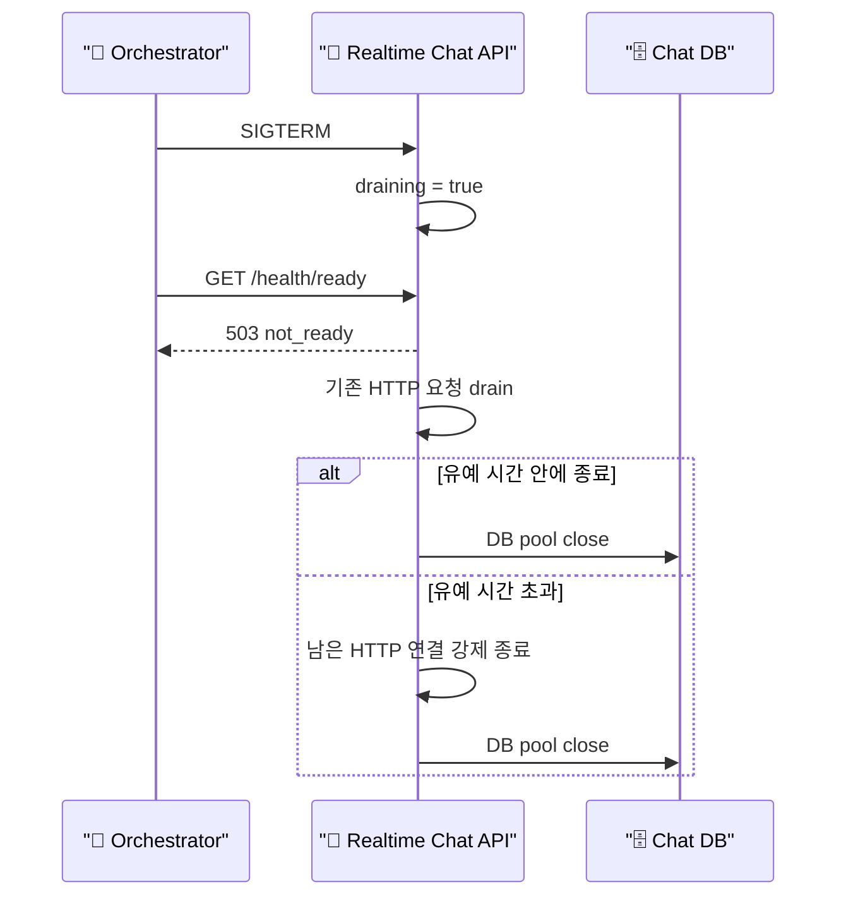

# 🏢 실시간 채팅 API 런타임 쉘

## 📄 문서 목적

이 문서는 `realtime-chat-api`가 단순히 HTTP endpoint만 여는 서버가 아니라, 외부 요청과 gateway-ticket
유스케이스 사이에서 어떤 운영 안전장치를 제공하는지 이해하기 쉽게 설명합니다.

*현재 공개 계약은 `public-docs/runtime-contract.md`가 기준입니다. 이 문서는 구현 과정에서 합의한 배경과
운영 흐름을 사람에게 설명하기 위한 notes이며, 에이전트의 기본 context route에는 포함하지 않습니다.*

## 🎭 등장요소

* 🧑‍💻 `Client (철수)` : 실시간 채팅 gateway에 접속하기 전에 일회성 ticket을 요청하는 브라우저
* 🛡️ `Trusted Edge / Auth Boundary` : 철수의 인증 정보를 검증하고 신뢰할 수 있는 actor context를 만드는 경계
* 🏢 `Realtime Chat API` : HTTP 요청을 보호하고 gateway-ticket 유스케이스를 조립하는 런타임 쉘
* 🎪 `Gateway` : 클라이언트에게 받은 ticket의 소비를 API에 요청하는 WebSocket 서버
* 🎟️ `Gateway Ticket Module` : ticket 발급과 일회성 소비 규칙을 실행하는 도메인 유스케이스
* 🗄️ `Realtime Chat Database` : ticket 상태를 원자적으로 기록하고 readiness 확인 대상이 되는 저장소
* 🚦 `Load Balancer / Orchestrator` : liveness와 readiness를 보고 트래픽 투입·제거를 결정하는 배포 환경

---

## 🍿 한 눈에 보는 요청 처리

API 서버에 요청이 도착했다고 해서 바로 유스케이스를 호출하지 않습니다. 공항 검색대를 차례로 통과하듯,
요청은 런타임 안전장치를 순서대로 거칩니다.

1. API는 요청마다 `requestId`를 만들거나 전달받아 한 요청의 로그를 끝까지 이어 붙입니다.
2. 기본 보안 헤더를 붙이고, 외부 브라우저 요청이면 허용된 Origin인지 확인합니다.
3. 지나치게 큰 본문과 너무 오래 걸리는 요청을 미리 제한합니다.
4. 발급 요청에서는 trusted edge가 만든 actor context를 읽고, 클라이언트 본문의 `actorId`는 믿지 않습니다.
5. 소비 요청에서는 인증된 gateway context를 읽고, 본문의 `gatewayId`는 믿지 않습니다.
6. contracts schema로 JSON 모양을 확인한 뒤에만 🎟️ `Gateway Ticket Module`을 호출합니다.
7. 성공·도메인 거절·인프라 장애를 서로 다른 HTTP 응답으로 매핑합니다.
8. 마지막으로 상태 코드와 처리 시간을 Pino 구조화 로그에 남깁니다. ticket 원문과 인증 헤더는 남기지 않습니다.

---

## 🎬 시퀀스 다이어그램 (ticket 발급 요청)

## 🎬 시퀀스 다이어그램 (gateway 내부 소비 요청)

## 🚦 배포 중 상태 확인과 안전한 종료

API 서버가 살아 있다는 것과 새 트래픽을 받을 준비가 됐다는 것은 같은 의미가 아닙니다.

* 💓 **Liveness**: 프로세스가 HTTP 응답을 만들 수 있는지만 확인합니다. DB가 잠시 아프다고 프로세스를
  무한 재시작하지 않습니다.
* ✅ **Readiness**: 종료 중이 아니고 DB에 실제 쿼리를 보낼 수 있을 때만 `ready`를 반환합니다.
* 🛑 **Graceful shutdown**: 종료 신호가 오면 readiness를 먼저 내리고 새 트래픽을 끊은 뒤, 진행 중인
  HTTP 요청과 DB pool을 정리합니다.
* ⏰ **종료 deadline**: 유예 시간이 끝날 때까지 남은 연결이 버티면 강제로 닫아 배포가 무한정 멈추지 않게 합니다.

## 🛡️ 런타임 안전장치가 해결하는 문제

* **요청 추적 단절 방지**: `requestId`로 gateway, API, 로그 사이의 한 요청을 연결합니다.
* **느린 요청 점유 방지**: handler, HTTP header, request, keep-alive 시간을 서로 다른 계층에서 제한합니다.
* **과대 본문 방지**: 작은 JSON API에 불필요하게 큰 body가 들어와 메모리를 점유하는 상황을 막습니다.
* **신뢰 경계 역전 방지**: actor와 gateway identity를 클라이언트 JSON에서 읽지 않습니다.
* **로그 비밀값 유출 방지**: ticket 원문, 인증 헤더, 전체 query string을 접근 로그에서 제외합니다.
* **배포 정지 방지**: readiness와 종료 deadline으로 무중단 배포가 특정 연결 때문에 멈추지 않게 합니다.

---

## 🧩 함수형 조립을 선택한 이유

이 앱은 `createRealtimeChatApiApp()`에 인증 함수, readiness 함수, ticket service, logger를 전달해
조립합니다. 서비스 클래스를 상속하거나 거대한 application 객체를 두지 않습니다.

* 미들웨어는 입력을 받고 다음 함수를 호출하는 작은 함수로 유지합니다.
* 오류는 클래스 계층 대신 태그된 오류 생성 함수와 타입 가드로 구분합니다.
* 변경 가능한 상태는 `main.ts`의 종료 상태와 앱 팩터리 경계 안에서만 소유합니다.
* Hono의 `HTTPException`처럼 프레임워크가 요구하는 객체는 프레임워크 경계에서만 사용합니다.

이 방식은 테스트에서 DB나 실제 인증 서버 없이도 작은 함수를 주입해 요청 흐름을 검증할 수 있게 합니다.

## 🎯 깔끔한 책임 구분

* 🛡️ **Trusted Edge / Auth Boundary**: actor와 gateway의 실제 신원을 검증하고 위조 가능한 외부 헤더를 제거하기
* 🏢 **Realtime Chat API**: HTTP 보호, 인증 context 연결, schema 검증, 오류·로그·상태 확인·종료 조립하기
* 🎟️ **Gateway Ticket Module**: ticket 발급·할당·만료·일회성 소비 규칙 실행하기
* 🗄️ **Realtime Chat Database**: ticket 상태를 원자적으로 저장하고 소비하기
* 🚦 **배포 환경**: readiness를 기준으로 트래픽을 제거하고 종료 유예 시간을 보장하기

## 🧭 아직 결정하지 않은 것

* 최종 actor JWT/JWKS 검증과 actor mapping 방식
* mTLS 또는 서명된 서비스 토큰 기반 gateway 인증
* 다중 API 인스턴스에서 공유하는 분산 rate limit
* DB statement timeout과 취소 신호 전파
* metric backend와 tracing exporter
