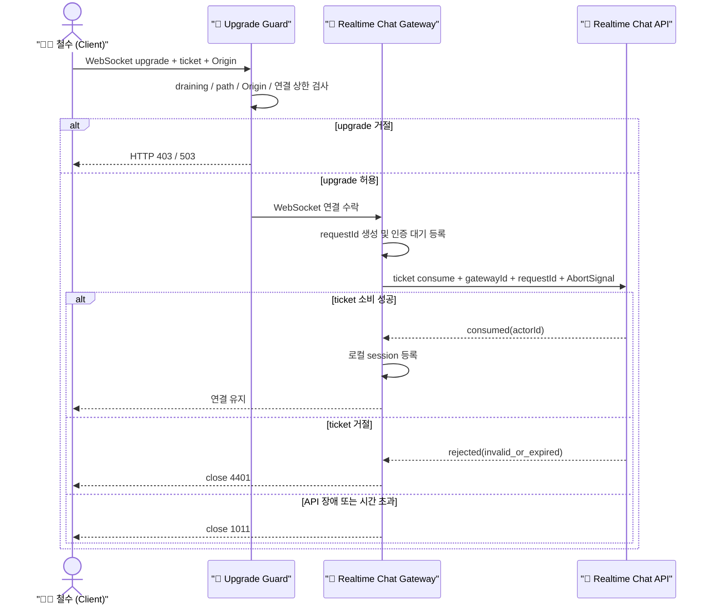
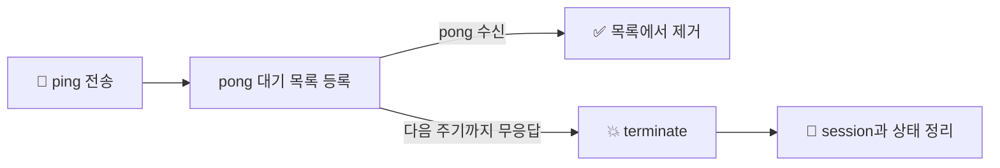
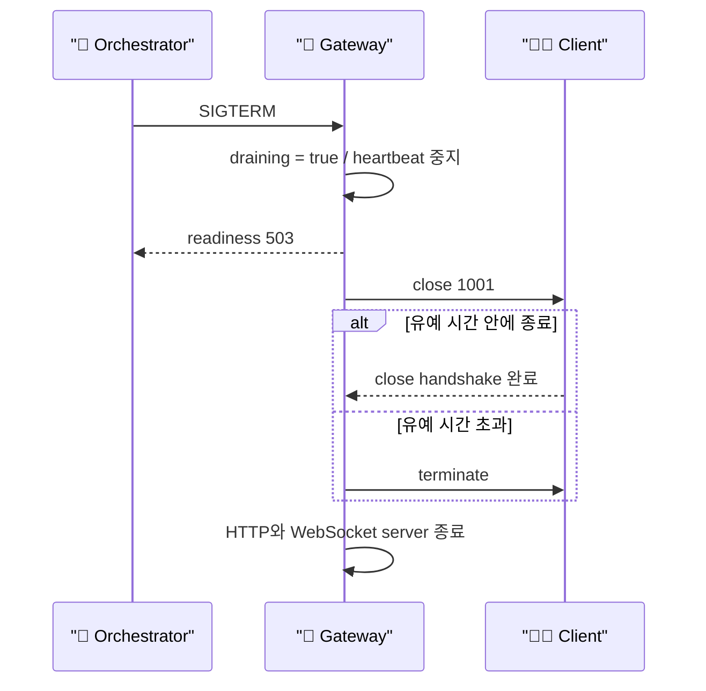

# 🎪 실시간 채팅 Gateway 런타임 쉘

## 📄 문서 목적

이 문서는 `realtime-chat-gateway`가 WebSocket 연결을 받을 때 어떤 순서로 입구를 지키고, ticket을
검증하고, 죽은 연결을 정리하며, 배포 중 안전하게 내려가는지 이해하기 쉽게 설명합니다.

*현재 공개 계약은 `public-docs/runtime-contract.md`가 기준입니다. 이 문서는 구현 과정의 배경과 연결
생명주기를 설명하는 사람용 notes이며, 에이전트의 기본 context route에는 포함하지 않습니다.*

## 🎭 등장요소

* 🧑‍💻 `Client (철수)` : 일회성 ticket을 들고 WebSocket 연결을 요청하는 브라우저
* 🚪 `HTTP Upgrade Guard` : path, draining, Origin, 전체 연결 수를 먼저 확인하는 입구
* 🎪 `Realtime Chat Gateway` : WebSocket 연결과 로컬 세션 생명주기를 소유하는 런타임 쉘
* 🏢 `Realtime Chat API` : ticket을 소비하고 연결할 actor를 확정해 주는 내부 API
* 💓 `Heartbeat` : ping/pong으로 실제로 살아 있는 연결인지 주기적으로 확인하는 파수꾼
* 🚦 `Load Balancer / Orchestrator` : readiness와 종료 신호로 gateway 배포를 조정하는 환경

---

## 🍿 한 눈에 보는 연결 수립

철수가 WebSocket 주소를 열었다고 바로 채팅 세션이 되는 것은 아닙니다. 연결은 세 개의 관문을 차례로
통과합니다.

1. 🚪 `Upgrade Guard`가 gateway가 종료 중인지, path와 Origin이 맞는지, 전체 연결 상한을 넘지 않았는지 확인합니다.
2. WebSocket을 수락한 뒤 연결별 `requestId`를 만들고 개별 `error`, `close`, `pong` 처리 함수를 붙입니다.
3. 동시에 인증 중인 연결이 너무 많으면 `1013`으로 빠르게 돌려보냅니다.
4. ticket이 없으면 `4401`로 닫고, 있으면 🏢 `Realtime Chat API`에 일회성 소비를 요청합니다.
5. API 요청에는 gateway identity, `requestId`, 취소 신호를 함께 전달합니다.
6. 정해진 시간 안에 API 응답이 없으면 요청을 취소하고 연결을 `1011`로 닫습니다.
7. ticket이 소비된 연결만 로컬 세션 Map에 등록합니다.
8. 연결 중에는 💓 `Heartbeat`가 pong을 확인하고, 끊겼는데 흔적만 남은 연결은 즉시 정리합니다.

---

## 🎬 시퀀스 다이어그램 (WebSocket 연결 수립)

## 💓 Heartbeat가 필요한 이유

정상적인 브라우저 종료는 `close` 이벤트를 보내지만, 와이파이가 갑자기 끊기거나 노트북이 잠들면 양쪽이
연결이 죽었다는 사실을 오래 모를 수 있습니다. 그러면 gateway의 session Map에는 유령 연결이 남습니다.

1. gateway는 일정 주기마다 모든 연결에 `ping`을 보냅니다.
2. 클라이언트가 살아 있으면 WebSocket 규약에 따라 `pong`이 돌아옵니다.
3. 다음 주기까지 pong이 오지 않은 연결은 정상 close handshake를 기다리지 않고 `terminate()`합니다.
4. `close` 처리 함수가 session, 인증 대기 목록, heartbeat 목록을 한꺼번에 정리합니다.

## 🛑 배포 중 안전한 종료

gateway는 장시간 연결을 소유하므로 HTTP API보다 종료가 까다롭습니다.

1. 종료 신호를 받으면 먼저 `draining` 상태로 전환합니다.
2. readiness는 `not_ready`가 되고 새 upgrade는 `503`으로 거절됩니다.
3. heartbeat timer를 멈추고 기존 client에 `1001 서버 종료 중` close를 보냅니다.
4. WebSocket과 HTTP server가 정상 종료되기를 함께 기다립니다.
5. 유예 시간이 지나도 남은 WebSocket은 `terminate()`하고 HTTP 연결도 강제로 닫습니다.
6. `close()`를 여러 번 호출해도 같은 Promise를 돌려줘 종료 과정이 중복 실행되지 않습니다.

## 🛡️ Gateway 안전장치가 해결하는 문제

* **출처 없는 브라우저 연결 차단**: 허용 Origin 목록으로 예상하지 않은 웹 페이지의 upgrade를 거절합니다.
* **연결 폭주 방지**: 전체 연결 수와 인증 대기 연결 수를 따로 제한합니다.
* **느린 내부 API 점유 방지**: ticket consume 요청에 제한 시간과 취소 신호를 적용합니다.
* **닫힌 소켓의 늦은 인증 방지**: API 응답이 늦게 와도 이미 닫힌 소켓은 session으로 등록하지 않습니다.
* **유령 세션 방지**: ping/pong heartbeat로 물리적으로 끊어진 연결을 제거합니다.
* **ticket 노출 방지**: 로그에는 ticket 원문이나 전체 query string을 남기지 않고 `requestId`만 전파합니다.
* **배포 정지 방지**: draining과 종료 deadline으로 장기 연결 때문에 배포가 무한정 대기하지 않게 합니다.

---

## 🧩 함수형 조립을 선택한 이유

gateway는 `createRealtimeChatGatewayApp()` 팩터리 안에서 필요한 `Map`, `Set`, timer를 클로저로
소유합니다. 별도의 GatewayApplication 클래스나 SessionManager 상속 계층을 만들지 않습니다.

* upgrade 검사, ticket 추출, API 요청, HTTP 응답, heartbeat, 종료를 작은 함수로 분리합니다.
* 외부 의존성은 `gatewayTicketConsumer`와 `logger` 함수 계약으로 주입합니다.
* 변경 가능한 collection은 팩터리 밖으로 내보내지 않고 count 조회 함수만 제공합니다.
* Node `Server`와 `WebSocket`은 프레임워크 경계 자원으로만 사용합니다.

이 구조는 실제 포트를 열어 보는 smoke test에서도 가짜 ticket consumer를 함수 하나로 주입할 수 있고,
Origin 거절, 시간 초과, 연결 상한, heartbeat를 서로 독립적으로 검증할 수 있게 합니다.

## 🎯 깔끔한 책임 구분

* 🧑‍💻 **Client**: API에서 발급받은 짧은 수명의 ticket으로 지정 gateway에 최초 연결하기
* 🚪 **Upgrade Guard**: draining, path, Origin, 전체 연결 상한을 확인하기
* 🎪 **Realtime Chat Gateway**: 인증 대기, 로컬 session, heartbeat, close/error, 종료 생명주기 소유하기
* 🏢 **Realtime Chat API**: ticket을 일회성으로 소비하고 연결할 actor를 반환하기
* 🚦 **배포 환경**: readiness를 보고 새 연결을 제거하고 종료 유예 시간을 보장하기

## 🧭 아직 결정하지 않은 것

* 메시지 envelope와 WebSocket protocol version 협상
* ACK, 재시도, 중복 메시지 처리 의미론
* 송신 큐 상한과 `bufferedAmount` 기반 slow consumer 제거
* 사용자·IP·gateway 단위 분산 rate limit
* 연결 수, 인증 실패, close code, heartbeat timeout metric
* mTLS 또는 서명된 서비스 토큰 기반 gateway 인증
