# realtime-chat package-owned 흐름 설명서

> 현재 구현은 API adapter와 Gateway adapter를 `packages/realtime-chat` 안에 둡니다. 이 문서의 participant는 단일 feature package 내부 adapter 경계를 기준으로 설명합니다.

## 0. 문서 목적

이 문서는 `apps`를 배포 단위이자 composition root로 보고, 실제 feature 흐름을 `packages/realtime-chat`의 API/Gateway adapter가 처리하는 기준으로 sequence diagram을 정리한 문서입니다.

이 문서의 핵심은 다음입니다.

```txt
apps는 요청을 해석하지 않는다.
apps는 command를 만들지 않는다.
apps는 handler를 구현하지 않는다.
apps는 package module을 mount한다.
```

---

## 1. 전체 런타임 구조

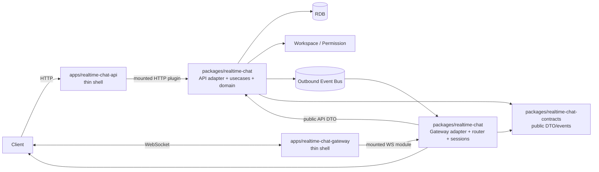

---

## 2. Flow 1. API app bootstrapping

### 설명

API app은 feature를 구현하지 않고, package module을 HTTP server에 등록합니다.

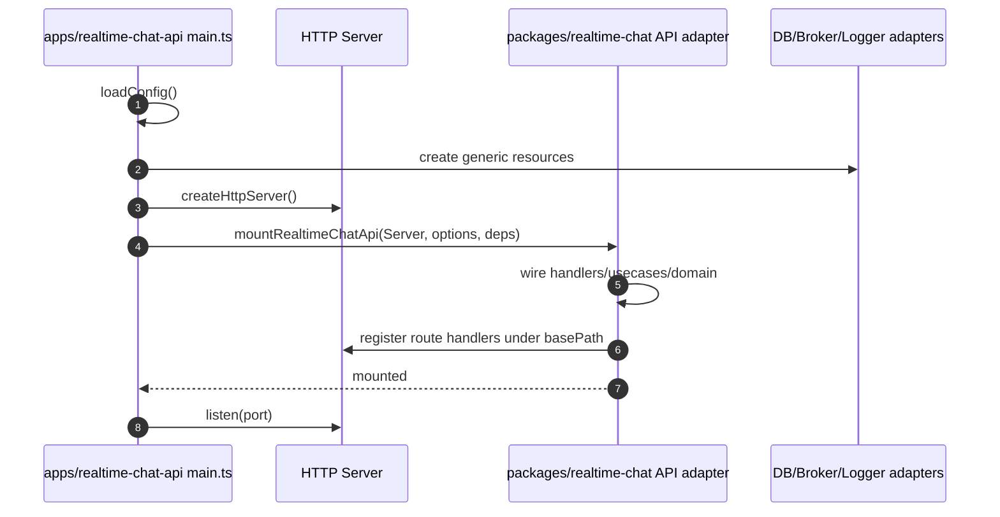

### 핵심

```txt
App은 module을 등록할 뿐 SendChannelMessageUsecase를 직접 만들지 않는다.
```

---

## 3. Flow 2. Gateway app bootstrapping

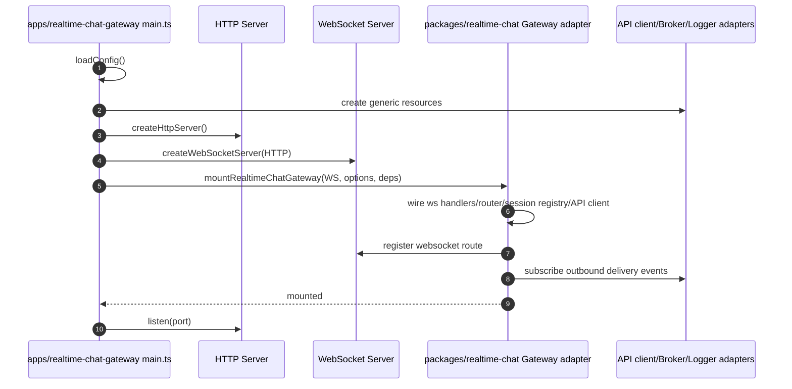

### 핵심

```txt
App은 ClientEventRouter를 만들지 않는다.
App은 socket event type switch를 하지 않는다.
```

---

## 4. Flow 3. Gateway ticket 발급

### 설명

HTTP request는 app의 server에 도착하지만, handler와 usecase는 API package가 처리합니다.

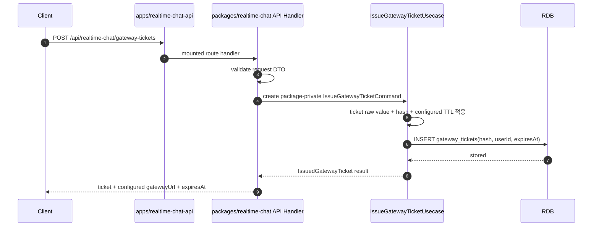

### app이 모르는 것

```txt
- IssueGatewayTicketCommand
- ticket hash 계산 방식
- gateway_tickets table
- TTL 정책
- gatewayUrl 결정
```

---

## 5. Flow 4. WebSocket 접속 성공

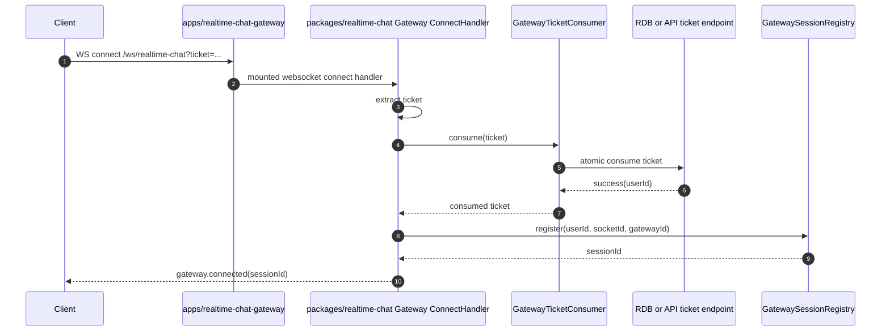

### app이 모르는 것

```txt
- ConsumeGatewayTicketCommand
- ticket hash 계산 방식
- GatewaySessionRegistry 자료구조
- gateway.connected payload mapping
```

---

## 6. Flow 5. WebSocket 접속 실패

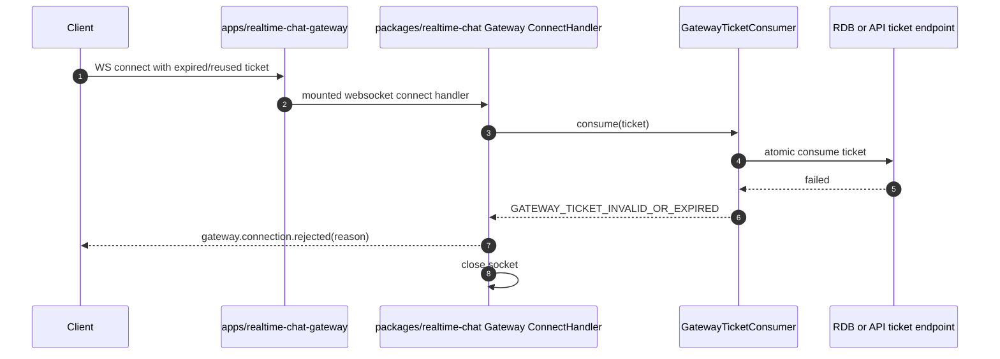

---

## 7. Flow 6. 채널 메시지 전송 성공

### 설명

Gateway adapter가 socket event를 public API DTO로 변환하고, API adapter가 public DTO를 내부 command로 변환합니다.

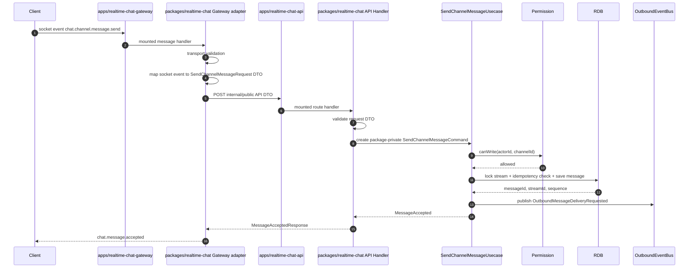

### app이 모르는 것

```txt
apps/realtime-chat-gateway가 모르는 것:
  - SendChannelMessageCommand
  - PermissionPort
  - ConversationStream

apps/realtime-chat-api가 모르는 것:
  - SendChannelMessageCommand
  - stream lock
  - repository
```

둘 다 모릅니다. command와 domain은 `packages/realtime-chat`의 API adapter 내부에 있습니다.

---

## 8. Flow 7. 권한 실패

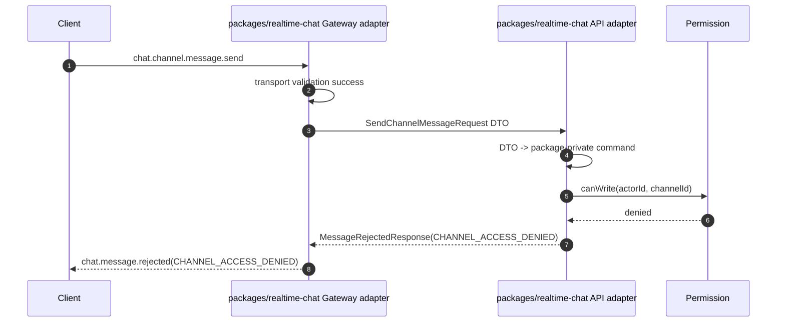

Gateway는 권한을 계산하지 않고, API 결과를 relay합니다.

---

## 9. Flow 8. ACK 유실 후 clientMessageId 재시도

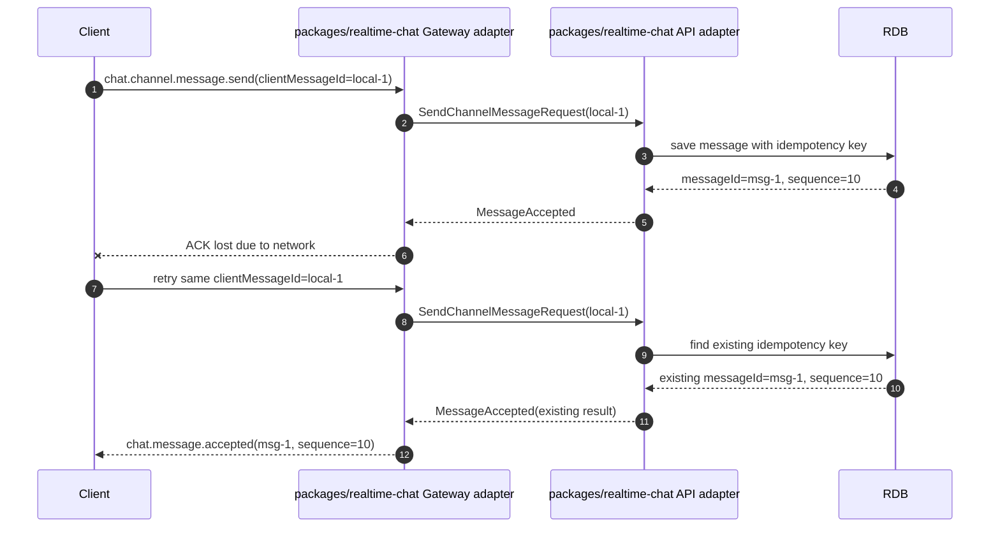

멱등성은 API adapter 책임입니다. Gateway adapter는 같은 event를 다시 relay할 뿐입니다.

---

## 10. Flow 9. Outbound delivery fan-out

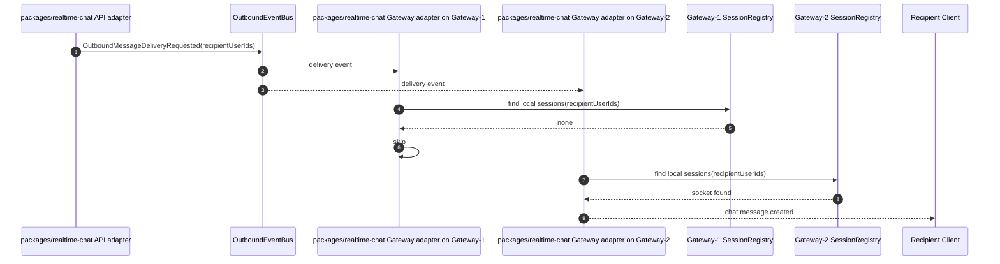

Gateway app은 이 event를 직접 구독하지 않습니다. `packages/realtime-chat` Gateway adapter mount가 subscriber를 시작합니다.

---

## 11. Flow 10. delivery publish 실패 후 afterSequence 복구

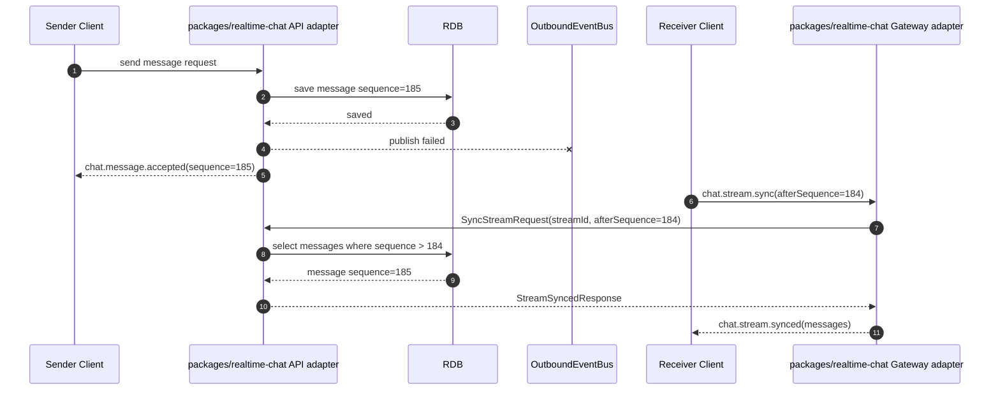

MVP에서 push 실패는 허용합니다. 저장된 메시지가 source of truth입니다.

---

## 12. Flow 11. Read cursor 전진

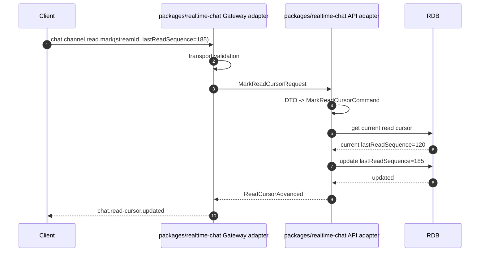

`lastReadSequence`가 기존 값보다 작거나 같으면 API package가 no-op 처리합니다.

---

## 13. Flow 12. Collaboration Session → system message

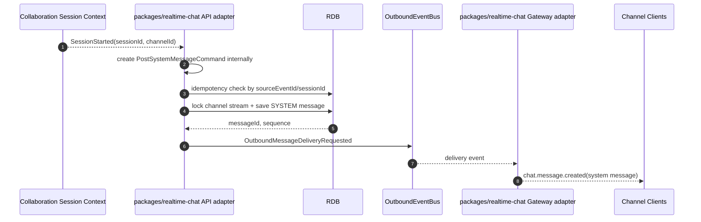

시스템 메시지 command도 `packages/realtime-chat` API adapter 내부 개념입니다.

---

## 14. 최종 흐름 요약

```txt
HTTP request가 들어온다
→ app server가 package handler로 넘긴다
→ package handler가 DTO를 검증한다
→ package handler가 package-private command를 만든다
→ package usecase가 domain/persistence/port를 사용한다
→ package가 public response DTO를 반환한다
→ app은 모른다
```

```txt
WebSocket event가 들어온다
→ app server가 package WS handler로 넘긴다
→ package router가 event type을 해석한다
→ package가 public API DTO를 만든다
→ API package가 내부 command로 변환한다
→ 결과가 public socket event로 돌아간다
→ app은 모른다
```
