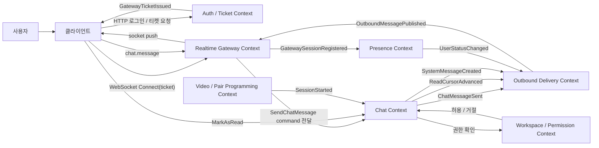
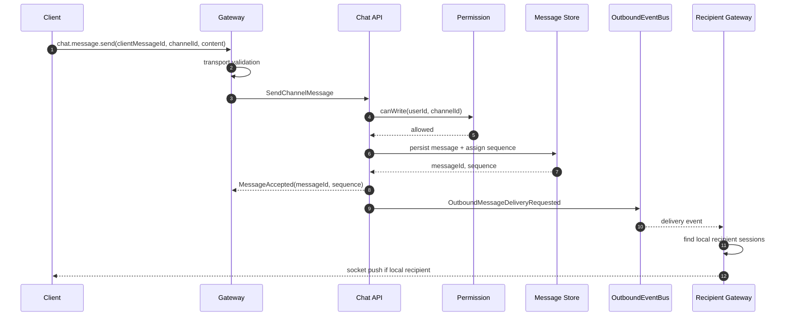
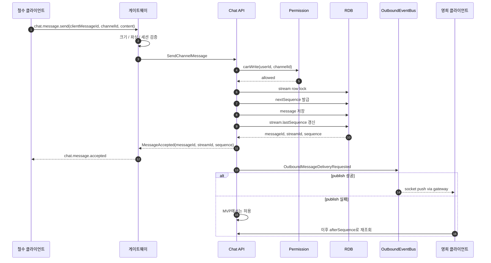
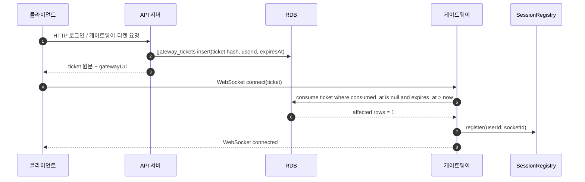
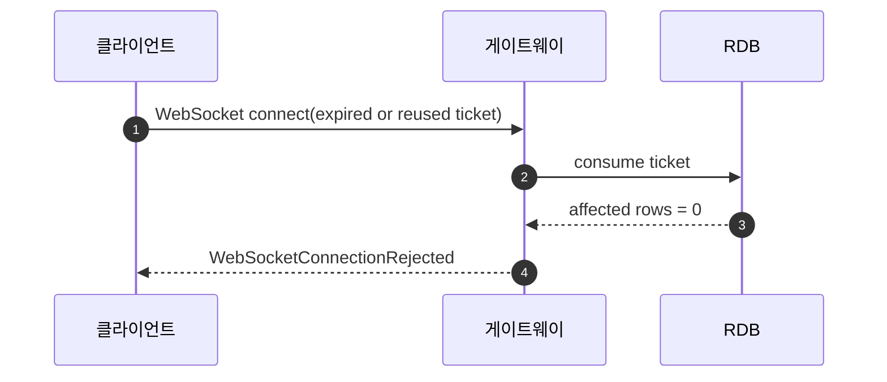

# wake-surfer 실시간 채팅 도메인 / 이벤트 스토밍 보고서

## 0. 스토밍 범위

이번 이벤트 스토밍의 중심 도메인은 **실시간 채팅**입니다.

화상 회의, 페어 프로그래밍, Presence, 인증, 게이트웨이, 브로커는 모두 채팅 도메인과 맞닿아 있지만, 채팅 도메인의 내부 규칙과는 분리해서 바라보는 것이 좋습니다.

핵심 판단은 다음과 같습니다.

> **채팅 도메인의 진짜 책임은 “사용자가 메시지를 보낼 수 있는가를 검증하고, 메시지를 순서 있게 기록하고, 읽음 상태와 알림 상태를 관리하는 것”이다.**
> 웹소켓 연결, 게이트웨이 세션, 브로커 전파는 채팅 도메인을 실시간으로 보이게 만드는 전달 인프라다.

---

# 1. 핵심 도메인 구분

## 1.1 Core Domain

### Chat Context

wake-surfer에서 이번에 구현할 중심 컨텍스트입니다.

책임은 다음과 같습니다.

| 책임        | 설명                                 |
| --------- | ---------------------------------- |
| 메시지 작성    | 채널, DM, 스레드에 메시지를 작성한다             |
| 메시지 검증    | 사용자가 해당 공간에 메시지를 쓸 수 있는지 검증한다      |
| 메시지 저장    | 서버 기준 메시지 ID와 순번을 발급하고 저장한다        |
| 메시지 정렬 보장 | 클라이언트가 동일한 순서로 메시지를 볼 수 있게 한다      |
| 읽음 상태     | 유저별 마지막 읽은 메시지 위치를 관리한다            |
| 시스템 메시지   | 외부 협업 세션 이벤트를 채팅 피드에 시스템 메시지로 기록한다 |

---

## 1.2 Supporting Domain

### Workspace / Membership / Permission Context

채팅이 직접 소유하기보다는 참조해야 하는 컨텍스트입니다.

| 책임           | 설명                                  |
| ------------ | ----------------------------------- |
| 워크스페이스 멤버 관리 | 누가 워크스페이스에 속해 있는지 관리                |
| 역할 관리        | Owner, Admin, Member, Guest 등 역할 관리 |
| 채널 접근 권한     | Public / Private 채널 접근 가능 여부 판단     |
| 메시지 작성 권한    | 특정 채널에 메시지를 쓸 수 있는지 판단              |

채팅 커맨드는 매번 `WorkspaceMember` 또는 권한 서비스에 질의해야 합니다.

---

### Presence Context

유저의 현재 상태를 관리합니다.

상태는 다음 네 가지입니다.

| 상태      | 의미      |
| ------- | ------- |
| ONLINE  | 온라인     |
| AWAY    | 자리비움    |
| BUSY    | 다른 용무 중 |
| OFFLINE | 오프라인    |

Presence는 채팅 메시지의 저장 규칙과는 분리됩니다. 다만 채팅 UI에서 상태 표시를 위해 Presence 이벤트를 구독합니다.

---

### Collaboration Session Context

화상 회의와 페어 프로그래밍 세션을 관리하는 컨텍스트입니다.

채팅 도메인과 만나는 지점은 다음 이벤트입니다.

```txt
SessionStarted
SessionEnded
```

채팅 도메인은 `SessionStarted`를 구독한 뒤, 해당 채널에 시스템 메시지를 생성합니다.

예:

```txt
"철수님이 페어 프로그래밍 세션을 열었습니다."
```

---

## 1.3 Generic / Technical Context

### Realtime Gateway Context

웹소켓 연결을 담당합니다.

| 책임       | 설명                                      |
| -------- | --------------------------------------- |
| 티켓 검증    | 클라이언트가 가져온 접속 티켓을 검증하고 소비               |
| 세션 등록    | userId와 socket connection을 로컬 레지스트리에 등록 |
| 전송 계층 검증 | 메시지 크기, JSON 파싱, 세션 존재 여부 확인            |
| API 전달   | 클라이언트 이벤트를 메인 API 서버로 전달                |
| 소켓 송신    | 배달 이벤트를 받아 실제 클라이언트 소켓으로 전송             |

중요한 점은 게이트웨이가 **채팅 권한을 최종 판단하지 않는다**는 것입니다.
게이트웨이는 전송 계층 수준의 방어만 수행하고, 도메인 검증은 API 서버의 Chat Context가 담당합니다.

---

### Outbound Delivery Context

메시지 저장 이후, 어떤 클라이언트에게 실시간으로 밀어줄지를 담당합니다.

1차 구현에서는 다음 포트와 어댑터로 대체합니다.

```txt
OutboundEventBusPort
  -> InMemoryOutboundEventBus
```

나중에 Redis Pub/Sub, Kafka, NATS, 영속 이벤트 스트림으로 교체할 수 있습니다.

---

# 2. 유비쿼터스 언어

| 용어               | 정의                             |
| ---------------- | ------------------------------ |
| Workspace        | 사용자가 협업하는 최상위 공간               |
| Channel          | 워크스페이스 내부의 목적별 대화 공간           |
| Public Channel   | 워크스페이스 멤버라면 참여 가능한 채널          |
| Private Channel  | 초대받은 멤버만 참여 가능한 채널             |
| DM               | 워크스페이스와 독립된 1:1 또는 그룹 대화       |
| Group DM         | 최대 10명까지 참여 가능한 DM             |
| Thread           | 특정 메시지에서 파생된 하위 대화 흐름          |
| Message          | 사용자가 작성한 일반 메시지                |
| System Message   | 시스템 또는 외부 컨텍스트 이벤트로 생성된 메시지    |
| Message Sequence | 서버가 저장 시점에 부여하는 정렬 기준 순번       |
| Read Cursor      | 유저가 마지막으로 읽은 메시지 위치            |
| Gateway Ticket   | 웹소켓 접속을 위한 일회성 티켓              |
| Gateway Session  | 특정 게이트웨이에 연결된 유저의 소켓 세션        |
| Outbound Event   | 저장된 메시지를 게이트웨이로 전달하기 위한 배달 이벤트 |
| Presence         | 유저의 온라인 / 자리비움 / 바쁨 / 오프라인 상태  |

---

# 3. 이벤트 스토밍 전체 그림



---

# 4. 주요 액터

| 액터                | 설명                                  |
| ----------------- | ----------------------------------- |
| 일반 사용자            | 채널 / DM / 스레드에 메시지를 작성하고 읽는다        |
| 워크스페이스 관리자        | 채널 생성, 멤버 초대, 권한 설정을 수행한다           |
| 클라이언트 앱           | 웹소켓 연결, 메시지 전송, 로컬 실패 처리, 재시도를 담당한다 |
| 메인 API 서버         | 도메인 검증, 저장, 순번 발급, 이벤트 발행을 담당한다     |
| 웹소켓 게이트웨이         | 연결 유지, 세션 등록, 소켓 송수신을 담당한다          |
| 메시지 브로커           | 저장된 메시지 배달 이벤트를 게이트웨이 서버군에 전파한다     |
| Presence 시스템      | 유저 상태 변경 이벤트를 발행한다                  |
| 화상 / 페어 프로그래밍 시스템 | 세션 시작 / 종료 이벤트를 발행한다                |

---

# 5. 핵심 이벤트 흐름

## 5.1 첫 접속 및 게이트웨이 티켓 발급

### 흐름

```txt
사용자가 로그인한다
→ API 서버가 게이트웨이 접속 티켓을 발급한다
→ 클라이언트가 티켓을 들고 웹소켓 게이트웨이에 연결한다
→ 게이트웨이가 티켓을 검증하고 소비한다
→ 게이트웨이가 로컬 세션을 등록한다
→ Presence 상태가 ONLINE으로 변경된다
```

### 커맨드

| 커맨드                      | 실행 주체        | 처리 위치                           |
| ------------------------ | ------------ | ------------------------------- |
| `Login`                  | Client       | Auth Context                    |
| `IssueGatewayTicket`     | Client / API | Auth 또는 Realtime Ticket Context |
| `ConnectWebSocket`       | Client       | Gateway Context                 |
| `ConsumeGatewayTicket`   | Gateway      | Gateway Ticket Adapter          |
| `RegisterGatewaySession` | Gateway      | Gateway Session Registry        |

### 이벤트

| 이벤트                         | 설명                  |
| --------------------------- | ------------------- |
| `UserAuthenticated`         | 사용자가 인증됨            |
| `GatewayTicketIssued`       | 게이트웨이 접속 티켓이 발급됨    |
| `GatewayTicketConsumed`     | 게이트웨이 티켓이 사용됨       |
| `GatewaySessionRegistered`  | userId와 socket이 연결됨 |
| `UserStatusChangedToOnline` | 유저 상태가 온라인으로 변경됨    |

### 정책

```txt
GatewaySessionRegistered 발생
AND 해당 유저의 첫 번째 활성 세션이라면
→ UserStatusChangedToOnline 발행
```

```txt
ConnectWebSocket 요청
AND 티켓이 만료되었거나 이미 소비되었다면
→ WebSocketConnectionRejected
```

### 주요 규칙

| 규칙                    | 설명                                |
| --------------------- | --------------------------------- |
| 티켓은 일회성이다             | 한 번 소비된 티켓은 재사용할 수 없다             |
| 티켓에는 TTL이 있어야 한다      | 오래된 티켓으로 접속할 수 없어야 한다             |
| 티켓은 userId와 연결된다      | 다른 사용자의 티켓을 사용할 수 없다              |
| 티켓은 게이트웨이 주소에 묶을 수 있다 | 특정 게이트웨이로 배정한 경우 다른 게이트웨이에서 거절 가능 |
| 세션은 로컬 상태다            | 특정 게이트웨이 인스턴스 안에서만 socket fd를 안다  |

---

## 5.2 채팅 메시지 전송

### 흐름

```txt
철수가 메시지를 작성한다
→ 클라이언트가 gateway로 chat.message 이벤트를 보낸다
→ 게이트웨이는 크기, 파싱, 세션 존재 여부만 확인한다
→ 게이트웨이는 API 서버로 SendChatMessage 커맨드를 전달한다
→ API 서버는 권한을 확인한다
→ 메시지를 저장한다
→ 서버 메시지 ID와 순번을 발급한다
→ ChatMessageSent 이벤트를 발행한다
→ 송신자에게 처리 성공 응답을 보낸다
```

### 커맨드

| 커맨드                  | 설명           |
| -------------------- | ------------ |
| `SendChannelMessage` | 채널에 메시지를 보낸다 |
| `SendDMMessage`      | DM에 메시지를 보낸다 |
| `ReplyThreadMessage` | 스레드에 답글을 보낸다 |

### 도메인 이벤트

| 이벤트                                | 설명                  |
| ---------------------------------- | ------------------- |
| `ChatMessageSendRequested`         | 메시지 전송 요청이 접수됨      |
| `ChatMessageRejected`              | 권한, 검증, 정책 위반으로 거절됨 |
| `ChatMessagePersisted`             | 메시지가 저장됨            |
| `MessageSequenceAssigned`          | 서버 기준 순번이 부여됨       |
| `ChatMessageSent`                  | 채팅 메시지가 성공적으로 생성됨   |
| `OutboundMessageDeliveryRequested` | 게이트웨이 배달이 요청됨       |

### 전송 계층 이벤트

아래 이벤트는 도메인 이벤트라기보다는 게이트웨이 / 전송 계층 이벤트입니다.

| 이벤트                           | 설명                    |
| ----------------------------- | --------------------- |
| `GatewayMessageReceived`      | 게이트웨이가 클라이언트 이벤트를 수신함 |
| `GatewayMessageParseFailed`   | 메시지 파싱 실패             |
| `GatewayMessageTooLarge`      | 메시지 크기 초과             |
| `GatewaySessionNotFound`      | 연결 세션 없음              |
| `GatewayForwardedClientEvent` | 게이트웨이가 API 서버로 이벤트 전달 |

### 핵심 정책

```txt
SendChannelMessage 요청
AND 사용자가 채널 멤버이거나 public 채널에 접근 가능한 workspace member이고
AND 해당 role이 메시지 작성 권한을 가지고 있다면
→ ChatMessageSent
```

```txt
SendChannelMessage 요청
AND 사용자가 private 채널 멤버가 아니라면
→ ChatMessageRejected(reason = CHANNEL_ACCESS_DENIED)
```

```txt
SendDMMessage 요청
AND 사용자가 해당 DM 참여자가 아니라면
→ ChatMessageRejected(reason = DM_ACCESS_DENIED)
```

```txt
ReplyThreadMessage 요청
AND 원본 메시지가 존재하고
AND 사용자가 원본 메시지가 속한 대화 공간에 접근 가능하다면
→ ThreadReplyPosted
```

---

## 5.3 메시지 배달

### 흐름

```txt
ChatMessageSent 발생
→ API 서버가 OutboundMessageDeliveryRequested 이벤트 발행
→ OutboundEventBus가 모든 게이트웨이에 이벤트 전파
→ 각 게이트웨이는 로컬 세션 레지스트리에서 수신자를 찾음
→ 수신자 세션이 있으면 socket으로 push
→ 없으면 아무것도 보내지 않음
→ 오프라인 사용자는 이후 메시지 목록 조회로 따라잡음
```

### 이벤트

| 이벤트                                | 설명                     |
| ---------------------------------- | ---------------------- |
| `OutboundMessageDeliveryRequested` | 특정 메시지의 실시간 배달 요청      |
| `OutboundMessagePublished`         | 배달 이벤트가 버스에 발행됨        |
| `RecipientLocalSessionFound`       | 현재 게이트웨이에 수신자 세션이 있음   |
| `RecipientLocalSessionNotFound`    | 현재 게이트웨이에 수신자 세션이 없음   |
| `MessagePushedToSocket`            | 클라이언트 소켓으로 메시지 전송 완료   |
| `MessagePushFailed`                | 소켓 전송 실패               |
| `MessageDeliverySkipped`           | 해당 게이트웨이에 대상 세션이 없어 스킵 |

### 중요한 해석

송신자에게 보내는 성공 응답은 다음 의미여야 합니다.

```txt
"서버가 메시지를 검증하고 저장했으며, 서버 메시지 ID와 순번을 발급했다."
```

이 응답은 다음을 의미하지 않습니다.

```txt
"모든 수신자가 메시지를 받았다."
```

따라서 송신자 ACK와 수신자 배달은 분리해야 합니다.

---

## 5.4 읽음 처리

wake-surfer는 카카오톡 스타일의 개별 읽음 숫자가 아니라, 슬랙 스타일의 **Read Cursor**를 채택합니다.

### 흐름

```txt
사용자가 채널을 클릭한다
→ 클라이언트가 MarkAsRead 커맨드를 보낸다
→ 서버는 해당 유저의 마지막 읽은 메시지 위치를 갱신한다
→ 해당 유저의 unread count 또는 빨간 점이 사라진다
→ 다른 유저에게 공개적인 읽음 숫자는 전파하지 않는다
```

### 커맨드

| 커맨드                 | 설명                        |
| ------------------- | ------------------------- |
| `MarkChannelAsRead` | 채널의 마지막 읽은 위치 갱신          |
| `MarkDMAsRead`      | DM의 마지막 읽은 위치 갱신          |
| `MarkThreadAsRead`  | 스레드별 읽음 처리를 별도로 지원할 경우 사용 |

### 이벤트

| 이벤트                       | 설명                          |
| ------------------------- | --------------------------- |
| `ReadCursorAdvanced`      | 유저의 읽음 위치가 앞으로 이동함          |
| `ChannelMarkedAsRead`     | 채널이 읽음 처리됨                  |
| `DMMarkedAsRead`          | DM이 읽음 처리됨                  |
| `UnreadCountRecalculated` | 읽지 않은 메시지 수가 재계산됨           |
| `UnreadBadgeCleared`      | 유저 개인 UI에서 빨간 점 또는 볼드 표시 제거 |

### 핵심 규칙

| 규칙                         | 설명                         |
| -------------------------- | -------------------------- |
| Read Cursor는 뒤로 이동하지 않는다   | `lastReadSequence`는 증가만 가능 |
| 읽음 상태는 유저별이다               | 같은 채널이어도 유저마다 다르다          |
| 읽음 처리는 공개 이벤트가 아니다         | 다른 유저에게 “읽었다”를 보여주지 않는다    |
| 메시지 ID보다 sequence 사용이 안전하다 | 정렬 기준과 읽음 기준을 통일할 수 있다     |

권장 모델은 다음입니다.

```txt
ReadCursor {
  userId
  conversationType: CHANNEL | DM | THREAD
  conversationId
  lastReadMessageId
  lastReadSequence
  updatedAt
}
```

---

## 5.5 채널 생성 및 관리

### 구조

```txt
Workspace
 └── Channel
      ├── Public Channel
      └── Private Channel

DMConversation
 ├── 1:1 DM
 └── Group DM, 최대 10명
```

### 커맨드

| 커맨드                          | 설명                |
| ---------------------------- | ----------------- |
| `CreateWorkspace`            | 워크스페이스 생성         |
| `CreateChannel`              | 워크스페이스 내부 채널 생성   |
| `RenameChannel`              | 채널 이름 변경          |
| `ArchiveChannel`             | 채널 보관             |
| `JoinPublicChannel`          | public 채널 참여      |
| `InvitePrivateChannelMember` | private 채널에 멤버 초대 |
| `LeaveChannel`               | 채널 나가기            |
| `OpenDirectMessage`          | 1:1 DM 열기         |
| `CreateGroupDM`              | 그룹 DM 생성          |
| `LeaveDMConversation`        | DM 나가기            |

### 이벤트

| 이벤트                           | 설명              |
| ----------------------------- | --------------- |
| `WorkspaceCreated`            | 워크스페이스 생성됨      |
| `ChannelCreated`              | 채널 생성됨          |
| `ChannelRenamed`              | 채널 이름 변경됨       |
| `ChannelArchived`             | 채널 보관됨          |
| `PublicChannelJoined`         | public 채널에 참여함  |
| `PrivateChannelMemberInvited` | private 채널에 초대됨 |
| `ChannelMemberJoined`         | 채널 멤버가 됨        |
| `ChannelMemberLeft`           | 채널에서 나감         |
| `DirectMessageOpened`         | 1:1 DM이 열림      |
| `GroupDMCreated`              | 그룹 DM 생성됨       |
| `DMParticipantLeft`           | DM 참여자가 나감      |

### 핵심 규칙

| 규칙                            | 설명                          |
| ----------------------------- | --------------------------- |
| Public 채널은 워크스페이스 멤버가 참여 가능하다 | 단, 워크스페이스 role 정책에 따라 제한 가능 |
| Private 채널은 초대받은 멤버만 접근 가능하다  | 검색 / 조회 / 메시지 작성 모두 제한      |
| DM은 워크스페이스와 독립이다              | workspaceId 없이도 존재 가능       |
| 그룹 DM은 최대 10명이다               | 11명 이상 생성 또는 추가 불가          |
| 보관된 채널에는 새 메시지를 쓸 수 없다        | 읽기만 가능하도록 할 수 있음            |

---

## 5.6 스레드

스레드는 채널 또는 DM의 특정 메시지에서 시작됩니다.

### 커맨드

| 커맨드                  | 설명              |
| -------------------- | --------------- |
| `StartThread`        | 특정 메시지에서 스레드 시작 |
| `ReplyThreadMessage` | 스레드에 답글 작성      |
| `MarkThreadAsRead`   | 스레드 읽음 처리       |

### 이벤트

| 이벤트                  | 설명          |
| -------------------- | ----------- |
| `ThreadStarted`      | 스레드가 생성됨    |
| `ThreadReplyPosted`  | 스레드 답글이 작성됨 |
| `ThreadMarkedAsRead` | 스레드가 읽음 처리됨 |

### 핵심 규칙

| 규칙                                | 설명                                    |
| --------------------------------- | ------------------------------------- |
| 루트 메시지가 존재해야 한다                   | 없는 메시지에서 스레드를 시작할 수 없다                |
| 루트 메시지 접근 권한이 필요하다                | 채널 / DM 접근 권한이 없으면 스레드도 볼 수 없다        |
| 스레드 답글도 메시지다                      | 메시지 ID와 sequence가 필요하다                |
| MVP에서는 채널 읽음과 스레드 읽음을 분리하지 않아도 된다 | 복잡도를 낮추려면 채널 단위 Read Cursor만 먼저 구현 가능 |

---

## 5.7 화상 회의 / 페어 프로그래밍 연동

### 외부 이벤트

Collaboration Session Context에서 다음 이벤트가 발생합니다.

```txt
SessionStarted
```

### 채팅 도메인의 정책

```txt
SessionStarted 발생
AND session이 특정 channelId에 연결되어 있다면
→ PostSystemMessage 커맨드 실행
→ SystemMessageCreated
→ OutboundMessageDeliveryRequested
```

### 예시

```txt
외부 이벤트:
SessionStarted {
  sessionId: "pair-123",
  sessionType: "PAIR_PROGRAMMING",
  workspaceId: "ws-1",
  channelId: "ch-1",
  startedBy: "user-1"
}

채팅 시스템 메시지:
"철수님이 페어 프로그래밍 세션을 열었습니다."
```

### 이벤트

| 이벤트                                | 설명                  |
| ---------------------------------- | ------------------- |
| `SessionStarted`                   | 외부 협업 세션이 시작됨       |
| `SystemMessageCreateRequested`     | 시스템 메시지 생성 요청       |
| `SystemMessageCreated`             | 채널 피드에 시스템 메시지가 생성됨 |
| `OutboundMessageDeliveryRequested` | 시스템 메시지 실시간 배달 요청   |

### 중요한 정책

동일한 `sessionId`로 `SessionStarted`가 중복 전달될 수 있으므로, 시스템 메시지는 idempotent 해야 합니다.

```txt
SessionStarted(sessionId = pair-123)
AND 이미 같은 sessionId로 생성된 system message가 있다면
→ 추가 생성하지 않음
```

---

## 5.8 Presence 상태 변경

### 흐름

```txt
유저가 웹소켓에 연결한다
→ GatewaySessionRegistered
→ Presence가 ONLINE으로 변경된다

유저가 탭을 닫거나 앱을 종료한다
→ GatewaySessionClosed
→ 마지막 활성 세션이라면 OFFLINE으로 변경된다

유저가 15분간 입력이 없다
→ UserBecameIdle
→ AWAY로 변경된다
```

### 커맨드 / 이벤트

| 유형      | 이름                           | 설명              |
| ------- | ---------------------------- | --------------- |
| Command | `RecordUserActivity`         | 유저 입력 또는 활동 기록  |
| Command | `CloseGatewaySession`        | 소켓 연결 종료 처리     |
| Event   | `GatewaySessionRegistered`   | 게이트웨이 세션 등록됨    |
| Event   | `GatewaySessionClosed`       | 게이트웨이 세션 종료됨    |
| Event   | `UserBecameIdle`             | 15분간 활동 없음      |
| Event   | `UserStatusChanged`          | 유저 상태 변경됨       |
| Event   | `PresenceBroadcastRequested` | 상태 변경 브로드캐스트 요청 |

### 핵심 규칙

| 규칙                         | 설명                                  |
| -------------------------- | ----------------------------------- |
| 여러 탭 / 기기를 고려해야 한다         | 세션 하나가 끊겨도 다른 세션이 있으면 OFFLINE이 아니다  |
| 마지막 세션이 종료될 때 OFFLINE 처리한다 | active session count 기준             |
| 15분간 활동이 없으면 AWAY          | 입력, 마우스, 메시지 전송 등을 활동으로 볼 수 있음      |
| BUSY는 수동 상태일 수 있다          | 사용자가 직접 설정한 상태라면 자동 AWAY보다 우선할 수 있음 |
| 상태 변경은 같은 워크스페이스 멤버에게 전파된다 | 모든 사용자에게 전역 브로드캐스트하지 않는다            |

---

# 6. 애그리게잇 후보

## 6.1 Workspace Aggregate

```txt
Workspace
- workspaceId
- name
- ownerId
- createdAt
- status
```

### 책임

| 책임           | 설명                    |
| ------------ | --------------------- |
| 워크스페이스 생성    | 협업 공간 생성              |
| 워크스페이스 상태 관리 | 활성 / 비활성 / 삭제 등       |
| 기본 채널 생성 정책  | 생성 시 기본 채널을 만들지 여부 결정 |

---

## 6.2 WorkspaceMember Aggregate

```txt
WorkspaceMember
- workspaceId
- userId
- role
- status
- joinedAt
```

### 책임

| 책임       | 설명                     |
| -------- | ---------------------- |
| 멤버 여부 판단 | 사용자가 워크스페이스 소속인지 판단    |
| role 관리  | 메시지 작성, 채널 생성 등의 권한 판단 |
| 권한 검증    | Chat Context에서 매번 참조   |

### 핵심 불변식

```txt
비활성화된 멤버는 채널 메시지를 작성할 수 없다.
워크스페이스 멤버가 아닌 사용자는 public 채널에도 접근할 수 없다.
```

---

## 6.3 Channel Aggregate

```txt
Channel
- channelId
- workspaceId
- name
- type: PUBLIC | PRIVATE
- status: ACTIVE | ARCHIVED
- createdBy
- createdAt
```

### 책임

| 책임       | 설명                     |
| -------- | ---------------------- |
| 채널 생성    | public / private 채널 생성 |
| 채널 이름 변경 | 이름 정책 검증               |
| 채널 보관    | 더 이상 메시지 작성 불가         |
| 접근 정책    | public / private 규칙 제공 |

### 핵심 불변식

```txt
ARCHIVED 채널에는 새 일반 메시지를 작성할 수 없다.
PRIVATE 채널은 참여자만 읽고 쓸 수 있다.
PUBLIC 채널은 워크스페이스 멤버가 접근할 수 있다.
```

---

## 6.4 ChannelMembership Aggregate

Private 채널의 멤버십은 별도 애그리게잇으로 두는 것이 좋습니다.

```txt
ChannelMembership
- channelId
- userId
- roleInChannel
- joinedAt
- invitedBy
```

### 이유

채널 하나에 멤버가 매우 많아질 수 있으므로, `Channel` 애그리게잇 내부에 모든 멤버 목록을 넣으면 쓰기 경합이 커질 수 있습니다.

---

## 6.5 DMConversation Aggregate

```txt
DMConversation
- dmConversationId
- type: ONE_TO_ONE | GROUP
- participants
- createdAt
```

### 핵심 불변식

```txt
1:1 DM은 정확히 2명의 참여자를 가진다.
Group DM은 3명 이상 10명 이하의 참여자를 가진다.
DM 참여자가 아닌 사용자는 메시지를 읽거나 쓸 수 없다.
```

1:1 DM의 경우 동일한 두 사용자 사이에 DM이 중복 생성되지 않도록 해야 합니다.

```txt
participants = [user-1, user-2]
→ 같은 조합의 ONE_TO_ONE DM은 하나만 존재
```

---

## 6.6 Message Stream / Conversation Aggregate

채팅에서는 메시지를 하나의 거대한 `MessageAggregate`로 다루기보다, 대화 공간별 메시지 스트림으로 바라보는 것이 자연스럽습니다.

```txt
ConversationStream
- streamId
- streamType: CHANNEL | DM | THREAD
- lastSequence
```

```txt
Message
- messageId
- streamId
- senderId
- messageType: USER | SYSTEM
- content
- sequence
- clientMessageId
- createdAt
```

### 책임

| 책임         | 설명                        |
| ---------- | ------------------------- |
| 메시지 저장     | 대화 공간에 메시지를 추가            |
| 순번 부여      | 서버 기준 정렬 순서 보장            |
| 중복 방지      | clientMessageId 기반 멱등성 처리 |
| 시스템 메시지 기록 | 외부 이벤트를 채팅 피드에 기록         |

### 핵심 불변식

```txt
하나의 stream 안에서 sequence는 중복될 수 없다.
sequence는 증가해야 한다.
동일한 senderId + clientMessageId 요청은 같은 메시지로 처리되어야 한다.
권한이 없는 사용자의 메시지는 저장되지 않는다.
```

---

## 6.7 ReadCursor Aggregate

```txt
ReadCursor
- userId
- streamId
- lastReadMessageId
- lastReadSequence
- updatedAt
```

### 핵심 불변식

```txt
lastReadSequence는 뒤로 이동할 수 없다.
사용자가 접근할 수 없는 stream에 대해 ReadCursor를 만들 수 없다.
```

---

## 6.8 GatewayTicket Aggregate

```txt
GatewayTicket
- ticketId
- userId
- assignedGatewayUrl
- expiresAt
- consumedAt
```

### 핵심 불변식

```txt
만료된 티켓은 사용할 수 없다.
이미 소비된 티켓은 사용할 수 없다.
티켓에 기록된 userId와 연결 세션의 userId는 같아야 한다.
```

주의할 점은 `GatewayTicket`은 채팅 도메인의 애그리게잇이라기보다 **Realtime Gateway / Auth 쪽 애그리게잇**입니다.

---

## 6.9 GatewaySession Aggregate 또는 Registry Entry

```txt
GatewaySession
- sessionId
- userId
- socketId
- gatewayId
- connectedAt
- lastActivityAt
```

이것은 영속 도메인 모델보다는 런타임 상태에 가깝습니다.

1차 구현에서는 다음 포트로 충분합니다.

```txt
GatewaySessionRegistryPort
  -> InMemoryGatewaySessionRegistry
```

---

# 7. 커맨드 / 이벤트 매핑표

## 7.1 접속

| Command                  | Aggregate / Component  | Event                          |
| ------------------------ | ---------------------- | ------------------------------ |
| `IssueGatewayTicket`     | GatewayTicket          | `GatewayTicketIssued`          |
| `ConnectWebSocket`       | Gateway                | `WebSocketConnectionRequested` |
| `ConsumeGatewayTicket`   | GatewayTicket          | `GatewayTicketConsumed`        |
| `RegisterGatewaySession` | GatewaySessionRegistry | `GatewaySessionRegistered`     |
| `CloseGatewaySession`    | GatewaySessionRegistry | `GatewaySessionClosed`         |

---

## 7.2 채널 / DM

| Command                      | Aggregate         | Event                         |
| ---------------------------- | ----------------- | ----------------------------- |
| `CreateChannel`              | Channel           | `ChannelCreated`              |
| `RenameChannel`              | Channel           | `ChannelRenamed`              |
| `ArchiveChannel`             | Channel           | `ChannelArchived`             |
| `JoinPublicChannel`          | ChannelMembership | `PublicChannelJoined`         |
| `InvitePrivateChannelMember` | ChannelMembership | `PrivateChannelMemberInvited` |
| `LeaveChannel`               | ChannelMembership | `ChannelMemberLeft`           |
| `OpenDirectMessage`          | DMConversation    | `DirectMessageOpened`         |
| `CreateGroupDM`              | DMConversation    | `GroupDMCreated`              |
| `LeaveDMConversation`        | DMConversation    | `DMParticipantLeft`           |

---

## 7.3 메시지

| Command              | Aggregate                    | Event                  |
| -------------------- | ---------------------------- | ---------------------- |
| `SendChannelMessage` | ConversationStream / Message | `ChatMessageSent`      |
| `SendDMMessage`      | ConversationStream / Message | `ChatMessageSent`      |
| `ReplyThreadMessage` | Thread / Message             | `ThreadReplyPosted`    |
| `PostSystemMessage`  | ConversationStream / Message | `SystemMessageCreated` |
| `DeleteMessage`      | Message                      | `MessageDeleted`       |
| `EditMessage`        | Message                      | `MessageEdited`        |

`DeleteMessage`, `EditMessage`는 현재 요구사항에는 없지만, 향후 거의 반드시 필요해질 가능성이 높으므로 이벤트 이름만 미리 확보해두는 것이 좋습니다.

---

## 7.4 읽음 / 알림

| Command                  | Aggregate              | Event                     |
| ------------------------ | ---------------------- | ------------------------- |
| `MarkChannelAsRead`      | ReadCursor             | `ChannelMarkedAsRead`     |
| `MarkDMAsRead`           | ReadCursor             | `DMMarkedAsRead`          |
| `MarkThreadAsRead`       | ReadCursor             | `ThreadMarkedAsRead`      |
| `RecalculateUnreadCount` | ReadModel / Projection | `UnreadCountRecalculated` |

---

## 7.5 Presence

| Command              | Aggregate / Component | Event                  |
| -------------------- | --------------------- | ---------------------- |
| `RecordUserActivity` | Presence              | `UserActivityRecorded` |
| `MarkUserAway`       | Presence              | `UserStatusChanged`    |
| `MarkUserBusy`       | Presence              | `UserStatusChanged`    |
| `MarkUserOffline`    | Presence              | `UserStatusChanged`    |

---

## 7.6 외부 협업 세션

| External Event   | Policy             | Chat Event             |
| ---------------- | ------------------ | ---------------------- |
| `SessionStarted` | 채널 시스템 메시지 생성      | `SystemMessageCreated` |
| `SessionEnded`   | 필요 시 종료 시스템 메시지 생성 | `SystemMessageCreated` |

---

# 8. 정책 목록

이벤트 스토밍에서 중요한 정책은 “어떤 이벤트가 발생하면 어떤 커맨드가 실행되는가”입니다.

## 8.1 접속 정책

```txt
GatewayTicketIssued
→ 클라이언트는 assignedGatewayUrl로 WebSocket 연결을 시도한다.
```

```txt
GatewaySessionRegistered
AND 해당 유저의 첫 활성 세션이라면
→ UserStatusChanged(ONLINE)
```

```txt
GatewaySessionClosed
AND 해당 유저의 남은 활성 세션이 없다면
→ UserStatusChanged(OFFLINE)
```

---

## 8.2 메시지 정책

```txt
GatewayMessageReceived
AND transport validation 성공
→ SendChatMessage
```

```txt
SendChatMessage
AND 권한 검증 성공
AND 메시지 본문 검증 성공
→ ChatMessageSent
```

```txt
ChatMessageSent
→ OutboundMessageDeliveryRequested
```

```txt
ChatMessageSent
→ UnreadCountIncremented for recipients
```

단, 송신자 자신에게는 unread count를 증가시키지 않습니다.

---

## 8.3 읽음 정책

```txt
ChannelOpenedByUser
→ MarkChannelAsRead
```

```txt
MarkChannelAsRead
AND requestedSequence > currentLastReadSequence
→ ReadCursorAdvanced
```

```txt
ReadCursorAdvanced
→ UnreadBadgeCleared for that user
```

---

## 8.4 Presence 정책

```txt
UserActivityRecorded
→ lastActivityAt 갱신
```

```txt
NoActivityFor15Minutes
AND manual status가 BUSY가 아니라면
→ UserStatusChanged(AWAY)
```

```txt
UserStatusChanged
→ PresenceBroadcastRequested to workspace members
```

---

## 8.5 협업 세션 정책

```txt
SessionStarted
AND channelId가 존재한다면
→ PostSystemMessage
```

```txt
SystemMessageCreated
→ OutboundMessageDeliveryRequested
```

```txt
SessionStarted
AND 같은 sessionId로 이미 SystemMessageCreated 됐다면
→ 아무것도 하지 않음
```

---

# 9. 메시지 전송 상세 스토밍

## 9.1 성공 케이스



## 9.2 권한 실패 케이스

```txt
Client → Gateway: chat.message.send
Gateway → API: SendChannelMessage
API → Permission: canWrite?
Permission → API: denied
API → Gateway: MessageRejected(reason = CHANNEL_ACCESS_DENIED)
Gateway → Client: error
Client: 전송 실패 UI 표시
```

## 9.3 네트워크 실패 케이스

```txt
Client가 메시지를 보냄
→ 네트워크 단절
→ Gateway 또는 API 응답을 받지 못함
→ Client는 local storage에 pending message 보관
→ 사용자가 재시도
→ 같은 clientMessageId로 재전송
→ 서버는 중복 저장하지 않고 기존 messageId / sequence 반환
```

이 흐름 때문에 `clientMessageId`는 사실상 필수입니다.

---

# 10. 메시지 멱등성 설계

실시간 채팅에서는 다음 상황이 자주 발생합니다.

```txt
1. 클라이언트가 메시지를 보냄
2. 서버는 저장 성공
3. 응답이 클라이언트에 도착하기 전에 네트워크 단절
4. 클라이언트는 실패로 판단하고 재시도
5. 서버가 같은 메시지를 한 번 더 저장하면 중복 메시지 발생
```

이를 막기 위해 클라이언트는 모든 메시지 전송에 `clientMessageId`를 포함해야 합니다.

## 권장 커맨드 형태

```json
{
  "type": "chat.message.send",
  "commandId": "cmd-001",
  "clientMessageId": "local-msg-abc-123",
  "actorId": "user-1",
  "target": {
    "type": "CHANNEL",
    "workspaceId": "ws-1",
    "channelId": "ch-1"
  },
  "content": {
    "type": "TEXT",
    "text": "영희야 안녕?"
  },
  "sentAtClient": "2026-07-02T10:00:00+09:00"
}
```

## 서버 저장 모델

```txt
unique key:
(senderId, targetType, targetId, clientMessageId)
```

동일한 키로 재요청이 오면 새 메시지를 만들지 않고 기존 결과를 반환합니다.

```json
{
  "type": "chat.message.accepted",
  "clientMessageId": "local-msg-abc-123",
  "messageId": "msg-999",
  "sequence": 18482,
  "serverCreatedAt": "2026-07-02T10:00:01+09:00"
}
```

---

# 11. 이벤트 스키마 초안

## 11.1 `ChatMessageSent`

```json
{
  "eventId": "evt-001",
  "eventType": "ChatMessageSent",
  "occurredAt": "2026-07-02T10:00:01+09:00",
  "message": {
    "messageId": "msg-999",
    "streamType": "CHANNEL",
    "workspaceId": "ws-1",
    "channelId": "ch-1",
    "senderId": "user-1",
    "messageType": "USER",
    "sequence": 18482,
    "content": {
      "type": "TEXT",
      "text": "영희야 안녕?"
    }
  }
}
```

## 11.2 `OutboundMessageDeliveryRequested`

```json
{
  "eventId": "evt-002",
  "eventType": "OutboundMessageDeliveryRequested",
  "occurredAt": "2026-07-02T10:00:01+09:00",
  "delivery": {
    "messageId": "msg-999",
    "streamType": "CHANNEL",
    "workspaceId": "ws-1",
    "channelId": "ch-1",
    "sequence": 18482,
    "recipientScope": {
      "type": "CHANNEL_MEMBERS",
      "channelId": "ch-1"
    }
  }
}
```

## 11.3 `ReadCursorAdvanced`

```json
{
  "eventId": "evt-003",
  "eventType": "ReadCursorAdvanced",
  "occurredAt": "2026-07-02T10:05:00+09:00",
  "readCursor": {
    "userId": "user-2",
    "streamType": "CHANNEL",
    "workspaceId": "ws-1",
    "channelId": "ch-1",
    "lastReadMessageId": "msg-999",
    "lastReadSequence": 18482
  }
}
```

## 11.4 `UserStatusChanged`

```json
{
  "eventId": "evt-004",
  "eventType": "UserStatusChanged",
  "occurredAt": "2026-07-02T10:15:00+09:00",
  "presence": {
    "userId": "user-1",
    "previousStatus": "ONLINE",
    "currentStatus": "AWAY",
    "reason": "NO_ACTIVITY_FOR_15_MINUTES"
  }
}
```

## 11.5 `SessionStarted`

```json
{
  "eventId": "evt-005",
  "eventType": "SessionStarted",
  "occurredAt": "2026-07-02T10:20:00+09:00",
  "session": {
    "sessionId": "pair-123",
    "sessionType": "PAIR_PROGRAMMING",
    "workspaceId": "ws-1",
    "channelId": "ch-1",
    "startedBy": "user-1"
  }
}
```

## 11.6 `SystemMessageCreated`

```json
{
  "eventId": "evt-006",
  "eventType": "SystemMessageCreated",
  "occurredAt": "2026-07-02T10:20:01+09:00",
  "message": {
    "messageId": "msg-1000",
    "streamType": "CHANNEL",
    "workspaceId": "ws-1",
    "channelId": "ch-1",
    "messageType": "SYSTEM",
    "sourceEventType": "SessionStarted",
    "sourceEventId": "evt-005",
    "sequence": 18483,
    "content": {
      "type": "SYSTEM_TEXT",
      "text": "철수님이 페어 프로그래밍 세션을 열었습니다."
    }
  }
}
```

---

# 12. 읽기 모델

채팅 시스템은 쓰기 모델과 읽기 모델을 분리하는 것이 좋습니다.

## 12.1 Message Timeline Read Model

채널 또는 DM 화면에서 사용하는 메시지 목록입니다.

```txt
MessageTimelineView
- streamId
- messageId
- sequence
- sender
- content
- messageType
- createdAt
- threadReplyCount
- lastThreadReplyAt
```

조회 예:

```txt
GET /channels/{channelId}/messages?afterSequence=18000
GET /channels/{channelId}/messages?beforeSequence=18000
```

---

## 12.2 Channel List Read Model

좌측 사이드바 채널 목록입니다.

```txt
ChannelListView
- workspaceId
- userId
- channelId
- channelName
- channelType
- lastMessagePreview
- lastMessageSequence
- unreadCount
- mentionedCount
- hasUnread
```

---

## 12.3 DM List Read Model

```txt
DMListView
- userId
- dmConversationId
- participants
- lastMessagePreview
- lastMessageSequence
- unreadCount
- hasUnread
```

---

## 12.4 Presence View

```txt
PresenceView
- userId
- status
- lastChangedAt
```

---

## 12.5 Current Session View

채널 상단의 “현재 진행 중인 세션” UI에 사용됩니다.

```txt
CurrentCollaborationSessionView
- workspaceId
- channelId
- sessionId
- sessionType
- startedBy
- startedAt
- participants
```

이 View는 Chat Context가 직접 소유하기보다 Collaboration Session Context의 projection을 조회하거나 구독하는 형태가 좋습니다.

---

# 13. 포트 / 어댑터 설계

## 13.1 OutboundEventBusPort

```ts
interface OutboundEventBusPort {
  publish(event: OutboundEvent): Promise<void>;

  subscribe(
    handler: (event: OutboundEvent) => Promise<void>
  ): Unsubscribe;
}
```

1차 구현:

```txt
OutboundEventBusPort
  -> InMemoryOutboundEventBus
```

주의점:

```txt
InMemoryOutboundEventBus는 같은 프로세스 안에서만 동작한다.
API 서버와 Gateway 서버가 실제로 분리된 프로세스라면 이벤트가 전달되지 않는다.
```

따라서 1차 구현에서는 둘 중 하나를 선택해야 합니다.

| 방식             | 설명                           |
| -------------- | ---------------------------- |
| 단일 프로세스 데모     | API와 Gateway를 같은 앱 프로세스에서 실행 |
| Mock 테스트 중심    | 실제 서버군 전파 없이 포트 계약만 검증       |
| 다음 단계 Redis 도입 | 여러 Gateway 인스턴스에 이벤트 전파      |

---

## 13.2 GatewayTicketPort

```ts
interface GatewayTicketPort {
  issue(command: IssueGatewayTicketCommand): Promise<GatewayTicket>;

  consume(ticketValue: string): Promise<ConsumedGatewayTicket>;
}
```

1차 구현:

```txt
GatewayTicketPort
  -> InMemoryGatewayTicketAdapter
```

중요한 설계 판단:

```txt
API가 티켓을 발급하고 Gateway가 티켓을 소비한다.
```

API와 Gateway가 다른 프로세스라면 인메모리 어댑터는 공유되지 않습니다.

해결 방법은 두 가지입니다.

| 선택지                          | 설명                                      |
| ---------------------------- | --------------------------------------- |
| 같은 프로세스에서 실행                 | 1차 구현에 가장 단순                            |
| 서명된 self-contained ticket 사용 | JWT 또는 signed token처럼 Gateway가 자체 검증 가능 |

1차 구현에서 외부 Redis를 쓰지 않으려면, **서명된 일회성 티켓에 가까운 구조**가 더 자연스러울 수 있습니다. 다만 “소비 여부”까지 엄밀히 보장하려면 공유 저장소가 필요합니다.

---

## 13.3 GatewaySessionRegistryPort

```ts
interface GatewaySessionRegistryPort {
  register(session: GatewaySession): Promise<void>;

  unregister(sessionId: string): Promise<void>;

  findByUserId(userId: string): Promise<GatewaySession[]>;

  findByWorkspaceId(workspaceId: string): Promise<GatewaySession[]>;
}
```

1차 구현:

```txt
GatewaySessionRegistryPort
  -> InMemoryGatewaySessionRegistry
```

게이트웨이별 로컬 세션만 알 수 있습니다.

```txt
Gateway-1은 Gateway-2에 연결된 socket을 직접 모른다.
```

따라서 배달 이벤트는 모든 게이트웨이에 전파하고, 각 게이트웨이가 자기 로컬 세션만 확인하는 구조가 맞습니다.

---

# 14. 정합성 모델

## 14.1 강한 정합성이 필요한 부분

| 영역                 | 이유                |
| ------------------ | ----------------- |
| 메시지 저장             | 중복 저장 방지 필요       |
| sequence 발급        | 메시지 정렬 보장 필요      |
| 권한 검증              | 허용되지 않은 메시지 저장 방지 |
| Read Cursor 전진     | 읽음 위치가 뒤로 가면 안 됨  |
| private channel 접근 | 보안 경계             |

---

## 14.2 결과적 정합성으로 충분한 부분

| 영역                         | 이유                  |
| -------------------------- | ------------------- |
| 소켓 실시간 배달                  | 실패해도 재조회로 복구 가능     |
| unread count projection    | 약간 늦게 반영되어도 허용 가능   |
| Presence 표시                | 몇 초 지연 허용 가능        |
| 시스템 메시지 배달                 | 저장만 정확하면 push 지연 가능 |
| 채널 목록 last message preview | projection 지연 허용 가능 |

---

# 15. 실패 시나리오

## 15.1 티켓 실패

| 상황           | 결과                            |
| ------------ | ----------------------------- |
| 티켓 만료        | `WebSocketConnectionRejected` |
| 티켓 재사용       | `WebSocketConnectionRejected` |
| 잘못된 서명       | `WebSocketConnectionRejected` |
| 배정 게이트웨이 불일치 | `WebSocketConnectionRejected` |

---

## 15.2 메시지 전송 실패

| 상황             | 서버 처리           | 클라이언트 처리 |
| -------------- | --------------- | -------- |
| JSON 파싱 실패     | 게이트웨이가 거절       | 전송 실패 표시 |
| 메시지 크기 초과      | 게이트웨이가 거절       | 전송 실패 표시 |
| 권한 없음          | API가 거절         | 전송 실패 표시 |
| DB 저장 실패       | API가 실패 반환      | 재시도 가능   |
| 저장 성공 후 ACK 유실 | 재시도 시 기존 메시지 반환 | 중복 표시 방지 |
| 배달 이벤트 발행 실패   | 메시지는 저장됨        | 재조회로 복구  |

---

## 15.3 수신자 오프라인

```txt
ChatMessageSent
→ OutboundMessageDeliveryRequested
→ Gateway들이 로컬 세션 조회
→ 수신자 세션 없음
→ 실시간 push 없음
→ 수신자가 재접속 후 afterSequence로 메시지 조회
```

오프라인 수신자를 위해 별도의 “실시간 배달 성공”이 반드시 필요하지는 않습니다.
저장된 메시지와 unread projection이 원천 데이터입니다.

---

## 15.4 Gateway 장애

```txt
Gateway 장애 발생
→ 해당 gateway의 로컬 session registry 손실
→ 클라이언트 웹소켓 끊김
→ 클라이언트 재접속
→ 새 ticket 발급 또는 기존 인증으로 재연결
→ 마지막으로 본 sequence 이후 메시지 재조회
```

따라서 클라이언트는 항상 다음 값을 들고 있어야 합니다.

```txt
lastSeenSequence per stream
```

---

# 16. 중요한 설계 리스크

## 16.1 “서버군”과 “인메모리 브로커”의 충돌

현재 구조는 게이트웨이 서버군을 전제로 합니다.

```txt
Gateway-1
Gateway-2
Gateway-3
```

하지만 1차 구현의 `InMemoryOutboundEventBus`는 같은 프로세스 안에서만 이벤트를 전달할 수 있습니다.

따라서 다음을 명확히 해야 합니다.

```txt
1차 구현은 실제 서버군 분산 구조가 아니라,
포트와 어댑터 계약을 검증하는 단일 프로세스 구조다.
```

이 전제를 명시하면 설계가 자연스럽습니다.

---

## 16.2 GatewayTicket도 인메모리 공유 문제가 있다

API 서버가 티켓을 발급하고 Gateway 서버가 소비합니다.

API와 Gateway가 다른 프로세스라면 다음 문제가 생깁니다.

```txt
API 프로세스의 InMemoryGatewayTicketAdapter에 저장된 티켓을
Gateway 프로세스의 InMemoryGatewayTicketAdapter가 알 수 없다.
```

1차 구현에서 가능한 선택은 다음입니다.

| 선택                                     | 설명              |
| -------------------------------------- | --------------- |
| API와 Gateway를 같은 프로세스에 둔다              | 가장 단순           |
| 테스트에서는 같은 in-memory adapter 인스턴스를 주입한다 | 포트 계약 검증 가능     |
| signed ticket을 사용한다                    | 공유 저장소 없이 검증 가능 |
| Redis 도입 시 consume-once 보장             | 운영 구조에 적합       |

---

## 16.3 글로벌 순번은 병목이 될 수 있다

요구사항에서는 “고유한 글로벌 순번”을 언급하고 있습니다.

글로벌 순번은 전체 시스템에서 하나의 증가값을 가져야 하므로, 트래픽이 커질수록 병목이 될 수 있습니다.

채팅 정렬에는 보통 다음이 더 적합합니다.

```txt
conversation stream별 sequence
```

예:

```txt
channel:ch-1 sequence = 100
channel:ch-2 sequence = 45
dm:dm-1 sequence = 12
```

클라이언트가 실제로 정렬해야 하는 단위는 전체 서비스가 아니라 **특정 채널 / DM / 스레드의 메시지 목록**이기 때문입니다.

권장안은 다음입니다.

```txt
messageId는 전역 고유
sequence는 stream별 증가
createdAt은 서버 시간
```

다만 프로젝트 요구사항상 반드시 글로벌 순번이 필요하다면, MVP에서는 DB auto-increment 또는 sequence table로 시작할 수 있습니다.

---

## 16.4 저장과 배달 사이의 원자성

다음 상황이 가능합니다.

```txt
메시지 DB 저장 성공
→ 배달 이벤트 발행 실패
```

이 경우 메시지는 존재하지만 실시간 push가 안 됩니다.

MVP에서는 허용할 수 있습니다.
하지만 운영 수준에서는 Outbox Pattern이 필요합니다.

```txt
DB transaction:
  - message 저장
  - outbox event 저장

별도 publisher:
  - outbox event 읽기
  - broker publish
  - 성공 시 published 처리
```

1차 구현에서는 `InMemoryOutbox` 또는 단순 직접 publish로 시작하고, 나중에 영속 outbox로 교체하는 방식이 좋습니다.

---

# 17. 추천 MVP 범위

## MVP 1단계: 접속

| 기능                | 포함 |
| ----------------- | -- |
| HTTP 로그인 mock     | 포함 |
| Gateway ticket 발급 | 포함 |
| WebSocket 연결      | 포함 |
| 티켓 검증 / 소비        | 포함 |
| 로컬 세션 등록          | 포함 |
| 연결 종료 처리          | 포함 |

완료 기준:

```txt
사용자가 티켓을 받아 WebSocket에 연결할 수 있다.
만료 / 재사용 티켓은 거절된다.
연결된 userId로 GatewaySessionRegistry에 세션이 등록된다.
```

---

## MVP 2단계: 채널 메시지 전송

| 기능                   | 포함 |
| -------------------- | -- |
| `SendChannelMessage` | 포함 |
| 권한 검증 mock           | 포함 |
| 메시지 저장               | 포함 |
| sequence 발급          | 포함 |
| sender ACK           | 포함 |
| clientMessageId 멱등성  | 포함 |

완료 기준:

```txt
권한 있는 사용자는 채널에 메시지를 보낼 수 있다.
권한 없는 사용자의 메시지는 저장되지 않는다.
같은 clientMessageId 재시도는 중복 메시지를 만들지 않는다.
```

---

## MVP 3단계: 실시간 배달

| 기능                         | 포함 |
| -------------------------- | -- |
| `OutboundEventBusPort`     | 포함 |
| `InMemoryOutboundEventBus` | 포함 |
| 게이트웨이 fan-out 구독           | 포함 |
| 로컬 세션 조회                   | 포함 |
| socket push                | 포함 |

완료 기준:

```txt
같은 프로세스 안에서 여러 클라이언트가 연결되어 있을 때,
한 사용자가 보낸 메시지가 다른 사용자에게 실시간으로 전달된다.
```

---

## MVP 4단계: 읽음 / unread

| 기능                      | 포함 |
| ----------------------- | -- |
| `MarkChannelAsRead`     | 포함 |
| ReadCursor 저장           | 포함 |
| unread count 계산         | 포함 |
| 채널 목록 bold / red dot 제거 | 포함 |

완료 기준:

```txt
사용자가 채널을 열면 해당 유저의 unread 상태만 사라진다.
다른 사용자에게 읽음 숫자나 읽음 여부는 표시하지 않는다.
```

---

## MVP 5단계: DM

| 기능        | 포함 |
| --------- | -- |
| 1:1 DM    | 포함 |
| Group DM  | 포함 |
| 최대 10명 제한 | 포함 |
| DM 메시지 전송 | 포함 |
| DM unread | 포함 |

완료 기준:

```txt
DM 참여자만 메시지를 읽고 쓸 수 있다.
Group DM은 10명을 초과할 수 없다.
```

---

## MVP 6단계: Presence / 협업 세션 연동

| 기능                          | 포함 |
| --------------------------- | -- |
| ONLINE / OFFLINE            | 포함 |
| 15분 idle → AWAY             | 포함 |
| UserStatusChanged broadcast | 포함 |
| SessionStarted 구독           | 포함 |
| 시스템 메시지 생성                  | 포함 |

완료 기준:

```txt
유저 연결 / 종료 / idle 상태가 같은 워크스페이스 멤버에게 반영된다.
페어 프로그래밍 세션 시작 시 채널에 시스템 메시지가 자동 생성된다.
```

---

# 18. 테스트 시나리오

## 18.1 접속 테스트

```txt
Given 유효한 gateway ticket
When 클라이언트가 WebSocket 연결을 시도하면
Then GatewaySessionRegistered 이벤트가 발생한다
```

```txt
Given 이미 소비된 gateway ticket
When 클라이언트가 다시 연결을 시도하면
Then WebSocketConnectionRejected가 발생한다
```

---

## 18.2 메시지 권한 테스트

```txt
Given 사용자가 public channel에 접근 가능한 workspace member이고
When SendChannelMessage를 실행하면
Then ChatMessageSent가 발생한다
```

```txt
Given 사용자가 private channel member가 아니고
When SendChannelMessage를 실행하면
Then ChatMessageRejected가 발생한다
```

---

## 18.3 메시지 순번 테스트

```txt
Given 같은 channel에 메시지 A, B를 순서대로 저장할 때
When 저장이 완료되면
Then sequence(A) < sequence(B) 여야 한다
```

---

## 18.4 멱등성 테스트

```txt
Given senderId, targetId, clientMessageId가 같은 요청이 이미 처리되었고
When 같은 요청이 다시 들어오면
Then 새 메시지를 만들지 않고 기존 messageId와 sequence를 반환한다
```

---

## 18.5 읽음 테스트

```txt
Given 유저의 lastReadSequence가 100이고
When MarkChannelAsRead(sequence = 150)을 실행하면
Then lastReadSequence는 150이 된다
```

```txt
Given 유저의 lastReadSequence가 150이고
When MarkChannelAsRead(sequence = 120)을 실행하면
Then lastReadSequence는 150으로 유지된다
```

---

## 18.6 Presence 테스트

```txt
Given 유저가 두 개의 탭으로 접속 중이고
When 하나의 WebSocket 세션이 종료되면
Then 유저 상태는 OFFLINE이 되지 않는다
```

```txt
Given 유저의 마지막 활성 세션이 종료되었고
When GatewaySessionClosed가 발생하면
Then UserStatusChanged(OFFLINE)이 발생한다
```

---

## 18.7 협업 세션 연동 테스트

```txt
Given channelId가 있는 SessionStarted 이벤트가 들어왔고
When Chat Context가 이벤트를 처리하면
Then SystemMessageCreated가 발생한다
```

```txt
Given 같은 sessionId의 SessionStarted 이벤트가 이미 처리되었고
When 같은 이벤트가 다시 들어오면
Then 시스템 메시지를 중복 생성하지 않는다
```

---

# 19. 최종 이벤트 보드

```txt
[UserAuthenticated]
  → IssueGatewayTicket
  → [GatewayTicketIssued]

[GatewayTicketIssued]
  → ConnectWebSocket
  → ConsumeGatewayTicket
  → RegisterGatewaySession
  → [GatewaySessionRegistered]

[GatewaySessionRegistered]
  → if first active session
  → [UserStatusChanged: ONLINE]

[GatewayMessageReceived]
  → transport validation
  → SendChannelMessage / SendDMMessage / ReplyThreadMessage

[SendChatMessage]
  → check permission via WorkspaceMember
  → validate content
  → persist message
  → assign sequence
  → [ChatMessageSent]

[ChatMessageSent]
  → [OutboundMessageDeliveryRequested]
  → [UnreadCountIncremented]

[OutboundMessageDeliveryRequested]
  → publish to all gateways
  → local session lookup
  → socket push
  → [MessagePushedToSocket]

[ChannelOpenedByUser]
  → MarkChannelAsRead
  → [ReadCursorAdvanced]
  → [UnreadBadgeCleared]

[GatewaySessionClosed]
  → if no active session remains
  → [UserStatusChanged: OFFLINE]

[NoActivityFor15Minutes]
  → [UserStatusChanged: AWAY]

[SessionStarted from Collaboration Context]
  → PostSystemMessage
  → [SystemMessageCreated]
  → [OutboundMessageDeliveryRequested]
```

---

# 20. 결론

wake-surfer의 실시간 채팅은 다음 네 가지 축으로 정리됩니다.

| 축                      | 핵심 책임                   |
| ---------------------- | ----------------------- |
| Chat Domain            | 메시지 검증, 저장, 순번, 읽음 상태   |
| Workspace / Permission | 멤버십과 메시지 작성 권한 판단       |
| Realtime Gateway       | 웹소켓 연결, 세션 관리, 소켓 push  |
| Outbound Delivery      | 저장된 메시지를 게이트웨이에 fan-out |

1차 구현에서는 외부 Redis나 Kafka 없이 다음 구조로 충분히 시작할 수 있습니다.

```txt
OutboundEventBusPort
  -> InMemoryOutboundEventBus

GatewayTicketPort
  -> InMemoryGatewayTicketAdapter

GatewaySessionRegistryPort
  -> InMemoryGatewaySessionRegistry
```

다만 이 구조는 **단일 프로세스 또는 테스트용 mock 구조**라는 점을 명확히 해야 합니다.
실제 “API 서버군 + 게이트웨이 서버군” 분산 구조가 되면, 티켓 저장소와 이벤트 버스, 세션 상태 공유 방식은 반드시 외부 인프라 또는 서명 기반 토큰 구조로 교체되어야 합니다.

가장 먼저 확정해야 할 설계 결정은 다음 세 가지입니다.

1. 메시지 순번을 전역 sequence로 둘지, channel / DM / thread별 stream sequence로 둘지.
2. Gateway ticket을 진짜 일회성 저장소 기반으로 검증할지, signed ticket으로 자체 검증할지.
3. 메시지 저장 후 배달 이벤트 발행 실패를 MVP에서 허용할지, Outbox 패턴을 바로 도입할지.

추천 방향은 다음입니다.

```txt
messageId: 전역 고유
sequence: stream별 증가
clientMessageId: 클라이언트 재시도 멱등성 보장
ReadCursor: userId + streamId + lastReadSequence
GatewaySession: 게이트웨이 로컬 상태
OutboundEventBus: 포트로 추상화 후 1차는 인메모리 구현
```

이렇게 나누면 1차 구현은 작게 시작할 수 있고, 나중에 Redis Pub/Sub, Kafka, 영속 outbox, 공유 presence 저장소를 도입하더라도 Chat Domain의 핵심 모델은 크게 흔들리지 않습니다.

좋습니다. 세 가지 결정을 반영하면 wake-surfer 실시간 채팅 MVP의 핵심 설계는 아래처럼 확정할 수 있습니다.

# 결정사항 반영 요약

| 항목                | 최종 결정                                                     |
| ----------------- | --------------------------------------------------------- |
| 메시지 순번            | 전역 시퀀스가 아니라 `channel / DM / thread`별 `stream sequence` 사용 |
| Gateway Ticket    | 1차 구현은 RDB 기반 일회성 티켓 저장소 사용                               |
| Gateway Ticket 확장 | 이후 JWT 기반 signed ticket 구조로 확장 가능                         |
| 저장 후 배달 실패        | MVP에서는 허용. 저장된 메시지는 이후 재조회로 복구                            |

---

# 1. 메시지 순번 정책 확정

## 1.1 기존 후보

```txt
전체 시스템 전역 sequence
```

## 1.2 최종 결정

```txt
Conversation Stream별 sequence
```

즉, 메시지 정렬 기준은 전체 서비스 전역이 아니라 **각 대화 흐름 단위**입니다.

```txt
channel:ch-1
  sequence: 1, 2, 3, 4 ...

channel:ch-2
  sequence: 1, 2, 3 ...

dm:dm-1
  sequence: 1, 2, 3 ...

thread:thread-1
  sequence: 1, 2, 3 ...
```

---

# 2. Conversation Stream 모델

채널, DM, 스레드는 모두 메시지를 담는 스트림으로 추상화합니다.

```txt
ConversationStream
- streamId
- streamType: CHANNEL | DM | THREAD
- ownerId
  - channelId
  - dmConversationId
  - threadId
- lastSequence
- createdAt
- updatedAt
```

메시지는 특정 stream 안에 저장됩니다.

```txt
Message
- messageId
- streamId
- streamType
- senderId
- messageType: USER | SYSTEM
- content
- sequence
- clientMessageId
- createdAt
```

## 핵심 불변식

```txt
같은 streamId 안에서 sequence는 중복될 수 없다.
같은 streamId 안에서 sequence는 증가해야 한다.
다른 stream 간 sequence는 서로 비교하지 않는다.
messageId는 전역 고유하다.
```

즉, 아래 두 메시지는 모두 정상입니다.

```txt
channel:ch-1, sequence = 10
dm:dm-1, sequence = 10
```

두 sequence가 같아도 stream이 다르기 때문에 충돌이 아닙니다.

---

# 3. 메시지 정렬 기준

클라이언트는 메시지를 정렬할 때 다음 기준을 사용합니다.

```txt
streamId + sequence
```

예:

```txt
GET /channels/{channelId}/messages?afterSequence=120
GET /dms/{dmConversationId}/messages?beforeSequence=50
GET /threads/{threadId}/messages?afterSequence=10
```

## 메시지 목록 조회 응답 예시

```json
{
  "streamId": "channel-ch-1",
  "streamType": "CHANNEL",
  "messages": [
    {
      "messageId": "msg-100",
      "sequence": 121,
      "senderId": "user-1",
      "content": {
        "type": "TEXT",
        "text": "영희야 안녕?"
      },
      "createdAt": "2026-07-02T10:00:01+09:00"
    },
    {
      "messageId": "msg-101",
      "sequence": 122,
      "senderId": "user-2",
      "content": {
        "type": "TEXT",
        "text": "안녕!"
      },
      "createdAt": "2026-07-02T10:00:03+09:00"
    }
  ]
}
```

---

# 4. Read Cursor 정책도 stream sequence 기준으로 확정

읽음 처리는 메시지 ID나 timestamp보다 `streamId + sequence` 기준이 가장 자연스럽습니다.

```txt
ReadCursor
- userId
- streamId
- lastReadSequence
- lastReadMessageId
- updatedAt
```

## 읽음 처리 규칙

```txt
MarkAsRead 요청
AND requestedSequence > currentLastReadSequence
→ ReadCursorAdvanced
```

```txt
MarkAsRead 요청
AND requestedSequence <= currentLastReadSequence
→ 변경 없음
```

## 예시

```txt
현재 상태:
user-2의 channel:ch-1 lastReadSequence = 30

요청:
MarkChannelAsRead(channel:ch-1, sequence = 45)

결과:
lastReadSequence = 45
```

반대로 아래 요청은 무시됩니다.

```txt
현재 상태:
lastReadSequence = 45

요청:
MarkChannelAsRead(sequence = 30)

결과:
lastReadSequence = 45 유지
```

---

# 5. 메시지 전송 커맨드 수정안

## `SendChannelMessage`

```json
{
  "type": "chat.channel.message.send",
  "commandId": "cmd-001",
  "clientMessageId": "local-msg-abc-123",
  "actorId": "user-1",
  "workspaceId": "ws-1",
  "channelId": "ch-1",
  "content": {
    "type": "TEXT",
    "text": "영희야 안녕?"
  },
  "sentAtClient": "2026-07-02T10:00:00+09:00"
}
```

## 서버 처리 결과

```json
{
  "type": "chat.message.accepted",
  "clientMessageId": "local-msg-abc-123",
  "messageId": "msg-999",
  "streamId": "channel-ch-1",
  "sequence": 184,
  "serverCreatedAt": "2026-07-02T10:00:01+09:00"
}
```

여기서 `sequence = 184`는 전체 wake-surfer 전역 순번이 아니라 `channel-ch-1` 안에서의 순번입니다.

---

# 6. 멱등성 정책 확정

클라이언트 재시도와 네트워크 단절을 고려하면 `clientMessageId`는 필수입니다.

## Unique Key 권장

```txt
senderId + streamId + clientMessageId
```

동일한 요청이 다시 오면 새 메시지를 만들지 않고 기존 메시지 정보를 반환합니다.

```txt
Given
  senderId = user-1
  streamId = channel-ch-1
  clientMessageId = local-msg-abc-123

When
  같은 요청이 재전송됨

Then
  기존 messageId, sequence 반환
  새 메시지 저장 안 함
```

---

# 7. DB 모델 초안

## 7.1 conversation_streams

```sql
CREATE TABLE conversation_streams (
  stream_id VARCHAR(64) PRIMARY KEY,
  stream_type VARCHAR(20) NOT NULL,
  owner_id VARCHAR(64) NOT NULL,
  last_sequence BIGINT NOT NULL DEFAULT 0,
  created_at TIMESTAMP NOT NULL,
  updated_at TIMESTAMP NOT NULL
);
```

예:

```txt
stream_id: channel-ch-1
stream_type: CHANNEL
owner_id: ch-1
last_sequence: 184
```

```txt
stream_id: dm-dm-1
stream_type: DM
owner_id: dm-1
last_sequence: 27
```

```txt
stream_id: thread-thread-1
stream_type: THREAD
owner_id: thread-1
last_sequence: 8
```

---

## 7.2 messages

```sql
CREATE TABLE messages (
  message_id VARCHAR(64) PRIMARY KEY,
  stream_id VARCHAR(64) NOT NULL,
  sender_id VARCHAR(64),
  message_type VARCHAR(20) NOT NULL,
  sequence BIGINT NOT NULL,
  client_message_id VARCHAR(128),
  content_json JSON NOT NULL,
  created_at TIMESTAMP NOT NULL,

  CONSTRAINT fk_messages_stream
    FOREIGN KEY (stream_id)
    REFERENCES conversation_streams(stream_id),

  CONSTRAINT uq_messages_stream_sequence
    UNIQUE (stream_id, sequence),

  CONSTRAINT uq_messages_idempotency
    UNIQUE (sender_id, stream_id, client_message_id)
);
```

주의할 점은 시스템 메시지입니다.

시스템 메시지는 `sender_id`나 `client_message_id`가 없을 수 있으므로, 실제 DB에서는 idempotency unique key를 별도 테이블로 분리하는 것도 좋습니다.

권장 구조는 다음입니다.

```txt
message_idempotency_keys
- idempotency_key
- message_id
- created_at
```

일반 유저 메시지의 idempotency key:

```txt
USER_MESSAGE:user-1:channel-ch-1:local-msg-abc-123
```

시스템 메시지의 idempotency key:

```txt
SYSTEM_MESSAGE:SessionStarted:session-pair-123
```

---

## 7.3 read_cursors

```sql
CREATE TABLE read_cursors (
  user_id VARCHAR(64) NOT NULL,
  stream_id VARCHAR(64) NOT NULL,
  last_read_sequence BIGINT NOT NULL DEFAULT 0,
  last_read_message_id VARCHAR(64),
  updated_at TIMESTAMP NOT NULL,

  PRIMARY KEY (user_id, stream_id)
);
```

---

# 8. sequence 발급 방식

stream별 sequence를 사용하므로 메시지를 저장할 때 해당 stream의 `last_sequence`를 증가시킵니다.

## 개념적 처리

```txt
1. stream row를 잠근다.
2. last_sequence + 1 값을 계산한다.
3. message를 저장한다.
4. stream.last_sequence를 갱신한다.
5. transaction commit.
```

## 의사 SQL

```sql
BEGIN;

SELECT last_sequence
FROM conversation_streams
WHERE stream_id = :streamId
FOR UPDATE;

-- nextSequence = last_sequence + 1

INSERT INTO messages (
  message_id,
  stream_id,
  sender_id,
  message_type,
  sequence,
  client_message_id,
  content_json,
  created_at
) VALUES (
  :messageId,
  :streamId,
  :senderId,
  :messageType,
  :nextSequence,
  :clientMessageId,
  :contentJson,
  :createdAt
);

UPDATE conversation_streams
SET last_sequence = :nextSequence,
    updated_at = :now
WHERE stream_id = :streamId;

COMMIT;
```

이 방식은 stream 단위로만 잠금이 걸립니다.

따라서 `channel-ch-1`에 메시지가 많이 몰려도 `dm-dm-1`이나 `channel-ch-2`의 메시지 저장은 독립적으로 처리됩니다.

---

# 9. Gateway Ticket 정책 확정

## 9.1 1차 구현

1차 구현에서는 Gateway Ticket을 **RDB 기반 일회성 저장소**로 관리합니다.

```txt
GatewayTicketPort
  -> RdbGatewayTicketAdapter
```

기존의 `InMemoryGatewayTicketAdapter`는 단위 테스트용 mock으로만 남기는 편이 좋습니다.

---

## 9.2 gateway_tickets 테이블

```sql
CREATE TABLE gateway_tickets (
  ticket_id VARCHAR(64) PRIMARY KEY,
  ticket_value_hash VARCHAR(255) NOT NULL UNIQUE,
  user_id VARCHAR(64) NOT NULL,
  assigned_gateway_url VARCHAR(255),
  expires_at TIMESTAMP NOT NULL,
  consumed_at TIMESTAMP NULL,
  created_at TIMESTAMP NOT NULL
);
```

실제 ticket 원문은 저장하지 않고 hash만 저장하는 것을 권장합니다.

```txt
ticket_value: 클라이언트에게 전달되는 원문
ticket_value_hash: 서버 DB에 저장되는 해시
```

---

## 9.3 티켓 발급 흐름

```txt
Client
→ API: IssueGatewayTicket 요청
→ API: ticketValue 생성
→ API: ticketValueHash 저장
→ API: assignedGatewayUrl 선택
→ Client: ticketValue + assignedGatewayUrl 반환
```

응답 예:

```json
{
  "ticket": "gw_ticket_raw_value",
  "gatewayUrl": "wss://gateway-1.wake-surfer.com/ws",
  "expiresAt": "2026-07-02T10:05:00+09:00"
}
```

---

## 9.4 티켓 소비 흐름

```txt
Client
→ Gateway: WebSocket connect(ticket)
→ Gateway: ticket hash 계산
→ Gateway: GatewayTicketPort.consume(ticket)
→ RDB: consumed_at IS NULL AND expires_at > now 조건으로 update
→ 성공 시 세션 등록
→ 실패 시 연결 거절
```

## 원자적 consume 처리

```sql
UPDATE gateway_tickets
SET consumed_at = :now
WHERE ticket_value_hash = :ticketValueHash
  AND consumed_at IS NULL
  AND expires_at > :now;
```

영향받은 row 수가 1이면 성공입니다.

```txt
affected rows = 1 → 티켓 소비 성공
affected rows = 0 → 만료, 재사용, 존재하지 않음 중 하나
```

이 방식이면 동시에 두 게이트웨이가 같은 ticket을 소비하려고 해도 하나만 성공합니다.

---

# 10. Gateway Ticket 이벤트

## 커맨드

| Command                     | 설명             |
| --------------------------- | -------------- |
| `IssueGatewayTicket`        | 웹소켓 접속 티켓 발급   |
| `ConsumeGatewayTicket`      | 티켓 검증 및 일회성 소비 |
| `RejectWebSocketConnection` | 티켓 문제로 연결 거절   |

## 이벤트

| Event                         | 설명           |
| ----------------------------- | ------------ |
| `GatewayTicketIssued`         | 티켓이 발급됨      |
| `GatewayTicketConsumed`       | 티켓이 정상 소비됨   |
| `GatewayTicketConsumeFailed`  | 티켓 소비 실패     |
| `WebSocketConnectionRejected` | 웹소켓 연결 거절    |
| `GatewaySessionRegistered`    | 웹소켓 세션 등록 완료 |

---

# 11. 향후 JWT signed ticket 확장 방향

현재 결정은 다음입니다.

```txt
1차: RDB 기반 일회성 티켓
향후: signed ticket, JWT 예상
```

이 경우 포트는 그대로 유지하고 어댑터만 교체할 수 있어야 합니다.

```txt
GatewayTicketPort
  -> RdbGatewayTicketAdapter
  -> JwtGatewayTicketAdapter
  -> HybridGatewayTicketAdapter
```

## 포트 인터페이스 예시

```ts
interface GatewayTicketPort {
  issue(command: IssueGatewayTicketCommand): Promise<IssuedGatewayTicket>;

  consume(ticketValue: string): Promise<ConsumedGatewayTicket>;
}
```

RDB 방식에서는 `consume()`이 DB의 `consumed_at`을 갱신합니다.

JWT 방식에서는 `consume()`이 다음을 검증합니다.

```txt
서명 유효성
만료 시간
issuer
audience
userId
assignedGatewayId 또는 gatewayUrl
```

단, 순수 JWT만 사용하면 “일회성 소비”를 완전히 보장하기 어렵습니다.
JWT에서도 일회성 보장이 필요하면 다음 중 하나가 필요합니다.

```txt
1. jti를 RDB 또는 Redis에 저장해서 consumed 여부 확인
2. 매우 짧은 TTL을 사용하고 재사용 위험을 감수
3. JWT + 서버 저장소를 섞은 hybrid 방식 사용
```

따라서 향후 운영 권장안은 다음입니다.

```txt
JWT signed ticket + jti consume store
```

즉, JWT로 위변조를 막고, `jti`를 저장소에서 한 번만 소비되도록 관리합니다.

---

# 12. 저장 후 배달 실패 정책 확정

## 12.1 MVP 결정

```txt
메시지 DB 저장 성공
→ OutboundEventBus publish 실패
→ MVP에서는 허용
```

이 경우 메시지는 서버에 저장되어 있으므로, 클라이언트는 이후 메시지 재조회로 복구할 수 있습니다.

---

## 12.2 의미

송신자 ACK의 의미는 다음과 같이 정의합니다.

```txt
서버가 메시지를 검증했고,
DB에 저장했고,
stream sequence를 발급했다.
```

송신자 ACK는 다음을 의미하지 않습니다.

```txt
모든 수신자가 실시간으로 메시지를 받았다.
```

---

## 12.3 실패 시 복구 방식

수신자는 재접속 또는 채널 재진입 시 마지막으로 본 sequence 이후 메시지를 조회합니다.

```txt
GET /channels/ch-1/messages?afterSequence=184
```

또는 웹소켓 재연결 후 sync 명령을 실행할 수 있습니다.

```json
{
  "type": "chat.stream.sync",
  "streamId": "channel-ch-1",
  "afterSequence": 184
}
```

서버 응답:

```json
{
  "type": "chat.stream.synced",
  "streamId": "channel-ch-1",
  "messages": [
    {
      "messageId": "msg-1000",
      "sequence": 185,
      "content": {
        "type": "TEXT",
        "text": "누락되었던 메시지"
      }
    }
  ]
}
```

---

# 13. MVP에서 허용하는 정합성 수준

## 강한 정합성이 필요한 것

| 영역                | 정책                           |
| ----------------- | ---------------------------- |
| 메시지 저장            | 반드시 정확해야 함                   |
| stream sequence   | 중복 없이 증가해야 함                 |
| 메시지 멱등성           | 같은 clientMessageId는 중복 저장 금지 |
| 권한 검증             | 저장 전에 반드시 수행                 |
| Gateway Ticket 소비 | 한 번만 성공해야 함                  |
| Read Cursor       | 뒤로 이동하면 안 됨                  |

## 결과적 정합성으로 허용하는 것

| 영역                         | 정책    |
| -------------------------- | ----- |
| 실시간 push                   | 실패 가능 |
| unread count projection    | 지연 가능 |
| Presence broadcast         | 지연 가능 |
| 채널 목록 last message preview | 지연 가능 |
| 시스템 메시지 실시간 배달             | 지연 가능 |

---

# 14. 수정된 메시지 전송 시퀀스



---

# 15. 수정된 웹소켓 접속 시퀀스



실패 케이스:



---

# 16. 수정된 이벤트 보드

```txt
[UserAuthenticated]
  → IssueGatewayTicket
  → RDB에 gateway ticket hash 저장
  → [GatewayTicketIssued]

[GatewayTicketIssued]
  → Client connects to assigned gateway
  → ConsumeGatewayTicket

[ConsumeGatewayTicket]
  → RDB에서 consumed_at IS NULL AND expires_at > now 조건으로 원자적 update
  → [GatewayTicketConsumed]
  → RegisterGatewaySession
  → [GatewaySessionRegistered]

[GatewayMessageReceived]
  → transport validation
  → SendChannelMessage / SendDMMessage / ReplyThreadMessage

[SendChatMessage]
  → check permission
  → resolve streamId
  → lock ConversationStream
  → assign stream sequence
  → persist message
  → [ChatMessageSent]

[ChatMessageSent]
  → sender ack with messageId + streamId + sequence
  → try OutboundMessageDeliveryRequested

[OutboundMessageDeliveryRequested]
  → publish to gateways

[publish failed]
  → MVP에서는 허용
  → 수신자는 afterSequence sync로 복구

[ChannelOpenedByUser]
  → MarkChannelAsRead(streamId, sequence)
  → [ReadCursorAdvanced]

[SessionStarted]
  → PostSystemMessage
  → stream sequence 발급
  → [SystemMessageCreated]
```

---

# 17. 수정된 MVP 구현 단계

## MVP 1: Gateway Ticket with RDB

```txt
GatewayTicketPort
  -> RdbGatewayTicketAdapter
```

완료 기준:

```txt
티켓은 RDB에 저장된다.
티켓은 한 번만 소비된다.
만료된 티켓은 거절된다.
이미 소비된 티켓은 거절된다.
동시 소비 요청에서도 하나만 성공한다.
```

---

## MVP 2: Stream 기반 메시지 저장

완료 기준:

```txt
channel / DM / thread별 stream이 존재한다.
각 stream 안에서 sequence가 증가한다.
다른 stream의 sequence와 독립적이다.
```

---

## MVP 3: 메시지 멱등성

완료 기준:

```txt
같은 senderId + streamId + clientMessageId 요청은 중복 저장되지 않는다.
재시도 시 기존 messageId와 sequence를 반환한다.
```

---

## MVP 4: 실시간 배달

```txt
OutboundEventBusPort
  -> InMemoryOutboundEventBus 또는 MockOutboundEventBus
```

완료 기준:

```txt
배달 이벤트 발행 성공 시 연결된 클라이언트에게 push된다.
배달 이벤트 발행 실패가 메시지 저장 성공을 롤백하지 않는다.
```

---

## MVP 5: afterSequence 동기화

완료 기준:

```txt
클라이언트가 stream별 lastSeenSequence를 보관한다.
재접속 또는 화면 진입 시 afterSequence로 누락 메시지를 가져온다.
```

---

# 18. 테스트 시나리오 추가 / 수정

## 18.1 stream sequence 테스트

```txt
Given channel-ch-1의 lastSequence가 10이고
When 메시지를 저장하면
Then 새 메시지 sequence는 11이다
```

```txt
Given channel-ch-1의 lastSequence가 10이고
And dm-dm-1의 lastSequence가 3이고
When 각각 메시지를 저장하면
Then channel 메시지는 11이 되고
And dm 메시지는 4가 된다
```

---

## 18.2 sequence 중복 방지 테스트

```txt
Given 같은 stream에 동시에 두 메시지 저장 요청이 들어왔을 때
When transaction이 완료되면
Then 두 메시지는 서로 다른 sequence를 가져야 한다
```

예상 결과:

```txt
message A: sequence = 101
message B: sequence = 102
```

---

## 18.3 티켓 일회성 소비 테스트

```txt
Given 유효한 gateway ticket이 있고
When 두 개의 Gateway가 동시에 consume을 시도하면
Then 하나의 요청만 성공해야 한다
And 나머지 요청은 실패해야 한다
```

---

## 18.4 티켓 만료 테스트

```txt
Given expires_at이 지난 gateway ticket이 있고
When WebSocket 연결을 시도하면
Then WebSocketConnectionRejected가 발생한다
```

---

## 18.5 배달 실패 허용 테스트

```txt
Given 메시지 저장은 성공했고
And OutboundEventBus publish가 실패했을 때
Then message는 rollback되지 않는다
And sender에게는 messageId, streamId, sequence가 반환된다
```

---

## 18.6 누락 메시지 복구 테스트

```txt
Given 수신자가 channel-ch-1에서 sequence 100까지 봤고
And sequence 101 메시지의 실시간 push가 실패했을 때
When 수신자가 afterSequence=100으로 sync하면
Then sequence 101 메시지를 받을 수 있다
```

---

# 19. 최종 설계 결론

이번 결정으로 wake-surfer 실시간 채팅 MVP는 다음 형태로 확정됩니다.

```txt
메시지 정렬:
  전역 sequence 사용 안 함
  streamId + sequence 사용

메시지 저장:
  ConversationStream 단위로 lastSequence 증가
  Message는 stream 안에서만 sequence uniqueness 보장

읽음 처리:
  userId + streamId + lastReadSequence

Gateway Ticket:
  1차 구현은 RDB 기반 일회성 소비
  이후 JWT signed ticket 또는 JWT + jti consume store로 확장

배달 실패:
  MVP에서는 허용
  afterSequence 기반 재조회로 복구
  운영 단계에서는 Outbox Pattern 검토
```

가장 중요한 확정 모델은 아래입니다.

```txt
ConversationStream(streamId, streamType, ownerId, lastSequence)

Message(messageId, streamId, sequence, senderId, content, clientMessageId)

ReadCursor(userId, streamId, lastReadSequence)

GatewayTicket(ticketHash, userId, expiresAt, consumedAt)
```

이제 구현 관점에서는 `ChatMessageService`의 핵심 트랜잭션을 다음 한 문장으로 정의할 수 있습니다.

```txt
권한을 확인한 뒤, stream을 잠그고, nextSequence를 발급하고, 메시지를 저장하고, sender ACK를 반환한 뒤, 배달 이벤트 발행을 시도한다.
```

MVP에서는 이 흐름만 안정적으로 구현하면 됩니다.
