# realtime-chat-api / realtime-chat-gateway 흐름 설명서

> 이 문서는 realtime-chat 초기 기획 단계에서 작성한 흐름 제안 문서다. 현재 구현 계약이 아니며
> 사람용 설계 이력으로만 사용한다. 현재 코드로 확인된 결정은
> `docs/realtime-chat/owner-docs/implemented-decisions.md`와 각 기능 패키지의 README를 따른다.

## 0. 문서 목적

이 문서는 `apps/realtime-chat-api`와 `apps/realtime-chat-gateway`를 분리 구현할 때 필요한 **주요 런타임 흐름과 sequence diagram**만 따로 모은 문서입니다.

기존 책임 문서가 “각 app이 무엇을 가져가야 하는가”를 설명한다면, 이 문서는 “요청 하나가 실제로 어느 app을 지나 어떤 순서로 처리되는가”를 설명합니다.

핵심 분리 기준은 다음입니다.

```txt
realtime-chat-gateway
= WebSocket 연결, ticket consume, local session registry, transport validation, command forward, socket push

realtime-chat-api
= 권한 검증, 메시지 저장, stream sequence 발급, read cursor 저장, sync 조회, delivery event publish
```

---

## 1. 전체 런타임 구조

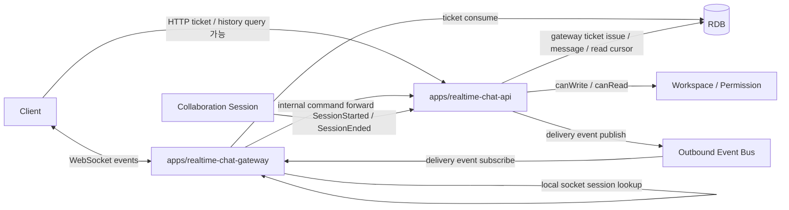

### 책임 경계 요약

| 구분                      | realtime-chat-gateway | realtime-chat-api                         |
| ------------------------- | --------------------- | ----------------------------------------- |
| WebSocket 연결            | 담당                  | 담당하지 않음                             |
| Gateway ticket 발급       | 담당하지 않음         | 담당                                      |
| Gateway ticket 소비       | 담당                  | RDB 저장소 제공                           |
| socket session 저장       | local memory에 저장   | 저장하지 않음                             |
| JSON parse / payload size | 담당                  | 보통 도달 전 차단                         |
| 채팅 권한 판단            | 하지 않음             | 담당                                      |
| 메시지 저장               | 하지 않음             | 담당                                      |
| stream sequence 발급      | 하지 않음             | 담당                                      |
| sender ACK 생성           | API 결과를 relay      | 담당                                      |
| recipient 계산            | 하지 않음             | 가능하면 API가 `recipientUserIds` resolve |
| socket push               | 담당                  | 직접 push하지 않음                        |
| afterSequence sync        | Gateway가 relay       | API가 조회                                |

---

## 2. 공통 처리 원칙

### 2.1 Gateway는 도메인 권한을 판단하지 않는다

Gateway는 다음 정도만 막습니다.

```txt
- ticket 누락 / 만료 / 재사용
- JSON parse 실패
- payload size 초과
- 지원하지 않는 event type
- socket session 없음
- commandId / clientMessageId 같은 최소 필드 누락
```

아래 판단은 반드시 API에서 처리합니다.

```txt
- 사용자가 해당 channel에 쓸 수 있는가
- private channel member인가
- DM 참여자인가
- archived channel인가
- 원본 thread message에 접근 가능한가
```

### 2.2 sender ACK는 delivery ACK가 아니다

`chat.message.accepted`의 의미는 다음입니다.

```txt
서버가 메시지를 검증했고,
DB에 저장했고,
stream sequence를 발급했다.
```

아래를 의미하지 않습니다.

```txt
모든 수신자가 socket push를 받았다.
```

따라서 메시지 저장 성공과 실시간 배달 성공은 분리합니다.

### 2.3 메시지 정렬 기준은 stream sequence다

```txt
messageId: 전역 고유
sequence: streamId 안에서만 증가
정렬 기준: streamId + sequence
```

예시는 다음과 같습니다.

```txt
channel-ch-1 sequence = 10
dm-dm-1      sequence = 10
```

두 sequence가 같아도 stream이 다르므로 충돌이 아닙니다.

### 2.4 실시간 push 실패는 MVP에서 허용한다

메시지가 DB에 저장되어 있으면 수신자는 나중에 다음 방식으로 복구합니다.

```txt
GET /channels/{channelId}/messages?afterSequence=184
```

또는 WebSocket event로 sync합니다.

```json
{
  "type": "chat.stream.sync",
  "streamId": "channel-ch-1",
  "afterSequence": 184
}
```

---

## 3. Flow 1. Gateway ticket 발급 및 WebSocket 접속 성공

### 목적

클라이언트가 WebSocket에 직접 인증 토큰을 계속 노출하지 않고, 짧은 TTL의 일회성 gateway ticket으로 접속하게 합니다.

### Sequence diagram

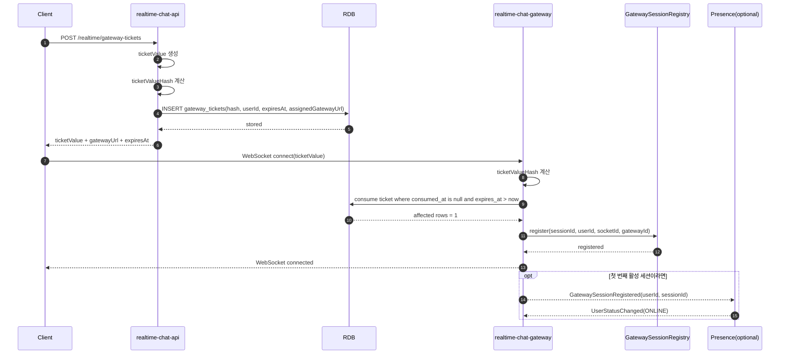

### app별 구현 포인트

| 단계           | 담당 app                   | 구현 포인트                                                       |
| -------------- | -------------------------- | ----------------------------------------------------------------- |
| ticket 발급    | API                        | 원문 ticket은 client에게만 반환하고 DB에는 hash 저장              |
| ticket consume | Gateway                    | `consumed_at IS NULL AND expires_at > now` 조건으로 원자적 update |
| session 등록   | Gateway                    | local memory registry에만 저장                                    |
| ONLINE 전환    | Presence 또는 Gateway 연동 | 여러 탭을 고려해 첫 활성 세션일 때만 ONLINE 처리                  |

---

## 4. Flow 2. Gateway ticket 실패

### 실패 원인

```txt
- ticket 만료
- 이미 소비된 ticket 재사용
- 존재하지 않는 ticket
- 잘못된 ticket hash
- assignedGatewayUrl 또는 gatewayId 불일치
```

### Sequence diagram

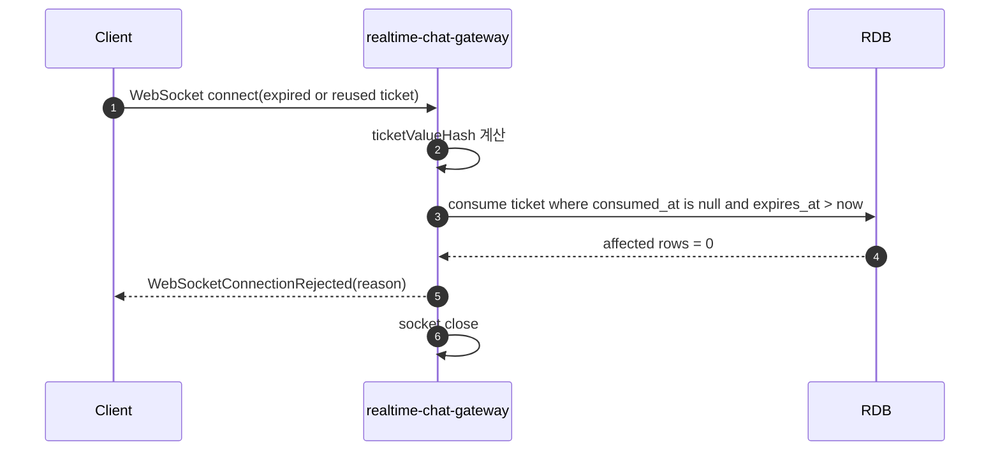

### 클라이언트 처리

```txt
WebSocketConnectionRejected
→ 새 gateway ticket 요청
→ 재연결 시도
```

단, 같은 ticket을 다시 쓰면 계속 실패해야 합니다.

---

## 5. Flow 3. 채널 메시지 전송 성공

### 목적

Gateway는 socket event를 받고 최소 검증만 수행한 뒤 API로 넘깁니다. API는 권한 검증, 멱등성 검증, stream sequence 발급, 메시지 저장을 수행합니다.

### Sequence diagram

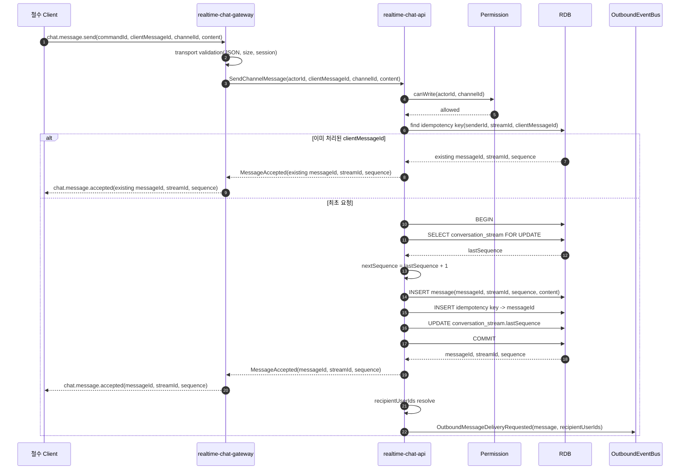

### 핵심 규칙

```txt
권한 검증 실패 전에는 message를 저장하지 않는다.
stream row lock은 sequence 발급 시점에만 잡는다.
동일 senderId + streamId + clientMessageId는 항상 같은 messageId / sequence를 반환한다.
```

---

## 6. Flow 4. 메시지 전송 권한 실패

### 목적

권한이 없는 메시지는 저장되지 않아야 합니다. Gateway가 권한을 추측해서 막는 것이 아니라 API가 Permission Context를 통해 최종 판단합니다.

### Sequence diagram

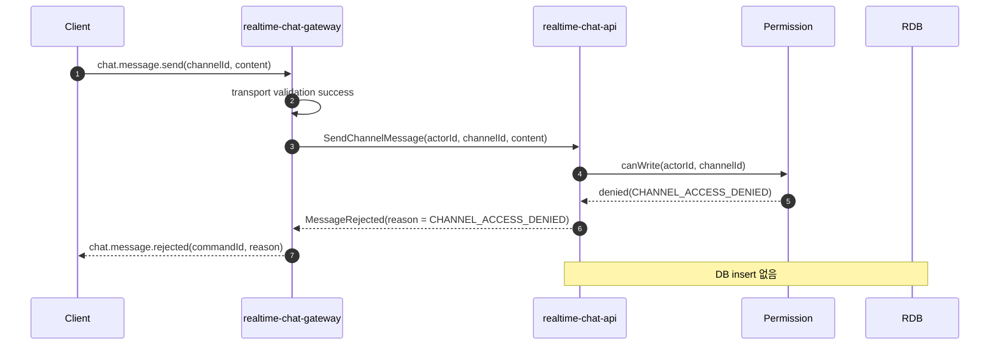

### 클라이언트 처리

```txt
chat.message.rejected
→ pending message를 failed 상태로 표시
→ reason에 따라 toast 또는 inline error 표시
```

---

## 7. Flow 5. ACK 유실 후 같은 clientMessageId 재시도

### 목적

서버는 저장에 성공했지만 네트워크 문제로 sender ACK가 클라이언트에 도착하지 않을 수 있습니다. 이때 같은 `clientMessageId`로 재전송해도 중복 메시지가 생기면 안 됩니다.

### Sequence diagram

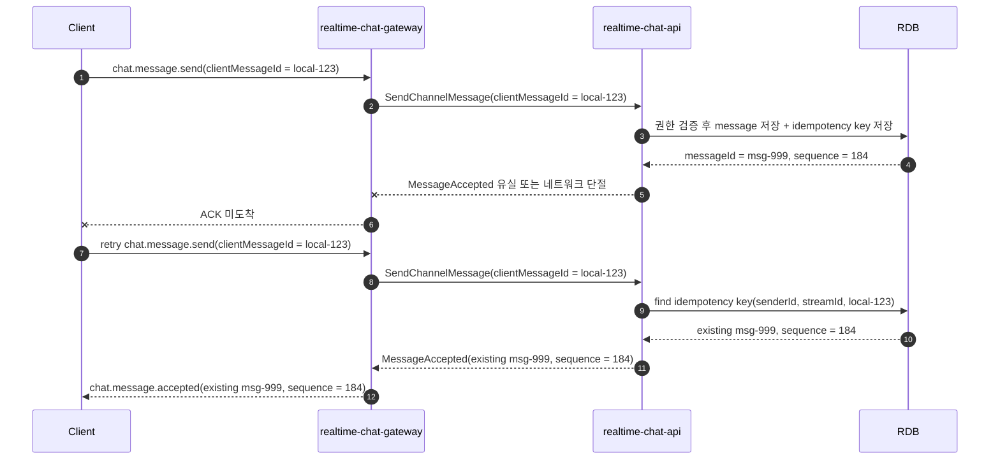

### 구현 주의

```txt
재시도는 새 message를 만들지 않는다.
sequence도 새로 발급하지 않는다.
client는 local pending message를 existing messageId로 치환한다.
```

중복 요청에서 delivery event를 다시 발행할지는 정책으로 정할 수 있습니다. MVP에서는 기본적으로 새 메시지 저장이 없으면 새 delivery event도 발행하지 않는 쪽이 단순합니다.

---

## 8. Flow 6. 실시간 배달 fan-out

### 목적

API가 메시지를 저장한 뒤 delivery event를 발행하면, 모든 Gateway 인스턴스가 이벤트를 받아 자기 local session registry에서 수신자 socket만 찾아 push합니다.

Gateway는 private channel membership을 직접 계산하지 않습니다. MVP에서는 API가 이미 권한을 고려해 `recipientUserIds`를 event에 포함하는 방식을 권장합니다.

### Sequence diagram

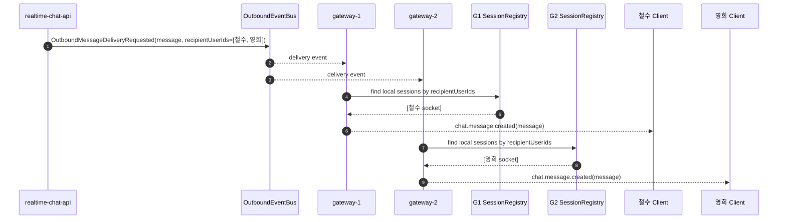

### local session이 없을 때

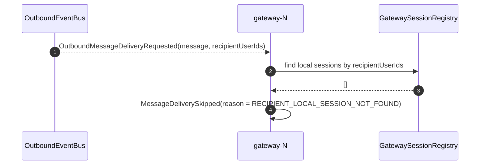

### 핵심 규칙

```txt
Gateway-1은 Gateway-2의 socket fd를 모른다.
따라서 delivery event는 모든 Gateway가 받아야 한다.
각 Gateway는 자기 local session만 보고 push 또는 skip한다.
```

---

## 9. Flow 7. Outbound publish 실패와 afterSequence 복구

### 목적

MVP에서는 메시지 저장 후 delivery event publish 실패를 허용합니다. 저장된 메시지는 `afterSequence` sync로 복구합니다.

### Sequence diagram

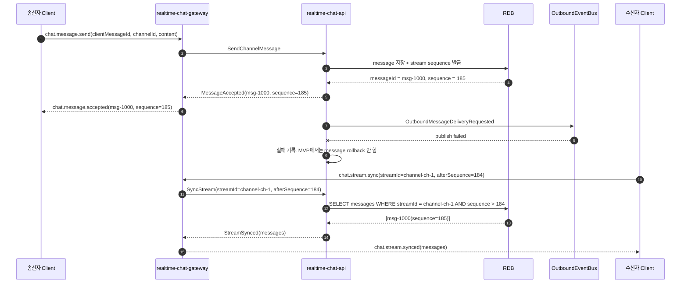

### 구현 주의

```txt
MessageAccepted는 publish 성공 여부와 독립적이다.
수신자 client는 stream별 lastSeenSequence를 저장해야 한다.
재접속 / 화면 진입 / 의심 구간에서는 afterSequence sync를 호출한다.
```

---

## 10. Flow 8. Read Cursor 전진 및 unread 제거

### 목적

wake-surfer는 공개 읽음 숫자가 아니라 Slack 스타일의 개인별 Read Cursor를 사용합니다. 따라서 읽음 처리는 해당 유저의 unread state만 바꿉니다.

### Sequence diagram

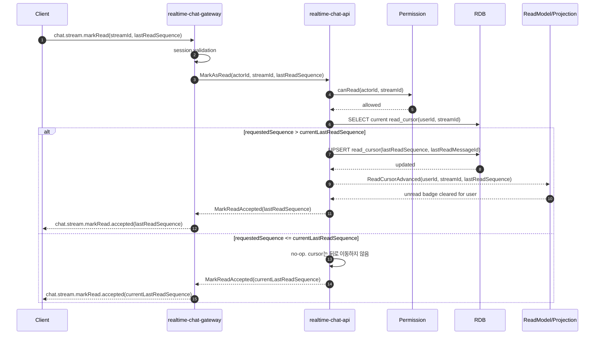

### 핵심 규칙

```txt
ReadCursor는 userId + streamId 단위다.
lastReadSequence는 증가만 가능하다.
다른 유저에게 “읽었다” 이벤트를 공개 broadcast하지 않는다.
```

---

## 11. Flow 9. WebSocket 종료, 재접속, 누락 메시지 동기화

### 목적

Gateway 장애, 브라우저 탭 종료, 네트워크 변경이 발생해도 클라이언트는 새 ticket으로 재접속한 뒤 stream별 `lastSeenSequence` 기준으로 누락 메시지를 가져옵니다.

### Sequence diagram

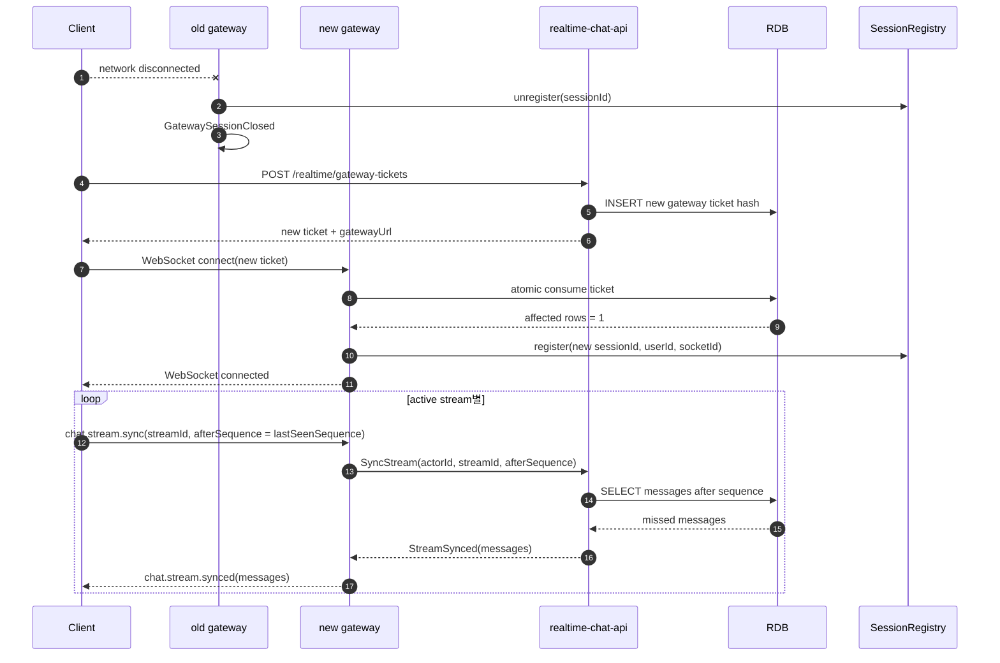

### 클라이언트가 저장해야 하는 값

```txt
lastSeenSequence per stream
pending messages by clientMessageId
current active streams
```

---

## 12. Flow 10. Collaboration Session 시작 → 시스템 메시지 생성

### 목적

화상 회의나 페어 프로그래밍 세션이 시작되면 Chat API가 외부 이벤트를 구독해 channel stream에 시스템 메시지를 저장합니다.

### Sequence diagram

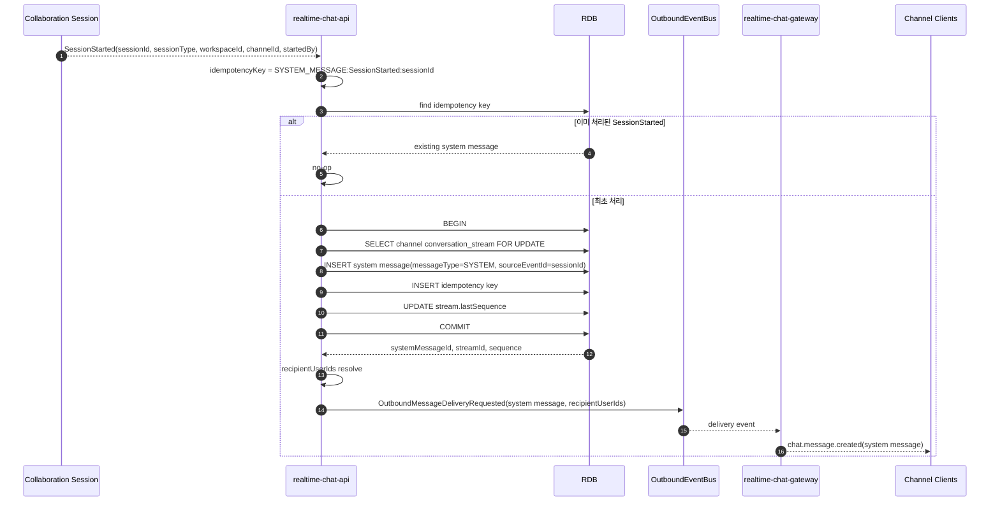

### 핵심 규칙

```txt
동일 sessionId의 SessionStarted는 시스템 메시지를 한 번만 만든다.
시스템 메시지도 stream sequence를 가진다.
시스템 메시지도 일반 메시지와 같은 delivery path를 탄다.
```

---

## 13. Flow 11. Presence 상태 변경

### 목적

Presence는 채팅 저장 규칙과 분리됩니다. 다만 Gateway session lifecycle과 연결되어 ONLINE / OFFLINE 전환의 입력이 됩니다.

### Sequence diagram

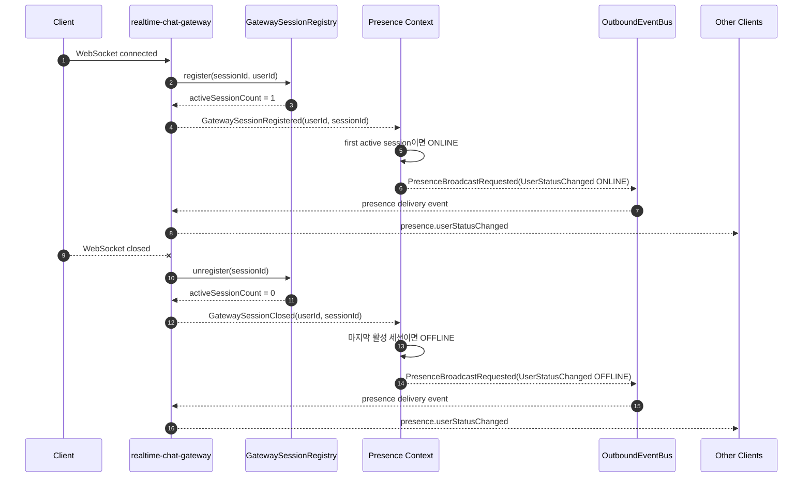

### 구현 주의

```txt
여러 탭 / 여러 기기를 고려한다.
세션 하나가 종료되어도 activeSessionCount가 남아 있으면 OFFLINE으로 바꾸지 않는다.
BUSY 같은 수동 상태는 자동 AWAY보다 우선할 수 있다.
```

---

## 14. Flow 12. DM 메시지 전송

### 목적

DM도 channel과 동일하게 `ConversationStream`에 메시지를 저장합니다. 차이는 권한 검증 기준이 channel membership이 아니라 DM participant라는 점입니다.

### Sequence diagram

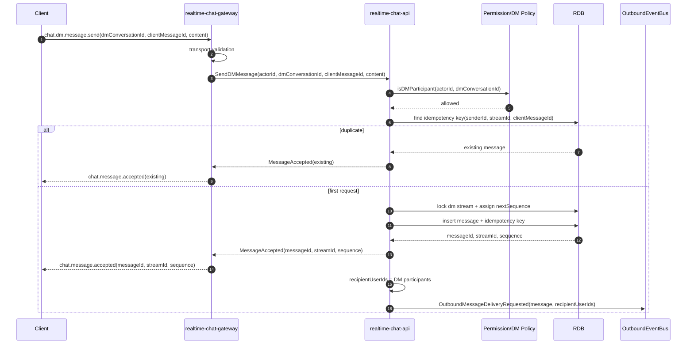

### 핵심 규칙

```txt
DM 참여자가 아닌 사용자는 읽기 / 쓰기 모두 불가하다.
Group DM은 최대 10명 제한을 별도 command에서 보장한다.
DM sequence도 dm stream 안에서만 증가한다.
```

---

## 15. Flow 13. Thread reply 전송

### 목적

Thread reply도 메시지입니다. 다만 root message 접근 권한을 확인한 뒤 thread stream에 저장합니다.

### Sequence diagram

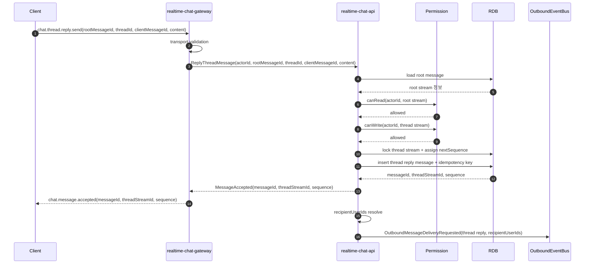

### MVP 선택지

```txt
MVP에서는 channel read cursor와 thread read cursor를 분리하지 않을 수 있다.
하지만 thread reply 자체는 별도 stream sequence를 갖게 설계하는 편이 확장에 좋다.
```

---

## 16. 클라이언트 socket event 이름 권장

### Client → Gateway

| event type               | Gateway 처리                    | API command                                |
| ------------------------ | ------------------------------- | ------------------------------------------ |
| `chat.message.send`      | transport validation 후 forward | `SendChannelMessage` 또는 target 기준 분기 |
| `chat.dm.message.send`   | transport validation 후 forward | `SendDMMessage`                            |
| `chat.thread.reply.send` | transport validation 후 forward | `ReplyThreadMessage`                       |
| `chat.stream.markRead`   | session validation 후 forward   | `MarkAsRead`                               |
| `chat.stream.sync`       | session validation 후 forward   | `SyncStream`                               |

### Gateway → Client

| event type                      | 의미                         |
| ------------------------------- | ---------------------------- |
| `chat.message.accepted`         | sender 메시지 저장 성공 ACK  |
| `chat.message.rejected`         | sender 메시지 저장 거절      |
| `chat.message.created`          | recipient에게 새 메시지 push |
| `chat.stream.synced`            | afterSequence sync 결과      |
| `chat.stream.markRead.accepted` | read cursor 처리 결과        |
| `gateway.error`                 | transport-level 오류         |
| `presence.userStatusChanged`    | presence 상태 변경 push      |

---

## 17. API internal command 권장 형태

### `SendChannelMessage`

```json
{
  "commandId": "cmd-001",
  "actorId": "user-1",
  "clientMessageId": "local-msg-abc-123",
  "workspaceId": "ws-1",
  "channelId": "ch-1",
  "content": {
    "type": "TEXT",
    "text": "영희야 안녕?"
  },
  "sentAtClient": "2026-07-02T10:00:00+09:00"
}
```

### `MessageAccepted`

```json
{
  "type": "chat.message.accepted",
  "commandId": "cmd-001",
  "clientMessageId": "local-msg-abc-123",
  "messageId": "msg-999",
  "streamId": "channel-ch-1",
  "sequence": 184,
  "serverCreatedAt": "2026-07-02T10:00:01+09:00"
}
```

### `OutboundMessageDeliveryRequested`

```json
{
  "eventId": "evt-001",
  "eventType": "OutboundMessageDeliveryRequested",
  "occurredAt": "2026-07-02T10:00:01+09:00",
  "message": {
    "messageId": "msg-999",
    "streamId": "channel-ch-1",
    "sequence": 184,
    "senderId": "user-1",
    "content": {
      "type": "TEXT",
      "text": "영희야 안녕?"
    }
  },
  "recipients": {
    "type": "USERS",
    "userIds": ["user-1", "user-2"]
  }
}
```

---

## 18. 실패 흐름별 책임 정리

| 실패 상황               | 발견 위치              | 처리 방식                   | DB 저장 여부       | client 결과                                  |
| ----------------------- | ---------------------- | --------------------------- | ------------------ | -------------------------------------------- |
| ticket 만료             | Gateway                | 연결 거절                   | 없음               | `WebSocketConnectionRejected`                |
| ticket 재사용           | Gateway                | 연결 거절                   | 없음               | `WebSocketConnectionRejected`                |
| JSON parse 실패         | Gateway                | event 거절                  | 없음               | `gateway.error`                              |
| payload size 초과       | Gateway                | event 거절                  | 없음               | `gateway.error`                              |
| socket session 없음     | Gateway                | event 거절                  | 없음               | `gateway.error`                              |
| channel write 권한 없음 | API                    | command 거절                | 없음               | `chat.message.rejected`                      |
| DM participant 아님     | API                    | command 거절                | 없음               | `chat.message.rejected`                      |
| DB 저장 실패            | API                    | command 실패                | 없음 또는 rollback | `chat.message.rejected` 또는 retryable error |
| 저장 성공 후 ACK 유실   | Client/Gateway network | same clientMessageId retry  | 이미 저장됨        | 기존 accepted 반환                           |
| delivery publish 실패   | API/EventBus           | MVP에서는 rollback 안 함    | 저장됨             | sender는 accepted, receiver는 sync로 복구    |
| recipient offline       | Gateway                | local session 없음이면 skip | 저장됨             | receiver는 재접속 후 sync                    |

---

## 19. 구현 순서 추천

### 19.1 Gateway ticket / connect

```txt
1. API: POST /realtime/gateway-tickets
2. API: gateway_tickets table 저장
3. Gateway: /ws handshake에서 ticket consume
4. Gateway: local session registry 등록
5. Gateway: connect reject test 작성
```

### 19.2 message send / ack

```txt
1. Gateway: chat.message.send parse / size validation
2. Gateway: session에서 actorId resolve
3. Gateway: API로 SendChannelMessage forward
4. API: PermissionPort.canWrite 호출
5. API: stream lock + sequence 발급 + message 저장
6. API: idempotency key 저장
7. Gateway: chat.message.accepted relay
```

### 19.3 delivery / sync

```txt
1. API: recipientUserIds resolve
2. API: OutboundMessageDeliveryRequested publish
3. Gateway: event subscribe
4. Gateway: recipientUserIds로 local session 조회
5. Gateway: chat.message.created push
6. API: SyncStream(afterSequence) 구현
7. Gateway: chat.stream.sync relay
```

### 19.4 read cursor

```txt
1. Gateway: chat.stream.markRead relay
2. API: canRead 검증
3. API: requestedSequence가 더 클 때만 read_cursor upsert
4. API: unread projection 갱신
5. Gateway: markRead accepted relay
```

---

## 20. 최소 테스트 시나리오

### Gateway

```txt
Given 유효한 ticket
When WebSocket connect
Then GatewaySessionRegistry에 session이 등록된다.
```

```txt
Given 이미 소비된 ticket
When WebSocket connect
Then 연결은 거절된다.
```

```txt
Given payload size가 limit을 초과하는 socket event
When chat.message.send
Then Gateway는 API로 forward하지 않는다.
```

### API

```txt
Given actor가 channel에 write 권한을 가진다
When SendChannelMessage
Then message가 저장되고 stream sequence가 증가한다.
```

```txt
Given 같은 senderId + streamId + clientMessageId가 이미 처리됐다
When SendChannelMessage를 재시도한다
Then 새 message 없이 기존 messageId와 sequence를 반환한다.
```

```txt
Given actor가 private channel member가 아니다
When SendChannelMessage
Then ChatMessageRejected가 반환되고 message는 저장되지 않는다.
```

### API + Gateway 통합

```txt
Given 철수와 영희가 서로 다른 gateway에 연결되어 있다
When 철수가 channel message를 보낸다
Then API가 message를 저장하고
And OutboundEventBus event가 두 gateway에 전파되고
And 영희가 연결된 gateway에서 socket push가 발생한다.
```

```txt
Given OutboundEventBus publish가 실패했다
When 수신자가 afterSequence로 sync한다
Then 저장된 누락 메시지를 받을 수 있다.
```

---

## 21. 최종 요약

구현 흐름은 아래 한 줄로 요약할 수 있습니다.

```txt
Gateway는 연결과 전달을 맡고,
API는 권한과 저장을 맡고,
EventBus는 저장된 메시지를 모든 Gateway에 fan-out하고,
Client는 lastSeenSequence로 누락 메시지를 복구한다.
```

가장 중요한 경계는 다음입니다.

```txt
Gateway는 메시지를 저장하지 않는다.
Gateway는 채팅 권한을 최종 판단하지 않는다.
Gateway는 recipient membership을 계산하지 않는다.
API는 socket fd를 알지 않는다.
API의 MessageAccepted는 socket delivery 성공을 의미하지 않는다.
```

이 경계를 지키면 `apps/realtime-chat-api`와 `apps/realtime-chat-gateway`를 별도 프로세스로 분리해도 핵심 도메인 모델이 흔들리지 않습니다.
