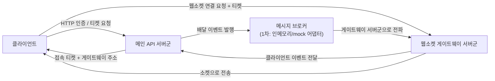
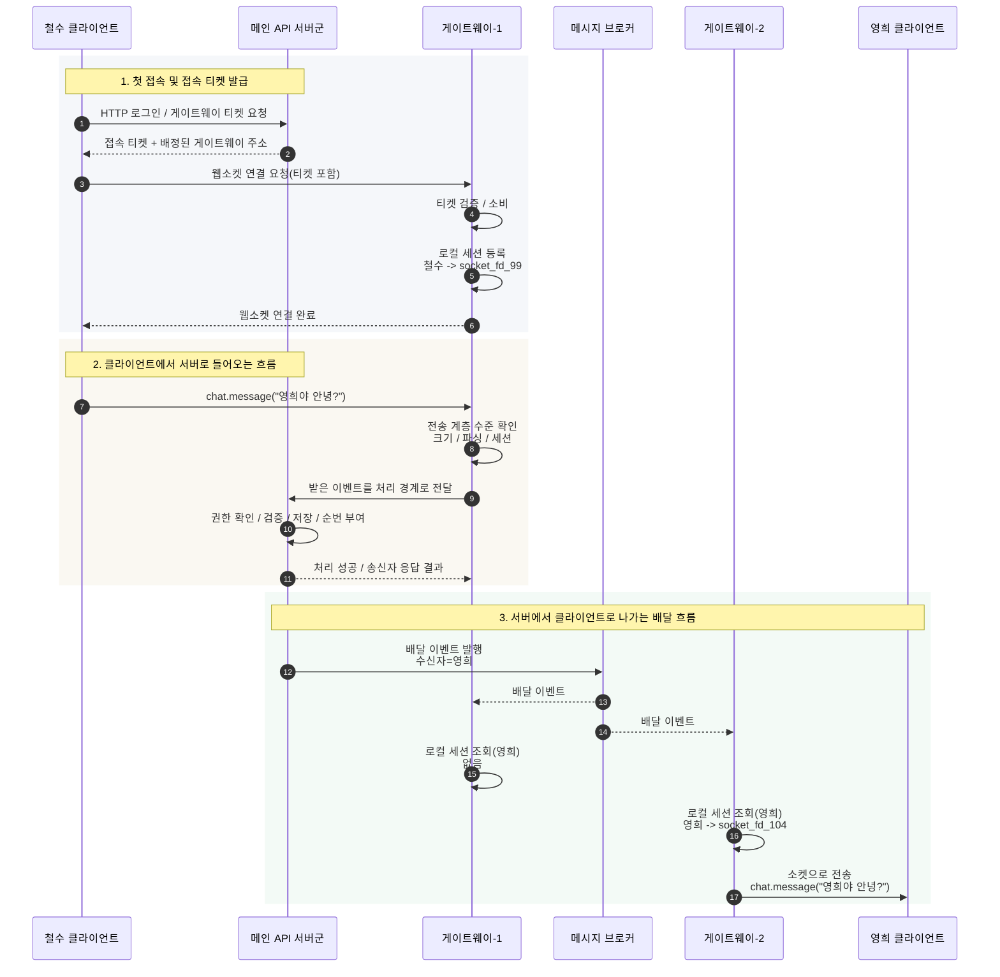

# 게이트웨이 중계 흐름

> 이 문서는 realtime-chat의 최초 흐름 스케치다. 현재 구현 계약이 아니며 사람용 설계 이력으로만 사용한다.
> 현재 코드로 확인된 결정은 `docs/realtime-chat/owner-docs/implemented-decisions.md`를 따른다.

## 문서 연결

이 문서는 클라이언트, 웹소켓 게이트웨이 서버군, 메인 API 서버군, 메시지 브로커 사이의 흐름을 시각화한다.

## 전체 구성

## 메시지 전송 시퀀스

