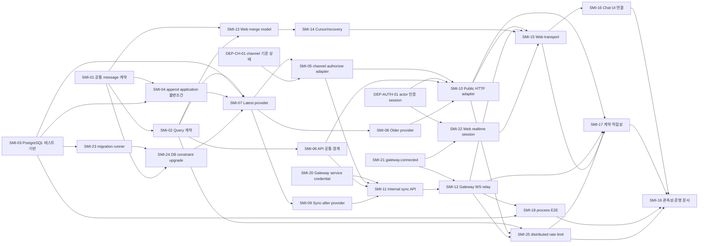

# Stream Messages 이슈 단위 구현 계획

> 상태: **Ready for issue creation**  
> 기준 설계: [stream-messages-use-case-design.md](./stream-messages-use-case-design.md)  
> 저장소 조사 기준: 2026-07-14  
> 계획 식별자: `SMI-01`~`SMI-25`, 외부 선행 `DEP-CH-01`, `DEP-AUTH-01`

## 1. 문서의 역할

이 문서는 Accepted 상태인 Stream Messages 설계 결정을 실제 GitHub 이슈와 PR로 옮기기 위한 실행
계획이다. `SMI-*`는 의존성을 설명하기 위한 계획 식별자이며 아직 GitHub 이슈 번호가 아니다.

각 이슈는 다음 원칙을 따른다.

- 하나의 이슈는 독립적으로 검증 가능한 결과 하나를 만든다.
- 한 이슈에서 package, API, Gateway, Web을 모두 조금씩 건드리는 방식보다 계약·provider·adapter·consumer를
  명시적으로 나눈다.
- HTTP route와 WebSocket event mapping은 `packages/realtime-chat-stream-messages`가 소유한다. API와
  Gateway app은 runtime resource를 만들고 package mount/register entrypoint만 호출한다.
- 각 기능 이슈는 자신의 단위·통합 테스트와 공개 문서 변경을 포함한다. 마지막 검증 이슈가 앞선 이슈의
  테스트를 대신하지 않는다.
- 공개 channel query는 실제 channel 권한 provider가 연결되기 전에는 mount하지 않는다.
- `message-send`, outbound delivery, read cursor의 전체 구현을 이 계획에 끌어들이지 않는다. 다만 조회
  불변조건을 보장하는 공통 message 계약, stream identity, write 크기 제한, 기존 stream target 검증은
  선행 범위에 포함한다.

실제 이슈를 생성할 때는 저장소 규칙에 따라 assignee를 `yullraes`로 지정한다. 작업 브랜치는
`<type>/<issue#>-<slug>` 형식을 사용하고, PR은 `BlueCool12`, `chan0324`에게 검토를 요청한다.

## 2. 구현 중 바꿀 수 없는 결정

이슈 구현 과정에서 다음 값을 다시 설계하지 않는다.

| 항목 | 확정값 |
| --- | --- |
| 공개 target | channel만 |
| Query slice | latest / sync-after / older의 독립 input·output·Handler |
| latest | 현재 head 기준 최대 5개, client limit 없음 |
| after·older limit | 기본 50, 최대 100, 최대 초과는 거절 |
| cursor | after·before 모두 exclusive, safe integer만 허용 |
| 정렬 | 모든 response는 sequence 오름차순 |
| snapshot | 첫 after page의 numeric `throughSequence`를 완료까지 고정 |
| 빈 channel | stream row를 만들지 않고 빈 성공 |
| message variant | `USER/TEXT`만 |
| text write | UTF-8 8KiB 이하 |
| Query envelope | 최종 JSON UTF-8 48KiB 이하 |
| 자동 recovery 묶음 | 10 page / 500 message / 512KiB 중 먼저 도달한 상한 |
| recovery 재개 | 마지막 완전 적용 cursor와 동일 watermark로 자동 재개 |
| 과거 가시 범위 | 현재 읽기 권한이 있으면 저장된 전체 history |
| client cursor 저장 | `sessionStorage`, actor+channel key, Gateway session ID 사용 금지 |
| transport | latest·older는 HTTP, after는 WebSocket relay |
| actor 신뢰 | public actor는 인증 세션/신뢰 edge, sync actor는 service credential로 인증된 Gateway의 local session |
| byte 측정 | contracts의 canonical final-envelope serializer로 Handler와 adapter가 동일 측정 |

## 3. 저장소 기준 선행 위험

### 3.1 Channel 권한 원천 부재

현재 저장소에는 channel 존재 여부와 actor membership을 판정하는 기준 상태가 없다. fake provider로 package
단위 테스트는 할 수 있지만 public endpoint를 공개할 수는 없다. `DEP-CH-01`과 이를 Stream Messages
consumer contract에 연결하는 `SMI-05`는 출시 차단 이슈다. allow-all provider는 허용하지 않는다.

### 3.2 기존 append 저장 불변조건 부족

현재 message append는 다음을 보장하지 않는다.

- text의 UTF-8 8KiB 상한
- 이미 존재하는 `stream_id` row의 target과 새 command에서 계산한 target의 일치
- 기존 DB에 대한 8KiB CHECK constraint upgrade

이 상태에서 조회를 먼저 공개하면 oversized row 또는 target mismatch를 정상 page로 표현할 수 없다.
application append 검증은 `SMI-04`, versioned migration 기반은 `SMI-23`, 기존 row audit과 DB constraint는
`SMI-24`로 분리하고 모두 Query 공개 전에 완료한다.

### 3.3 실제 PostgreSQL 검증 경로 부재

현재 package 테스트는 실제 PostgreSQL의 lock, unique constraint, snapshot, index ordering을 반복 검증하는
공통 경로가 없다. sequence와 page 경계를 mock DB만으로 승인하지 않기 위해 `SMI-03`을 선행한다.

### 3.4 API와 Web의 현재 경계 부족

- API error mapping과 handler timeout fallback은 gateway-ticket 의미에 묶여 있다.
- browser CORS는 현재 `POST`만 허용한다.
- Gateway는 ticket connect까지만 구현되어 message event router가 없다.
- Web `loadHistory()`는 cursor와 snapshot을 표현하지 못하고, history 응답이 live message를 덮어쓸 수 있다.

이 항목들은 각각 API, Gateway, Web 이슈로 분리한다.

### 3.5 인증과 연결 준비 상태 부재

- 현재 public actor header는 실제 인증 edge 없이 평문 값을 신뢰한다.
- 현재 Gateway의 `x-gateway-id`도 식별자일 뿐 service credential이 아니다.
- Web 로그인은 mock이고 realtime-chat ticket/HTTP 요청에 사용할 안정적인 인증 세션이 없다.
- Gateway는 ticket consume과 local session 등록 뒤 `gateway.connected` application event를 보내지 않는다.

public actor session/edge는 `DEP-AUTH-01`, Gateway service credential은 `SMI-20`, 연결 준비 event는
`SMI-21`, Web realtime session bootstrap은 `SMI-22`로 나눈다.

## 4. 외부 선행 이슈

아래 두 이슈는 Stream Messages가 소유할 수 없는 bounded context의 기준 상태다. 실제 GitHub 이슈를 먼저
만들고 `SMI-*` 이슈에서 번호로 의존해야 한다.

### DEP-CH-01. Channel 기준 상태와 읽기 권한 모델 제공

**Owner**: channel/workspace bounded context

**필수 결과**

- channel 존재, visibility, workspace/channel membership의 authoritative source가 있다.
- public channel은 active workspace member, private channel은 active channel member가 읽을 수 있다는 최소
  규칙을 제공한다.
- archived channel은 위 membership을 유지한 actor에게 read-only history 조회를 허용한다.
- 입력 `actorId + channelId`에 대해 available/unavailable/infrastructure failure를 구분하는 public provider
  contract가 있다.
- fake나 allow-all이 아닌 production provider와 통합 테스트가 있다.

이 결과가 준비되면 `SMI-05`가 Stream Messages의 `ChannelReadAuthorizer` consumer contract로 번역한다.

### DEP-AUTH-01. 인증 actor session과 public trusted edge 제공

**Owner**: auth/session 및 deployment edge

**필수 결과**

- Web이 로그인 actor를 식별하고 API ticket/query에 사용할 수 있는 안정적인 인증 session을 가진다.
- production API는 browser가 임의 지정한 `x-actor-id`를 직접 신뢰하지 않는다.
- trusted edge 또는 session middleware가 검증한 actor만 API auth context에 주입한다.
- 개발용 header adapter는 production에서 시작할 수 없도록 명시적으로 차단한다.
- logout/account change signal로 Web의 actor-scoped `sessionStorage`를 폐기할 수 있다.
- ticket 발급과 stream query가 같은 actor session을 사용한다.

이 이슈는 Stream Messages가 OAuth/session 도메인을 대신 구현한다는 뜻이 아니다. 다만 완료되지 않으면
`SMI-10`, `SMI-22`, `SMI-15`의 production consumer를 활성화할 수 없다.

## 5. 의존성 개요



`DEP-CH-01`, `DEP-AUTH-01`이 늦어져도 provider와 Web 순수 모델은 fake authorizer/transport로 병렬 개발할
수 있다. 그러나 public/internal production 조립과 실제 Web transport, 이후 출시 관문은 통과할 수 없다.

## 6. 이슈 목록

| ID | 이슈 제목 | 종류 | 주요 결과 | 선행 이슈 |
| --- | --- | --- | --- | --- |
| SMI-01 | 공통 공개 message 계약과 stream identity 분리 | feat | canonical `PublicMessage`, 8KiB 규칙, stream ID owner | 없음 |
| SMI-02 | Stream Messages 공개 Query 계약 정의 | feat | 세 독립 schema와 wire error/cursor 의미 | SMI-01 |
| SMI-03 | PostgreSQL 통합 테스트 실행 기반 구축 | test | 실제 PG 18 격리 테스트 경로 | 없음 |
| SMI-04 | Message append application 불변조건 보강 | fix | 8KiB use case 검증과 target mismatch 차단 | SMI-01, SMI-03 |
| SMI-05 | ChannelReadAuthorizer adapter 연결 | feat | channel source를 consumer contract로 번역 | SMI-07, DEP-CH-01 |
| SMI-06 | API 공통 오류·CORS·timeout 경계 일반화 | refactor | ticket과 stream query 오류 분리, GET 허용 | SMI-02 |
| SMI-07 | Latest Stream Messages Query 구현 | feat | read-only latest provider/Handler | SMI-01~04, SMI-24 |
| SMI-08 | Older Stream Messages Query 구현 | feat | exclusive before pagination | SMI-07 |
| SMI-09 | Sync-after Stream Messages Query 구현 | feat | fixed watermark recovery page | SMI-07 |
| SMI-10 | Latest·Older package-owned HTTP adapter 조립 | feat | 인증된 channel HTTP 조회와 app mount | SMI-05, SMI-06~08, DEP-AUTH-01 |
| SMI-11 | Package-owned internal sync API와 Gateway actor assertion 구현 | feat | 인증 Gateway 전용 page API와 app mount | SMI-05, SMI-06, SMI-09, SMI-20 |
| SMI-12 | Package-owned Gateway WebSocket sync relay 구현 | feat | `chat.stream.sync` request/result relay와 app mount | SMI-11, SMI-21 |
| SMI-13 | Web sequence-aware message merge model 구현 | feat | 모든 message 입력의 단일 merge 상태 모델 | SMI-01, SMI-02 |
| SMI-14 | Web cursor 영속화와 제한된 자동 recovery 구현 | feat | reload 복원, 10/500/512 자동 재개 | SMI-13 |
| SMI-15 | Web 실제 Stream Messages transport 구현 | feat | latest/older HTTP, after WS | SMI-10, SMI-12, SMI-14, SMI-22 |
| SMI-16 | Chat 화면에 latest·recovery·older 상태 연결 | feat | 배열 교체 제거와 실제 UI 흐름 | SMI-15 |
| SMI-17 | 생산자·소비자 계약 적합성 검증 | test | API/Gateway/Web golden fixture 검증 | SMI-10, SMI-12, SMI-15, SMI-25 |
| SMI-18 | API–Gateway–PostgreSQL recovery E2E 검증 | test | 실제 process 경계의 조회·복구 검증 | SMI-03, SMI-10~12 |
| SMI-19 | Stream Messages 관측성과 운영 계약 마감 | feat/docs | 구조화 로그, 운영 대응, 최종 public docs | SMI-16~18, SMI-25 |
| SMI-20 | Gateway service credential 인증 구현 | feat/security | internal API의 실제 Gateway 인증 | 없음 |
| SMI-21 | Gateway 인증 완료 event와 pre-ready 차단 구현 | feat | `gateway.connected`와 event readiness | 기존 ticket/session flow |
| SMI-22 | Web authenticated realtime session bootstrap 구현 | feat | ticket 발급, WS 연결·재연결, connection generation | SMI-21, DEP-AUTH-01 |
| SMI-23 | Realtime Chat versioned migration runner 구축 | feat | 기존 schema를 안전하게 upgrade하는 기반 | SMI-03 |
| SMI-24 | Message 8KiB DB constraint audit·migration | fix | 기존 row audit와 idempotent CHECK 적용 | SMI-01, SMI-23 |
| SMI-25 | Stream query distributed rate limit 구현 | feat/security | Redis 기반 HTTP/WS abuse 보호 | SMI-02, SMI-10, SMI-12 |

## 7. 상세 이슈 명세

### SMI-01. 공통 공개 message 계약과 stream identity 분리

**목표**

`message-send`, stream query, future delivery가 같은 외부 message value와 stream identity를 사용하게 한다.

**주요 변경**

- `packages/realtime-chat-message-contracts` 신규 생성
- `realtime-chat-message-send-contracts`의 공통 ID, target, `PublicMessage`, text content를 새 owner로 이동
- Web의 임시 message DTO를 즉시 제거하지는 않되 migration 대상임을 명시
- target에서 canonical stream ID를 계산하는 공통 순수 함수 제공

**확정 구현 규칙**

- canonical 외부 필드명은 현재 서버 계약의 `senderActorId`, `target`, `content.type = text`를 유지한다.
- 첫 version은 `USER/TEXT`만 표현하고 `SYSTEM` 또는 알 수 없는 variant를 parse하지 않는다.
- history message item에는 `clientMessageId`를 넣지 않는다.
- text byte 계산은 UTF-8 기준이며 JavaScript string length를 사용하지 않는다.
- canonical stream ID는 `{targetType}:{targetId}`다. channel은 `channel:{channelId}`다.
- send와 query는 같은 exported helper를 사용하고 각자 resolver 규칙을 복제하지 않는다.

**완료 조건**

- strict runtime schema와 타입이 함께 제공된다.
- 8,192 byte text는 허용하고 8,193 byte text는 거절하는 다국어/emoji 경계 테스트가 있다.
- message-send contracts가 공통 정의를 중복하지 않는다.
- 기존 message-send consumer build와 테스트가 통과한다.
- package README가 공개 계약과 비공개 내부 모델을 구분한다.

**비범위**

- `SYSTEM` message 도입
- send HTTP/WS adapter

권장 브랜치 slug: `public-message-contract`

---

### SMI-02. Stream Messages 공개 Query 계약 정의

**목표**

세 Query가 공유 다중-mode DTO 없이 독립된 request/response와 오류 의미를 갖게 한다.

**주요 변경**

- `packages/realtime-chat-stream-messages-contracts` 신규 생성
- latest, older, sync-after request/response strict schema
- HTTP와 WebSocket event payload schema
- domain rejection과 retryable infrastructure failure schema
- latest HTTP, older HTTP, `chat.stream.synced`의 canonical JSON serializer와 UTF-8 byte 측정 함수

**확정 공개 경계**

- `GET /realtime-chat/channels/:channelId/messages/latest`
- `GET /realtime-chat/channels/:channelId/messages/older?beforeSequence=...&limit=...`
- `POST /internal/realtime-chat/channels/:channelId/messages/sync-after`
- WebSocket `chat.stream.sync`
- WebSocket `chat.stream.synced`
- WebSocket `chat.stream.sync.rejected`
- WebSocket `chat.stream.sync.failed`

HTTP의 `x-request-id`와 WebSocket payload의 `requestId`가 correlation을 담당한다. internal API는 같은
`x-request-id`를 사용하며 request body에 actor를 넣지 않는다.

**완료 조건**

- latest request에는 client limit과 cursor가 없다.
- older와 after는 기본 50, 최대 100이며 101은 clamp하지 않고 거절한다.
- cursor/watermark/limit는 safe integer strict validation을 적용한다.
- `requestId`는 현재 API와 같은 최대 128자 제한을 적용한다.
- unknown field와 client-owned actor field를 거절한다.
- latest/older의 `nextBeforeSequence`는 non-empty면 가장 오래된 반환 sequence, empty면 `null`이다.
- after의 `nextAfterSequence`는 마지막 반환 sequence이며 empty final page에서는 `throughSequence`다.
- `stream_unavailable`, `invalid_cursor`, `bad_request`, `rate_limited`, retryable
  `stream_messages_unavailable`을 구분한다. `rate_limited`에는 `retryAfterMs`가 있다.
- `USER/TEXT` message만 허용하고 `SYSTEM` fixture를 거절한다.
- page envelope 상수 49,152 byte와 49,152/49,153 경계 테스트가 있다.
- boundary별 adapter/mount가 Handler에 주입할 canonical final-envelope measurer를 제공한다. Handler는 HTTP
  body나 WebSocket event serializer를 직접 import하지 않는다.
- 같은 value를 canonical serializer로 두 번 직렬화하면 같은 UTF-8 byte 수가 나온다.

**비범위**

- Web recovery의 10/500/512 묶음은 wire 계약이 아니라 client orchestration 규칙이므로 이 package에서
  공유 상수로 만들지 않는다.

권장 브랜치 slug: `stream-messages-contracts`

---

### SMI-03. PostgreSQL 통합 테스트 실행 기반 구축

**목표**

실제 PostgreSQL 18에서 schema, transaction, ordering, concurrency를 반복 검증할 공통 실행 경로를 만든다.

**확정 방식**

- 테스트 runner는 `TEST_DATABASE_URL`을 받는다.
- 각 worker/suite는 충돌하지 않는 임시 schema를 만들고 공통 DB bootstrap을 적용한 뒤 삭제한다.
- 로컬은 현재 Docker Compose의 PostgreSQL 18을 사용한다.
- 자동화 환경도 동일한 root command와 PostgreSQL major version을 사용한다.

**완료 조건**

- root에 `pnpm test:integration:realtime-chat` command가 있다.
- 실패한 테스트 뒤에도 임시 schema를 정리한다.
- 병렬 실행 시 schema가 충돌하지 않는다.
- 현재 gateway ticket과 message table bootstrap smoke test가 통과한다.
- migration 실패가 테스트 성공으로 위장되지 않는다.
- 사용법과 필수 env를 개발 문서에 기록한다.

권장 브랜치 slug: `realtime-chat-pg-test-harness`

---

### SMI-04. Message append application 불변조건 보강

**목표**

앞으로 application 경계를 통해 저장되는 message가 query의 byte/target 불변조건을 깨지 않게 한다. 기존
DB schema upgrade는 `SMI-23`, `SMI-24`가 소유한다.

**주요 변경**

- message-send request schema와 use case의 UTF-8 8KiB 이중 검증
- append transaction의 existing stream target 일치 검증

**완료 조건**

- 8,192 byte text는 저장되고 8,193 byte text는 `invalid_content`로 거절된다.
- 우회 호출에서도 use case 검증이 동작한다.
- 기존 `stream_id`의 `target_type/target_id`가 command target과 다르면 sequence 증가와 insert가 모두
  일어나지 않는다.
- 같은 target에 대한 경쟁 append에서도 `(stream_id, sequence)`와 target 불변조건이 유지된다.
- 실제 PostgreSQL 통합 테스트가 있다.

**비범위**

- 기존 oversized content 자동 절단·삭제·수정
- message-send 전체 transport 조립

권장 브랜치 slug: `message-append-invariants`

---

### SMI-05. ChannelReadAuthorizer adapter 연결

**목표**

`DEP-CH-01`의 실제 channel provider를 Stream Messages의 `ChannelReadAuthorizer` consumer contract에
번역한다.

**소유권**

- stream-messages는 좁은 consumer contract인 `ChannelReadAuthorizer`를 소유한다.
- channel 존재와 membership 기준 상태 및 concrete provider는 channel bounded context가 소유한다.
- 이 이슈는 `SMI-07`에서 consumer contract가 생성되고 `DEP-CH-01` provider가 준비된 뒤 시작한다.
- fake provider만 추가해서 닫을 수 없다.

**완료 조건**

- 입력 actor는 server auth context에서만 온다.
- 존재하지 않는 channel과 읽기 권한이 없는 channel은 모두 `stream_unavailable`로 보인다.
- 허용된 actor에는 minimum readable sequence를 반환하지 않으며 저장된 전체 history를 읽게 한다.
- message content query보다 먼저 판정된다.
- app production 조립에 allow-all 또는 allow-if-unknown fallback이 없다.
- provider 장애는 권한 거절이 아니라 retryable infrastructure failure다.
- 권한 철회 race는 page 시작 시 판정하고 다음 page에서 다시 판정하는 Accepted 규칙을 따른다.

**출시 조건**

이 이슈가 완료되지 않으면 `SMI-10`, `SMI-11` route를 production에 mount하지 않는다.

권장 브랜치 slug: `channel-read-authorizer`

---

### SMI-06. API 공통 오류·CORS·timeout 경계 일반화

**목표**

gateway-ticket 전용 오류 변환을 feature-neutral API 경계로 바꾸고 stream query가 독립된 외부 의미를
유지하게 한다.

**완료 조건**

- handler timeout과 unknown 5xx가 항상 `gateway_ticket_unavailable`로 바뀌지 않는다.
- feature handler가 자신의 domain rejection code를 보존한다.
- auth failure, bad request, domain rejection, timeout, DB/network failure를 구분한다.
- browser CORS가 허용 origin에 대해 `GET`을 지원한다.
- 기존 ticket endpoint의 status/error 의미가 회귀하지 않는다.
- 공통 error envelope과 feature code의 소유권을 분리한다.
- API runtime contract와 관련 테스트를 갱신한다.

권장 브랜치 slug: `realtime-chat-api-error-boundary`

---

### SMI-07. Latest Stream Messages Query 구현

**목표**

`@wake-surfer/realtime-chat-stream-messages` package의 read-only 기반과 latest Query/Handler를 구현한다.

**주요 변경**

- provider package와 `ChannelReadAuthorizer` consumer contract
- `@wake-surfer/realtime-chat-message-send/table-contract`의 read-only DB type 사용
- channel target → canonical stream identity resolve
- latest slice-local Kysely query, mapper, byte-aware page policy

**완료 조건**

- 독립 Query input/output과 Handler를 가진다.
- authorization 전에 message row/content를 조회하지 않는다.
- 빈 channel은 DB row를 만들지 않고 `streamId = channel:{channelId}`, `throughSequence = 0`, 빈 page로
  성공한다.
- non-empty stream은 현재 head 기준 최근 6개까지 선택해 최대 5개를 오름차순으로 반환한다.
- Handler는 주입된 `measureFinalEnvelope(candidate)` 크기 정책으로 candidate envelope을 측정하며 HTTP
  serializer를 직접 알지 않는다.
- 48KiB 때문에 줄일 때는 head를 포함한 가장 가까운 연속 tail만 남긴다.
- `nextBeforeSequence`와 `hasMoreBefore`가 count/byte trimming을 모두 반영한다.
- head 한 건만으로 48KiB를 넘으면 skip/truncate하지 않고 data-integrity failure로 중단한다.
- stream row target mismatch와 current no-retention gap을 data-integrity failure로 검출한다.
- Query가 message, stream, read cursor를 수정하지 않는다.
- 실제 PostgreSQL snapshot/concurrent append 테스트가 있다.

**의존성 메모**

concrete channel provider가 준비되기 전에는 fake authorizer로 provider 테스트만 수행한다.

권장 브랜치 slug: `load-latest-stream-messages`

---

### SMI-08. Older Stream Messages Query 구현

**목표**

현재 history window보다 가까운 과거 page를 독립 Query/Handler로 조회한다.

**완료 조건**

- `beforeSequence`는 exclusive이며 `1 <= value <= headSequence + 1`만 허용한다.
- 기본 50, 최대 100이며 N+1 row로 `hasMoreBefore`를 판정한다.
- DB에서는 가까운 과거부터 내림차순으로 선택해도 외부 응답은 오름차순이다.
- 48KiB 상한에서는 `beforeSequence`에 가장 가까운 연속 구간만 반환한다.
- Handler는 주입된 `measureFinalEnvelope(candidate)` 크기 정책으로 candidate envelope을 측정하며 HTTP
  serializer를 직접 알지 않는다.
- non-empty `nextBeforeSequence`는 가장 오래된 반환 sequence이고 empty면 `null`이다.
- `headSequence + 1` 요청이 latest와 겹쳐도 정상이며 client merge가 중복을 제거할 수 있다.
- non-empty page 내부 sequence는 연속이고 가장 최신 row는 `beforeSequence - 1`이어야 한다. 마지막 page가
  1에 도달하지 않은 채 `hasMoreBefore = false`가 되면 current no-retention gap으로 실패한다.
- concurrent append가 기존 older 범위를 바꾸지 않는다.
- delivery cursor와 ReadCursor를 수정하지 않는다.
- 실제 PostgreSQL count/byte/cursor 경계 테스트가 있다.

권장 브랜치 slug: `load-older-stream-messages`

---

### SMI-09. Sync-after Stream Messages Query 구현

**목표**

고정 watermark까지 누락 구간을 한 page씩 복구하는 독립 Query/Handler를 구현한다.

**완료 조건**

- 첫 page는 현재 committed head를 `throughSequence`로 고정한다.
- 후속 page는 `afterSequence < sequence <= throughSequence`만 읽는다.
- 각 page 시작 시 authorization을 다시 수행한다.
- 기본 50, 최대 100, N+1과 48KiB를 함께 적용한다.
- Handler는 주입된 `measureFinalEnvelope(candidate)` 크기 정책으로 candidate envelope을 측정하며 WebSocket
  serializer를 직접 알지 않는다. internal HTTP response가 더 작다는 이유로 page를 늘리지 않는다.
- non-empty `nextAfterSequence`는 마지막 반환 sequence다.
- empty final page의 `nextAfterSequence`는 `throughSequence`이며 `hasMoreAfter = false`다.
- final page의 cursor가 watermark에 정확히 도달한다.
- `afterSequence > head`, 변조된 watermark, stream target mismatch, gap을 확정된 오류 범주로 처리한다.
- page 사이 concurrent append를 현재 snapshot에 포함하지 않는다.
- 실제 PostgreSQL 다중 page/concurrent append 테스트가 있다.

권장 브랜치 slug: `sync-stream-messages-after`

---

### SMI-10. Latest·Older package-owned public HTTP adapter 조립

**목표**

인증된 browser actor가 channel latest/older Query를 HTTP로 호출하게 한다.

HTTP route registration, schema mapping, feature error mapping은
`@wake-surfer/realtime-chat-stream-messages`가 소유한다. API app은 HTTP server, actor 인증 함수, DB/runtime
dependency를 넘겨 register/mount만 한다.

**완료 조건**

- 확정 경로와 contracts parser를 사용한다.
- actor는 `DEP-AUTH-01`의 API auth context에서만 주입하며 body/query/header의 client-owned actor field를
  받지 않는다. production은 현재 개발용 평문 actor header adapter로 시작할 수 없다.
- concrete `ChannelReadAuthorizer`가 없으면 production app 조립이 실패하거나 route가 명시적으로 비활성이다.
- latest와 older가 각자의 Handler만 호출한다.
- API app에 Query DTO 변환, pagination, Kysely query, feature error code가 들어가지 않는다.
- package가 제공하는 public route registration을 app bootstrap이 한 번 mount한다.
- public HTTP mount가 latest/older canonical serializer로 만든 boundary별 `measureFinalEnvelope` 정책을 각
  Handler에 주입한다.
- contracts의 canonical serializer로 Handler가 측정한 동일 object를 전송하고 49,152 byte 이하인지
  adapter에서도 assertion한다. adapter가 별도 wrapper를 추가하지 않는다.
- domain rejection과 retryable failure를 다른 HTTP status/code로 응답한다.
- `x-request-id`를 response header와 body correlation에 유지한다.
- GET CORS, timeout, abort, readiness/drain 동작을 검증한다.
- API runtime contract를 갱신한다.

권장 브랜치 slug: `stream-messages-http-routes`

---

### SMI-11. Package-owned internal sync API와 Gateway actor assertion 구현

**목표**

Gateway가 local session actor를 대신해 한 page의 sync-after를 API에 요청할 수 있는 trusted internal 경계를
만든다.

internal route와 feature-specific Gateway API client는 stream-messages package가 소유한다. API/Gateway app은
base URL, trusted header 이름, 인증 함수, fetch/runtime resource를 주입하고 mount만 한다.

**확정 인증 방식**

- `SMI-20`의 Gateway service bearer credential을 먼저 검증한다.
- `x-gateway-id`는 식별자로만 사용하고 credential로 사용하지 않는다.
- service 인증 성공 뒤에만 별도 server-only actor header를 읽는다.
- actor는 request body에 포함하지 않는다.
- public route는 asserted actor header를 해석하지 않는다.

**완료 조건**

- internal route가 sync-after Handler만 호출한다.
- internal sync mount가 최종 `chat.stream.synced` canonical serializer로 만든 `measureFinalEnvelope` 정책을
  Handler에 주입한다. internal HTTP envelope이 더 작아도 page를 늘리지 않는다.
- API app에 sync request/response mapping이나 actor assertion 해석을 직접 구현하지 않는다.
- Gateway app에 feature response type guard를 직접 구현하지 않는다.
- Gateway 인증 실패와 actor assertion 누락/오염을 거절한다.
- 같은 WebSocket request의 `requestId`를 `x-request-id`로 보존한다.
- Gateway API client는 timeout, abort, non-2xx, invalid JSON, schema mismatch를 구분한다.
- 5xx/transport failure를 `stream_unavailable` 같은 domain rejection으로 위장하지 않는다.
- 로그에 asserted actor header 원문이나 message content를 남기지 않는다.
- API와 Gateway runtime contract에 trusted ingress 배포 조건을 기록한다.

권장 브랜치 slug: `stream-sync-internal-api`

---

### SMI-12. Package-owned Gateway WebSocket sync relay 구현

**목표**

인증된 socket session이 `chat.stream.sync` 한 page를 요청하고 correlation된 결과를 받게 한다.

WebSocket event parse/result mapping과 relay orchestration은 stream-messages package가 소유한다. Gateway app은
WebSocket server, local session lookup, API client runtime, logger를 넘겨 package registration을 mount한다.

**완료 조건**

- `SMI-21`의 `gateway.connected`가 전송되고 ready 상태가 되기 전 event를 처리하지 않는다.
- actor는 local session registry에서 가져오며 client payload의 actor/stream ID hint를 거절한다.
- strict event schema와 inbound payload 상한을 적용한다.
- client event 하나는 internal API page 요청 하나로 relay한다.
- `requestId`를 API 호출과 success/rejected/failed event에 보존한다.
- domain rejection은 `chat.stream.sync.rejected`, retryable transport failure는
  `chat.stream.sync.failed`로 구분한다.
- `rate_limited` rejection의 `retryAfterMs`를 보존한다.
- success event는 contracts의 canonical `chat.stream.synced` serializer로 만들며 추가 wrapper를 붙이지
  않는다.
- socket close 시 진행 중 request를 abort하고 늦은 response를 폐기한다.
- 같은 session/channel에서 중복 in-flight request를 허용하지 않는다.
- Gateway가 pagination, authorization, gap policy를 재구현하지 않는다.
- Gateway app bootstrap에 event payload schema나 sync result mapping을 직접 넣지 않는다.
- Gateway runtime contract와 relay 테스트를 갱신한다.

권장 브랜치 slug: `gateway-stream-sync-relay`

---

### SMI-13. Web sequence-aware message merge model 구현

**목표**

latest, older, sync, live created, sender accepted를 하나의 순수 상태 모델로 병합한다.

**완료 조건**

- canonical key는 `streamId + sequence`이며 `messageId`도 교차 검증한다.
- same sequence/different message와 same message/different sequence를 계약 위반으로 검출한다.
- latest response가 먼저 도착한 live message를 배열 교체로 잃지 않는다.
- out-of-order live message를 buffer하고 gap sync 필요 상태를 만든다.
- sync가 gap을 채우면 순서대로 한 번만 적용한다.
- cursor 이하이면서 loaded window 밖인 delayed event는 current tail에 삽입하지 않는다.
- older merge는 `deliverySyncCursor`를 바꾸지 않는다.
- channel stream에 thread target message가 들어오면 계약 위반으로 검출한다.
- root message에 `threadSummary`가 없어도 정상이다.
- reducer/store 단위 테스트가 transport 없이 실행된다.

권장 브랜치 slug: `chat-message-merge-model`

---

### SMI-14. Web cursor 영속화와 제한된 자동 recovery 구현

**목표**

WebSocket reconnect와 browser reload 뒤에도 마지막 연속 cursor부터 안전하게 복구한다.

**확정 저장 규칙**

- `sessionStorage` key는 actor ID와 channel ID를 기본으로 한다.
- 안정적인 auth session namespace가 있으면 추가할 수 있지만 Gateway session ID는 사용하지 않는다.
- message content는 저장하지 않는다.
- `deliverySyncCursor`, 진행 중 `throughSequence`, recovery 상태만 저장한다.
- logout·계정 전환 때 이전 actor namespace를 폐기한다.

**완료 조건**

- `deliverySyncCursor`, `historyBeforeCursor`, ReadCursor를 다른 상태로 유지한다.
- 신뢰 가능한 cursor가 있으면 latest를 호출하기 전에 sync-after를 수행한다.
- cursor가 없을 때만 latest checkpoint를 만든다.
- 한 자동 묶음은 성공 page 10개, message 500개, 누적 serialized response 512KiB 중 먼저 도달한
  상한에서 `recovery_pending`으로 전환한다.
- 누적 byte는 transport가 raw HTTP response/WebSocket frame에서 측정해 전달한 값을 사용하고 parsed
  object를 다시 직렬화해 추정하지 않는다.
- 마지막 완전 적용 cursor와 같은 watermark를 저장하고 event loop에 양보한 뒤 새 묶음을 자동 시작한다.
- 실패·부분 page는 cursor와 누적량을 전진시키지 않는다.
- `hasMoreAfter = true`인데 cursor가 전진하지 않으면 protocol failure로 중단한다.
- `invalid_cursor`를 받았다고 자동 latest로 이동하지 않는다. 누락 구간을 포기하는 명시적 사용자 reset만
  latest checkpoint를 새로 만든다.
- `rate_limited`는 `retryAfterMs` 뒤 같은 cursor/watermark에서 재개하고 cursor를 전진시키지 않는다.
- reload, reconnect, cancel, retry를 fake transport와 새 store instance로 검증한다.

권장 브랜치 slug: `chat-cursor-recovery`

---

### SMI-15. Web 실제 Stream Messages transport 구현

**목표**

mock `loadHistory()` 대신 실제 HTTP/WS Query 계약을 소비한다.

**완료 조건**

- transport interface를 latest, older, sync-after 전용 메서드로 분리한다.
- latest/older는 HTTP, sync-after는 WebSocket relay를 사용한다.
- `SMI-22`의 authenticated realtime session이 `gateway.connected` ready 상태일 때만 sync event를 보낸다.
- 모든 success/error payload를 공유 runtime schema로 parse한다.
- HTTP raw text와 WebSocket raw frame의 UTF-8 byte 수를 parse 전에 측정하고 검증된 result와 함께 recovery
  orchestrator에 전달한다.
- HTTP `x-request-id`와 WebSocket `requestId` correlation을 보존한다.
- timeout, abort, stale response, socket close를 처리한다.
- domain rejection과 retryable failure를 UI가 구분할 수 있는 결과로 전달한다.
- mock transport는 명시적인 개발/테스트 구현으로만 남는다.
- message-send와 outbound delivery 구현을 이 이슈에 포함하지 않는다.

권장 브랜치 slug: `web-stream-messages-transport`

---

### SMI-16. Chat 화면에 latest·recovery·older 상태 연결

**목표**

현재 chat 화면의 배열 교체 흐름을 sequence-aware model과 실제 transport로 교체한다.

**완료 조건**

- 기존 cursor가 있으면 recovery 후 안정 상태로 전환하고, 없으면 latest 5개로 시작한다.
- fake/live fixture가 merge model로 들어온 상태에서 history response가 기존 message를 덮어쓰지 않는다.
  production `chat.message.created` source 자체는 outbound-delivery 후속 capability다.
- 과거 더보기와 `hasMoreBefore = false` 종료 상태를 제공한다.
- loading, recovering, `recovery_pending`, retryable failure, `stream_unavailable`을 구분한다.
- channel 화면만 새 Query를 사용한다.
- 중복, 역순 삽입, 같은 message의 깜빡임이 없다.
- logout/account change가 저장 cursor를 폐기한다.
- Web build, state integration test, 접근성 검증이 통과한다.

권장 브랜치 slug: `chat-stream-messages-ui`

---

### SMI-17. 생산자·소비자 계약 적합성 검증

**목표**

contracts, API, Gateway, Web이 같은 wire value와 오류를 해석하는지 자동 검증한다.

**완료 조건**

- versioned golden fixtures를 contracts package가 소유한다.
- API가 생성한 latest/older/after response가 schema를 통과한다.
- Gateway와 Web은 손수 작성한 느슨한 type guard 대신 contract parser를 사용한다.
- unknown actor/field, unsafe integer, limit 101, invalid watermark를 모두 거절한다.
- 8,192/8,193 text byte 경계와 49,152/49,153 envelope 경계를 검증한다.
- `USER/TEXT`는 허용하고 `SYSTEM`은 거절한다.
- domain rejection과 retryable infrastructure failure fixture가 다르다.
- HTTP/WS `rate_limited`와 `retryAfterMs`를 producer와 Web consumer가 같은 의미로 해석한다.
- 각 consumer package에서 같은 fixture suite를 실행할 수 있다.

권장 브랜치 slug: `stream-messages-contract-tests`

---

### SMI-18. API–Gateway–PostgreSQL recovery E2E 검증

**목표**

mock boundary를 넘어 실제 API, Gateway, PostgreSQL 사이의 핵심 조회·복구 의미를 검증한다.

**필수 시나리오**

- 읽을 수 있는 빈 channel latest
- 최신 5개와 여러 older page
- WebSocket sync-after 다중 page
- 첫 page 뒤 concurrent append와 고정 watermark
- 권한 거절 시 content query 미실행
- invalid cursor, sequence gap, stream target mismatch
- 48KiB byte-aware page split과 oversized row failure
- 중단 뒤 마지막 성공 cursor에서 재개
- Gateway reconnect 후 local-session actor assertion
- requestId end-to-end correlation

**완료 조건**

- 실제 PostgreSQL 18과 실제 HTTP/WS server를 사용한다.
- 테스트용 권한 provider는 allow/deny/failure를 명시적으로 제어한다.
- process 종료와 abort 뒤 열린 handle이 남지 않는다.
- 테스트가 한 명령으로 재현되고 실패 로그에 message content가 노출되지 않는다.

권장 브랜치 slug: `stream-messages-e2e`

---

### SMI-19. Stream Messages 관측성과 운영 계약 마감

**목표**

운영 중 느린 조회, 반복 recovery, cursor 오류, 데이터 무결성 문제를 content 노출 없이 진단하고 실제
consumer 문서를 최종 상태로 맞춘다.

**완료 조건**

- 구조화 로그에 query 종류, requestId, duration, message count, serialized byte, hasMore를 기록한다.
- sync relay의 domain rejection, timeout, network/5xx, schema mismatch를 구분한다.
- recovery 묶음의 completed, pending, cancelled, no-progress 상태를 기록한다.
- gap, oversized row, stream target mismatch는 ID/sequence/byte만 기록하고 content는 남기지 않는다.
- actor ID를 metric label로 쓰지 않고 ticket 원문과 asserted actor header를 로그에 남기지 않는다.
- provider README, API/Gateway runtime contract, Web feature 문서를 실제 구현과 일치시킨다.
- gap/oversized/target mismatch 발견 시 운영 대응 절차를 문서화한다.
- metrics backend가 아직 없으므로 대시보드 구축은 요구하지 않되 재사용할 안정적인 event/field 이름을
  고정한다.

권장 브랜치 slug: `stream-messages-operations`

---

### SMI-20. Gateway service credential 인증 구현

**목표**

평문 `x-gateway-id` 신뢰를 제거하고 API internal route가 실제 Gateway service를 인증하게 한다.

**확정 방식**

- API와 Gateway가 최소 32 random byte의 `REALTIME_CHAT_GATEWAY_API_TOKEN`을 공유한다.
- Gateway는 TLS internal HTTP 요청의 `Authorization: Bearer ...`로 credential을 보낸다.
- API는 timing-safe 비교로 검증하고, 성공한 뒤에만 gateway ID와 asserted actor header를 읽는다.
- `x-gateway-id`는 관측/할당 식별자이며 credential이 아니다.
- production에서는 token 미설정 시 startup을 실패시킨다. transport는 TLS를 사용하거나 runtime이
  service-mesh TLS 종단을 명시적으로 증명해야 하며, 둘 다 아니면 startup을 실패시킨다.

**완료 조건**

- token 없음, 잘못된 token, 빈 actor assertion, public route의 actor assertion을 모두 거절한다.
- credential, actor assertion 원문, ticket을 로그에 남기지 않는다.
- Gateway API client가 모든 internal request에 credential을 넣는다.
- 기존 ticket consume과 새 sync-after가 같은 service auth middleware를 사용한다.
- API/Gateway runtime contract와 secret rotation 절차를 문서화한다.

권장 브랜치 slug: `gateway-service-auth`

---

### SMI-21. Gateway 인증 완료 event와 pre-ready 차단 구현

**목표**

client가 ticket consume과 local session 등록 완료 시점을 명확히 알게 하고 그 전에는 application event를
보낼 수 없게 한다.

**완료 조건**

- ticket consume 성공과 local session 등록이 모두 끝난 뒤 한 번만 `gateway.connected`를 보낸다.
- event는 protocol version, connection generation, gateway/session 식별자, connected time을 표현하되
  actor credential은 포함하지 않는다.
- ready 이전 client application event는 queue하지 않고 `gateway.not_ready`로 거절하거나 socket을 닫는다.
- ticket rejected connection은 `gateway.connected`를 보내지 않는다.
- 재접속은 새로운 connection generation을 가지며 이전 socket의 늦은 event를 식별할 수 있다.
- event schema와 mapping은 gateway ticket/session package가 소유하고 Gateway app은 mount만 한다.
- Gateway runtime contract와 connect/reject/close 테스트를 갱신한다.

권장 브랜치 slug: `gateway-connected-event`

---

### SMI-22. Web authenticated realtime session bootstrap 구현

**목표**

인증된 Web actor가 ticket을 발급받아 WebSocket을 연결하고 `gateway.connected` 이후에만 feature transport를
사용하게 한다.

**완료 조건**

- `DEP-AUTH-01` actor session으로 gateway ticket을 요청한다.
- ticket의 gateway URL로 연결하고 `gateway.connected`를 기다린 뒤 ready 상태가 된다.
- timeout, ticket rejection, socket close를 구분한다.
- 재접속마다 새 ticket을 발급받고 exponential backoff와 최대 즉시 retry 횟수를 적용한다.
- connection generation이 바뀌면 이전 socket의 response/event를 폐기한다.
- 한 authenticated realtime session이 여러 channel stream transport를 공유한다.
- route unmount는 channel 구독만 정리하고 logout/session end가 socket과 actor-scoped cursor를 정리한다.
- fake socket과 실제 Gateway connect test가 있다.

권장 브랜치 slug: `web-realtime-session`

---

### SMI-23. Realtime Chat versioned migration runner 구축

**목표**

`CREATE TABLE IF NOT EXISTS` bootstrap만으로는 적용할 수 없는 기존 schema upgrade를 순서와 이력에 따라
안전하게 실행한다.

**완료 조건**

- `realtime_chat_schema_migrations`에 version, name, checksum, applied time을 기록한다.
- migration은 PostgreSQL advisory lock 아래에서 한 번에 한 process만 실행한다.
- 새 DB는 ordered migration으로 현재 gateway ticket/message schema를 만든다.
- 기존 DB는 현재 schema shape를 검증한 뒤 명시적인 baseline을 기록하며 잘못된 shape를 묵시 승인하지
  않는다.
- 이미 적용된 checksum이 바뀌면 startup/migration을 실패시킨다.
- transaction 가능한 migration은 transaction으로 실행하고 실패 version을 적용 완료로 기록하지 않는다.
- `database.migrate()` public contract와 API startup lifecycle은 유지한다.
- fresh DB, existing baseline, concurrent migrate, checksum mismatch 통합 테스트가 있다.

권장 브랜치 slug: `realtime-chat-migration-runner`

---

### SMI-24. Message 8KiB DB constraint audit·migration

**목표**

기존 DB를 audit하고 `messages.content_text`에 application과 같은 UTF-8 8KiB invariant를 적용한다.

**완료 조건**

- migration 전에 `octet_length(content_text) > 8192` row를 조회한다.
- 위반 row가 있으면 content 없이 message ID, stream ID, sequence, byte 수만 보고하고 migration을 중단한다.
- 위반 row가 없으면 named CHECK `octet_length(content_text) <= 8192`를 추가하고 validate한다.
- fresh DB에도 같은 constraint가 처음부터 존재한다.
- 반복 실행해도 constraint를 중복 생성하지 않는다.
- 8,192/8,193 byte direct SQL insert와 existing violating DB 통합 테스트가 있다.
- 기존 위반 데이터를 자동 절단·삭제·수정하지 않는다.

권장 브랜치 slug: `message-content-byte-constraint`

---

### SMI-25. Stream query distributed rate limit 구현

**목표**

page/recovery 상한과 별개로 반복 HTTP/WS query가 API, Gateway, PostgreSQL을 고갈시키지 않게 한다.

**확정 초기 정책**

- public latest/older: actor당 분당 120회, source IP당 분당 300회
- WebSocket sync page: actor당 분당 120회, session+channel당 동시 1회
- 여러 API/Gateway instance가 같은 Redis 8.8 token bucket 상태를 사용한다.
- 상한은 env로 더 낮출 수 있지만 production에서 무제한으로 설정할 수 없다.

**완료 조건**

- HTTP는 `429`와 `rate_limited`, `retryAfterMs`/`Retry-After`를 반환한다.
- WebSocket은 `chat.stream.sync.rejected(rate_limited, retryAfterMs)`를 반환한다.
- source IP는 trusted edge가 확정한 connection context에서 받고 client가 임의 지정한 forwarding header를
  직접 신뢰하지 않는다.
- limiter key는 raw actor/IP를 로그에 노출하지 않는 namespaced digest를 사용한다.
- Redis 장애 시 query를 무제한 통과시키지 않고 retryable `stream_messages_unavailable`로 fail closed한다.
- app은 Redis lifecycle을 소유하고 package-owned adapter에 limiter runtime을 주입한다.
- 단일/다중 instance, 경계 시간, retry-after, Redis failure 테스트가 있다.

권장 브랜치 slug: `stream-query-rate-limit`

## 8. 병렬 실행 계획

### Wave 0 — 외부 의존성과 독립 기반 착수

- `DEP-CH-01` channel 기준 상태
- `DEP-AUTH-01` actor 인증 session/edge
- `SMI-01` 공통 message 계약
- `SMI-03` PostgreSQL 테스트 기반
- `SMI-20` Gateway service credential
- `SMI-21` Gateway connected event

### Wave 1 — 계약·migration·순수 client 기반

- `SMI-02` Query contracts
- `SMI-04` append application 불변조건
- `SMI-13` Web merge model
- `SMI-23` versioned migration runner

### Wave 2 — DB upgrade와 공통 runtime 경계

- `SMI-06` API 공통 경계
- `SMI-22` Web realtime session
- `SMI-24` DB byte constraint

`SMI-22`는 `DEP-AUTH-01`, `SMI-21`이 준비된 경우 병렬 진행한다.

### Wave 3 — Provider 기반

- `SMI-07` latest provider

### Wave 4 — 독립 pagination·권한 adapter·recovery model

- `SMI-05` ChannelReadAuthorizer adapter
- `SMI-08` older provider
- `SMI-09` after provider
- `SMI-14` Web cursor/recovery

### Wave 5 — Runtime adapter

- `SMI-10` public HTTP
- `SMI-11` internal sync API

### Wave 6 — Gateway와 Web transport

- `SMI-12` Gateway relay
- `SMI-15` Web transport

`SMI-15`는 `SMI-10`, `SMI-12`, `SMI-14`, `SMI-22`가 모두 준비된 뒤 완료할 수 있다.

### Wave 7 — 소비자 연결과 출시 검증

- `SMI-16` Chat UI
- `SMI-18` process E2E
- `SMI-25` distributed rate limit

`SMI-17` 계약 적합성은 `SMI-25`의 실제 rate-limit producer까지 포함해 이 wave의 마지막에 실행한다.

### Wave 8 — 운영 마감

- `SMI-19` 관측성·운영 문서

## 9. 출시 관문

다음 조건을 모두 만족하기 전 production public route를 활성화하지 않는다.

1. `DEP-CH-01`, `DEP-AUTH-01`: 실제 channel 기준 상태와 actor 인증 session/edge가 준비됐다.
2. `SMI-04`, `SMI-23`, `SMI-24`: application은 canonical stream target identity를 보장하고, application과
   DB는 UTF-8 8KiB content invariant를 함께 보장한다.
3. `SMI-05`: 실제 channel provider adapter가 연결되어 있고 allow-all fallback이 없다.
4. `SMI-20`~`SMI-22`: Gateway service 인증, connected readiness, Web authenticated session이 동작한다.
5. `SMI-10`~`SMI-12`: public/internal actor 신뢰 경계와 package-owned adapter가 분리돼 있다.
6. `SMI-25`: 분산 rate limit이 HTTP/WS 양쪽에서 동작한다.
7. `SMI-17`: 생산자와 모든 소비자가 같은 계약 fixture를 통과한다.
8. `SMI-18`: 실제 process/DB recovery 시나리오가 통과한다.
9. `SMI-19`: data-integrity failure와 retryable failure를 운영자가 구분할 수 있다.

## 10. 별도 capability로 유지할 후속 작업

아래 작업은 현재 저장소에 없지만 Stream Messages 이슈에 합치지 않는다.

- message-send HTTP/WS adapter 조립
- Redis outbound broker와 Gateway local fan-out
- `chat.message.created` 실제 push
- `mark-read-cursor`와 unread projection
- channel list, inbox, DM list read model
- DM/thread Stream Messages 공개 Query
- retention과 cursor reset protocol
- service-to-service mTLS 또는 signed assertion 전환

Stream Messages만 완료해도 저장 message의 최초 조회, 과거 조회, 명시적 누락 복구는 동작한다. 그러나 실제
새 message 실시간 push와 message 전송까지 포함한 전체 chat runtime을 출시하려면 message-send와
outbound-delivery의 별도 이슈 묶음이 추가로 필요하다.

## 11. 실제 GitHub 이슈 생성 규칙

이 문서의 `SMI-*`, `DEP-*` 순서를 GitHub 번호로 강제하지 않는다. 실제 이슈 제목에는 계획 ID를 남겨
추적한다.

예시:

```txt
[SMI-07] Latest Stream Messages Query 구현
```

각 이슈 본문에는 최소 다음을 포함한다.

- 이 문서와 Accepted 설계 문서 링크
- 목표와 비범위
- 선행 GitHub 이슈 번호
- 변경 package/app
- 완료 조건 체크리스트
- 검증 명령
- `Refs #...` 또는 후속 PR의 `Closes #...`

이슈 생성 뒤 계획 ID와 실제 번호의 대응표를 이 문서에 추가한다. 구현 중 새 작업이 발견되면 기존 이슈를
무제한 확장하지 않고, 설계 의미를 바꾸지 않는 범위에서 별도 이슈로 분리한다. 설계 의미 자체를 바꿔야
하면 먼저 Accepted 결정문을 개정한다.
