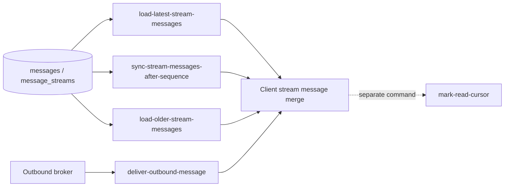

# Stream Messages 유스케이스 설계 결정

> 상태: **Accepted**  
> 조사 기준: 2026-07-13, repository `8e52e36`  
> 결정권자: 도메인 결정권자  
> 부분 결정 기록일: 2026-07-14  
> 최종 결정일: 2026-07-14

## 1. 문서의 역할

이 문서는 `stream-messages` capability group의 유스케이스 경계와 조회 의미를 확정한 최종 설계
결정문이다.

도메인 결정권자는 2026-07-14에 모든 도메인 권고안을 승인했고, 같은 날 `SM-19`, `SM-23`의 기술 제한값도
확정했다. 이 문서는 stream messages 구현 계획의 상위 source of truth다. 이후 package, contract, API,
Gateway, Web 작업을 나누는
[이슈 단위 구현 계획](./stream-messages-implementation-plan.md)은 이 결정의 의미를 바꾸지 않고 실행
단위로만 분해한다.

이 문서가 답하려는 질문은 다음과 같다.

- 저장된 stream 메시지를 읽는 실제 Query slice는 무엇인가?
- 최초 진입, 누락 복구, 과거 더보기는 같은 요청인가, 서로 다른 요청인가?
- `afterSequence`, `beforeSequence`, snapshot watermark의 의미는 무엇인가?
- channel, DM, thread에 같은 조회 규칙을 적용할 수 있는가?
- 실시간 메시지 수신은 이 capability group에 포함되는가?
- 현재 코드에서 재사용할 수 있는 저장 계약과 새로 확정한 공개 계약은 무엇인가?

## 2. 근거의 우선순위

설계 배경으로 제공된 대화는 CQRS 구현 단위와 capability group/slice 구분을 세우는 데 사용한다. 다만
현재 저장소의 공개 계약을 대체하지는 않는다.

목표 계약과 현재 배포 계약을 구분한다.

1. 새 `stream-messages` 구현의 목표 의미는 이 Accepted 결정문이 최우선이다.
2. 구현이 완료되기 전 현재 배포 동작은 source code, provider `README.md`, app `public-docs/`가 설명한다.
3. tracked 아키텍처 문서인 [realtime-chat-architecture.md](./realtime-chat-architecture.md)는 package와 runtime
   경계를 설명한다.
4. 사람용 flow 제안, 구현 계획, 설계 배경 대화는 위 결정을 해석하는 보조 근거다.

구현 계획은 이 문서의 외부 의미를 변경하지 않고 작업 단위로만 분해한다. 구현 완료 뒤에는 provider
`README.md`와 app `public-docs/`를 갱신해 실제 배포 계약과 이 결정문을 일치시킨다.

다음 문서들은 중요한 분석 자료지만 스스로 현재 계약이 아니라고 선언한다.

- [flow-sequence-guide.md](./flow-sequence-guide.md)
- [domain-event-storming-report.md](./domain-event-storming-report.md)
- [Flow 07 — publish 실패와 afterSequence 복구](./notes/implementation-plans/flow-07-publish-failure-after-sequence-recovery.md)
- [Flow 09 — 재접속과 누락 메시지 동기화](./notes/implementation-plans/flow-09-reconnect-missed-message-sync.md)
- [Flow 12 — DM 메시지 전송](./notes/implementation-plans/flow-12-dm-message-send.md)
- [Flow 13 — thread reply 전송](./notes/implementation-plans/flow-13-thread-reply-send.md)

`flow-sequence-guide.md`가 우선하라고 안내하는 `package-owned-flows.md`와
`packages/realtime-chat/owner-docs/*`는 현재 저장소에 없다. 따라서 존재하지 않는 문서를 확정 근거로
가정하지 않는다.

## 3. 결론 요약

현재 요구사항을 CQRS의 실제 구현 단위로 내리면 `stream-messages`는 하나의 Query가 아니라 다음 세
Query slice를 묶는 capability group이다.

| Query slice | 사용자 의도 | 기준 cursor |
| --- | --- | --- |
| `load-latest-stream-messages` | stream 화면에 처음 들어가 최신 구간을 본다 | cursor 없음, 현재 head 기준 |
| `sync-stream-messages-after-sequence` | 재접속·누락·gap 이후 최신 상태까지 따라잡는다 | `afterSequence` |
| `load-older-stream-messages` | 현재 보이는 가장 오래된 메시지보다 이전 구간을 더 본다 | `beforeSequence` |

세 Query는 같은 테이블과 message item을 읽을 수 있지만 요청 의도, cursor, 완료 조건, 실패 의미가
다르다. 하나의 `SyncStream(mode = latest | after | before)` handler에 합치지 않고 독립 Query input,
output, Handler를 가진 세 slice로 분리한다.

### 3.1 2026-07-14에 확정된 제품 의미

- MVP에서 공개하는 조회 대상은 **channel만**이다. DM과 thread 조회는 첫 구현 범위에 포함하지 않는다.
- 최초 진입은 현재 head를 기준으로 **최신 최대 5개**만 조회한다. client가 initial limit을 선택하지
  않으며, `afterSequence = 0`으로 전체 history를 읽지 않는다.
- 신뢰 가능한 기존 sync cursor가 있으면 latest로 건너뛰지 않고, cursor 이후 누락 복구를 먼저 수행한다.
- 읽을 수 있는 빈 channel은 placeholder message나 별도 공개 stream 객체로 표현하지 않고, 빈 message
  page로 응답한다.
- thread 조회를 향후 지원할 때도 첫 reply가 저장되어 thread가 생성된 뒤에만 조회를 허용한다. reply 없는
  root를 빈 thread로 조회하는 계약은 제공하지 않는다.
- 현재 읽기 권한이 있으면 저장된 전체 target history를 읽을 수 있다. 과거 가시 범위 하한은 두지 않는다.
  MVP에서는 이 규칙을 channel에 적용한다.
- 첫 공개 message variant는 `USER/TEXT`만 지원하며 `SYSTEM` message는 지원하지 않는다.
- 같은 로그인 상태에서 WebSocket 재접속과 browser reload가 발생해도 누락 없는 복구를 보장한다.
- channel timeline의 root message에 `threadSummary`를 포함하지 않는다.
- Query Handler는 transport-neutral하게 유지하고, 첫 공개 adapter는 latest/older에 HTTP, after recovery에
  WebSocket relay를 사용한다.
- 최종 response JSON envelope은 UTF-8 직렬화 기준 48KiB를 넘지 않는다. 사용자 text write는 UTF-8
  8KiB로 제한한다.
- 한 번의 자동 after recovery 묶음은 10 page, 500 message, 누적 512KiB 중 먼저 도달한 상한에서 끊고
  마지막 연속 cursor부터 자동 재개한다.

실시간 메시지 수신은 이 Query group의 네 번째 Query가 아니다. broker delivery event를 받아 Gateway의
local session에 `chat.message.created`를 보내는 별도 event-handler capability다. `stream-messages`와
실시간 delivery는 클라이언트의 동일한 message merge 규칙에서 만난다.



## 4. 현재 저장소 구현 기준

### 4.1 이미 구현된 기반

[message-send provider](../../packages/realtime-chat-message-send/README.md)는 message append와 stream
sequence를 구현했고 stream sync는 자신의 책임이 아니라고 명시한다.

현재 DB에는 다음 기반이 이미 있다.

- `message_streams`: `stream_id`, target, `last_sequence`
- `messages`: `stream_id`, `sequence`, sender, target, content, 생성 시각
- `(stream_id, sequence)` unique constraint
- `(stream_id, sequence)` range index
- `(sender_actor_id, stream_id, client_message_id)` idempotency constraint

근거 코드는
[message-send-table.ts](../../packages/realtime-chat-message-send/src/message-send-table.ts)와
[send-message.kysely.ts](../../packages/realtime-chat-message-send/src/usecases/send-message/send-message.kysely.ts)에
있다.

이 저장 구조는 세 조회를 모두 지원한다.

- latest: head 이하에서 최신 최대 5개를 고른 뒤 응답은 오름차순으로 변환
- after: `sequence > afterSequence` 범위를 오름차순 조회
- older: `sequence < beforeSequence` 범위에서 가까운 과거 N개를 고른 뒤 응답은 오름차순으로 변환

다만 현재 append 구현은 이미 존재하는 `stream_id` row의 `target_type/target_id`가 새 command에서 resolve한
target과 같은지 명시적으로 검증하지 않는다. `(target_type, target_id)` unique index만으로는 잘못된
`streamId` resolve나 collision을 완전히 막지 못한다. “channel stream에 thread reply 본문이 들어가지
않는다”는 목표 불변조건을 구현하려면 stream messages query뿐 아니라 message append에서도 기존 stream과
resolved target의 일치를 검증하는 선행 보강이 필요하다.

[realtime-chat-database](../../packages/realtime-chat-database/src/realtime-chat-database.ts)는 gateway ticket뿐
아니라 message tables도 이미 전체 DB type과 migration에 합성한다. 반면 package README의
“현재 ticket table로 시작한다”는 설명은 source code보다 오래되었다.

### 4.2 아직 구현되지 않은 것

현재 저장소에는 다음이 없다.

- stream messages contracts/provider package
- latest/after/older Query와 Handler
- stream read authorizer
- API message query endpoint
- Gateway의 WebSocket message parser와 `chat.stream.sync` relay
- `chat.stream.synced` 또는 sync rejected event
- outbound broker subscriber와 `chat.message.created` 실제 push
- Web client의 실제 WebSocket transport
- sequence gap, snapshot page, out-of-order message를 처리하는 client model

[API runtime contract](../../apps/realtime-chat-api/public-docs/runtime-contract.md)는 ticket 발급/소비
endpoint만 공개한다. [Gateway runtime contract](../../apps/realtime-chat-gateway/public-docs/runtime-contract.md)는
현재 범위가 연결 수락과 ticket 인증까지이며 message envelope과 reconnect 의미는 아직 계약이 아니라고
명시한다.

`message-send`는 package와 DB 차원에서는 구현됐지만 API/Gateway transport에는 아직 조립되지 않았다.
따라서 stream messages 구현 계획은 “message send endpoint가 이미 존재한다”는 전제로 작성하면 안 된다.

현재 API의 error type, timeout fallback과 5xx mapping도 gateway-ticket code에 맞춰져 있고 browser CORS
allow method는 `POST`뿐이다. latest/older HTTP `GET` 또는 stream query 전용 rejection을 추가한다면 공통
API error 경계를 일반화하고 CORS/runtime contract를 함께 변경해야 한다.

### 4.3 현재 Web 구현의 한계

[ChatTransport](../../apps/web/src/features/chat/transport/chatTransport.ts)는 `loadHistory()`와
`onMessageCreated()`라는 필요한 seam을 이미 보여준다. 그러나 실제 구현은
[mockChatTransport](../../apps/web/src/features/chat/transport/mockChatTransport.ts)뿐이다.

현재 `loadHistory()`는 다음 정보를 표현하지 못한다.

- cursor
- page limit
- snapshot watermark
- `hasMoreBefore` / `hasMoreAfter`
- 권한 또는 cursor 오류

[useChatRoom.ts](../../apps/web/src/features/chat/useChatRoom.ts)는 realtime listener를 먼저 등록한 뒤
history 응답이 오면 message 배열 전체를 교체한다. 실제 transport에서 history 요청 중 live message가 먼저
오면 그 message를 잃을 수 있다. 현재 중복 제거도 `messageId`만 사용하고 sequence gap과 out-of-order
buffer를 다루지 않는다.

### 4.4 현재 message 계약의 불일치

서버의
[PublicMessage](../../packages/realtime-chat-message-send-contracts/src/index.ts)와 Web의 임시
[PublicMessageDto](../../apps/web/src/features/chat/contracts.ts)는 같은 개념을 서로 다른 모양으로 정의한다.

| 서버 현재 계약 | Web 임시 계약 |
| --- | --- |
| `senderActorId` | `senderId` |
| target union | `streamType` |
| content의 `type` | content의 `kind` |
| 현재 user text message만 표현 | `USER` / `SYSTEM` 표현 |
| `sentAtClient` 가능 | 해당 필드 없음 |

canonical public message 표현은 Query별 envelope과 분리된 versioned 공통 public contract가 소유한다.

## 5. Capability group과 slice 정의

`stream-messages`는 저장된 message timeline을 읽는 capability group이다. 실제 구현 slice는 하나의 Query
input, 하나의 Handler, 그 Query 전용 response envelope, slice-local query와 mapper로 구성한다.

TypeScript에 CQRS semantics를 적용하기 위해 별도 mediator framework를 도입할 필요는 없다. 현재 저장소의
함수 조립 스타일을 유지하면서 다음 경계를 지키면 된다.

- Query별 input/output envelope을 공유하지 않는다.
- 각 Handler는 자신의 시작과 끝을 소유한다.
- 세 Handler가 다른 Handler를 직접 호출하지 않는다.
- 공통 DB table을 읽을 수는 있지만 다른 slice의 query helper를 deep import하지 않는다.
- read slice는 message, stream, read cursor를 수정하지 않는다.
- HTTP와 WebSocket adapter는 Query input으로 mapping하고 결과를 외부 contract로 mapping한다.

공개 message item은 Query envelope과 성격이 다르다. 여러 외부 경계가 같은 저장 메시지를 표현해야 한다면
독립된 versioned message contract로 승격할 수 있다. 이것은 slice-local Query DTO 공유와 구분한다.

## 6. Cursor 용어와 상태 모델

최초 tail 조회와 누락 복구를 올바르게 분리하려면 cursor를 하나의 `lastSeenSequence`로 뭉뚱그리지 않아야
한다.

| 용어 | 의미 | 변경 주체 |
| --- | --- | --- |
| `headSequence` | 서버 stream에 저장 완료된 마지막 sequence | message append transaction |
| `throughSequence` | 한 번의 latest/sync 응답이 고정한 snapshot 상한 | Query Handler |
| `deliverySyncCursor` | client가 특정 기준점 이후 누락 없이 live 상태를 적용한 위치 | client merge model |
| `historyBeforeCursor` | 현재 로드한 history window의 가장 오래된 경계 | client history model |
| `ReadCursor` | 사용자가 실제로 읽었다고 서버에 표시한 위치 | `mark-read-cursor` command |

예를 들어 stream head가 1,000이고 최초 화면이 최신 5개인 996~1,000만 로드했다고 하자.

- client는 1~995를 로드하지 않았다.
- 그래도 latest snapshot을 적용한 뒤 live 복구 기준은 1,000으로 잡을 수 있다.
- 과거 더보기 기준은 996이다.
- 사용자가 실제로 읽은 위치는 별도의 `ReadCursor`다.

따라서 “1부터 연속으로 가진 모든 history”와 “latest snapshot 이후의 live 연속성”을 같은 cursor로 표현하면
안 된다. latest query는 과거 전체를 가져오는 sync가 아니라 live 상태를 시작할 checkpoint를 세우는
query다.

### 6.1 Query 선택 규칙

신뢰 가능한 `deliverySyncCursor`가 이미 있으면 화면 재진입이나 재접속에서 latest checkpoint를 새로
세우면 안 된다. cursor가 900인데 latest 996~1,000으로 바로 anchor하면 901~995를 영구적으로 건너뛸 수
있다.

확정된 선택 규칙은 다음과 같다.

- 신뢰 가능한 cursor가 있다: `sync-stream-messages-after-sequence`로 기존 cursor 이후를 먼저 복구한다.
- cursor가 없다: `load-latest-stream-messages`로 현재 head에 새 checkpoint를 세운다.
- 사용자가 명시적으로 “최신으로 이동”을 선택했다: 복구하지 않은 구간을 포기한다는 제품 의미를 확인한
  뒤 latest checkpoint를 재설정할 수 있다.
- 과거를 더 본다: `load-older-stream-messages`를 사용하며 live cursor와 독립적으로 처리한다.

같은 로그인 상태의 WebSocket reconnect와 browser reload 뒤에도 cursor를 복원해 누락 없는 recovery를
보장한다. 첫 구현은 `sessionStorage`에 actor와 channel별 `deliverySyncCursor`와 진행 중
`throughSequence`만 보존한다. 안정적인 인증 session namespace가 있을 때만 key에 추가하며, 연결마다
바뀌는 Gateway session ID는 key로 사용하지 않는다. message content는 저장하지 않는다. logout·계정 전환
때 해당 actor의 값을 폐기하고, 유효한 로그인 문맥과 일치하지 않는 값은 복원하지 않는다. memory-only
cursor는 이 보장 수준을 만족하지 못한다.

## 7. Query slice 1 — `load-latest-stream-messages`

### 7.1 의도

사용자가 MVP channel 화면에 처음 진입했을 때 현재 stream의 최신 message window를 최대 5개 가져오고,
이후 live sync를 시작할 snapshot 기준점을 얻는다.

`afterSequence = 0`으로 오래된 stream 전체를 순회하는 것은 이 유스케이스가 아니다.

### 7.2 확정된 처리 의미

1. 인증 actor와 target/stream selector를 검증한다.
2. message content를 읽기 전에 read authorization을 수행한다.
3. canonical stream과 현재 `headSequence`를 확인한다.
4. `headSequence` 이하의 최신 6개까지 고른다.
5. 최신 5개만 response에 포함하고 sequence 오름차순으로 반환한다.
6. 추가 row 존재 여부로 `hasMoreBefore`를 계산한다.
7. 응답의 `throughSequence`를 live `deliverySyncCursor`의 checkpoint로 제공한다.

MVP `load-latest-stream-messages` request에는 client가 조절하는 `limit`을 두지 않는다. 5는 기본값이 아니라
서버가 보장하는 initial window 상한이다. after/older page는 기본 50개, 최대 100개로 확정한다.

### 7.3 성공 결과가 표현해야 할 것

- Query correlation ID
- canonical `streamId`
- snapshot `throughSequence`
- sequence 오름차순 message page
- 다음 older 요청에 사용할 `nextBeforeSequence`
- `hasMoreBefore`

message page가 비어 있지 않으면 `nextBeforeSequence`는 반환한 가장 오래된 sequence이고, 비어 있으면
`null`이다.

### 7.4 불변조건

- response message는 모두 같은 stream에 속한다.
- message sequence는 엄격히 증가한다.
- 어떤 message도 `throughSequence`보다 클 수 없다.
- `headSequence > 0`이면 non-empty latest page의 마지막 message sequence는 반드시
  `throughSequence`와 같다.
- current no-retention 모델에서는 반환한 tail window 내부 sequence가 연속이어야 한다.
- latest 5개를 선택하는 DB 내부 정렬과 client에 반환하는 정렬을 구분한다.
- Query는 `ReadCursor`를 갱신하지 않는다.
- 유효하고 읽을 수 있지만 아직 message가 없는 channel은 빈 성공이어야 한다.

마지막 조건은 현재 구현에서 특히 중요하다. `message_streams` row는 첫 message append 때 lazy create된다.
따라서 stream row가 없다는 이유만으로 channel 미존재 또는 권한 없음으로 판단하면 안 된다. 빈 channel은
placeholder message나 미리 생성된 공개 stream 객체로 표현하지 않고, `messages = []`인 성공 결과로만
표현한다. 빈 thread는 이 규칙의 예외이며 `SM-22`에 따라 존재하지 않는 조회 대상으로 취급한다.

### 7.5 대표 acceptance scenario

- sequence 1~200이 있으면 196~200을 오름차순으로 반환한다.
- `throughSequence`는 200이고 `hasMoreBefore`는 true다.
- query snapshot 뒤 sequence 201이 live event로 도착하면 latest response와 별도로 병합되어 최종 cursor가
  201까지 전진한다.
- 읽을 수 있는 빈 channel은 `throughSequence = 0`, 빈 messages, `hasMoreBefore = false`를 반환한다.

## 8. Query slice 2 — `sync-stream-messages-after-sequence`

### 8.1 의도

다음 상황에서 client의 `deliverySyncCursor` 이후 저장 message를 조회해 고정된 stream snapshot까지
따라잡는다.

- WebSocket 재접속
- recipient offline
- outbound publish 또는 socket push 누락
- live sequence gap 감지
- sync page 중단 뒤 재개

이 Query는 현재 message-send의 “저장 성공과 delivery 성공은 별개”라는 의미를 완성하는 필수 복구 경로다.

### 8.2 확정된 처리 의미

첫 page:

1. actor와 selector를 검증하고 read authorization을 수행한다.
2. 현재 `headSequence`를 `throughSequence`로 고정한다.
3. `afterSequence <= throughSequence`를 검증한다.
4. `afterSequence < sequence <= throughSequence`를 오름차순으로 N+1개 조회한다.
5. 반환한 마지막 sequence를 `nextAfterSequence`로 제공한다.

후속 page:

1. 이전 응답과 동일한 `throughSequence`를 받는다.
2. 각 page마다 현재 actor의 read authorization을 다시 확인한다.
3. `nextAfterSequence` 이후부터 같은 상한까지만 읽는다.
4. 새 message가 생겨도 현재 sync snapshot에 포함하지 않는다.
5. 마지막 page를 적용한 뒤 `deliverySyncCursor`가 `throughSequence`에 수렴한다.

`throughSequence`는 pagination watermark이지 권한을 고정하는 capability token이 아니다. page 사이에 접근
권한이 철회되면 다음 page는 `stream_unavailable`로 중단되어야 한다.

### 8.3 성공 결과가 표현해야 할 것

- Query correlation ID
- canonical `streamId`
- 요청한 `afterSequence`
- 고정 `throughSequence`
- sequence 오름차순 message page
- `nextAfterSequence`
- `hasMoreAfter`

message page가 비어 있지 않으면 `nextAfterSequence`는 반환한 마지막 sequence다. 정상 final page가 비어
있으면 `nextAfterSequence`는 `throughSequence`와 같다.

### 8.4 불변조건

- `afterSequence`는 exclusive cursor다.
- 동일 요청은 DB가 변하지 않은 범위에서 같은 message order를 반환한다.
- 각 page는 유한하고 snapshot 상한은 page 사이에 움직이지 않는다.
- `hasMoreAfter = false`인 정상 final page의 `nextAfterSequence`는 `throughSequence`와 같아야 한다.
- live event와 sync page가 겹쳐도 `messageId` 기준으로 한 번만 적용한다.
- 같은 `streamId + sequence`에 다른 `messageId`가 오면 protocol/data invariant 위반이다.
- Query는 message, stream head, `ReadCursor`를 수정하지 않는다.

### 8.5 대표 acceptance scenario

- head가 100이고 `afterSequence = 97`, limit 2이면 첫 page는 98~99, 다음 cursor는 99,
  `hasMoreAfter = true`다.
- 다음 page는 동일한 `throughSequence = 100`으로 100을 반환하고 완료된다.
- 첫 page 뒤 101이 저장돼도 현재 snapshot에는 포함되지 않는다. 101은 live event 또는 다음 sync에서 처리한다.
- `afterSequence = headSequence`면 빈 성공이다.
- `afterSequence > headSequence`면 정상 빈 page로 위장하지 않고 invalid cursor로 처리한다.

## 9. Query slice 3 — `load-older-stream-messages`

### 9.1 의도

사용자가 timeline을 위로 이동할 때 현재 history window의 가장 오래된 message보다 이전에 저장된 message를
추가로 가져온다.

이 Query는 delivery 누락 복구가 아니다. 완료되어도 `deliverySyncCursor`를 바꾸지 않는다.

### 9.2 확정된 처리 의미

1. actor와 selector를 검증하고 read authorization을 수행한다.
2. `sequence < beforeSequence`인 row 중 cursor에 가장 가까운 과거 N+1개를 선택한다.
3. DB에서는 효율적인 선택을 위해 내림차순으로 읽을 수 있다.
4. response는 client canonical order인 sequence 오름차순으로 반환한다.
5. 가장 오래된 반환 sequence를 다음 `beforeSequence` 경계로 제공한다.
6. 추가 row 존재 여부로 `hasMoreBefore`를 계산한다.

### 9.3 성공 결과가 표현해야 할 것

- Query correlation ID
- canonical `streamId`
- 요청한 `beforeSequence`
- sequence 오름차순 message page
- 다음 요청에 사용할 `nextBeforeSequence`
- `hasMoreBefore`

message page가 비어 있지 않으면 `nextBeforeSequence`는 반환한 가장 오래된 sequence이고, 비어 있으면
`null`이다.

### 9.4 불변조건

- `beforeSequence`는 exclusive cursor다.
- response message는 모두 `beforeSequence`보다 작다.
- 최신 append는 이미 고정된 older 범위를 흔들지 않는다.
- Query는 live sync cursor와 `ReadCursor`를 갱신하지 않는다.
- 각 page는 현재 actor의 read authorization을 다시 확인한다.

`beforeSequence`는 `1 <= beforeSequence <= headSequence + 1` 범위만 허용한다. 이는 stateless numeric
cursor의 유효 범위다. `headSequence + 1` 요청은 latest 구간과 겹칠 수 있으며 정상 client는 서버가 반환한
`nextBeforeSequence`를 사용한다. 겹친 message는 공통 merge model이 제거한다. 범위 밖 값은
`invalid_cursor`로 거절한다.

### 9.5 대표 acceptance scenario

- 현재 가장 오래된 message가 151이고 limit 50이면 `beforeSequence = 151` 요청은 101~150을
  오름차순으로 반환한다.
- 같은 요청 중 sequence 201이 append되어도 older page 결과는 바뀌지 않는다.
- 더 오래된 row가 없으면 빈 messages와 `hasMoreBefore = false`를 반환한다.

## 10. Channel, DM, Thread 적용

세 Query의 pagination과 ordering은 stream type과 무관하게 동일하게 적용할 수 있다. 달라지는 것은 stream
resolve와 read authorization이다. 다만 MVP 공개 범위는 channel 하나이며, DM과 thread row는 첫 구현에
포함하지 않는다.

| Target | MVP 공개 여부 | 읽기 전 확인 | 빈 stream 처리 | 추가 규칙 |
| --- | --- | --- | --- | --- |
| Channel | 공개 | workspace/channel read membership | 읽을 수 있으면 빈 message page | 현재 권한이 있으면 저장된 전체 history 조회 |
| DM | 비공개 | 후속 범위에서 결정 | MVP 계약 없음 | 첫 구현에서 제외 |
| Thread | 비공개 | 후속 범위에서 root의 parent stream read 권한 확인 | 빈 thread를 표현하지 않음 | 첫 reply로 thread가 생성된 뒤에만 조회 |

thread reply 본문은 channel stream query에 섞지 않는다. channel timeline이 root message의
`threadSummary`를 포함하지 않는다. 향후 thread 조회를 공개하더라도 reply 본문은 별도 thread stream에서만
조회한다.

현재 실제 channel read permission provider는 구현되어 있지 않다. production runtime에 allow-all 기본값을
두지 않는다. channel authorizer가 준비되지 않으면 앱 조립을 실패시키거나 Query를 공개하지 않아야 한다.

첫 channel 권한 모델은 public channel의 active workspace member와 private channel의 active channel member를
허용한다. archived channel도 해당 membership을 유지한 actor에게 read-only history 조회를 허용한다.
channel 존재, visibility, membership의 기준 상태는 channel bounded context가 소유하고 Stream Messages는
그 provider를 좁은 `ChannelReadAuthorizer`로 소비한다.

Thread는 첫 reply가 저장될 때 생성된다. 따라서 root message만 있고 reply가 없는 상태는 thread로
표현하지 않으며, `rootMessageId`로 빈 reply page를 조회하는 계약도 제공하지 않는다. 향후 thread Query를
공개할 때는 이미 생성된 canonical thread target만 selector로 받을 수 있다. stream messages Query는 reply
page만 반환하고 root message와 thread metadata 조회는 별도 Query라는 경계를 유지한다.

## 11. Stream selector와 빈 stream 문제

Query selector를 확정할 때 가장 중요하게 다룬 문제다.

현재 flow 제안은 client가 opaque `streamId`로 sync하는 그림을 사용한다. 그러나 현재 DB는 첫 message 때
stream row를 lazy create한다. message가 한 건도 없는 target은 stream row가 없으므로 `streamId`만으로는
target 존재와 읽기 권한을 확인할 정보가 없다.

가능한 선택은 다음과 같다.

### 선택 A — 모든 Query가 target selector를 받는다 — **채택**

- channelId, dmConversationId, threadId 중 하나를 받는다.
- server가 target을 canonical stream으로 resolve하고 권한을 확인한다.
- 읽기 Query가 stream row를 만들지 않아도 빈 성공을 표현할 수 있다.
- response는 canonical `streamId`를 돌려준다.

### 선택 B — stream을 target 생성 시 eager create한다

- 모든 Query가 opaque `streamId`만 받을 수 있다.
- channel/DM/thread 생성 lifecycle과 stream 생성 transaction을 새로 묶어야 한다.
- 현재 lazy append 구조를 바꾸는 선행 작업이 필요하다.

### 선택 C — `streamId`와 target hint를 함께 받는다

- 서버가 둘의 일치를 검증해야 한다.
- 계약과 오류가 복잡해지고 client가 두 식별자를 함께 보존해야 한다.

선택 A를 채택한다. MVP의 세 Query는 `channelId`를 받고 server가 canonical stream을 resolve하며, 조회는
stream row를 생성하지 않는다. response는 canonical `streamId`를 반환한다. thread에는 향후 공개 시
`SM-22`의 “첫 reply 이후에만 조회” 규칙이 우선 적용된다.

canonical stream identity는 공통 message contract가 소유한다. 첫 버전의 결정적 규칙은
`{targetType}:{targetId}`이며 channel은 `channel:{channelId}`다. message-send와 stream-messages는 각각
resolver를 만들지 않고 같은 공통 함수를 사용한다. 따라서 빈 channel 조회에서 계산해 반환한 `streamId`와
첫 message append가 생성하는 `streamId`가 반드시 같다. 이미 존재하는 stream row의 target과 계산한
identity가 다르면 정상 빈 결과로 처리하지 않고 data-integrity failure로 중단한다.

## 12. 실시간 메시지 수신과의 경계

사용자가 “메시지를 받는다”는 표현에는 두 흐름이 있다.

| 흐름 | 입력 | 구현 종류 | 소유 경계 |
| --- | --- | --- | --- |
| 저장 message를 요청해 받음 | Query request | Query Handler | `stream-messages` |
| 새 message를 실시간 push로 받음 | outbound delivery event | Event Handler | outbound delivery/Gateway |

실시간 흐름은 다음과 같다.

```txt
OutboundMessageDeliveryRequested
→ 모든 Gateway subscriber
→ recipientActorIds로 local session 조회
→ 해당 socket에 chat.message.created push
```

따라서 `receive-message` Query를 새로 만들지 않는다. 대신 Query result와 live event가 같은 client merge
invariant를 만족해야 한다.

## 13. Client merge와 race 처리

모든 message 입력 경로는 하나의 stream merge model을 통과해야 한다.

입력 source는 다음과 같다.

- latest page
- after sync page
- older page
- realtime created event
- sender accepted correlation

공통 규칙은 다음과 같다.

- canonical ordering은 `streamId + sequence`다.
- `messageId`가 이미 있으면 중복 삽입하지 않는다.
- 같은 `streamId + sequence`의 다른 `messageId`는 오류로 기록하고 자동 덮어쓰지 않는다.
- live sequence가 `deliverySyncCursor + 1`보다 크면 buffer하고 after sync를 예약한다.
- sequence가 `deliverySyncCursor` 이하이고 현재 loaded history window 밖이면 오래 지연된 pre-checkpoint
  event로 보고 현재 window에는 삽입하지 않는다. 필요하면 older query가 다시 가져온다.
- sequence가 `deliverySyncCursor` 이하이면서 현재 loaded window 안인데 해당 message가 없다면 snapshot
  누락 또는 계약 위반으로 기록한다.
- latest/sync 요청 전에 live listener를 활성화하고 응답이 올 때까지 live message를 안전하게 buffer한다.
- latest snapshot의 `throughSequence` 이하 live event는 page와 deduplicate한다.
- `throughSequence`보다 큰 live event는 snapshot 이후 message로 순서대로 적용한다.
- older page는 timeline 앞에 merge하지만 `deliverySyncCursor`를 바꾸지 않는다.
- `ReadCursor` 전진은 별도 사용자 command에서만 일어난다.

현재 `useChatRoom`의 배열 교체 방식은 이 규칙을 보장하지 못한다. client merge model은 Web chat feature가
소유하고, `deliverySyncCursor`와 진행 중 `throughSequence`는 `sessionStorage`에 저장한다. 위 protocol
invariant는 server contract와 client model 양쪽에서 같은 acceptance scenario로 검증한다.

## 14. 권한, 오류, 정보 은닉

### 14.1 권한

- actor identity는 API auth context 또는 Gateway session에서 주입한다.
- client body의 actor ID를 신뢰하지 않는다.
- read authorization은 message row/content 조회 전에 실행한다.
- multi-page query는 page마다 현재 권한을 다시 확인한다.
- Gateway는 local session만 확인하고 channel/DM/thread membership을 추측하지 않는다.
- 권한 provider가 없는 production 조립에 allow-all fallback을 두지 않는다.

과거 가시 범위에는 별도의 하한을 두지 않는다. 현재 target read authorization을 통과한 actor는 저장된
전체 history를 조회할 수 있고, authorizer는 `minimumReadableSequence`를 반환하지 않는다. 각 page에서
현재 권한을 다시 확인하는 원칙은 유지한다. MVP에서는 channel에 적용하며, 향후 DM을 공개하더라도
재참여로 현재 읽기 권한을 다시 얻으면 재참여 이전의 저장 history까지 조회할 수 있다는 의미다.

첫 버전은 page 시작 시 authorization을 완료한 뒤 message query를 실행하며, 그 사이에 membership이
철회되는 짧은 race를 허용한다. 서로 다른 권한 원천과 message DB를 하나의 transaction으로 묶지 않는다.
다음 page에서는 다시 authorization하므로 철회 이후의 추가 조회는 중단된다. 더 강한 즉시 철회 보장이
필요해지면 권한 원천의 snapshot/version 계약을 별도 확장한다.

### 14.2 도메인 결과와 infrastructure failure

다음은 domain/query rejection이다.

- 읽을 수 없거나 존재하지 않는 target/stream
- cursor가 현재 head보다 큼
- 잘못된 page cursor 또는 watermark

다음은 정상 rejected result로 위장하면 안 된다.

- DB timeout/failure
- Gateway → API network failure
- API 5xx
- response schema mismatch
- current no-retention invariant에서 발견한 sequence gap

존재하지 않는 private stream과 권한이 없는 stream을 다른 reason으로 노출하면 resource enumeration이 가능할
수 있다. 외부 reason은 하나의 `stream_unavailable`로 합친다.

입력과 watermark validation의 확정 기준은 다음과 같다.

- sequence와 limit는 JSON number 중 safe integer만 허용한다.
- `afterSequence`와 `throughSequence`는 0 이상이어야 한다.
- `beforeSequence`는 1 이상이어야 한다.
- 후속 sync는 `afterSequence <= throughSequence <= current headSequence`여야 한다.
- explicit `throughSequence`는 secret이나 권한 token이 아니다. 서버가 범위를 매 page 검증한다.
- malformed/unsafe number는 transport `bad_request`, 유효한 숫자지만 stream 상태와 맞지 않는 cursor는
  domain `invalid_cursor`로 구분한다.
- after/older limit 미지정은 50을 사용하고 100 초과는 clamp하지 않고 거절한다.
- request object는 strict schema로 검증하고 client-owned actor, 권한, server watermark 외의 unknown field를
  거절한다.

첫 버전은 client-visible numeric `throughSequence`를 사용한다. 서버는 매 page에서 값의 범위를 검증하지만
“첫 page에서 실제로 발급한 값과 같은가”까지 stateless하게 증명하지 않는다. 이 증명이 필요해지면
watermark와 selector를 담은 signed/opaque continuation token 또는 server-side sync state를 별도 도입한다.

현재 schema에는 retention과 hard delete가 없다. 따라서 요청 범위 안의 sequence gap은 정상 history
상태가 아니라 infrastructure/data-integrity failure다. retention은 이번 범위에서 제외하며, 미래에 도입할
때 `earliestAvailableSequence`와 reset-required cursor 의미를 별도 결정한다.

## 15. Contract와 package 소유권

현재 저장소 구조에 맞춘 확정 책임은 다음과 같다.

```txt
packages/realtime-chat-message-contracts
  versioned PublicMessage item schema
  USER/TEXT content schema
  UTF-8 text 8KiB invariant
  canonical target -> streamId identity rule

packages/realtime-chat-stream-messages-contracts
  load-latest 전용 request/response schema
  sync-after 전용 request/response schema
  load-older 전용 request/response schema
  공개 query rejection code
  response 48KiB invariant
  boundary별 canonical JSON serializer / UTF-8 byte measurer

packages/realtime-chat-stream-messages
  usecases/load-latest-stream-messages
  usecases/sync-stream-messages-after-sequence
  usecases/load-older-stream-messages
  slice-local Kysely query / mapper / policy
  ChannelReadAuthorizer consumer contract와 target resolver 경계
  API public/internal route registration과 transport mapping
  Gateway sync event router와 API client mapping
```

구체 package/file 작업은 이 결정문을 기준으로 별도 구현 계획에서 이슈 단위로 나눈다. 위 구조의 핵심은
capability package 하나에 세 Handler를 두되 하나의 다중-mode Handler로 합치지 않는 것이다.

저장소 의존 방향은 다음과 같다.

- stream messages provider는 현재 message tables의 공개 table contract를 read-only로 사용한다.
- `send-message.kysely.ts`의 private row parser를 deep import하지 않는다.
- 새 table은 만들지 않는다.
- Query package가 `realtime-chat-database` 전체 runtime package를 참조하지 않는다.
- 공통 message row/public item mapping이 실제로 두 capability에서 필요하면 명시적 owner package로
  승격한다.

Query request/response envelope은 서로 공유하지 않는다. `PublicMessage`처럼 send response, delivery event,
stream query에서 같은 외부 value를 뜻하는 message item은 send-specific contracts에서 분리해
`@wake-surfer/realtime-chat-message-contracts`가 소유한다. message-send contracts는 이 공통 계약을
재사용한다.

HTTP route와 WebSocket event mapping은 app에 직접 구현하지 않고 stream-messages package가 소유한다.
API/Gateway app은 server, 인증 문맥, DB, HTTP client 같은 runtime resource를 만들고 package의
register/mount entrypoint를 호출한다. app이 Query DTO, pagination, 오류 mapping을 다시 구현하지 않는다.

`ChannelReadAuthorizer`의 좁은 consumer-side contract는 stream messages provider가 소유한다. 현재
저장소에는 channel 존재와 membership을 판정할 concrete provider가 없으므로 이를 제공하는 선행 이슈가
필요하다. concrete 권한 규칙을 app shell이나 allow-all fallback으로 대신하지 않으며, provider가 준비되기
전에는 public Query adapter를 mount하지 않는다.

첫 공개 계약의 message variant는 현재 저장 가능한 `USER/TEXT` 하나로 제한한다. `SYSTEM` message는
지원하지 않으며, 이를 알 수 없는 variant로 묵시 변환하지도 않는다. SYSTEM을 도입하려면 storage와 공개
contract를 함께 확장하는 별도 결정을 거친다.

## 16. Transport 경계

세 Query Handler는 transport-neutral하게 유지한다. 첫 공개 adapter는 다음과 같다.

- HTTP latest/older query
- WebSocket after recovery `chat.stream.sync` → `chat.stream.synced` relay
- HTTP 기반 Gateway → API internal query

Gateway가 WebSocket query를 relay하더라도 read authorization과 pagination 의미는 API/provider가 소유한다.
Gateway는 actor를 session에서 주입하고 request/result correlation, payload limit, timeout/cancellation만
담당한다.

Gateway가 전달하는 actor identity의 신뢰 경계는 공개 internal contract에 포함한다. browser가 body나
header로 보낸 actor ID를 그대로 전달해서는 안 된다. 현재 `x-gateway-id` 평문 값은 식별자일 뿐 production
자격 증명으로 사용하지 않는다. MVP internal route는 TLS 위에서 별도 Gateway service bearer credential을
검증하고, 인증에 성공한 경우에만 server-only actor header를 읽는다. actor는 request body에 넣지 않으며
public route에서는 asserted actor header를 읽지 않는다. public actor도 인증 세션 또는 신뢰된 edge가
주입해야 하며 현재의 평문 actor header adapter는 명시적인 개발·테스트 환경에서만 허용한다.

latest/older는 HTTP로 제공하고 after recovery는 WebSocket으로 relay한다. Gateway → API 내부 호출이
필요하더라도 같은 Handler와 Query 의미를 사용하며 별도 pagination 규칙을 만들지 않는다.

Query correlation 이름은 `requestId`를 사용한다. domain idempotency key가 아니라 응답 relay와 stale
response 폐기에 쓰이는 transport correlation이기 때문이다.

## 17. 성능과 일관성

### 17.1 DB query

현재 `(stream_id, sequence)` index는 세 조회 shape에 충분하다. 구현 시 N+1 row를 읽어 `hasMore`를
판정하고 response에는 N개만 포함한다.

- latest: head 이하, sequence 내림차순 선택, response 오름차순
- after: cursor 초과와 watermark 이하, response 오름차순
- older: cursor 미만, sequence 내림차순 선택, response 오름차순

head와 message rows의 snapshot 의미는 하나의 SQL 또는 짧은 read-only transaction으로 검증한다. write
transaction이 `last_sequence` 증가와 message insert를 함께 commit하므로 미커밋 head만 노출되어서는 안
된다.

### 17.2 Payload와 종료 조건

모든 page에는 다음 상한을 적용한다.

- latest initial window: 최대 5개로 확정
- after/older default message count: 50개
- after/older maximum message count: 100개
- 최종 client-visible JSON envelope: UTF-8 직렬화 기준 최대 48KiB(49,152 byte)
- `USER/TEXT` write의 text: UTF-8 기준 최대 8KiB(8,192 byte)

count 상한보다 먼저 byte 상한에 도달하면 다음 message 직전에서 page를 끝내고 마지막으로 반환한 sequence를
continuation으로 사용한다. latest/older는 DB에서 가까운 message부터 선택한 뒤 byte 상한에 맞는 연속 구간만
오름차순으로 반환한다. after는 오름차순으로 byte 상한까지 반환한다. 어느 경우에도 message를 건너뛰거나
내용을 절단하지 않는다.

48KiB 판정은 message item 크기의 합이나 provider의 추정값으로 계산하지 않는다.
`@wake-surfer/realtime-chat-stream-messages-contracts`가 latest HTTP body, older HTTP body,
`chat.stream.synced` WebSocket event의 canonical JSON serializer와 UTF-8 byte 측정 함수를 소유한다.

Query Handler는 HTTP body나 WebSocket event 형식을 직접 알지 않는다. 각 adapter/mount가 실제
`requestId`, cursor, watermark와 candidate messages를 포함해 최종 client envelope을 직렬화하는
`measureFinalEnvelope(candidate)` 크기 정책을 만들고 Handler에 주입한다. Handler는 이 함수가 반환한 byte
수와 상한 충족 여부만 사용해 page와 continuation을 결정한다. adapter는 Handler가 판정한 동일 object를 같은
canonical serializer로 전송하고 마지막에 같은 상한을 assertion한다. sync-after internal HTTP mount도 내부
HTTP response 크기가 아니라 최종 `chat.stream.synced` event serializer를 사용하는 측정 정책을 주입한다.
따라서 세 Handler는 전송 중립성을 유지하면서도 실제 client-visible envelope의 48KiB 상한을 보장한다.

저장된 message 한 건만으로 48KiB를 넘으면 해당 row를 건너뛰거나 cursor를 전진시키지 않고
infrastructure/data-integrity failure로 중단한다. 외부에는 일반 retryable service/transport failure로
표현하고, 내부 관측에는 message ID, stream ID, sequence, byte 수만 남기며 content는 기록하지 않는다.
정상 write에서는 8KiB text 상한으로 이 상태를 예방한다. 현재 message-send 계약과 DB에는 이 상한이 없으므로
write validation과 DB invariant 보강이 stream messages 구현의 선행 작업이다.

한 번의 자동 after recovery 묶음은 다음 중 하나에 먼저 도달할 때 끝낸다.

- 성공적으로 적용한 page 10개
- 성공적으로 적용한 message 500개
- 최종 직렬화 response 누적 512KiB(524,288 byte)

`throughSequence`에 아직 도달하지 못했다면 오류가 아니라 `recovery_pending` 상태로 전환한다. 마지막으로
완전히 적용한 `nextAfterSequence`와 같은 `throughSequence`를 보존하고 event loop에 제어를 양보한 뒤 새
묶음을 자동 시작한다. 실패하거나 일부만 받은 page는 cursor와 누적량에 반영하지 않는다.
`hasMoreAfter = true`인데 cursor가 전진하지 않으면 무한 반복하지 않고 protocol failure로 중단한다.

server Query는 stateless page 단위이므로 48KiB 상한을 강제한다. 10 page/500 message/512KiB의 묶음 상한은
Web recovery orchestrator가 강제한다. 현재 page 상한에서는 10 page가 최대 480KiB이므로 512KiB는 먼저
도달하지 않는 방어적 이중 상한이다. 반복 호출 abuse 방지는 이 상한이 아니라 API/Gateway 공통 rate limit
책임이며, production public exposure 전 별도 보안 이슈로 완료한다.

Web transport는 HTTP raw response text 또는 WebSocket raw frame의 UTF-8 byte 수를 parse 전에 측정하고,
검증된 page와 함께 recovery orchestrator에 전달한다. orchestrator는 object를 다시 직렬화해 누적량을
추정하지 않는다.

## 18. Domain Owner Decision Record

아래 표의 모든 항목은 `확정` 상태다.

도메인 결정권자는 2026-07-14에 명시적으로 답한 항목 외의 모든 권고안도 일괄 승인했다. “과거
가시범위는 없음”은 **과거 조회 제한이 없음**, 즉 현재 읽기 권한이 있으면 저장된 전체 history를 조회할 수
있다는 의미로 기록한다.

| ID | 결정 항목 | 검토 당시 권고안 | 결정 |
| --- | --- | --- | --- |
| SM-01 | slice 경계 | latest / after / older를 세 Query+Handler로 분리 | **확정 — 세 Query를 각각 독립 input·output·Handler를 가진 slice로 분리한다.** |
| SM-02 | MVP target 범위 | storage/query는 channel·DM·thread 공통, 공개는 authorizer가 준비된 target부터 | **확정 — MVP 공개 조회 대상은 channel만이다. DM과 thread는 제외한다.** |
| SM-03 | Query selector | 세 Query 모두 target selector를 받고 server가 stream resolve | **확정 — MVP는 `channelId`를 받고 server가 canonical stream을 resolve하며 response에 `streamId`를 반환한다.** |
| SM-04 | initial load | `afterSequence=0` 전체 sync가 아니라 현재 head 기준 latest N개 | **확정 — 현재 head 기준 최신 최대 5개를 반환한다. initial limit은 client가 선택하지 않는다.** |
| SM-05 | cursor 모델 | `deliverySyncCursor`, `historyBeforeCursor`, `ReadCursor`를 분리 | **확정 — 세 cursor를 서로 다른 상태로 유지한다.** |
| SM-06 | cursor 비교/정렬 | after/before 모두 exclusive, 모든 response는 sequence ASC | **확정 — after/before는 모두 exclusive이고 모든 page는 sequence 오름차순이다.** |
| SM-07 | after/older page limit | 기본 50, 최대 100, N+1 row로 `hasMore` 판정 | **확정 — 기본 50, 최대 100이며 N+1개 조회 후 최대 N개를 반환한다.** |
| SM-08 | after snapshot 신뢰 수준 | stateless numeric `throughSequence`를 범위 검증; 발급 증명이 필요하면 opaque token 선택 | **확정 — 첫 버전은 numeric `throughSequence`를 매 page 범위 검증하며 opaque token은 사용하지 않는다.** |
| SM-09 | 빈 stream | target이 존재하고 읽을 수 있으면 stream row가 없어도 빈 성공 | **확정 — 빈 channel은 placeholder로 표현하지 않고 빈 message page로 응답한다. 빈 thread는 SM-22의 예외다.** |
| SM-10 | 권한/은닉 | content 조회 전 authorize, not-found/forbidden은 `stream_unavailable`로 통합 | **확정 — 조회 전 authorize하고 외부 오류는 `stream_unavailable`로 통합한다.** |
| SM-11 | canonical message contract | Query envelope은 독립, message item은 별도 공통 public contract로 승격 | **확정 — Query envelope은 독립 소유하고 message item은 versioned 공통 public contract가 소유한다.** |
| SM-12 | transport | Handler는 중립; latest/older HTTP와 after WebSocket relay를 우선 제공 | **확정 — Handler는 중립으로 유지하고 latest/older는 HTTP, after는 WebSocket relay로 공개한다.** |
| SM-13 | correlation | Query는 `requestId` 사용 | **확정 — Query correlation은 `requestId`를 사용한다.** |
| SM-14 | current history gap | retention이 없으므로 infrastructure/data-integrity failure로 처리 | **확정 — 현재 sequence gap은 infrastructure/data-integrity failure다.** |
| SM-15 | future retention | 이번 범위에서 제외하고 도입 시 reset/earliest cursor 계약 재결정 | **확정 — retention은 제외하고 도입 시 cursor/reset 의미를 다시 결정한다.** |
| SM-16 | sender correlation | history item에 `clientMessageId`를 노출하지 않고 동일 ID send retry로 pending 복구 | **확정 — history에 `clientMessageId`를 노출하지 않고 send 재시도로 pending을 복구한다.** |
| SM-17 | thread timeline projection | reply 본문은 thread stream에만, root `threadSummary`는 별도 결정/후속 범위 | **확정 — channel timeline에 `threadSummary`를 포함하지 않는다.** |
| SM-18 | client merge invariant | latest/sync/older/live/accepted가 하나의 sequence-aware merge model 사용 | **확정 — 모든 입력을 하나의 sequence-aware client merge model로 처리한다.** |
| SM-19 | response byte limit | page count와 별도로 serialized byte 상한 및 oversized single message 정책 정의 | **확정 — response 48KiB, text write 8KiB. oversized row는 skip/truncate 없이 data-integrity failure로 중단한다.** |
| SM-20 | older cursor 범위 | `1 <= beforeSequence <= headSequence + 1`, 범위 밖은 invalid cursor | **확정 — 해당 범위만 허용하고 범위 밖은 `invalid_cursor`다.** |
| SM-21 | 기존 sync cursor가 있는 진입 | latest로 건너뛰지 않고 after sync부터 수행; jump-to-latest만 명시적 reset | **확정 — 기존 cursor 이후 누락 복구를 먼저 수행한다.** |
| SM-22 | 빈 thread selector | 최초 panel은 `rootMessageId`로 resolve하고 reply가 없으면 빈 성공 | **확정 — 첫 reply로 thread가 생성된 뒤에만 조회한다. reply 없는 빈 thread 조회는 지원하지 않는다.** |
| SM-23 | 한 sync의 총량 상한 | 최대 page 수·message 수·총 byte와 중단/재개 의미 정의 | **확정 — 자동 recovery 한 묶음은 10 page, 500 message, 512KiB 중 먼저 도달한 상한에서 끊고 마지막 cursor부터 자동 재개한다.** |
| SM-24 | message variant 범위 | 첫 계약은 현재 USER/TEXT만; SYSTEM 도입 시 versioned union과 storage를 함께 확장 | **확정 — `USER/TEXT`만 지원하고 `SYSTEM`은 지원하지 않는다.** |
| SM-25 | read visibility 일관성 | page별 authorize; DM 등은 필요 시 minimum readable sequence를 authorizer 결과에 포함 | **확정 — 현재 읽기 권한이 있으면 저장된 전체 history를 조회한다. 재참여 이전을 포함해 과거 가시 범위 하한은 없다.** |
| SM-26 | cursor/limit validation | safe integer strict validation, maximum 초과 limit는 reject | **확정 — safe integer strict validation을 적용하고 limit 100 초과는 reject한다.** |
| SM-27 | cursor persistence 보장 | 최소 같은 로그인 세션의 reconnect/reload 범위까지 sync cursor 보존; 저장 기술은 후속 결정 | **확정 — `sessionStorage`에 actor/channel별 cursor와 진행 중 watermark만 저장하고 logout·계정 전환 때 폐기한다. Gateway session ID는 key로 사용하지 않는다.** |
| SM-28 | delayed pre-checkpoint event | cursor 이하·loaded window 밖 live event는 drop하고 older query에 맡김 | **확정 — 현재 window에 넣지 않고 drop하며 과거 조회는 older Query가 맡는다.** |
| SM-29 | Gateway actor assertion | authenticated gateway만 local-session actor를 internal API에 assert 가능 | **확정 — TLS와 별도 service bearer credential으로 인증된 Gateway만 server-only header로 local-session actor를 assert하고 client actor ID는 신뢰하지 않는다.** |

### 18.1 기술 제한값의 근거

- 현재 Gateway의 inbound WebSocket frame 상한은 64KiB이다. response envelope은 같은 transport 규모보다
  16KiB 작은 48KiB로 두되, 이 값은 Gateway 설정이 outbound에 자동 적용하는 것이 아니라 Query/adapter가
  최종 JSON 직렬화 뒤 직접 검사한다.
- 현재 API request body 상한은 16KiB이므로 text write를 UTF-8 8KiB로 제한해 envelope 여유를 둔다.
- 10 page의 page별 최대량은 480KiB이므로 누적 512KiB 상한 안에 들어간다.
- 기본 50 message의 10 page가 500 message이므로 page와 message 상한이 설명 가능한 한 묶음을 이룬다.
- byte 계산은 JavaScript 문자열 길이가 아니라 최종 JSON UTF-8 byte 수를 사용한다.

향후 확정 결정을 바꾸는 경우에는 다음 항목도 함께 기록한다.

- 바뀌는 외부 의미
- 호환성 영향
- 추가로 필요한 선행 domain/provider
- 이 문서의 어떤 acceptance criteria를 수정해야 하는지

## 19. 결정 후 구현 계획의 필수 acceptance criteria

### 19.1 공통

- 각 Query는 독립 input/output schema와 Handler를 가진다.
- actor는 신뢰 경계에서 주입되고 client-owned actor 필드는 거절된다.
- production public actor는 인증 session/trusted edge에서 주입하고 개발용 평문 actor header를 사용하지
  않는다.
- internal sync는 TLS와 Gateway service bearer credential을 먼저 검증한 뒤 local-session actor assertion을
  신뢰한다.
- 권한 거절 시 message content query를 실행하지 않는다.
- 모든 page는 같은 stream message만 sequence 오름차순으로 반환한다.
- Query는 message, stream head, read cursor를 수정하지 않는다.
- current server contract와 Web 임시 contract를 하나의 canonical message contract로 수렴시킨다.
- 첫 버전의 storage, mapper, runtime schema는 `USER/TEXT`만 일관되게 표현하고 `SYSTEM`을 허용하지 않는다.
- USER/TEXT write는 UTF-8 8KiB를 초과하면 `invalid_content`로 거절하고 DB에도 같은 invariant를 둔다.
- adapter/mount는 boundary별 canonical serializer로 만든 `measureFinalEnvelope` 크기 정책을 Query Handler에
  주입하고, Handler는 전송 형식을 모른 채 그 측정 결과로 48KiB page를 판정한다.
- DB failure와 API/Gateway transport failure를 domain rejection으로 위장하지 않는다.
- existing stream row와 resolved target의 일치를 append와 query 양쪽에서 검증한다.
- unsafe/음수/소수 cursor와 limit, 변조되거나 범위를 벗어난 watermark를 결정된 오류로 처리한다.

### 19.2 Latest

- 큰 stream에서 전체 history를 자동 조회하지 않는다.
- 현재 head 기준 최신 최대 5개, snapshot head, older continuation 의미가 정확하다.
- 읽을 수 있는 빈 channel은 stream row를 만들지 않고 빈 message page로 처리한다.
- 기존 sync cursor가 있으면 latest checkpoint로 중간 구간을 건너뛰지 않는다.
- latest page의 마지막 sequence가 snapshot head이고 current window 내부에 gap이 없는지 검증한다.
- query 중 live append와 겹쳐도 response/live merge로 message를 잃지 않는다.
- count 5보다 먼저 48KiB에 도달하면 head를 포함한 가장 가까운 연속 tail만 반환하고 `hasMoreBefore`를
  true로 둔다.

### 19.3 After sync

- publish 실패 또는 offline 뒤 저장 message를 복구한다.
- 첫 page의 snapshot watermark가 후속 page에서 고정된다.
- 여러 page와 concurrent append 상황에서도 유한하게 완료된다.
- 마지막 성공 cursor부터 안전하게 재개할 수 있다.
- final page의 cursor가 고정 watermark에 정확히 도달한다.
- gap과 invalid cursor를 결정된 오류 의미로 처리한다.
- page는 count 50/100과 최종 JSON 48KiB 상한을 모두 지킨다.
- 자동 recovery는 10 page, 500 message, 512KiB 중 먼저 도달한 시점에 `recovery_pending`으로 양보하고,
  같은 watermark와 마지막 연속 cursor에서 새 묶음을 자동 시작한다.
- 실패·부분 page와 cursor가 전진하지 않은 page는 적용량에 포함하지 않는다.
- Web은 raw HTTP response/WS frame byte 수를 누적하고 parsed object 재직렬화 값은 사용하지 않는다.

### 19.4 Older

- exclusive `beforeSequence`와 가장 가까운 과거 N개 의미를 지킨다.
- DB 선택 방향과 무관하게 response는 오름차순이다.
- concurrent append가 older page 경계를 흔들지 않는다.
- older load는 live sync cursor와 read cursor를 변경하지 않는다.
- count 50/100보다 먼저 48KiB에 도달하면 `beforeSequence`에 가장 가까운 연속 과거 구간만 반환한다.

### 19.5 Client merge

- latest response가 기존 live event를 배열 교체로 잃지 않는다.
- sync page와 live event가 겹쳐도 message가 한 번만 보인다.
- out-of-order live message는 buffer되고 gap sync 뒤 순서대로 적용된다.
- cursor 이하이면서 latest window 밖인 delayed event가 오래된 message를 현재 tail에 잘못 삽입하지 않는다.
- same sequence/different message 또는 same message/different sequence를 계약 위반으로 검출한다.
- channel stream에는 thread reply 본문이 섞이지 않는다.
- channel root message에는 `threadSummary`가 포함되지 않는다.

### 19.6 Scope와 recovery

- 공개 Query는 channel selector만 허용하고 DM/thread selector는 거절하거나 route 자체를 공개하지 않는다.
- 현재 channel 읽기 권한이 있으면 별도의 minimum readable sequence 없이 저장된 전체 history를 조회할 수
  있다.
- 첫 reply 전의 root message를 빈 thread로 조회할 수 없다.
- 같은 로그인 상태에서 reconnect와 browser reload 뒤에도 이전 sync cursor를 복원해 누락 구간을 먼저
  recovery한다.
- single message가 48KiB를 넘는 비정상 row는 skip/truncate하지 않고 cursor를 유지한 채 data-integrity
  failure로 기록한다.

## 20. 명시적 비범위

- message send와 idempotency 전체 재구현. 단, 공통 message contract 승격과 UTF-8 8KiB write invariant
  보강은 선행 범위에 포함한다.
- outbound broker와 Gateway fan-out 본체 구현
- `mark-read-cursor`와 unread projection
- channel list, DM list, inbox read model
- message search
- message edit/delete
- retention/hard delete
- DM과 thread의 stream messages 공개 Query
- `SYSTEM` message 조회
- 여러 stream을 한 요청으로 sync하는 batch protocol
- presence와 typing indicator
- thread summary projection의 최종 구현

## 21. Accepted 판정

다음 조건을 모두 만족했으므로 이 문서는 `Accepted`다.

1. `SM-01`~`SM-29`가 모두 `확정` 상태다.
2. 선택한 계약 이름과 cursor 의미가 문서 전체에서 하나로 통일됐다.
3. channel, DM, thread 중 첫 구현 범위와 `ChannelReadAuthorizer` consumer contract owner가 정해졌고,
   concrete provider 부재가 public adapter를 막는 선행 이슈로 명시됐다.
4. canonical public message contract의 owner가 정해졌다.
5. public HTTP/WebSocket adapter 범위가 정해졌다.
6. domain rejection과 retryable infrastructure failure가 구분됐다.
7. acceptance criteria가 최종 결정과 모순되지 않는다.

확정된 결정은 [이슈 단위 구현 계획](./stream-messages-implementation-plan.md)에서
package/contract/API/Gateway/Web 작업과 테스트 단위로 분해했다. 구현이 완료되면 실제 소비자 계약은 각
provider `README.md`와 app `public-docs/`에 반영한다.
