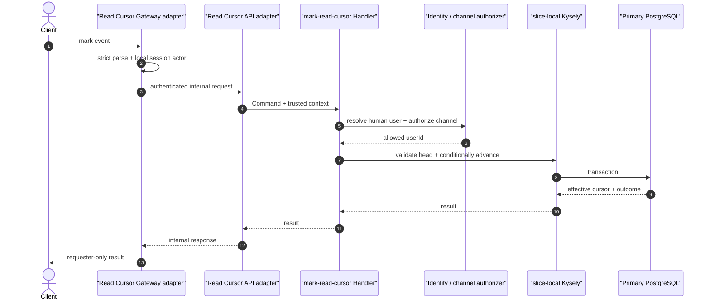

# Read Cursor 설계: 입출력, 실패, transport

> [설계 index](./README.md) | [owner decisions](../decisions.md)

## 계약 분리

- client WebSocket event, internal HTTP DTO, slice-local Command는 서로 다른 입력 모델이다.
- public read-state HTTP Query와 slice-local Query도 서로 다른 입력 모델이다.
- adapter는 strict runtime validation 뒤 신뢰된 인증 문맥을 별도로 전달한다.
- 구현 package가 usecase와 route/event mapping을 소유하고 app은 runtime resource와 mount만 제공한다.

## Mark 입력과 성공 의미

입력 의미는 다음과 같다.

- `commandId`: 요청·응답 correlation 전용이며 저장 멱등성 key가 아니다.
- `channelId`: MVP 외부 target selector다.
- `lastReadSequence`: 읽은 것으로 간주할 마지막 sequence다.
- user identity: payload가 아니라 인증 문맥에서 온다.

성공은 요청 correlation, channel/canonical stream, effective cursor, `advanced/unchanged`를 전달한다. stream
head와 unread 값을 command 응답에 섞지 않는다.

## Read-state Query 의미

화면 진입과 reload에서 별도 Query가 다음을 반환한다.

- channel/canonical stream identity
- effective cursor: row가 없으면 0
- `hasUnread = stream head > effective cursor`

읽을 수 있는 빈 channel은 cursor 0, `hasUnread = false`다. Query는 cursor를 만들거나 갱신하지 않는다.

## 실패 의미

| 실패 | 공개 의미 | 상태 변경 |
| --- | --- | --- |
| malformed payload, 잘못된 sequence | transport validation error | 없음 |
| 인증된 session 없음 | authentication/session error | 없음 |
| 사람 사용자 identity 해석 불가 | authentication/identity error | 없음 |
| channel 없음 또는 권한 없음 | `stream_unavailable` | 없음 |
| sequence가 primary head보다 큼 | `invalid_cursor` | 없음 |
| DB/권한 provider 장애 | retryable infrastructure error | 성공으로 위장하지 않음 |
| stream target 불일치 | data-integrity failure | 없음, 운영 경보 |

## Runtime 흐름

Gateway가 DB에 직접 접근하거나 client가 보낸 actor ID를 API에 신뢰값으로 전달하는 구현은 허용하지
않는다.
