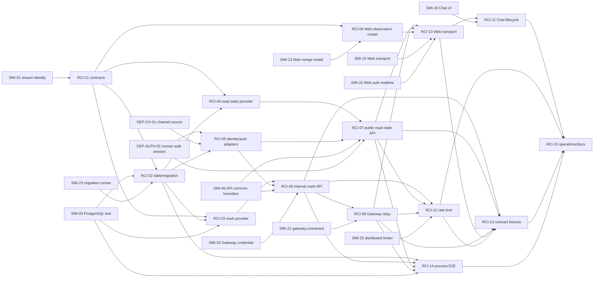

# Read Cursor 구현 계획: 의존성 그래프

> [구현 index](./README.md) | [설계 index](../design/README.md)

공유 선행 이슈가 늦어져도 `RCI-01`, 순수 provider, Web observation model은 fake provider/transport로 개발할
수 있다. production mount와 출시 관문은 실제 auth/channel/Gateway 기반 없이 통과할 수 없다.
