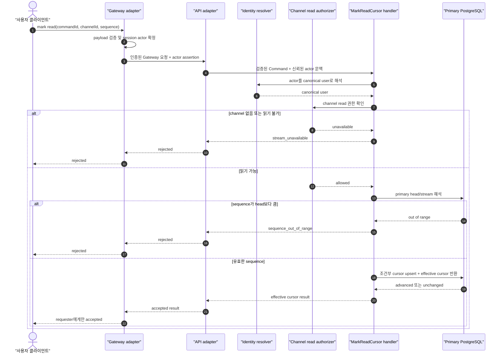

# Mark Read Cursor 유스케이스 결정 후보

| 항목 | 값 |
| --- | --- |
| 문서 상태 | **Proposed — 도메인 결정 필요** |
| 대상 구현 단위 | `mark-read-cursor` Command slice |
| 문서 역할 | 도메인 결정권자의 최종 결정을 수용한 뒤 구현 계획의 유일한 입력 문서 |
| 현재 구현 여부 | 미구현 |
| 마지막 저장소 대조 | 2026-07-14 |

> 이 문서는 구현 계획이 아니다. 현재 저장소의 사실, 기존 문서에서 유지할 규칙, 고쳐야 할 가정,
> 권고안, 도메인 결정 대기 항목을 한곳에 모은 **결정 후보 문서**다. 아래 `RC-*` 필수 결정이 모두
> 확정되고 결정권자와 결정일이 기록되면 상태를 `Accepted — Ready for implementation planning`으로
> 바꾼다. 그 전에는 이 문서를 근거로 패키지·테이블·공개 계약 구현을 시작하지 않는다.

## 1. 결론

`mark-read-cursor`는 인증된 사용자가 한 채널에서 특정 sequence까지를 읽은 것으로 간주하도록
`ReadCursor`를 전진시키는 하나의 쓰기 유스케이스다.

이 유스케이스의 구현 경계는 다음과 같다.

- 하나의 Command 입력과 하나의 처리 파이프라인을 가진다.
- 한 트랜잭션에서 하나의 `ReadCursor` aggregate만 쓴다.
- `ReadCursor`의 식별자는 canonical `userId + streamId`다.
- 저장되는 핵심 값은 `lastReadSequence` 하나다.
- 커서는 감소하지 않으며, 동시 요청의 완료 순서와 무관하게 최댓값만 남는다.
- 같은 값이나 더 작은 값의 재요청은 성공한 `unchanged`다.
- message, message stream head, session, unread projection은 이 트랜잭션에서 수정하지 않는다.
- 메시지 조회 Query는 이 커서를 암묵적으로 갱신하지 않는다.
- 다른 사용자에게 read receipt를 방송하지 않는다.

현재 저장소만으로는 이 경계까지는 확정할 수 있지만, persistent identity, 클라이언트가 언제 무엇을
읽었다고 간주하는지, 미래 sequence 처리, 안 읽음 의미와 자기 메시지 처리, wire contract는 아직
도메인 결정이 필요하다.

## 2. 근거의 우선순위

이 문서는 다음 순서로 근거를 적용한다.

1. 현재 추적되는 package 코드와 package README
2. [현재 realtime-chat 아키텍처](../../realtime-chat-architecture.md)
3. 이미 분리된 조회 기능의 [Stream Messages owner decisions](../stream-messages/decisions.md)
4. [Flow Sequence Guide](../../flow-sequence-guide.md)와
   [Flow 08 조사 문서](../../notes/implementation-plans/flow-08-read-cursor-unread.md)
5. 사용자와의 설계 대화

설계 대화에서 언급된 `ADR 013`과 `package-owned-flows.md`는 현재 저장소에 존재하지 않는다. 따라서
그 대화는 CQRS slice를 해석하는 배경으로만 사용했고, 저장소의 확정 결정으로 승격하지 않았다.
`notes/` 문서도 조사 근거이지 현재 계약이 아니다.

## 3. 현재 저장소에서 확인된 사실

### 3.1 구현 상태

| 영역 | 현재 상태 | 이 문서에 주는 제약 |
| --- | --- | --- |
| Message Send | 구현됨 | stream과 sequence의 현재 source of truth를 제공한다. |
| Gateway Ticket | 구현됨 | 인증 뒤 확정되는 주체 이름은 현재 `actorId`다. |
| Realtime Chat Database | 구현됨 | gateway ticket과 message send table만 합성한다. |
| Stream Messages | owner/public 설계 문서 존재, 구현 전 | 조회 cursor와 ReadCursor를 분리하기로 했다. |
| Read Cursor | package, table, contract 모두 없음 | 이 문서에서 새 계약을 암묵적으로 확정하면 안 된다. |
| API/Gateway app | 추적되는 실행 코드 없음 | 실제 relay endpoint와 mount 방식은 구현 계획에서 검증해야 한다. |
| Web chat | mock transport만 존재 | mark-read 호출 시점과 viewport 상태가 아직 없다. |

### 3.2 현재 message stream 모델

현재 [message stream table](../../../../packages/realtime-chat-message-send/src/message-send-table.ts)은
다음을 보장한다.

- `message_streams`는 target마다 하나의 stream row를 가진다.
- stream은 `last_sequence`를 소유하고 message는 `(stream_id, sequence)`가 유일하다.
- 현재 sequence 저장 타입은 PostgreSQL `integer`이고 애플리케이션에서는 number다.
- stream row는 채널 생성 시가 아니라 첫 message append 시점에 lazy create된다.
- message append 트랜잭션이 stream row를 잠그고 `last_sequence`를 증가시킨다.
- 현재 message 삭제·retention 때문에 sequence gap을 만드는 구현은 없다.

[Message Send README](../../../../packages/realtime-chat-message-send/README.md)는 read cursor를 명시적으로
소유하지 않는다. 따라서 Read Cursor가 Message Send 내부 query를 deep import하거나 Message Send가
read cursor table을 쓰는 구조는 현재 package 경계와 맞지 않는다.

### 3.3 현재 identity 경계

[Gateway Ticket README](../../../../packages/realtime-chat-gateway-ticket/README.md)의 `actorId`는 클라이언트가
보내는 값이 아니라 인증 뒤 서버가 확정한 실시간 principal이다. 이 값은 사람 사용자뿐 아니라 bot,
system, service account를 표현할 수 있도록 의도적으로 `userId`와 구분되어 있다.

ReadCursor는 장기 보존되는 사용자별 상태다. 따라서 `actorId`를 곧바로 `user_id` 컬럼에 저장하는 것은
안전한 현재 결정이 아니다. `RC-01`이 구현의 선행 조건이다.

### 3.4 현재 조회 설계에서 상속할 결정

Stream Messages owner 문서에서 다음을 이미 분리했다.

- MVP 조회 범위는 channel이다.
- 외부 요청은 canonical `streamId`가 아니라 `channelId`를 사용하고 서버가 stream identity를 해석한다.
- readable channel에 아직 stream row가 없으면 빈 stream으로 취급한다.
- 조회용 delivery/history cursor와 사용자가 읽었다고 표시한 ReadCursor는 다른 상태다.
- 조회 Query는 ReadCursor를 수정하지 않는다.
- 읽을 수 없음과 존재하지 않음은 외부에서 구분하지 않는 `stream_unavailable` 의미를 사용한다.
- Gateway의 actor assertion은 인증된 Gateway 경계에서만 신뢰한다.

Read Cursor가 이 결정을 뒤집으려면 먼저 Stream Messages 결정을 함께 수정해야 한다. 이 문서의 권고안은
따라서 channel-only, `channelId` 입력, 서버의 canonical stream 해석을 기본으로 한다.

### 3.5 현재 Web의 빈 자리

현재 Web chat transport에는 연결, history load, send, message created/accepted/rejected만 있고 다음이 없다.

- mark-read command
- 현재 활성 채널과 문서 visibility를 결합한 읽음 판단
- 화면에 반영된 최대 연속 sequence 추적
- effective read cursor 저장
- hasUnread 또는 unreadCount projection

백엔드 command만 구현해도 제품 동작은 완성되지 않는다. `RC-05`, `RC-15`, `RC-17`이 Web 구현 범위를
결정한다.

## 4. 기존 Flow 08에서 유지할 것과 고칠 것

### 4.1 유지할 규칙

- cursor는 사용자와 stream의 조합마다 하나다.
- `lastReadSequence`는 증가만 한다.
- 낮거나 같은 요청은 오류가 아니라 no-op 성공이다.
- read state는 다른 사용자에게 공개 broadcast하지 않는다.
- 권한을 확인한 뒤 cursor를 전진시킨다.

### 4.2 그대로 구현하면 안 되는 부분

| 기존 표현 | 문제 | 이 문서의 교정 |
| --- | --- | --- |
| 현재 cursor를 SELECT한 뒤 애플리케이션에서 비교하고 UPSERT | 두 요청이 동시에 들어오면 늦게 끝난 낮은 값이 높은 값을 덮을 수 있다. | DB의 조건부 upsert 한 문장이 단조 증가를 보장한다. |
| `lastReadMessageId`도 저장 | stream sequence가 canonical 위치인데 중복 식별자를 추가한다. 삭제 정책과 불일치 위험도 생긴다. | sequence만 저장한다. message 존재를 매번 조회하지 않는다. |
| cursor가 전진하면 unread badge를 지운다 | 50에서 70으로 전진해도 head가 100이면 여전히 unread가 있다. | `head <= effectiveCursor`일 때만 unread가 없다. |
| client가 `streamId`를 보낸다 | 이미 정한 channel Query selector와 다르고 내부 stream identity를 노출한다. | MVP 외부 입력은 `channelId`, 내부 Command는 해석된 `streamId`를 사용한다. |
| `actorId`를 `userId`처럼 저장 | 현재 인증 문서가 두 개념의 영속적 동일성을 보장하지 않는다. | identity 결정을 먼저 확정한다. |
| `ReadCursorAdvanced`를 즉시 발행 | 현재 소비자와 delivery 보장이 없다. | 소비자가 생기기 전에는 발행하지 않는다. 필요하면 outbox를 별도 결정한다. |
| channel과 thread cursor를 합칠 수 있다 | 별도 stream sequence를 공유 cursor 하나로 비교할 수 없다. | MVP는 channel-only로 제한하고 thread는 별도 후속 결정으로 둔다. |

## 5. 유스케이스 경계

### 5.1 실제 vertical slice 정의

`mark-read-cursor`는 capability group이 아니라 실제 쓰기 slice다.

| 구성 | 책임 |
| --- | --- |
| Command 입력 | 신뢰된 actor 문맥, channel selector, 요청 sequence, 선택적 correlation ID |
| Handler | canonical user 해석, 권한, stream/head 확인과 한 번의 cursor 전진을 조율한다. |
| slice-local query | stream head 조회와 read cursor 조건부 upsert를 수행한다. |
| 결과 | effective cursor와 `advanced` 또는 `unchanged`를 반환한다. |
| adapter | HTTP/WebSocket 계약을 Command와 결과로 매핑한다. |

현재 저장소는 MediatR나 class Handler를 사용하지 않는다. Message Send와 Gateway Ticket처럼 command/context,
module facade, usecase 함수, slice-local Kysely helper로 구성되어 있다. 여기서 “하나의 Handler”는 특정
framework나 class 도입이 아니라 **입력 하나를 끝까지 책임지는 처리 파이프라인 하나**를 뜻한다.

### 5.2 Aggregate와 트랜잭션

`ReadCursor` aggregate의 후보 모델은 다음과 같다.

| 항목 | 후보 |
| --- | --- |
| aggregate key | `(canonicalUserId, streamId)` |
| 상태 | `lastReadSequence`, 실제 전진 시각 |
| 부재 의미 | `lastReadSequence = 0` |
| 불변조건 | `0 <= lastReadSequence <= stream head` |
| 쓰기 소유자 | Read Cursor capability |

한 `mark-read-cursor` 트랜잭션은 정확히 이 aggregate 하나만 쓴다. 상한 확인을 위해
`message_streams.last_sequence`를 읽을 수 있지만 stream row나 message row는 수정하지 않는다.

### 5.3 쓰지 않는 저장소

이 Handler는 다음을 직접 수정하지 않는다.

- `messages`
- `message_streams.last_sequence`
- gateway ticket 또는 session registry
- 채널 membership
- inbox/unread projection
- 다른 사용자의 cursor

다른 capability가 ReadCursor를 바꿀 필요가 생기면 table을 직접 쓰지 않고 Read Cursor의 공개 command
경계 또는 별도로 승인된 event consumer를 사용한다.

### 5.4 이 slice가 하지 않는 일

- 메시지를 조회하거나 전달하지 않는다.
- “사용자가 실제로 화면의 모든 내용을 읽었다”는 사실을 증명하지 않는다.
- read receipt를 채널 참여자에게 보내지 않는다.
- unread count를 영속 상태로 함께 갱신하지 않는다.
- 자기 메시지를 자동으로 읽음 처리하지 않는다.
- reconnect/history pagination cursor를 저장하지 않는다.

## 6. 도메인 의미

### 6.1 ReadCursor의 정확한 뜻

요청 sequence `S`를 mark한다는 뜻은 다음과 같다.

> 이 사용자는 이 stream에서 sequence가 `S` 이하인 모든 메시지를 읽은 것으로 간주한다.

이는 화면 노출을 서버가 증명한다는 뜻이 아니다. 클라이언트가 제품 규칙에 따라 사용자 의도를 판단하고,
서버는 그 선언을 권한·상한·단조 증가 규칙 안에서 기록한다.

### 6.2 권고하는 클라이언트 발행 시점

권고안은 다음 조건을 모두 만족할 때만 mark command를 보내는 것이다.

- 해당 채널이 현재 활성 채널이다.
- 브라우저/앱이 foreground이며 문서가 visible이다.
- 최신 조회 또는 push로 받은 메시지가 상태 저장소와 화면에 적용되었다.
- 적용한 메시지 sequence가 이전 적용 위치부터 연속이다.

초기 최신 페이지를 열었을 때는 페이지의 head까지 읽은 것으로 간주하는 일반적인 채팅 의미를 권고한다.
이 선택은 로드하지 않은 더 오래된 메시지도 head 이하이므로 읽은 것으로 간주한다. 제품이 “viewport에
실제로 보인 메시지만 읽음”을 요구한다면 별도 가시성 모델이 필요하며 같은 구현 계획을 사용할 수 없다.

다음 동작만으로는 mark하지 않는다.

- background socket이 메시지를 수신함
- history 응답이 network에서 도착했지만 아직 화면 상태에 반영되지 않음
- 비활성 채널의 cache가 갱신됨
- sequence gap이 있는 상태에서 더 큰 sequence를 먼저 수신함

### 6.3 빈 채널

stream row가 첫 메시지에서 만들어지므로 읽을 수 있는 빈 채널에는 `message_streams` row가 없을 수 있다.
권고 의미는 다음과 같다.

- 권한 provider가 readable channel임을 확인한다.
- 논리 head는 `0`이다.
- `mark(0)`은 `unchanged(0)`이며 row를 만들지 않는다.
- `mark(S > 0)`은 상한 초과로 거절한다.

빈 채널을 `stream_unavailable`로 처리하면 Stream Messages의 빈 채널 결정과 충돌한다.

### 6.4 미래 sequence와 gap

권고안은 요청 sequence가 현재 primary DB의 stream head보다 크면 clamp하지 않고 거절하는 것이다.
clamp하면 손상된 클라이언트 상태를 숨기고, 클라이언트는 자신이 요청한 위치가 저장됐다고 오해한다.

현재 message append는 sequence를 연속 발급하고 hard delete가 없으므로 `S <= head`이면 개별 message row
존재 조회 없이 유효한 위치로 취급할 수 있다. retention이나 삭제로 gap을 허용하게 되면 `lastReadSequence`는
여전히 경계 위치로 사용할 수 있지만 unread count 계산은 별도 재결정이 필요하다.

## 7. 인증, 권한, 정보 노출

### 7.1 신뢰 경계

- client payload의 `actorId`, `userId`, role, membership은 받거나 신뢰하지 않는다.
- Gateway는 연결 session에서 인증된 `actorId`를 얻는다.
- API는 인증된 Gateway와 service credential을 검증한 요청의 actor assertion만 신뢰한다.
- ReadCursor key는 `RC-01`에서 정한 identity 계약을 거쳐 얻은 canonical user를 사용한다.

### 7.2 권한 순서

권고 처리 순서는 다음과 같다.

1. payload 형태와 sequence 범위를 검증한다.
2. adapter가 신뢰된 인증 문맥의 actor와 검증된 요청을 Handler에 전달한다.
3. Handler가 actor를 canonical user로 해석한다.
4. Handler가 channel read permission을 확인한다.
5. Handler가 primary DB에서 canonical stream과 head를 해석한다.
6. Handler가 상한을 검증하고 cursor를 조건부 전진시킨다.

권한이 없는 channel의 stream 존재 여부나 head를 노출하지 않는다. channel 없음과 읽기 권한 없음은 외부에
동일한 `stream_unavailable` 의미를 반환하는 것을 권고한다. 권한 provider 장애는 도메인 거절로 위장하지
않고 재시도 가능한 기반 시설 실패로 처리한다.

권한 확인과 짧은 DB 트랜잭션 사이의 membership 변경 경쟁은 Stream Messages와 같은 짧은 TOCTOU를
허용하는 것을 권고한다. 강한 직렬화를 요구하면 channel provider와 동일 트랜잭션을 공유해야 하므로 현재
경계를 크게 바꾼다.

## 8. 트랜잭션, 동시성, 멱등성

### 8.1 필수 DB 보장

애플리케이션에서 `SELECT -> 비교 -> UPDATE`로 단조 증가를 보장하지 않는다. 저장소의 한 조건부 upsert가
다음 연산을 원자적으로 보장해야 한다.

- row가 없고 `S > 0`이면 `S`로 생성한다.
- 현재 값이 `S`보다 작으면 `S`로 갱신한다.
- 현재 값이 `S` 이상이면 쓰지 않는다.
- no-op에서는 `updated_at`도 바꾸지 않는다.
- 결과에는 요청값이 아니라 처리 후 effective cursor를 반환한다.

DB 격리 수준에 기대지 않고 조건식 자체로 최댓값 보존을 보장한다. 상한 검증과 upsert는 primary DB의
짧은 트랜잭션에서 실행한다. replica head를 사용하면 복제 지연 때문에 유효한 최신 sequence를 미래값으로
잘못 거절할 수 있다.

### 8.2 대표 경쟁 조건

| 초기 상태 | 동시 요청 | 반드시 남아야 할 값 |
| --- | --- | --- |
| 80 | 100, 120 | 120 |
| row 없음 | 10, 20 | 20 |
| 120 | 100, 120 | 120, 두 요청 모두 성공한 unchanged 가능 |

100 요청이 먼저 시작하고 120 요청보다 늦게 끝나더라도 최종값은 120이다. 100 요청의 응답도 처리 시점의
effective cursor인 120을 반환할 수 있어야 한다.

### 8.3 자연 멱등성

이 command는 별도 idempotency table 없이 상태 기반으로 멱등하다.

- 최초 `mark(100)`은 `advanced(100)`일 수 있다.
- 같은 command를 재전송하면 `unchanged(100)`일 수 있다.
- 그 사이 다른 기기가 120으로 전진했다면 재전송 응답은 `unchanged(120)`일 수 있다.

즉 동일 요청의 outcome 문자열을 재현하는 것이 아니라, 같은 요청을 여러 번 적용해도 상태가 잘못되지
않는 것이 보장이다. 정확히 같은 과거 응답 재현이 제품 요구라면 command result log라는 별도 저장소와
결정이 필요하며 현재 권고안에는 포함하지 않는다.

### 8.4 append와의 경쟁

상한을 읽은 직후 새 message가 append되는 경쟁은 안전하다. head는 증가만 하므로 요청 `S`가 확인한
head 이하였다는 사실은 새 append 뒤에도 참이다. 반대로 요청 시점에는 미래였던 `S`가 직후 append로
유효해질 수 있다. 이 요청은 거절되고 클라이언트가 상태를 동기화한 뒤 재시도한다.

## 9. 입출력과 실패 의미 후보

아래는 구현을 고정하는 계약이 아니라 `RC-12`부터 `RC-14`까지 결정하기 위한 의미 모델이다.

### 9.1 입력 의미

- `commandId`: 요청·응답 상관관계용 값. 저장 멱등성 key가 아니다.
- `channelId`: MVP의 외부 target selector.
- `lastReadSequence`: 사용자가 읽은 것으로 간주할 마지막 sequence.
- actor/user identity: payload가 아니라 인증 문맥에서 온다.

내부 Handler는 adapter가 검증한 요청과 신뢰된 actor 문맥을 입력받고, canonical user와 stream identity는
자기 처리 파이프라인 안에서 좁은 provider/query를 통해 해석한다. HTTP DTO, WebSocket event, 내부
Command DTO를 같은 객체로 공유하지 않는다.

### 9.2 성공 의미

성공은 최소한 다음을 전달해야 한다.

- 요청과 연결할 식별자
- channel과 canonical stream 식별자
- 처리 후 effective `lastReadSequence`
- `advanced` 또는 `unchanged`

응답에 stream head나 unread count를 싣는 것은 권고하지 않는다. cursor transaction 직후에도 새 message가
append될 수 있어 즉시 낡은 값이 되며, 조회/projection 경계를 다시 command 응답에 섞는다.

### 9.3 실패 분류

| 실패 | 공개 의미 후보 | 상태 변경 |
| --- | --- | --- |
| malformed payload, 음수/정수가 아닌 sequence | transport validation error | 없음 |
| 인증된 session 없음 | authentication/session error | 없음 |
| identity 해석 불가 | authentication/identity error | 없음 |
| channel 없음 또는 read permission 없음 | `stream_unavailable` | 없음 |
| 요청 sequence가 primary head보다 큼 | `sequence_out_of_range` | 없음 |
| DB/권한 provider 일시 장애 | retryable infrastructure error | 성공으로 위장하지 않음 |
| 내부 stream target 불일치 | data-integrity failure | 없음, 운영 경보 |

거절 응답에서 실제 head를 반환하지 않는다. 이는 권한과 내부 상태 노출을 줄이고, 클라이언트가 sync Query를
통해 canonical 상태를 복구하도록 한다.

## 10. 안 읽음 상태와 이벤트

### 10.1 cursor source of truth

MVP에서 모든 stream message를 동일하게 unread로 센다는 결정이면 다음을 파생할 수 있다.

- `effectiveCursor = read cursor가 없으면 0`
- `hasUnread = stream head > effectiveCursor`
- sequence가 연속이고 삭제가 없을 때만 `unreadCount = stream head - effectiveCursor`

따라서 cursor가 일부 전진했다고 badge를 무조건 지우면 안 된다. head 100에서 cursor가 50에서 70으로
전진하면 여전히 unread다.

### 10.2 자기 메시지

`head - cursor`는 자기 메시지도 센다. 사용자가 보낸 메시지를 unread에서 제외하려면 다음 중 하나를
명시적으로 선택해야 한다.

- 전송 화면이 message accepted/render 뒤 같은 사용자의 mark command를 보낸다.
- 별도 event-handler slice가 sender cursor를 전진시킨다.
- unread projection이 sender message를 제외해 별도 계산한다.

Message Send 트랜잭션에서 `read_cursors`를 직접 갱신하는 방식은 table ownership과 aggregate 경계를
침범하므로 사용하지 않는다.

### 10.3 이벤트와 다중 기기

현재 `ReadCursorAdvanced` 소비자는 없다. 소비자 없는 이벤트는 계약이 아니므로 MVP에서는 발행하지 않는
것을 권고한다.

나중에 inbox/unread projection을 만들면 실제 전진에만 내부 개인 이벤트를 생성한다. projection의
정확성이 필요하면 cursor 갱신과 같은 트랜잭션의 outbox를 사용한다. broker에 best-effort publish하고
잃어버리는 방식은 영구적인 잘못된 unread 상태를 만들 수 있다.

다른 사용자를 향한 read receipt broadcast는 하지 않는다. 같은 사용자의 다른 탭·기기 동기화는 별도
제품 결정이다. 필요하면 사용자 개인 채널 이벤트로 설계하며 public channel broadcast와 구분한다.

## 11. 후보 처리 흐름

구현 계획에서는 API/Gateway app 코드가 실제로 존재하는지 다시 확인하고, 없다면 adapter mount 구현을 별도
작업 단위로 분리해야 한다. 위 그림은 app shell이 도메인 판단을 한다는 뜻이 아니다.

## 12. 도메인 결정 레지스터

### 12.1 사용법

- `필수` 항목은 구현 계획 작성 전에 모두 결정해야 한다.
- `후속 가능` 항목은 권고안을 채택해 MVP 비범위를 명시하면 구현 계획을 작성할 수 있다.
- 결정권자는 `최종 결정`에 권고안 채택 또는 대안을 적고, 아래 승인 기록에 이름과 날짜를 남긴다.
- 대안이 다른 owner/public 문서를 바꾸면 그 문서도 같은 변경에서 갱신한다.

### 12.2 Identity와 범위

| ID | 중요도 | 결정 질문 | 권고안 | 결정하지 않을 때의 영향 | 최종 결정 |
| --- | --- | --- | --- | --- | --- |
| RC-01 | 필수 | cursor의 영속 주체 key는 무엇인가? | `actorId -> canonical userId` 해석 계약을 사용한다. MVP에서 두 값이 같다면 그 동일성과 안정성을 인증 계약에 명시한다. | table key와 개인정보 수명주기를 정할 수 없다. | **결정 대기** |
| RC-02 | 필수 | MVP target 범위는 어디까지인가? | channel만 지원한다. DM/thread는 각 stream·권한 모델이 확정된 뒤 별도 확장한다. | DTO, 권한, table 테스트 범위가 열린다. | **결정 대기** |
| RC-03 | 필수 | client selector는 `channelId`인가 `streamId`인가? | 기존 Stream Messages 결정과 같이 `channelId`; 서버가 canonical `streamId`를 해석한다. | 조회와 쓰기 계약이 불일치한다. | **결정 대기** |

### 12.3 읽음 의미와 sequence

| ID | 중요도 | 결정 질문 | 권고안 | 결정하지 않을 때의 영향 | 최종 결정 |
| --- | --- | --- | --- | --- | --- |
| RC-04 | 필수 | `mark(S)`의 의미는 무엇인가? | stream의 모든 sequence `<= S`를 읽은 것으로 간주한다. | aggregate invariant를 정할 수 없다. | **결정 대기** |
| RC-05 | 필수 | 클라이언트는 언제 S를 mark하는가? | 활성·visible 채널에 최신 page/push가 연속 적용된 뒤 head를 mark한다. initial latest open은 과거 미로드분도 읽은 것으로 간주한다. | Web과 unread 제품 동작이 결정되지 않는다. | **결정 대기** |
| RC-06 | 필수 | 빈 채널과 sequence 0은 어떻게 처리하는가? | readable empty channel의 head는 0; `mark(0)`은 row 없는 unchanged 성공이다. | lazy stream 생성과 충돌한다. | **결정 대기** |
| RC-07 | 필수 | 요청 S가 현재 head보다 크면? | clamp하지 않고 `sequence_out_of_range`로 거절한다. | 손상된 client state와 저장 의미가 불명확하다. | **결정 대기** |
| RC-08 | 필수 | exact message 존재 또는 `lastReadMessageId`를 확인/저장하는가? | 하지 않는다. sequence boundary만 사용한다. | schema와 query가 불필요하게 이중화될 수 있다. | **결정 대기** |
| RC-09 | 필수 | sequence 저장 타입은? | 현재 message stream과 같은 `integer/number`를 사용한다. bigint 전환은 message 생태계 전체의 별도 변경으로 한다. | FK/비교/contract 타입이 달라질 수 있다. | **결정 대기** |

### 12.4 권한과 일관성

| ID | 중요도 | 결정 질문 | 권고안 | 결정하지 않을 때의 영향 | 최종 결정 |
| --- | --- | --- | --- | --- | --- |
| RC-10 | 필수 | 없음과 권한 없음을 외부에서 구분하는가? | 둘 다 `stream_unavailable`; head는 노출하지 않는다. | 정보 노출과 error contract가 열린다. | **결정 대기** |
| RC-11 | 필수 | 권한 확인과 cursor transaction 사이의 TOCTOU를 허용하는가? | Stream Messages와 같은 짧은 경쟁을 허용한다. | 분산/공유 트랜잭션 요구가 생길 수 있다. | **결정 대기** |
| RC-12 | 필수 | 단조 증가를 어디서 보장하는가? | primary PostgreSQL의 조건부 upsert로 보장하고 no-op에서는 `updated_at`을 바꾸지 않는다. | concurrency-safe 구현 계획을 만들 수 없다. | **결정 대기** |
| RC-13 | 필수 | 재시도 멱등성은 무엇을 보장하는가? | 상태 멱등성만 보장한다. 같은 과거 outcome 재현용 result log는 만들지 않는다. | 별도 idempotency 저장소 필요 여부가 열린다. | **결정 대기** |

### 12.5 계약과 응답

| ID | 중요도 | 결정 질문 | 권고안 | 결정하지 않을 때의 영향 | 최종 결정 |
| --- | --- | --- | --- | --- | --- |
| RC-14 | 필수 | 성공 결과는 무엇을 반환하는가? | effective sequence와 `advanced/unchanged`, correlation ID, channel/stream identity를 반환한다. head/unread count는 제외한다. | Handler 결과와 테스트 oracle이 없다. | **결정 대기** |
| RC-15 | 필수 | `commandId`를 쓰는가? | WebSocket 요청·응답 correlation에 사용하되 DB에는 저장하지 않는다. | relay가 동시 요청을 안정적으로 매칭하기 어렵다. | **결정 대기** |
| RC-16 | 필수 | MVP transport는 무엇인가? | client WebSocket event -> Gateway relay -> authenticated internal HTTP -> API Handler. public direct HTTP는 제외한다. | contracts와 app mount 작업을 나눌 수 없다. | **결정 대기** |
| RC-17 | 필수 | 공개 오류 코드는 무엇인가? | `stream_unavailable`, `sequence_out_of_range`를 도메인 거절로 사용하고 validation/auth/infrastructure 실패와 구분한다. | adapter mapping과 consumer 복구가 불명확하다. | **결정 대기** |

### 12.6 Unread, 이벤트, 생명주기

| ID | 중요도 | 결정 질문 | 권고안 | 결정하지 않을 때의 영향 | 최종 결정 |
| --- | --- | --- | --- | --- | --- |
| RC-18 | 필수 | MVP hasUnread/unreadCount의 source는? | cursor가 source of truth. 삭제 없음·모든 메시지 포함이면 `head > cursor`와 `head - cursor`를 파생한다. | badge 완료 조건을 정할 수 없다. | **결정 대기** |
| RC-19 | 필수 | 자기 메시지는 unread에서 어떻게 제외하는가? | send transaction은 cursor를 쓰지 않는다. 활성 화면이 accepted/render 뒤 mark command를 보낸다. 서버 자동 처리가 필요하면 후속 event-handler slice로 분리한다. | sender에게 자기 메시지가 unread로 보일 수 있다. | **결정 대기** |
| RC-20 | 후속 가능 | `ReadCursorAdvanced` 내부 이벤트를 지금 발행하는가? | 소비자가 없으므로 MVP에서는 발행하지 않는다. projection 도입 시 transactional outbox를 별도 설계한다. | 불필요하거나 유실 가능한 이벤트 계약이 생긴다. | **결정 대기** |
| RC-21 | 후속 가능 | 같은 사용자의 다른 탭/기기를 즉시 동기화하는가? | MVP 응답은 requester에게만 보낸다. 개인 multi-device event는 후속 범위다. | Gateway fan-out 범위가 열린다. | **결정 대기** |
| RC-22 | 후속 가능 | stream/channel 삭제 시 cursor lifecycle은? | 현재 삭제가 없으므로 MVP 비범위. 삭제 정책 도입 전 FK restrict/cascade와 보존 기간을 별도 결정한다. | 향후 삭제 migration이 열린다. | **결정 대기** |

### 12.7 승인 기록

| 항목 | 기록 |
| --- | --- |
| 도메인 결정권자 | **미기록** |
| 결정일 | **미기록** |
| 승인 범위 | **미기록** |
| 함께 변경해야 할 문서 | **미기록** |

## 13. 결정 후 고정할 수용 시나리오

아래 시나리오는 권고안 기준이다. 대안을 선택하면 해당 시나리오를 먼저 수정한다.

### 13.1 정상 전진

- Given user A가 channel C를 읽을 수 있고 head가 200이다.
- And A의 cursor는 120이다.
- When A가 150을 mark한다.
- Then effective cursor는 150이고 outcome은 `advanced`다.

### 13.2 동일·역행 요청

- Given cursor가 150이다.
- When 150 또는 100을 mark한다.
- Then 저장값과 `updated_at`은 바뀌지 않는다.
- And effective cursor 150, outcome `unchanged`를 반환한다.

### 13.3 동시 요청

- Given cursor가 80이다.
- When 100과 120 요청이 동시에 처리된다.
- Then 완료 순서와 무관하게 최종 cursor는 120이다.
- And 두 응답 모두 실패가 아니며 각 처리 시점의 effective cursor를 반환한다.

### 13.4 빈 readable channel

- Given channel은 읽을 수 있지만 아직 message/stream row가 없다.
- When 0을 mark한다.
- Then cursor row를 만들지 않고 `unchanged(0)`을 반환한다.

### 13.5 미래 sequence

- Given head가 200이다.
- When 201을 mark한다.
- Then cursor를 만들거나 바꾸지 않고 `sequence_out_of_range`를 반환한다.
- And 응답에는 실제 head를 포함하지 않는다.

### 13.6 권한과 격리

- 읽을 수 없는 channel과 존재하지 않는 channel은 같은 공개 거절을 반환한다.
- user A의 요청은 user B의 cursor를 만들거나 바꾸지 않는다.
- client payload에 actor/user 필드를 넣어도 신뢰하지 않으며 strict contract라면 거절한다.

### 13.7 실제 PostgreSQL 경쟁 검증

mock unit test만으로 완료 처리하지 않는다. 최소한 다음은 실제 PostgreSQL integration test로 검증한다.

- 조건부 upsert의 insert/advance/no-op 반환 의미
- 100/120 동시 요청의 최댓값 보존
- no-op에서 `updated_at` 불변
- transaction rollback 시 cursor 불변
- stream head 상한과 FK/table contract

## 14. 구현 계획 작성 게이트

다음 조건을 모두 만족해야 구현 계획을 작성할 수 있다.

- [ ] RC-01부터 RC-19까지 최종 결정이 기록되어 있다.
- [ ] RC-20부터 RC-22까지 결정 또는 명시적 MVP 비범위가 기록되어 있다.
- [ ] 결정권자와 결정일이 기록되어 있다.
- [ ] Stream Messages 결정과 충돌하는 선택이 있으면 양쪽 문서가 함께 수정되어 있다.
- [ ] identity resolver와 channel read authorizer의 provider/consumer 계약 위치가 정해져 있다.
- [ ] API/Gateway app의 실제 mount/relay 구현 위치를 저장소에서 재확인했다.
- [ ] public event/HTTP contract를 어느 package가 소유할지 정했다.
- [ ] read cursor table contract를 database 합성에 제공할 package 경계를 정했다.
- [ ] Web의 active/visible/contiguous sequence 판단 책임을 정했다.

결정 완료 후 구현 계획은 최소 다음 작업 단위로 나눈다.

1. read-cursor contracts와 public contract 문서
2. read-cursor table contract와 database migration 합성
3. `mark-read-cursor` Handler 및 slice-local Kysely query
4. identity와 channel permission adapter
5. API internal route 및 Gateway relay
6. Web transport와 읽음 발행 조건
7. unit, PostgreSQL integration, adapter contract, Web behavior 검증

## 15. 문서 승격 규칙

이 파일은 owner 전용 결정 문서다. 소비자는 현재 이 파일을 기본 context로 읽지 않는다.

결정이 승인되면 다음 순서로 승격한다.

1. 이 문서 상태를 `Accepted — Ready for implementation planning`으로 바꾼다.
2. 결정 레지스터와 승인 기록에서 `결정 대기`를 제거한다.
3. 구현 계획을 별도 owner 문서로 작성한다.
4. consumer가 알아야 할 wire contract와 불변조건만 실제 provider package의 `public-docs/` 또는
   `docs/realtime-chat/public-docs/read-cursor/`에 추출한다.
5. `docs/realtime-chat/AGENTS.md`에 consumer route를 추가한다.

`notes/`의 Flow 08 문서는 계속 historical research로 남기며 현재 계약 route에 넣지 않는다.
