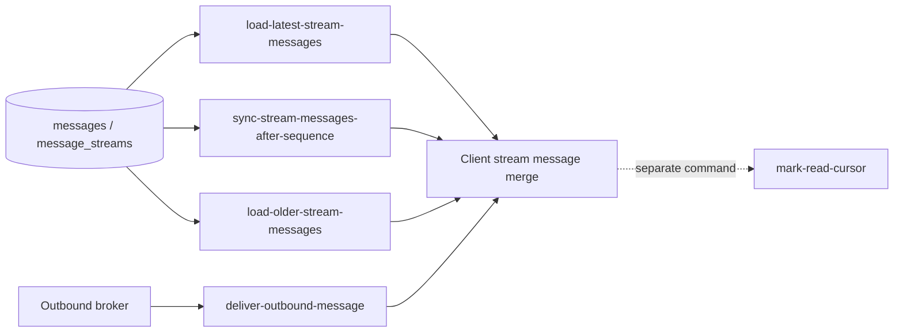

# Stream Messages 설계: 결론 요약과 현재 구현

> [설계 index](./README.md) | [구현 이슈 index](../implementation/README.md)

## 3. 결론 요약

현재 요구사항을 CQRS의 실제 구현 단위로 내리면 `stream-messages`는 하나의 Query가 아니라 다음 세
Query slice를 묶는 capability group이다.

| Query slice | 사용자 의도 | 기준 cursor |
| --- | --- | --- |
| `load-latest-stream-messages` | stream 화면에 처음 들어가 최신 구간을 본다 | cursor 없음, 현재 head 기준 |
| `sync-stream-messages-after-sequence` | 재접속·누락·gap 이후 최신 상태까지 따라잡는다 | `afterSequence` |
| `load-older-stream-messages` | 현재 보이는 가장 오래된 메시지보다 이전 구간을 더 본다 | `beforeSequence` |

세 Query는 같은 테이블과 message item을 읽을 수 있지만 요청 의도, cursor, 완료 조건, 실패 의미가
다르다. 하나의 `SyncStream(mode = latest | after | before)` handler에 합치지 않고 독립 Query input,
output, Handler를 가진 세 slice로 분리한다.

### 3.1 2026-07-14에 확정된 제품 의미

- MVP에서 공개하는 조회 대상은 **channel만**이다. DM과 thread 조회는 첫 구현 범위에 포함하지 않는다.
- 최초 진입은 현재 head를 기준으로 **최신 최대 5개**만 조회한다. client가 initial limit을 선택하지
  않으며, `afterSequence = 0`으로 전체 history를 읽지 않는다.
- 신뢰 가능한 기존 sync cursor가 있으면 latest로 건너뛰지 않고, cursor 이후 누락 복구를 먼저 수행한다.
- 읽을 수 있는 빈 channel은 placeholder message나 별도 공개 stream 객체로 표현하지 않고, 빈 message
  page로 응답한다.
- thread 조회를 향후 지원할 때도 첫 reply가 저장되어 thread가 생성된 뒤에만 조회를 허용한다. reply 없는
  root를 빈 thread로 조회하는 계약은 제공하지 않는다.
- 현재 읽기 권한이 있으면 저장된 전체 target history를 읽을 수 있다. 과거 가시 범위 하한은 두지 않는다.
  MVP에서는 이 규칙을 channel에 적용한다.
- 첫 공개 message variant는 `USER/TEXT`만 지원하며 `SYSTEM` message는 지원하지 않는다.
- 같은 로그인 상태에서 WebSocket 재접속과 browser reload가 발생해도 누락 없는 복구를 보장한다.
- channel timeline의 root message에 `threadSummary`를 포함하지 않는다.
- Query Handler는 transport-neutral하게 유지하고, 첫 공개 adapter는 latest/older에 HTTP, after recovery에
  WebSocket relay를 사용한다.
- 최종 response JSON envelope은 UTF-8 직렬화 기준 48KiB를 넘지 않는다. 사용자 text write는 UTF-8
  8KiB로 제한한다.
- 한 번의 자동 after recovery 묶음은 10 page, 500 message, 누적 512KiB 중 먼저 도달한 상한에서 끊고
  마지막 연속 cursor부터 자동 재개한다.

실시간 메시지 수신은 이 Query group의 네 번째 Query가 아니다. broker delivery event를 받아 Gateway의
local session에 `chat.message.created`를 보내는 별도 event-handler capability다. `stream-messages`와
실시간 delivery는 클라이언트의 동일한 message merge 규칙에서 만난다.

## 4. 현재 저장소 구현 기준

### 4.1 이미 구현된 기반

[message-send provider](../../../../../packages/realtime-chat-message-send/README.md)는 message append와 stream
sequence를 구현했고 stream sync는 자신의 책임이 아니라고 명시한다.

현재 DB에는 다음 기반이 이미 있다.

- `message_streams`: `stream_id`, target, `last_sequence`
- `messages`: `stream_id`, `sequence`, sender, target, content, 생성 시각
- `(stream_id, sequence)` unique constraint
- `(stream_id, sequence)` range index
- `(sender_actor_id, stream_id, client_message_id)` idempotency constraint

근거 코드는
[message-send-table.ts](../../../../../packages/realtime-chat-message-send/src/message-send-table.ts)와
[send-message.kysely.ts](../../../../../packages/realtime-chat-message-send/src/usecases/send-message/send-message.kysely.ts)에
있다.

이 저장 구조는 세 조회를 모두 지원한다.

- latest: head 이하에서 최신 최대 5개를 고른 뒤 응답은 오름차순으로 변환
- after: `sequence > afterSequence` 범위를 오름차순 조회
- older: `sequence < beforeSequence` 범위에서 가까운 과거 N개를 고른 뒤 응답은 오름차순으로 변환

다만 현재 append 구현은 이미 존재하는 `stream_id` row의 `target_type/target_id`가 새 command에서 resolve한
target과 같은지 명시적으로 검증하지 않는다. `(target_type, target_id)` unique index만으로는 잘못된
`streamId` resolve나 collision을 완전히 막지 못한다. “channel stream에 thread reply 본문이 들어가지
않는다”는 목표 불변조건을 구현하려면 stream messages query뿐 아니라 message append에서도 기존 stream과
resolved target의 일치를 검증하는 선행 보강이 필요하다.

[realtime-chat-database](../../../../../packages/realtime-chat-database/src/realtime-chat-database.ts)는 gateway ticket뿐
아니라 message tables도 이미 전체 DB type과 migration에 합성한다. 반면 package README의
“현재 ticket table로 시작한다”는 설명은 source code보다 오래되었다.

### 4.2 아직 구현되지 않은 것

현재 저장소에는 다음이 없다.

- stream messages contracts/provider package
- latest/after/older Query와 Handler
- stream read authorizer
- API message query endpoint
- Gateway의 WebSocket message parser와 `chat.stream.sync` relay
- `chat.stream.synced` 또는 sync rejected event
- outbound broker subscriber와 `chat.message.created` 실제 push
- Web client의 실제 WebSocket transport
- sequence gap, snapshot page, out-of-order message를 처리하는 client model

현재 API와 Gateway에는 별도 runtime contract 문서가 없다. 구현 조사 결과 ticket 발급·소비와 Gateway 연결
수락·ticket 인증까지만 구현되어 있으며, message envelope과 reconnect 의미는 아직 공개 계약으로 문서화되지
않았다. 이 공백은 Stream Messages adapter와 Web transport 이슈에서 해소한다.

`message-send`는 package와 DB 차원에서는 구현됐지만 API/Gateway transport에는 아직 조립되지 않았다.
따라서 stream messages 구현 계획은 “message send endpoint가 이미 존재한다”는 전제로 작성하면 안 된다.

현재 API의 error type, timeout fallback과 5xx mapping도 gateway-ticket code에 맞춰져 있고 browser CORS
allow method는 `POST`뿐이다. latest/older HTTP `GET` 또는 stream query 전용 rejection을 추가한다면 공통
API error 경계를 일반화하고 CORS/runtime contract를 함께 변경해야 한다.

### 4.3 현재 Web 구현의 한계

[ChatTransport](../../../../../apps/web/src/features/chat/transport/chatTransport.ts)는 `loadHistory()`와
`onMessageCreated()`라는 필요한 seam을 이미 보여준다. 그러나 실제 구현은
[mockChatTransport](../../../../../apps/web/src/features/chat/transport/mockChatTransport.ts)뿐이다.

현재 `loadHistory()`는 다음 정보를 표현하지 못한다.

- cursor
- page limit
- snapshot watermark
- `hasMoreBefore` / `hasMoreAfter`
- 권한 또는 cursor 오류

[useChatRoom.ts](../../../../../apps/web/src/features/chat/useChatRoom.ts)는 realtime listener를 먼저 등록한 뒤
history 응답이 오면 message 배열 전체를 교체한다. 실제 transport에서 history 요청 중 live message가 먼저
오면 그 message를 잃을 수 있다. 현재 중복 제거도 `messageId`만 사용하고 sequence gap과 out-of-order
buffer를 다루지 않는다.

### 4.4 현재 message 계약의 불일치

서버의
[PublicMessage](../../../../../packages/realtime-chat-message-send-contracts/src/index.ts)와 Web의 임시
[PublicMessageDto](../../../../../apps/web/src/features/chat/contracts.ts)는 같은 개념을 서로 다른 모양으로 정의한다.

| 서버 현재 계약 | Web 임시 계약 |
| --- | --- |
| `senderActorId` | `senderId` |
| target union | `streamType` |
| content의 `type` | content의 `kind` |
| 현재 user text message만 표현 | `USER` / `SYSTEM` 표현 |
| `sentAtClient` 가능 | 해당 필드 없음 |

canonical public message 표현은 Query별 envelope과 분리된 versioned 공통 public contract가 소유한다.
