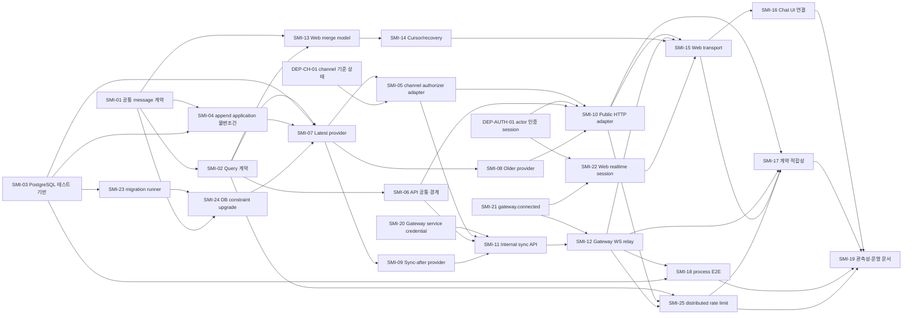

# Stream Messages 구현 계획: 의존성 그래프

> [구현 index](./README.md) | [설계 index](../design/README.md)

## 5. 의존성 개요

`DEP-CH-01`, `DEP-AUTH-01`이 늦어져도 provider와 Web 순수 모델은 fake authorizer/transport로 병렬 개발할
수 있다. 그러나 public/internal production 조립과 실제 Web transport, 이후 출시 관문은 통과할 수 없다.
