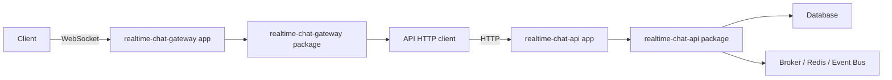

# realtime-chat 아키텍처와 경계

## 문서 목적

이 문서는 `realtime-chat` 영역의 큰 아키텍처 방향과 책임 경계를 설명한다.

대상 독자는 개발자만이 아니다. 기획, 운영, QA, 다른 도메인 담당자도 `realtime-chat`이 어떤 기준으로 나뉘고, 어떤 서버가 어떤 책임을 가지며, 변경이 생겼을 때 어느 영역을 봐야 하는지 이해할 수 있도록 작성한다.

이 문서는 특정 기능의 세부 구현 절차를 설명하지 않는다. 예를 들어 메시지 전송, 읽음 처리, 접속 상태, 누락 메시지 동기화 같은 개별 흐름은 별도 설계 문서에서 다룬다. 여기서는 그 기능들이 놓일 전체 구조와 경계만 정의한다.

## 핵심 요약

`realtime-chat`은 WebSocket 기반의 실시간 채팅 영역이다. 사용자는 Gateway 서버에 WebSocket으로 연결하고, Gateway는 사용자의 실시간 연결과 세션을 관리한다. 도메인 판단, 권한, 저장, 트랜잭션 처리는 API 서버가 맡는다. Gateway와 API는 서버 대 서버 HTTP 통신으로 협력한다.

저장소 구조에서 `apps/`는 배포 가능한 실행 단위이고, `packages/`는 실제 책임이 들어가는 코드 단위다. `apps/`는 가능한 얇게 유지하고, 도메인 규칙과 유스케이스는 `packages/`에 둔다.

가장 중요한 설계 원칙은 다음과 같다.

```txt
같은 이유로 바뀌는 코드는 가까이 둔다.
다른 이유로 바뀌는 코드는 분리한다.
```

이 원칙 때문에 `realtime-chat`은 전형적인 계층형 구조만으로 나누지 않는다. `controller`, `service`, `repository` 같은 기술 계층보다, 요구사항 변경 단위와 트랜잭션 경계를 기준으로 코드를 나눈다.

## 왜 이런 구조를 선택하는가

`realtime-chat`은 요구사항이 쉽게 바뀔 수 있는 영역이다. 채팅은 단순히 텍스트를 저장하는 기능처럼 보이지만 실제로는 권한, 대화 대상, 실시간 전달, 재시도, 중복 방지, 읽음 상태, 접속 상태, 동기화 정책이 서로 영향을 준다.

도메인 요구사항이 바뀌면 다음 코드가 함께 흔들릴 수 있다.

```txt
클라이언트 이벤트 모양
서버 요청/응답 계약
권한 규칙
저장 방식
DB 조회와 트랜잭션
실시간 전달 이벤트
프론트엔드 화면과 상태
```

추상화나 인터페이스를 많이 둔다고 이 변경 전파가 사라지지는 않는다. 백엔드와 프론트엔드는 모두 도메인 기능에 결합되어 있기 때문이다.

따라서 이 아키텍처의 목표는 변경을 없애는 것이 아니다. 변경이 발생했을 때 수정할 위치를 예측 가능하게 만들고, 관계없는 영역까지 같이 흔들리지 않게 경계를 세우는 것이 목표다.

## 모노레포의 기본 구조

이 프로젝트는 TypeScript 기반 모노레포를 지향한다. 모노레포란 여러 앱과 패키지를 하나의 저장소 안에서 관리하는 방식이다.

`realtime-chat` 관점에서 큰 구조는 다음과 같다.

```txt
apps/
  realtime-chat-api/
  realtime-chat-gateway/

packages/
  realtime-chat-api/
  realtime-chat-gateway/
  realtime-chat-domain/
  realtime-chat-contracts/
  realtime-chat-outbound-delivery/
  ...
```

이 이름들은 최종 확정된 파일명이 아니라 책임 경계를 설명하기 위한 예시다. 실제 패키지 이름은 구현 시점의 의도와 저장소 규칙에 맞춰 조정될 수 있다.

## apps의 역할

`apps/`는 배포 단위다. 실제 서버 프로세스로 실행되는 코드가 여기에 있다.

하지만 `apps/`는 비즈니스 로직을 담는 곳이 아니다. 앱은 런타임 쉘에 가깝다. 즉 서버를 띄우기 위한 최소한의 일만 책임진다.

예를 들어 API 앱은 다음 정도만 알아야 한다.

```txt
환경 변수를 읽는다.
HTTP 서버를 연다.
필요한 패키지를 조립한다.
헬스 체크 엔드포인트를 제공한다.
종료 시그널을 받으면 안전하게 종료한다.
```

Gateway 앱은 다음 정도만 알아야 한다.

```txt
환경 변수를 읽는다.
WebSocket 서버를 연다.
Gateway 패키지를 조립한다.
연결 종료와 프로세스 종료를 처리한다.
```

앱이 알아서는 안 되는 것은 다음과 같다.

```txt
메시지를 어떤 규칙으로 저장하는가
사용자가 특정 대화에 쓸 권한이 있는가
중복 요청을 어떻게 처리하는가
어떤 이벤트를 어떤 수신자에게 전달해야 하는가
도메인 상태를 어떤 트랜잭션으로 변경하는가
```

이런 지식은 `packages/`에 있어야 한다.

## packages의 역할

`packages/`는 실제 책임이 들어가는 곳이다. 여기서 패키지는 단순히 여러 앱이 공유하는 공용 유틸리티 모음이 아니다. 각 패키지는 특정 변경 이유와 책임을 가진 코드 영역이다.

예를 들어 `realtime-chat-api` 패키지는 API 쪽 도메인 요청 처리와 트랜잭션을 책임질 수 있다. `realtime-chat-gateway` 패키지는 WebSocket 연결, 세션, 클라이언트 이벤트 해석을 책임질 수 있다. `realtime-chat-domain` 패키지는 백엔드 내부 도메인 규칙을 담을 수 있다. `realtime-chat-contracts` 패키지는 프론트엔드나 다른 서버와 공유해야 하는 공개 타입과 통신 계약을 담을 수 있다.

중요한 점은 `domain`이 공유되지 않는다는 뜻이 아니다. 도메인은 백엔드 내부의 여러 패키지에서 공유될 수 있다. 다만 프론트엔드가 서버 내부 도메인 패키지를 직접 가져다 쓰지는 않는다. 프론트엔드와 공유해야 하는 값은 별도의 contract 패키지로 분리한다.

정리하면 다음과 같다.

```txt
domain
  서버 내부 도메인 규칙
  백엔드 패키지 간 공유 가능
  프론트엔드에 직접 노출하지 않음

contracts
  외부와 약속하는 공개 타입
  HTTP 요청/응답 DTO
  WebSocket 이벤트 payload
  프론트엔드와 공유 가능

api package
  API 요청 처리
  도메인 판단
  저장과 트랜잭션
  외부 시스템 호출 wrapper

gateway package
  WebSocket 연결
  세션 관리
  클라이언트 이벤트 해석
  API HTTP 호출
  클라이언트 응답 변환
```

## API 서버와 Gateway 서버의 분리

`realtime-chat`은 API 서버와 Gateway 서버를 분리한다.

API 서버는 도메인 판단과 기준 상태 변경을 책임진다. 권한 확인, 정책 적용, 데이터 저장, 트랜잭션, 이벤트 발행 요청 같은 일은 API 쪽 책임이다.

Gateway 서버는 WebSocket 연결과 사용자 세션을 책임진다. 사용자가 어떤 WebSocket 연결로 접속해 있는지, 해당 연결이 어떤 세션인지, 클라이언트가 보낸 이벤트를 어떤 API 요청으로 바꿀지는 Gateway 쪽 책임이다.

두 서버의 관계는 다음과 같다.



Gateway와 API를 분리하는 이유는 상태의 성격이 다르기 때문이다.

Gateway는 stateful하다. 사용자의 WebSocket 연결을 직접 들고 있기 때문이다. 어떤 사용자가 지금 어느 프로세스의 어떤 연결에 붙어 있는지는 Gateway가 알고 있다.

API는 가능한 stateless하게 유지한다. API는 요청을 받을 때마다 데이터베이스나 외부 저장소를 기준으로 판단한다. 특정 API 프로세스의 메모리에 도메인 기준 상태가 갇히면 수평 확장이 어려워진다.

이 구조에서는 Gateway 인스턴스를 여러 개 띄울 수 있고, API 인스턴스도 여러 개 띄울 수 있다. 특정 사용자는 Gateway A에 붙어 있고 다른 사용자는 Gateway B에 붙어 있을 수 있다. 그래도 기준 상태는 API와 저장소를 통해 일관되게 처리된다.

## 서버 간 통신 경계

Gateway와 API는 내부 함수 호출처럼 직접 묶이지 않는다. Gateway는 API를 HTTP로 호출한다.

이 결정은 경계를 명확히 만든다.

Gateway는 API 패키지의 내부 구현을 알 필요가 없다. Gateway는 공개된 server-to-server HTTP 계약만 알면 된다. API는 Gateway가 WebSocket을 어떤 방식으로 관리하는지 알 필요가 없다. API는 요청을 받고 도메인 결과를 반환하면 된다.

이 경계 때문에 오류도 구분해야 한다.

도메인 규칙상 요청이 거절된 경우는 정상적인 도메인 결과다. 예를 들어 권한이 없거나 정책상 허용되지 않는 요청은 도메인 거절로 다룬다.

반면 Gateway가 API를 호출했는데 timeout, 5xx, 네트워크 실패, 응답 형식 불일치가 발생한 경우는 도메인 거절이 아니다. 이것은 서버 간 통신 실패 또는 일시적 장애다. 클라이언트에게도 재시도 가능한 오류로 내려가야 한다.

즉 다음 두 오류는 다르게 다뤄야 한다.

```txt
도메인 거절
  요청은 API에 도달했다.
  API가 도메인 규칙에 따라 거절했다.
  클라이언트에게 기능 수준의 거절 응답을 준다.

통신/서버 오류
  Gateway가 API 결과를 신뢰할 수 없다.
  API가 응답하지 않았거나 비정상 응답을 했다.
  클라이언트에게 재시도 가능한 Gateway 오류를 준다.
```

## 상태 관리와 확장

Node.js와 TypeScript 런타임은 기본적으로 단일 프로세스 이벤트 루프 모델에 가깝다. 따라서 많은 연결과 높은 처리량을 감당하려면 처음부터 scale-out을 염두에 둬야 한다.

이 아키텍처에서 중요한 전제는 다음과 같다.

```txt
WebSocket 연결은 특정 Gateway 프로세스에 붙는다.
하지만 채팅의 기준 상태는 특정 Gateway 프로세스에 갇히면 안 된다.
```

Gateway의 로컬 메모리는 현재 프로세스가 들고 있는 WebSocket 연결과 세션만 관리한다. 메시지, 대화방, 권한, 순번 같은 기준 상태는 API와 저장소가 책임진다.

Gateway가 죽으면 해당 Gateway에 연결된 WebSocket은 끊어진다. 하지만 이미 저장된 메시지나 기준 상태는 사라지면 안 된다. 사용자가 재연결하면 API와 저장소를 기준으로 필요한 상태를 다시 맞출 수 있어야 한다.

## Vertical Slice Architecture

이 프로젝트는 전형적인 계층형 구조보다 Vertical Slice Architecture를 우선한다.

계층형 구조는 보통 코드를 다음처럼 나눈다.

```txt
controller
service
repository
```

이 방식은 기술 역할을 기준으로 파일을 나눈다. 하지만 요구사항이 바뀔 때는 한 계층만 바뀌는 경우보다 여러 계층이 함께 바뀌는 경우가 많다. 그 결과 하나의 기능 변경을 위해 여러 디렉터리를 오가야 할 수 있다.

Vertical Slice Architecture는 다른 질문을 던진다.

```txt
이 코드는 어떤 요구사항 때문에 바뀌는가?
이 코드들은 같은 변경 이유를 가지는가?
하나의 트랜잭션 또는 일관성 경계를 함께 책임지는가?
```

같은 이유로 바뀌는 코드는 가까이 둔다. 다른 이유로 바뀌는 코드는 분리한다.

여기서 slice는 항상 작은 command 하나만 의미하지 않는다. 어떤 경우에는 command나 query 하나가 slice가 될 수 있다. 어떤 경우에는 여러 command가 같은 정책 변경에 강하게 묶여 있어 capability group으로 가까이 있을 수 있다.

중요한 기준은 이름이 아니라 책임이다.

```txt
좋은 기준
  하나의 요구사항 변경에서 함께 바뀌는가
  하나의 트랜잭션 경계를 책임지는가
  하나의 일관성 규칙을 함께 보장하는가

나쁜 기준
  controller라서 controller 폴더에 둔다
  repository라서 repository 폴더에 둔다
  공용처럼 보이니 shared에 먼저 뺀다
```

## capability group과 slice

일부 기능은 너무 작게 자르면 오히려 흐름을 이해하기 어려워진다. 반대로 너무 크게 합치면 하나의 파일이나 핸들러가 여러 요구사항을 모두 떠안게 된다.

이때 capability group과 slice를 구분한다.

```txt
capability group
  같은 정책 변경에 강하게 묶이는 기능들의 묶음
  서로 가까이 있어야 전체 흐름을 이해하기 쉬움

slice
  실제로 하나의 요청, 트랜잭션, 일관성 경계를 책임지는 구현 단위
  command 또는 query에 가까울 수 있음
```

capability group은 관련 흐름을 가까이 두기 위한 상위 경계다. 하지만 그 안에서 실제 처리 로직은 여러 slice로 나뉠 수 있다. 하나의 거대한 핸들러가 모든 경우를 if 문으로 처리하는 구조는 피한다.

## 데이터 접근과 wrapper

데이터베이스, Redis, 브로커 같은 외부 시스템 접근은 필요하다. 하지만 이를 무조건 전역 repository 또는 거대한 adapter 계층으로 밀어내지는 않는다.

특정 slice의 데이터 접근 방식이 그 slice의 요구사항과 함께 바뀐다면, SQL이나 query helper가 slice 가까이에 있을 수 있다. 이것은 이 프로젝트에서 허용 가능한 구조다.

중요한 것은 SQL이 어디에 있느냐가 아니라, 그 SQL이 어떤 변경 이유를 가지느냐다.

```txt
허용 가능한 경우
  특정 slice의 트랜잭션 규칙을 직접 표현하는 query
  특정 요구사항 변경과 함께 바뀌는 SQL
  해당 package 내부에서만 쓰이는 얇은 wrapper

주의해야 하는 경우
  여러 책임이 뒤섞인 전역 DB 포트
  모든 기능이 의존하는 거대한 repository
  아직 반복 변경 이유가 확인되지 않았는데 먼저 shared로 뺀 코드
```

공통화는 나중에 해도 된다. 처음부터 모든 것을 공용으로 만들면 변경 이유가 다른 코드가 하나의 추상화에 묶일 수 있다.

## contract와 domain의 차이

`domain`과 `contract`는 다르다.

domain은 서버 내부의 도메인 규칙이다. 어떤 행동이 가능한지, 어떤 상태 전이가 유효한지, 어떤 불변조건을 지켜야 하는지 같은 내부 판단이 여기에 속한다.

contract는 외부와의 약속이다. 클라이언트가 보내는 이벤트 payload, 서버가 돌려주는 응답 모양, 서버 간 HTTP 요청/응답 DTO처럼 통신 경계에서 합의해야 하는 모양이 여기에 속한다.

프론트엔드와 공유해야 하는 것은 domain이 아니라 contract다.

```txt
domain
  서버 내부 규칙
  백엔드 패키지 간 공유 가능
  프론트엔드 직접 의존 금지

contract
  외부 공개 타입과 schema
  프론트엔드와 공유 가능
  API/Gateway 통신 경계에서 사용
```

이 구분은 중요하다. 프론트엔드가 서버 내부 도메인 모델에 직접 결합되면 서버 내부 규칙을 바꾸는 일이 곧바로 프론트엔드 구조 변경으로 이어질 수 있다. 반대로 contract를 분리하면 외부 약속과 내부 구현을 구분할 수 있다.

## outbound delivery 경계

실시간 채팅에서는 저장과 전달을 구분해야 한다.

요청이 성공했다는 것은 보통 기준 상태가 저장되었음을 의미한다. 하지만 그것이 모든 접속자에게 실시간 push가 완료되었다는 뜻은 아니다. WebSocket 전달은 네트워크와 각 Gateway의 연결 상태에 영향을 받는다.

따라서 도메인 처리 패키지는 필요한 경우 delivery 요청 이벤트를 발행할 수 있다. 이후 실제로 어떤 Gateway가 어떤 로컬 세션에 push할지는 outbound delivery 쪽 책임이다.

이 경계는 다음을 분리한다.

```txt
도메인 처리
  요청 검증
  권한 판단
  저장
  트랜잭션
  delivery 요청 이벤트 생성

outbound delivery
  delivery 이벤트 수신
  수신자 연결 찾기
  Gateway local session으로 push
  socket 전송 실패 처리
```

이 구분 덕분에 저장 성공과 실시간 전달 성공을 혼동하지 않는다.

## 책임 배치 기준

새 코드를 추가할 때는 다음 질문을 먼저 한다.

```txt
이 코드는 어떤 이유로 바뀌는가?
이 변경 이유는 어떤 package가 소유하는가?
이 코드는 런타임 실행을 위한 조립인가, 도메인 판단인가?
이 코드는 외부와의 공개 계약인가, 내부 규칙인가?
이 코드는 특정 slice의 트랜잭션 규칙인가, 여러 slice가 실제로 공유하는 규칙인가?
```

대략적인 배치 기준은 다음과 같다.

| 코드 성격                                | 위치                                     |
| ---------------------------------------- | ---------------------------------------- |
| 서버 실행, 포트 바인딩, 환경 변수 로드   | `apps/*`                                 |
| WebSocket 연결과 세션 처리               | `packages/realtime-chat-gateway`         |
| Gateway에서 API를 호출하는 HTTP client   | `packages/realtime-chat-gateway`         |
| API 요청 검증과 command mapping          | `packages/realtime-chat-api`             |
| 도메인 트랜잭션과 기준 상태 변경         | `packages/realtime-chat-api`             |
| 서버 내부 도메인 규칙                    | `packages/realtime-chat-domain`          |
| 프론트엔드와 공유할 DTO/schema/type      | `packages/realtime-chat-contracts`       |
| 실제 socket fan-out                      | outbound delivery 책임 package           |
| 특정 slice 전용 SQL/query                | 해당 slice 또는 해당 package 내부        |
| 여러 책임이 실제로 공유하는 작은 wrapper | 해당 책임 package 내부 또는 별도 package |

## 이 아키텍처가 피하려는 것

이 구조는 다음을 피하려고 한다.

```txt
앱 내부에 도메인 로직이 쌓이는 것
Gateway가 권한과 저장 규칙까지 판단하는 것
API가 WebSocket 세션 상태를 직접 아는 것
프론트엔드가 서버 내부 domain package에 직접 결합되는 것
모든 DB 접근이 하나의 거대한 repository로 몰리는 것
shared 폴더가 변경 이유가 다른 코드의 집합소가 되는 것
하나의 handler가 여러 요구사항을 if 문으로 모두 처리하는 것
저장 성공과 실시간 전달 성공을 같은 의미로 다루는 것
```

## 결론

`realtime-chat` 아키텍처는 배포 단위, 책임 단위, 변경 단위를 분리한다.

`apps/`는 얇은 런타임 쉘이다. `packages/`는 실제 책임이 들어가는 곳이다. Gateway는 WebSocket 연결과 세션을 책임지고, API는 도메인 판단과 기준 상태 변경을 책임진다. 프론트엔드와 공유할 것은 domain이 아니라 contract로 분리한다.

이 구조의 핵심은 변경을 인정하는 것이다. 도메인 요구사항이 바뀌면 여러 코드가 바뀐다. 중요한 것은 그 변경이 어디에 모여야 하는지 명확히 하고, 관계없는 영역까지 함께 바뀌지 않게 경계를 세우는 것이다.
