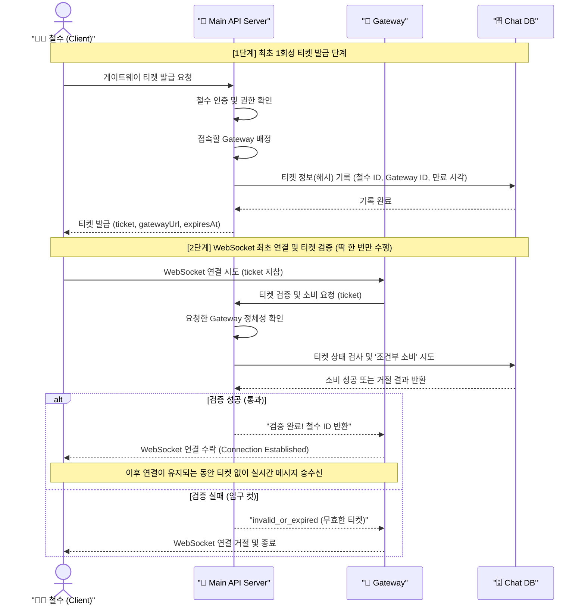

# 🚀 실시간 채팅 게이트웨이 티켓 유스케이스

## 📄 문서 목적

이 문서는 사용자가 최초로 실시간 채팅 서버에 연결할 때 왜 '게이트웨이 티켓'이 필요한지, 그리고 여러 서버가 어떤 순서로 협력하는지 이해하기 쉽게 설명합니다.

*시스템 내부의 복잡한 코드 구조는 제외하고, 사용자 흐름과 서버 간의 최초 연결 협력 구조만 다룹니다.*

## 🎭 등장요소

* 🧑‍💻 `Client (철수)` : 실시간 채팅을 위해 최초 WebSocket 연결을 시도하는 유저 클라이언트
* 🏢 `Main API Server (발급처)` : 유저 인증을 확인하고, "너는 몇 번 게이트로 가라"며 일회성 티켓을 끊어주는 총괄 서버
* 🎪 `Gateway (탑승 게이트)` : 실시간 WebSocket 연결을 유지하며 채팅 데이터를 나르는 실시간 서버
* 🗄️ `Realtime Chat Database (중앙 장부)` : 티켓의 유효성과 재사용 여부를 칼같이 기록하는 저장소

---

## 🍿 한 눈에 보는 유스케이스

철수가 실시간 채팅을 이용하려면 먼저 🎪 `Gateway`에 WebSocket 연결을 맺어야 합니다. 하지만 보안상 아무나 바로 문을 두드리게 둘 수는 없으므로, **최초 연결 시 딱 한 번** 인증을 위한 티켓 프로세스를 거칩니다.

1. 철수는 먼저 🏢 `Main API Server`를 찾아가 "나 실시간 채팅 연결하게 티켓 한 장 줘"라고 요청합니다.
2. 🏢 `Main API Server`는 철수의 신분을 확인한 뒤, 현재 여유 있는 🎪 `Gateway` 주소를 배정하고 **짧은 시간만 유효한 일회용 티켓**을 발급합니다. 이때 티켓 원문이 그대로 저장되지 않도록 티켓의 일련번호(해시값)를 🗄️ `중앙 장부(DB)`에 기록해 둡니다.
3. 철수는 받은 티켓을 들고 배정받은 🎪 `Gateway`로 찾아가 WebSocket 연결을 요청합니다.
4. 🎪 `Gateway`는 이 티켓이 진짜인지 확인하기 위해 🏢 `Main API Server`에 무전을 칩니다. "여기 철수라는 유저가 티켓 들고 왔는데, 이 티켓 지금 써도 되나요?" 이때 게이트웨이의 정체성은 클라이언트가 보낸 값이 아니라 서버 간 인증이나 내부 설정으로 확인됩니다.
5. 🏢 `Main API Server`는 🗄️ `중앙 장부`를 확인하여 이미 썼거나, 만료됐거나, 다른 게이트용 티켓이면 거절합니다. 조건이 딱 맞으면 장부에 **[사용 완료]** 도장을 찍고 "통과!"를 외칩니다.
6. 🎪 `Gateway`는 안심하고 철수의 WebSocket 연결을 수락(Accept)합니다. **이후 최초 연결이 성공적으로 맺어지면, 이 티켓은 소멸하며 철수는 연결된 파이프라인을 통해 자유롭게 채널 메시지나 DM을 실시간으로 주고받습니다.**

---

## 🎬 시퀀스 다이어그램 (최초 연결 수립 과정)

## 🛡️ 티켓이 해결해 주는 고질적인 문제들

* **비인증 유저 차단**: 로그인하지 않은 유저가 게이트웨이에 직접 달라붙는 것을 최초 관문에서 막습니다.
* **티켓 재활용(어택) 방지**: 이미 한 번 연결할 때 써먹은 티켓을 가로채서 다른 기기나 다른 유저가 다시 연결하려는 시도를 막습니다.
* **만료 티켓 차단**: 발급받은 지 한참 지난 만료된 티켓으로 나중에 슬그머니 세션을 열려는 상황을 막습니다.
* **번지수 오인 차단**: A 게이트웨이용으로 받은 티켓을 들고 B 게이트웨이에 가서 연결해 달라고 하는 상황을 막습니다.
* **게이트웨이 과부하 방지**: 실시간 서버(`Gateway`)가 유저 핸드셰이크 시점에 무거운 인증 정보 해독을 직접 하지 않고, API 서버의 검증 결과를 기준으로 세션을 열어줄 수 있습니다.

---

## 🎯 깔끔한 책임 구분

* 🧑‍💻 **Client**: 발급받은 티켓을 지참하여 지정된 게이트웨이에 **최초 연결 요청** 시 제시하기
* 🏢 **Main API Server**: 유저 신분 확인, 게이트웨이 배정, 티켓 발급 및 **최초 1회 소비 검증** 총괄하기
* 🎪 **Gateway**: WebSocket 연결 요청을 받아 티켓 검증을 의뢰하고, 통과된 유저와 **장기 실시간 세션 유지**하기
* 🗄️ **Realtime Chat Database**: 티켓이 딱 한 번만 깔끔하게 소비되도록 원자적(Atomic) 상태 저장하기
