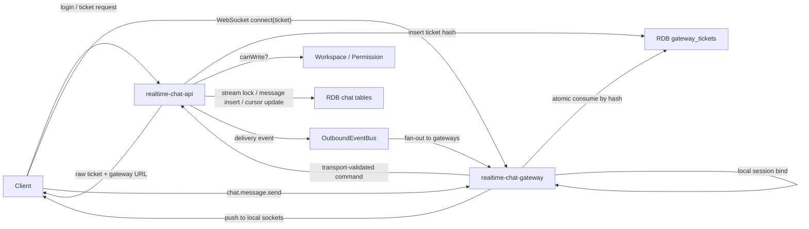

# Gateway Relay Architecture

## 문서 연결

- Index: [Realtime Chat Docs Index](index.md)
- 원천 리포트: [도메인 이벤트 스토밍 보고서](../../../docs/realtime-chat/domain-event-storming-report.md)
- 기존 리서치 맥락: [Research Notes](../../../apps/realtime-chat-api/docs/realtime-chat-research.md)

이 문서는 실시간 채팅에서 API 서버와 WebSocket gateway를 어떻게 나누고, 메시지 저장과 realtime push를 어떻게 분리하는지 설명한다.

## 핵심 결정

| 영역 | 결정 |
| --- | --- |
| API와 Gateway | API는 domain command, permission, persistence를 맡고 Gateway는 WebSocket connection state를 맡는다. |
| Gateway Ticket | MVP 배포 기준은 RDB 기반 one-time consume이다. in-memory ticket store는 테스트/mock 전용이다. |
| Message Sequence | 전역 순번이 아니라 `streamId + sequence`를 사용한다. |
| Sender ACK | ACK는 메시지 저장과 stream sequence 발급 성공을 뜻한다. 모든 recipient push 성공을 뜻하지 않는다. |
| Outbound Delivery | realtime push 실패는 메시지 저장을 rollback하지 않는다. 수신자는 `afterSequence` sync로 복구한다. |

## 전체 구조



## 책임 분리

### `realtime-chat-api`

API 서버는 채팅 도메인의 권위 있는 처리 경계다.

- 인증된 사용자에게 gateway ticket을 발급한다.
- `SendChannelMessage`, `SendDMMessage`, `ReplyThreadMessage` 같은 command를 처리한다.
- Workspace / Permission context에 쓰기 권한을 질의한다.
- `ConversationStream` row를 잠그고 다음 sequence를 발급한다.
- message, idempotency key, read cursor를 RDB transaction 안에서 다룬다.
- 저장 성공 후 sender ACK를 반환하고 outbound delivery publish를 시도한다.

### `realtime-chat-gateway`

Gateway는 connection state와 전송 계층만 책임진다.

- WebSocket handshake에서 ticket consume을 호출한다.
- local `GatewaySessionRegistry`에 socket session을 등록한다.
- frame size, JSON parse, session 존재 여부 같은 transport validation을 수행한다.
- chat permission, message persistence, sequence assignment를 최종 판단하지 않는다.
- outbound delivery event를 받으면 현재 gateway의 local session만 찾아 socket으로 push한다.

### `OutboundEventBus`

Outbound bus는 저장된 메시지를 gateway server group 쪽으로 알리는 전달 경계다.

- 단일 프로세스 데모나 단위 테스트에서는 in-memory/mock adapter를 쓸 수 있다.
- API와 Gateway가 실제로 분리된 프로세스라면 Redis Pub/Sub, Kafka, NATS 같은 broker adapter가 필요하다.
- publish 실패는 MVP에서 message commit을 rollback하지 않는다.
- 운영 단계에서는 outbox pattern을 검토한다.

## Gateway Ticket 정책

MVP 배포 기준은 RDB 기반 one-time ticket이다.

```txt
GatewayTicketPort
  -> RdbGatewayTicketAdapter
```

티켓 발급:

```txt
Client -> API: IssueGatewayTicket
API -> RDB: ticket_value_hash, user_id, assigned_gateway_url, expires_at insert
API -> Client: raw ticket + gatewayUrl + expiresAt
```

티켓 소비:

```txt
Client -> Gateway: WebSocket connect(raw ticket)
Gateway -> RDB: hash(raw ticket)로 atomic consume
Gateway -> SessionRegistry: consume 성공 시 local session bind
```

consume은 다음 조건을 한 번의 update로 만족해야 한다.

```sql
UPDATE gateway_tickets
SET consumed_at = :now
WHERE ticket_value_hash = :ticketValueHash
  AND consumed_at IS NULL
  AND expires_at > :now;
```

영향받은 row가 1이면 성공, 0이면 만료, 재사용, 존재하지 않음 중 하나로 보고 연결을 거절한다.

## 메시지 저장 정책

Channel, DM, Thread는 모두 message stream이다.

```txt
ConversationStream(streamId, streamType, ownerId, lastSequence)
Message(messageId, streamId, sequence, senderId, content, clientMessageId)
ReadCursor(userId, streamId, lastReadSequence)
```

메시지 저장 transaction:

```txt
1. permission check
2. streamId resolve
3. conversation_streams row lock
4. nextSequence = lastSequence + 1
5. message insert
6. stream.lastSequence update
7. idempotency key record
8. commit
9. sender ACK
10. outbound delivery publish 시도
```

`sequence`는 한 stream 안에서만 비교한다. `channel-ch-1`의 sequence 10과 `dm-dm-1`의 sequence 10은 서로 충돌하지 않는다.

## Package Ports

| Port | 책임 | MVP adapter |
| --- | --- | --- |
| `GatewayTicketPort` | gateway ticket issue/consume | RDB-backed adapter |
| `GatewaySessionRegistryPort` | gateway 한 대의 local session bind/unbind/lookup | in-memory local registry |
| `InboundMessagePort` | gateway가 받은 client event를 API/message service로 전달 | HTTP/gRPC/in-process adapter |
| `OutboundEventBusPort` | 저장 후 delivery event publish/subscribe | in-memory/mock for local, broker for server group |
| `ConnectionSenderPort` | local socket session으로 serialized event 전송 | gateway app socket adapter |

## 확장 기준

| 필요 | 교체 지점 |
| --- | --- |
| gateway ticket을 JWT로 확장 | `GatewayTicketPort` adapter. 단 one-time consume 보장이 필요하면 `jti` consume store가 필요하다. |
| gateway server group fan-out | `OutboundEventBusPort`를 Redis/Kafka/NATS adapter로 교체한다. |
| publish 실패 자동 재시도 | message transaction에 outbox table을 추가하고 별도 publisher를 둔다. |
| shared presence | local registry는 유지하고, Presence context 또는 shared registry를 별도 adapter로 붙인다. |

처음부터 모든 외부 인프라를 붙이는 것이 목표는 아니다. 다만 API와 Gateway가 분리된다는 전제에서, RDB ticket과 message persistence처럼 강한 정합성이 필요한 부분은 in-memory 기본값으로 설명하지 않는다.
