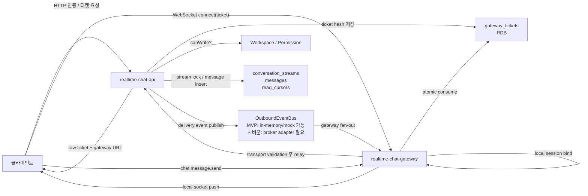
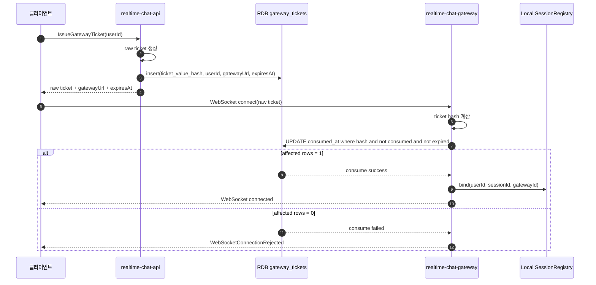
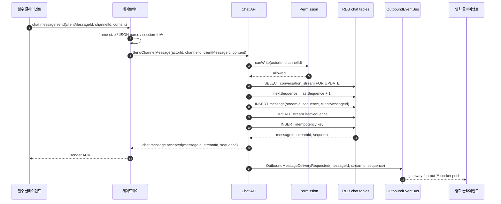
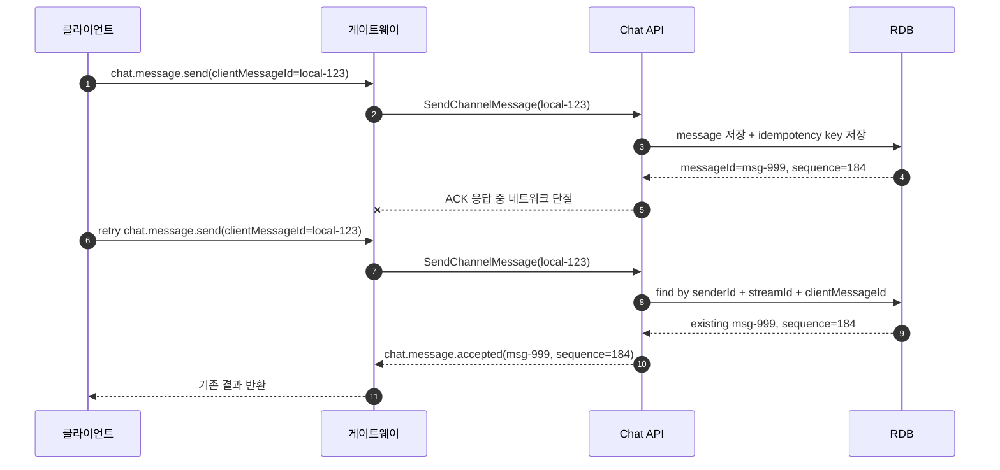
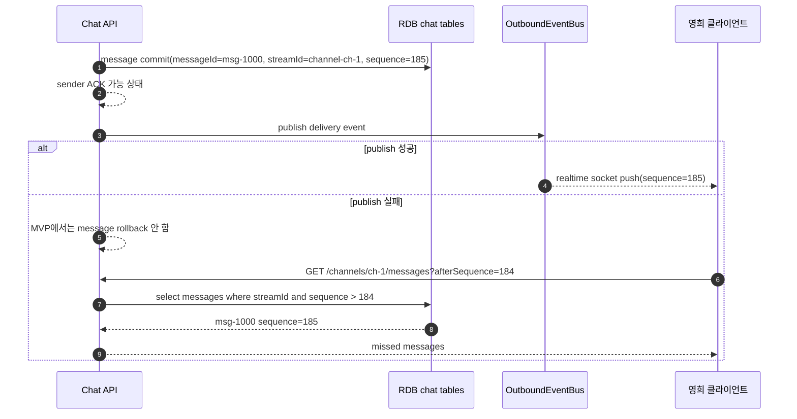
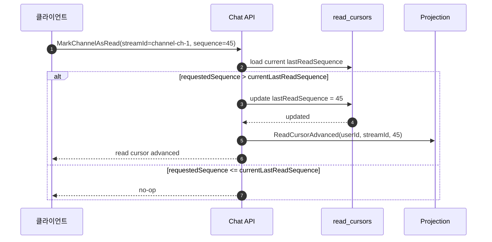
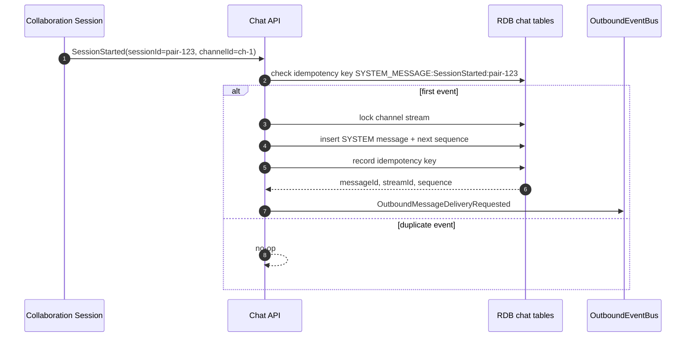

# 게이트웨이 중계 흐름

## 문서 연결

- 문서 색인: [Realtime Chat Docs Index](index.md)
- 결정 문서: [Gateway Relay Architecture](gateway-relay-architecture.md)
- 원천 리포트: [도메인 이벤트 스토밍 보고서](../../../docs/realtime-chat/domain-event-storming-report.md)

이 문서는 실시간 채팅의 핵심 흐름을 다이어그램으로 표현한다. 중요한 기준은 다음 세 가지다.

1. Gateway는 전송 계층을 맡고, Chat API가 도메인 판단을 맡는다.
2. 메시지 정렬은 `streamId + sequence`로 한다.
3. sender ACK와 recipient realtime delivery는 분리한다.

## 전체 구성



## 1. 웹소켓 접속과 RDB Ticket Consume



티켓은 한 번만 성공해야 한다. 같은 ticket을 두 gateway가 동시에 소비하려고 해도 RDB update가 한쪽만 성공해야 한다.

## 2. 메시지 전송, Stream Sequence, Sender ACK



sender ACK의 의미:

```txt
서버가 메시지를 검증했고,
DB에 저장했고,
stream sequence를 발급했다.
```

sender ACK가 의미하지 않는 것:

```txt
모든 수신자가 realtime push를 받았다.
```

## 3. 멱등성 재시도



같은 `senderId + streamId + clientMessageId` 요청은 새 메시지를 만들지 않는다.

## 4. 배달 실패와 afterSequence 복구



Realtime push는 편의 경로다. 저장된 메시지와 stream sequence가 복구의 기준이다.

## 5. 읽음 처리



읽음 상태는 유저별 private state다. 다른 사용자에게 공개적인 read receipt로 전파하지 않는다.

## 6. 협업 세션에서 시스템 메시지 생성



외부 협업 이벤트가 재전달되어도 같은 시스템 메시지를 중복 생성하지 않는다.

## 1차 구현 해석

| 영역 | 1차 구현 기준 |
| --- | --- |
| Gateway Ticket | RDB 기반 one-time consume |
| Message Store | RDB 기반 `conversation_streams`, `messages`, `message_idempotency_keys`, `read_cursors` |
| Gateway Session | gateway process local in-memory registry |
| Outbound Bus | 단일 프로세스 검증은 in-memory/mock 가능. 분리된 gateway server group에서는 broker adapter 필요 |
| Missed Delivery | `afterSequence` sync로 복구 |

이 구조에서 강한 정합성이 필요한 것은 ticket consume, message persistence, stream sequence, idempotency, read cursor다. Realtime push, unread projection, presence broadcast는 지연되거나 실패해도 다시 계산하거나 sync할 수 있다.
