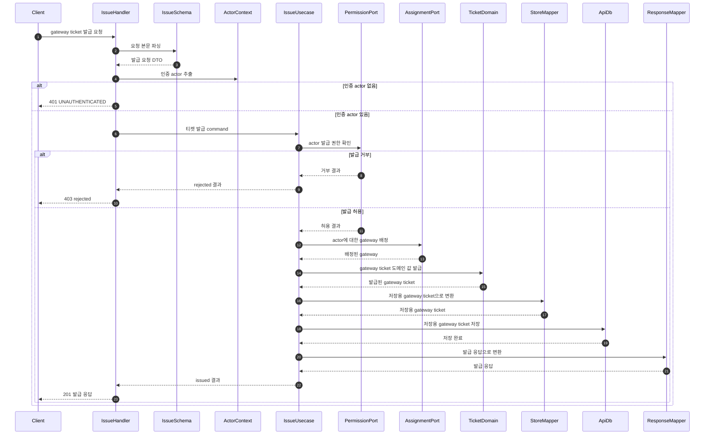
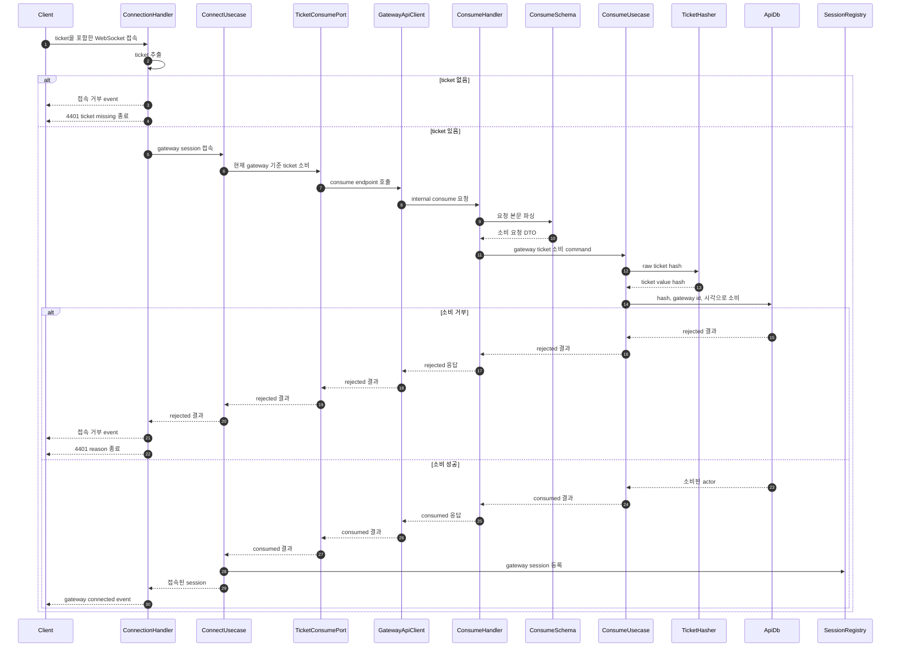

# gateway ticket routing 시퀀스

## 상태

논의 메모입니다. 현재 구현을 이해하기 위한 파일/함수 단위 흐름이며, public contract가 아닙니다. 에이전트 작업 기준으로 사용하려면 필요한 내용을 `owner-docs/` 또는 `public-docs/`로 승격합니다.

## 티켓 발급 흐름

참여자 매핑:

| Participant      | TS file/function                                                                    |
| ---------------- | ----------------------------------------------------------------------------------- |
| `IssueHandler`   | `api/http/handlers/issue-gateway-ticket.handler.ts:createIssueGatewayTicketHandler` |
| `IssueSchema`    | `api/http/schemas/issue-gateway-ticket.schema.ts:parseIssueGatewayTicketRequest`    |
| `ActorContext`   | `api/http/actor-context.ts:extractActorId`                                          |
| `IssueUsecase`   | `api/usecases/issue-gateway-ticket.usecase.ts:issueGatewayTicket`                   |
| `PermissionPort` | `runtime-deps.ts:permissionPort.canIssueGatewayTicket`                              |
| `AssignmentPort` | `runtime-deps.ts:gatewayAssignmentPort.assignGatewayForTicket`                      |
| `TicketDomain`   | `api/domain/gateway-ticket.ts:issueGatewayTicketDomain`                             |
| `StoreMapper`    | `api/domain/gateway-ticket.ts:toStoredGatewayTicket`                                |
| `ApiDb`          | `runtime-deps.ts:db.issueGatewayTicket`                                             |
| `ResponseMapper` | `api/domain/gateway-ticket.ts:toIssueGatewayTicketResponse`                         |

## 티켓 소비와 gateway 접속 흐름

참여자 매핑:

| Participant         | TS file/function                                                                                    |
| ------------------- | --------------------------------------------------------------------------------------------------- |
| `ConnectionHandler` | `gateway/websocket/connection-handler.ts:createConnectionHandler`                                   |
| `ConnectUsecase`    | `gateway/usecases/connect-gateway-session.usecase.ts:connectGatewaySession`                         |
| `TicketConsumePort` | `gateway/runtime-deps.ts:gatewayTicketPort.consume`                                                 |
| `GatewayApiClient`  | `apps/realtime-chat-gateway/runtime/realtime-chat-api-client.ts:createHttpGatewayTicketConsumePort` |
| `ConsumeHandler`    | `api/http/handlers/consume-gateway-ticket.handler.ts:createConsumeGatewayTicketHandler`             |
| `ConsumeSchema`     | `api/http/schemas/consume-gateway-ticket.schema.ts:parseConsumeGatewayTicketRequest`                |
| `ConsumeUsecase`    | `api/usecases/consume-gateway-ticket.usecase.ts:consumeGatewayTicket`                               |
| `TicketHasher`      | `api/domain/gateway-ticket.ts:defaultTicketHasher.hash`                                             |
| `ApiDb`             | `runtime-deps.ts:db.consumeGatewayTicket`                                                           |
| `SessionRegistry`   | `gateway/session/in-memory-gateway-session-registry.ts:register`                                    |

## 구현상 경계

- `IssueGatewayTicketRequest`는 actor/workspace를 담지 않는다.
- `issue-gateway-ticket.handler.ts`가 authenticated actor context를 package-private command로 변환한다.
- `issue-gateway-ticket.usecase.ts`는 권한 확인, gateway 배정, domain 발급, 저장, 결과 반환만 조율한다.
- `gateway-ticket.ts`는 ticket value/hash/expiresAt/assigned gateway를 포함한 발급 값을 만든다.
- `db.consumeGatewayTicket`은 ticket hash, 현재 gateway id, 만료, 소비 여부를 트랜잭션 경계에서 검증한다.
- Gateway는 DB를 직접 보지 않고 `GatewayTicketConsumePort`를 통해 API internal endpoint를 호출한다.
