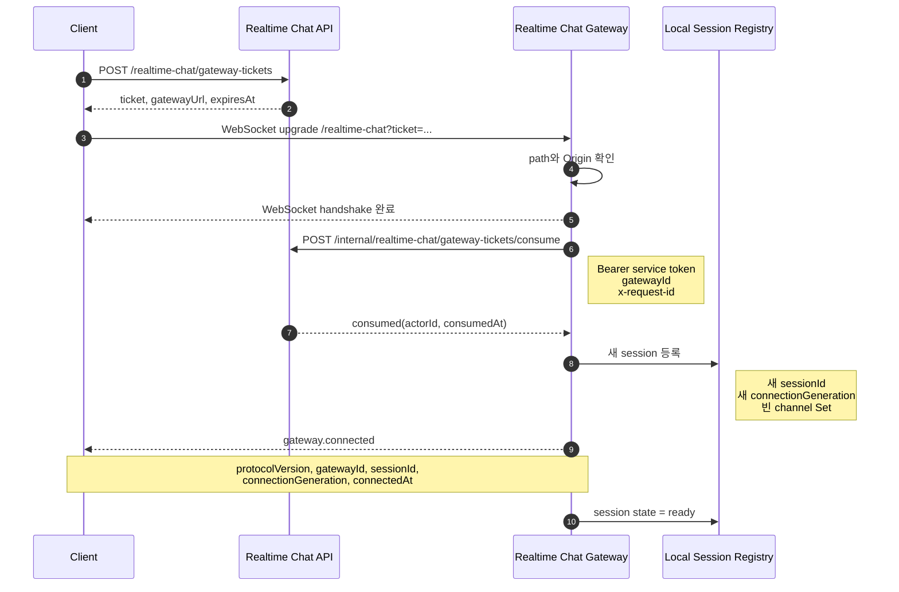
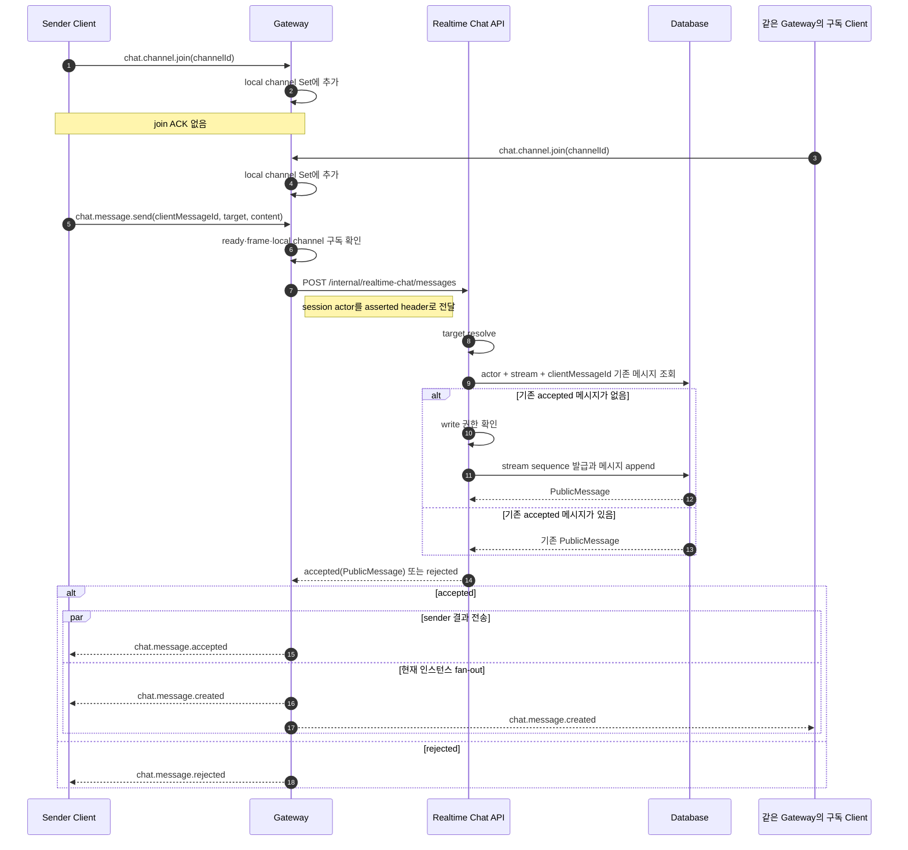
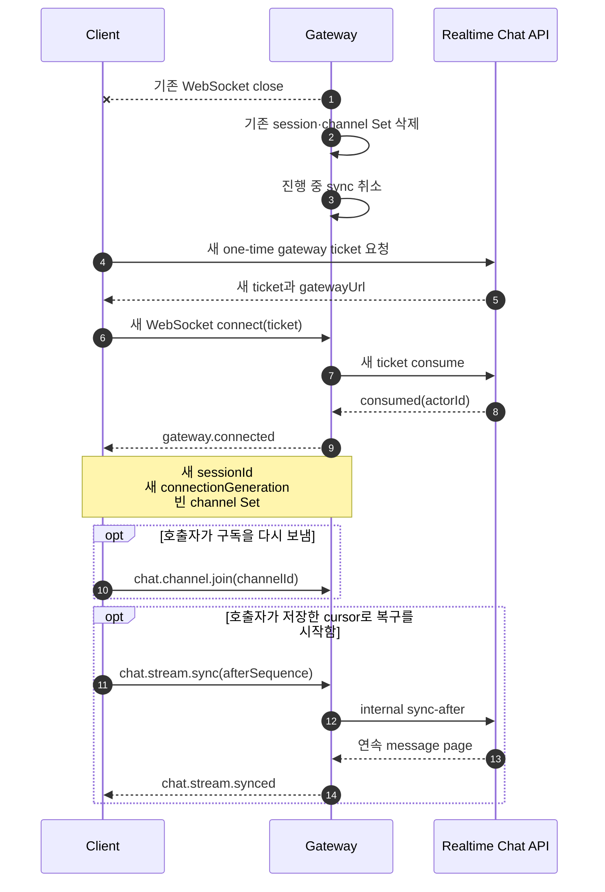

# 02. 현재 Gateway/API 동작 흐름

## 1. 문서 목적

이 문서는 2026-07-28 저장소 구현을 기준으로 실시간 문자 채팅의 Gateway/API 경로를 사실 그대로
기록한다. 새로운 프로토콜이나 목표 구조를 제안하지 않으며, 구현되지 않은 동작은 `미구현` 또는
`미결정`으로 표시한다.

주요 조사 대상은 다음과 같다.

- `apps/realtime-chat-gateway`
- `packages/realtime-chat-gateway-ticket-contracts`
- `packages/realtime-chat-message-contracts`
- `packages/realtime-chat-message-send-contracts`
- `packages/realtime-chat-message-send`
- `packages/realtime-chat-stream-messages-contracts`
- `packages/realtime-chat-stream-messages-gateway`
- `packages/realtime-chat-stream-messages-client`

현재 wire frame은 모두 다음과 같은 flat JSON object다.

```json
{
  "type": "event.name",
  "...": "event payload fields"
}
```

## 2. 현재 책임 경계

| 구성 요소 | 현재 책임 |
| --- | --- |
| Client | Gateway ticket 요청, WebSocket 연결, application event 전송, 결과 correlation |
| Gateway | Upgrade path·Origin 확인, ticket consume 중계, local session·channel Set 보관, frame 검증, API 중계, 현재 인스턴스 fan-out |
| API | Gateway service credential 검증, ticket 발급·소비, actor 확정, target resolve·쓰기 권한 확인, 메시지 저장, stream query |
| Database | 일회성 ticket 상태, 메시지, stream별 sequence와 조회 기준 상태 저장 |
| Stream Messages relay | `chat.stream.sync` 검증, internal sync-after 호출, generation 확인, 오류 mapping |

Gateway가 보관하는 session과 channel subscription은 프로세스 메모리에만 있다. 메시지와 stream
sequence는 API와 저장소가 소유한다.

현재 Gateway의 client event는 다음 세 가지뿐이다.

| Event | 현재 처리 |
| --- | --- |
| `chat.channel.join` | nonblank `channelId`를 현재 session의 local Set에 추가 |
| `chat.message.send` | channel 구독 여부를 먼저 확인한 뒤 API message-send로 중계 |
| `chat.stream.sync` | session actor를 사용해 API sync-after로 중계 |

`chat.channel.join`에는 성공·거절 응답, leave, 채널 존재 확인, 멤버십 확인이 없다. 따라서 local Set은
전송 전 방어선일 뿐 권한 증명이 아니다. 최종 message write와 stream read 판단은 API 경계에 남아 있다.

## 3. 현재 연결·인증 흐름



WebSocket handshake와 application 인증 완료는 같은 시점이 아니다. Upgrade가 완료된 뒤 Gateway가
ticket consume을 비동기로 수행한다. 이 사이에 정상 형식의 application frame이 들어오면 API로 보내지
않고 `gateway.not_ready`를 반환한다.

### 3.1 연결 거절과 종료

| 지점 | 조건 | 현재 결과 |
| --- | --- | --- |
| HTTP upgrade | Gateway 종료 중 | HTTP 503 |
| HTTP upgrade | URL을 해석할 수 없음 | HTTP 400 |
| HTTP upgrade | configured path 불일치 | HTTP 404 |
| HTTP upgrade | Origin 부재 또는 allowlist 불일치 | HTTP 403 |
| ticket 인증 | query ticket 부재 | WebSocket close 4401, `gateway ticket required` |
| ticket 인증 | ticket invalid·expired·reused·gateway mismatch | WebSocket close 4401, `gateway ticket rejected` |
| ticket 인증 | ticket API 장애 또는 신뢰할 수 없는 응답 | WebSocket close 1011, `ticket service unavailable` |
| protocol | binary frame | WebSocket close 1003 |
| protocol | JSON/type/event payload 형식 오류 | WebSocket close 1008 |
| protocol | 지원하지 않는 event type | WebSocket close 1008 |
| shutdown | 정상 서버 종료 | WebSocket close 1001, `server shutdown` |

Ticket consume 응답의 `actorId`가 local session actor의 유일한 근거다. Client가 frame에 넣은 actor나
gateway identity는 신뢰하지 않는다. Gateway가 API를 호출할 때 service Bearer token과 configured
`gatewayId`를 직접 붙이고, actor가 필요한 요청에는 session의 `actorId`를 별도 header로 전달한다.

Socket이 닫히면 Gateway는 session을 `closed`로 바꾸고 registry와 channel Set에서 제거한다. 진행 중인
Stream Messages sync는 취소되고 늦은 응답은 버려진다.

## 4. 현재 메시지 전송 흐름



### 4.1 현재 routing 규칙

- Gateway runtime은 message-send 계약이 허용하는 channel, DM, thread 중 channel만 중계한다.
- Target이 channel이 아니거나 현재 session이 해당 `channelId`를 join하지 않았으면 Gateway가
  `write_forbidden`으로 즉시 거절한다.
- API가 accepted를 반환했는데 message target이 원래 요청 channel과 다르면 Gateway는 신뢰 경계 위반으로
  처리하고 socket을 1011로 닫는다.
- Accepted message는 같은 Gateway 인스턴스에서 `ready`이고 해당 channel을 join한 모든 session에
  fan-out된다. 발신 session도 이 집합에 포함된다.
- `chat.message.accepted` 전송과 `chat.message.created` fan-out은 서로의 완료를 기다리지 않고 함께
  시작된다. 두 event의 수신 순서는 별도 계약으로 고정되어 있지 않다.
- 한 socket 전송이 실패해도 그 실패는 로그로 남기고 다른 socket 전송은 계속한다.
- 발신 socket이 API 응답 전에 닫혀도 message-send API 호출은 session close로 취소되지 않는다. 저장이
  완료되면 남아 있는 local 구독자에게 `chat.message.created`를 보낼 수 있다.
- 다중 Gateway 사이의 fan-out과 durable broker delivery는 현재 Gateway app에 연결되어 있지 않다.

### 4.2 저장과 전달의 현재 순서

Message-send use case의 정상 새 메시지 경로는 다음 순서다.

```text
target resolve
→ 기존 clientMessageId 조회
→ 신규 요청일 때만 write 권한 확인
→ 신규 요청일 때 stream sequence 발급과 메시지 저장
→ publisher가 조립된 경우에만 outbound delivery 요청을 best-effort로 시도
→ accepted response 반환
→ Gateway가 sender response와 local fan-out 수행
```

현재 API runtime은 outbound publisher를 조립하지 않으므로 delivery 요청 event를 실제로 발행하지
않는다. Publisher가 조립된 구성에서도 publish 실패는 저장 성공을 되돌리지 않는다. Gateway의 socket
전달 실패 역시 API의 저장 성공을 되돌리지 않는다.

## 5. 현재 ACK 의미

현재 프로토콜에는 하나의 범용 ACK가 없다. 각 응답의 의미는 다음과 같다.

| 관찰 가능한 신호 | 현재 확인되는 단계 | 확인하지 않는 단계 |
| --- | --- | --- |
| WebSocket `open` | HTTP upgrade와 socket 수립 | ticket consume, actor 확정, session ready |
| `gateway.connected` | ticket consume 성공, local session 생성, connected frame 전송 성공 | heartbeat 생존성, channel 구독, 이력 동기화 |
| `chat.message.accepted` | API가 저장된 메시지 또는 같은 멱등 키의 기존 메시지를 반환 | 모든 구독자 fan-out 성공, 수신·표시·읽음 |
| `chat.message.rejected` | 현재 명령이 domain 또는 local routing 규칙에서 거절됨 | transport 재시도 성공 가능성 |
| `chat.message.created` | Gateway가 생성된 message를 특정 socket으로 전송 시도 | 수신 Client의 처리 완료 |
| `chat.stream.synced` | 특정 `requestId`의 sync-after page가 반환됨 | Gateway session resume, 모든 누락 복구 완료 |

현재 존재하지 않는 ACK는 다음과 같다.

- Gateway frame 수신 ACK
- `chat.channel.join` 성공·거절 ACK
- heartbeat ACK
- recipient delivery ACK
- Client render 또는 read ACK

따라서 `chat.message.accepted`를 “Gateway가 frame을 받았다” 또는 “모든 수신자에게 배달했다”로 해석하면
안 된다. 현재 구현에서 가장 가까운 이름은 **저장 확정 ACK**다.

## 6. 현재 Stream Messages 동기화

`chat.stream.sync`는 다음 payload를 사용한다.

```json
{
  "type": "chat.stream.sync",
  "requestId": "request-...",
  "channelId": "channel-...",
  "afterSequence": 42,
  "throughSequence": 57,
  "limit": 50
}
```

`throughSequence`는 생략할 수 있다. API가 반환하는 첫 page의 watermark를 후속 page에서도 유지하면,
계속 증가하는 live tail과 분리해 유한한 복구 구간을 조회할 수 있다.

현재 relay는 다음을 수행한다.

1. `sessionId`와 `connectionGeneration`이 현재 session과 일치하는지 확인한다.
2. `gateway.connected`가 전송된 ready session인지 확인한다.
3. strict contract로 payload를 검증한다.
4. 같은 session·channel에서 동시에 하나의 sync만 진행한다.
5. session actor와 `requestId`를 internal API header에 넣어 sync-after를 호출한다.
6. 응답 시점에도 같은 generation인지 확인하고 stale response를 버린다.
7. 결과를 `chat.stream.synced`, `chat.stream.sync.rejected`, `chat.stream.sync.failed` 중 하나로 변환한다.

Stream sync는 local `chat.channel.join` Set을 확인하지 않는다. Read 권한과 cursor 의미는 API가 판단한다.

| Sync 결과 | 현재 의미 |
| --- | --- |
| `chat.stream.synced` | 연속 sequence page와 다음 cursor 반환 |
| `chat.stream.sync.rejected/stream_unavailable` | stream을 사용할 수 없음 |
| `chat.stream.sync.rejected/invalid_cursor` | 요청 cursor를 현재 stream 기준으로 사용할 수 없음 |
| `chat.stream.sync.rejected/bad_request` | correlation 가능한 잘못된 요청 |
| `chat.stream.sync.rejected/rate_limited` | retry hint가 있는 요청 제한 |
| `chat.stream.sync.failed/stream_messages_unavailable` | 재시도 가능한 infrastructure failure |

유효한 `requestId`도 읽을 수 없는 잘못된 sync payload는 1008 close로 끝난다. Session close는 진행 중인
sync를 취소하며 그 요청의 늦은 성공 응답을 Client에 보내지 않는다.

## 7. 현재 재접속 흐름

Gateway에는 기존 session을 resume하는 명령이나 저장소가 없다. Repository의 Client session model은
예상하지 않은 socket close 뒤 새 ticket을 발급받아 새 연결을 만들 수 있지만, Gateway 관점에서는 항상
별개의 인증과 별개의 session이다.



위 마지막 두 단계는 Gateway가 자동 수행하지 않는다. 새 session의 channel Set은 비어 있으며, 이전
`sessionId`나 `connectionGeneration`을 제시해 복원하는 wire event도 없다. `chat.stream.sync`는 저장된
message sequence를 사용한 데이터 catch-up 수단이지 transport session resume가 아니다.

Server 재시작에서도 같은 결론이 적용된다. Local registry가 프로세스 메모리이므로 모든 connection,
session, channel Set이 사라진다. 저장된 메시지와 stream sequence는 사라지지 않으므로 새 연결 이후
cursor 기반 조회는 가능하다.

현재 web runtime은 actor+channel cursor를 page-lifetime 메모리 Map에 둔다. 같은 document 안의
재접속에서는 이 cursor로 catch-up하지만 browser reload 뒤에는 cursor가 사라져 latest부터 다시 읽는다.
또한 live gap은 buffer하지만 그 gap만으로 sync bootstrap을 새로 시작하지는 않는다.

현재 `invalid_cursor` 결과를 받은 뒤 latest를 다시 읽는 orchestration은 Gateway relay에 없다. 이 경우
현행 코드만으로는 full sync 전환과 local state 폐기 범위를 알 수 없다. 이 조사 뒤 채택한 Conversation
단위 Full Sync 정책은 [10-reconnect-resume-sync-policy.md](./10-reconnect-resume-sync-policy.md)에
별도로 기록한다.

## 8. 현재 식별자 목록

| 식별자 | 생성·확정 주체 | 현재 scope와 의미 |
| --- | --- | --- |
| `ticket` | API | Gateway 연결에 제시하는 일회성 credential. 안정 session ID가 아님 |
| `actorId` | API의 ticket consume 결과 | 인증된 행위자. Client frame의 actor hint를 사용하지 않음 |
| `gatewayId` | Gateway 설정 | Gateway service identity와 `gateway.connected`의 인스턴스 표시 |
| `sessionId` | Gateway | 현재 연결마다 새로 만드는 local opaque ID. 재접속 후 유지되지 않음 |
| `connectionGeneration` | Gateway | 현재 연결의 stale async response 차단용 generation. resume token이 아님 |
| `gateway-request_<uuid>` | Gateway | ticket consume과 message-send internal HTTP 요청 correlation. Client에는 반환하지 않음 |
| Stream `requestId` | Client transport | 한 sync request와 success·rejection·failure를 연결하고 internal `x-request-id`로 전달 |
| `clientMessageId` | Client | actor·resolved stream 안에서 message-send 멱등성을 찾는 필수 키 |
| `commandId` | Client, 선택 | accepted·rejected에 되돌려주는 선택 correlation 값. 현재 멱등 키가 아님 |
| `channelId` | 외부 channel context | local subscription과 channel target 식별 |
| `streamId` | API/domain | `channel:<channelId>` 형식의 canonical message stream identity |
| `messageId` | API/domain | 저장된 메시지 identity |
| `sequence` | API/database | 한 stream 안에서 발급되는 양의 정수 순서와 복구 cursor |
| internal `eventId` | Message-send use case | outbound delivery 요청 envelope ID. 현재 `chat.message.created` wire에는 포함되지 않음 |

현재 Gateway wire에는 `connectionId`, 안정적인 logical session ID, device ID, 독립 live event ID가 없다.
Live message의 중복·순서 판단에 사용할 수 있는 값은 `messageId`, `streamId`, `sequence`다.

## 9. 현재 오류 반환 경계

Message-send와 Stream Messages는 infrastructure failure를 다르게 노출한다.

- Message-send API의 timeout, non-JSON, non-2xx, schema mismatch는 Gateway frame handler 예외가 되어
  socket 1011로 끝난다. Message 전용 retryable failure event는 없다.
- Stream Messages relay는 domain rejection과 infrastructure failure를 별도 event로 매핑한다.
  Infrastructure failure는 `stream_messages_unavailable`, `retryable: true`다.
- Fan-out socket send 실패는 저장 결과를 바꾸지 않고 로그만 남긴다.
- Stream relay 최상단의 예상하지 못한 오류는 로그로 남지만, 이미 보낼 수 있는 정형 오류로 변환되지
  못한 경우 Client가 응답을 받지 못할 수 있다.

## 10. 현행에서 미구현·미결정인 의미

아래 항목은 현재 코드에서 정책을 찾을 수 없거나, 존재하는 값의 의미가 이후 시나리오를 위해 충분히
고정되어 있지 않다.

| 항목 | 현재 상태 |
| --- | --- |
| Heartbeat와 heartbeat ACK | event, interval, deadline, zombie 판정이 없음 |
| Logical session resume | resume token, session TTL, resume command가 없음 |
| 재접속 구독 복원 | 새 session의 channel Set이 비며 자동 재구독이 없음 |
| Join 결과 | 성공·거절 ACK와 구독 권한 확인 지점이 없음 |
| Device session | actor와 여러 connection 사이의 device identity가 없음 |
| ACK 단계 이름 | `accepted`가 저장 확정을 뜻하지만 범용 ACK 단계 체계가 없음 |
| Sender event 순서 | 같은 API 응답에서는 sender `accepted` 전송을 local `created` fan-out보다 먼저 호출하지만, application 적용 확인과 동시 command의 stream 순서 직렬화는 없음 |
| Recipient delivery | 수신 ACK, 부분 실패 상태, 재전송 정책이 없음 |
| Cross-Gateway fan-out | 현재 app은 local session에만 fan-out |
| Live event identity | `chat.message.created`에 별도 `eventId`가 없음 |
| `commandId` | optional echo 외 역할이 없음 |
| `invalid_cursor` 후 처리 | full sync 자동 전환과 local state 폐기 범위가 없음 |
| Slow consumer | socket backpressure와 강제 종료 기준이 없음 |
| 계획·비계획 종료 구분 | Client에 reconnect 의도나 retry hint를 주는 control event가 없음 |

이 목록은 새 요구사항이 아니라, 현재 구현만으로 의미를 확정할 수 없는 지점의 조사 결과다.

## 11. 구현 근거 인덱스

| 조사 항목 | 주요 근거 |
| --- | --- |
| Upgrade와 socket lifecycle | `apps/realtime-chat-gateway/src/app.ts:75-170`, `apps/realtime-chat-gateway/src/connection/upgrade-policy.ts:14-46` |
| Ticket consume과 session 생성 | `apps/realtime-chat-gateway/src/app.ts:173-244`, `packages/realtime-chat-gateway-ticket-contracts/src/index.ts:45-76` |
| `gateway.connected` 계약 | `packages/realtime-chat-gateway-ticket-contracts/src/gateway-session.ts:3-25` |
| Client event routing | `apps/realtime-chat-gateway/src/app.ts:246-312` |
| Message API 중계와 local fan-out | `apps/realtime-chat-gateway/src/app.ts:314-381` |
| Session close와 shutdown | `apps/realtime-chat-gateway/src/app.ts:384-424`, `apps/realtime-chat-gateway/src/runtime/close-servers.ts:6-68` |
| Internal credential와 actor header | `apps/realtime-chat-gateway/src/runtime/gateway-api-client.ts:38-120` |
| Message request·response 식별자 | `packages/realtime-chat-message-send-contracts/src/index.ts:29-142` |
| Message 멱등 조회·저장·accepted 순서 | `packages/realtime-chat-message-send/src/usecases/send-message/send-message.usecase.ts:80-186`, `packages/realtime-chat-message-send/src/usecases/send-message/send-message.kysely.ts:55-187` |
| Public message와 canonical stream | `packages/realtime-chat-message-contracts/src/index.ts:14-42`, `packages/realtime-chat-message-contracts/src/index.ts:98-111` |
| Stream sync relay와 generation fence | `packages/realtime-chat-stream-messages-gateway/src/gateway-relay.ts:85-378` |
| Stream request correlation와 error mapping | `packages/realtime-chat-stream-messages-gateway/src/gateway-api-client.ts:80-130`, `packages/realtime-chat-stream-messages-gateway/src/gateway-api-client.ts:217-260` |
| Cursor·watermark·연속 sequence 계약 | `packages/realtime-chat-stream-messages-contracts/src/common.ts:22-90`, `packages/realtime-chat-stream-messages-contracts/src/sync-after.ts:16-195` |
| Client 새 ticket 재연결 | `packages/realtime-chat-stream-messages-client/src/authenticated-realtime-session.ts:127-149`, `packages/realtime-chat-stream-messages-client/src/authenticated-realtime-session.ts:240-297`, `packages/realtime-chat-stream-messages-client/src/authenticated-realtime-session.ts:402-420` |
| Client cursor와 timeline merge 재료 | `packages/realtime-chat-stream-messages-client/src/cursor-storage.ts:9-100`, `packages/realtime-chat-stream-messages-client/src/timeline-model.ts:14-276` |
