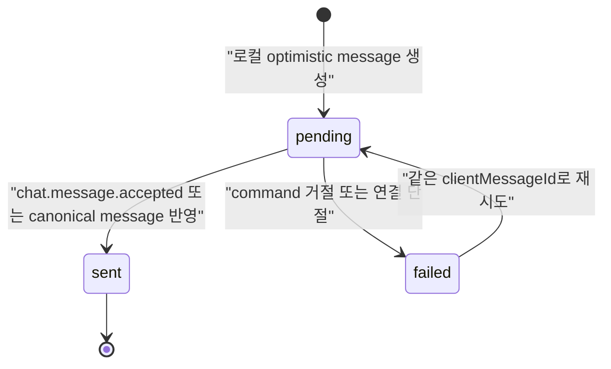
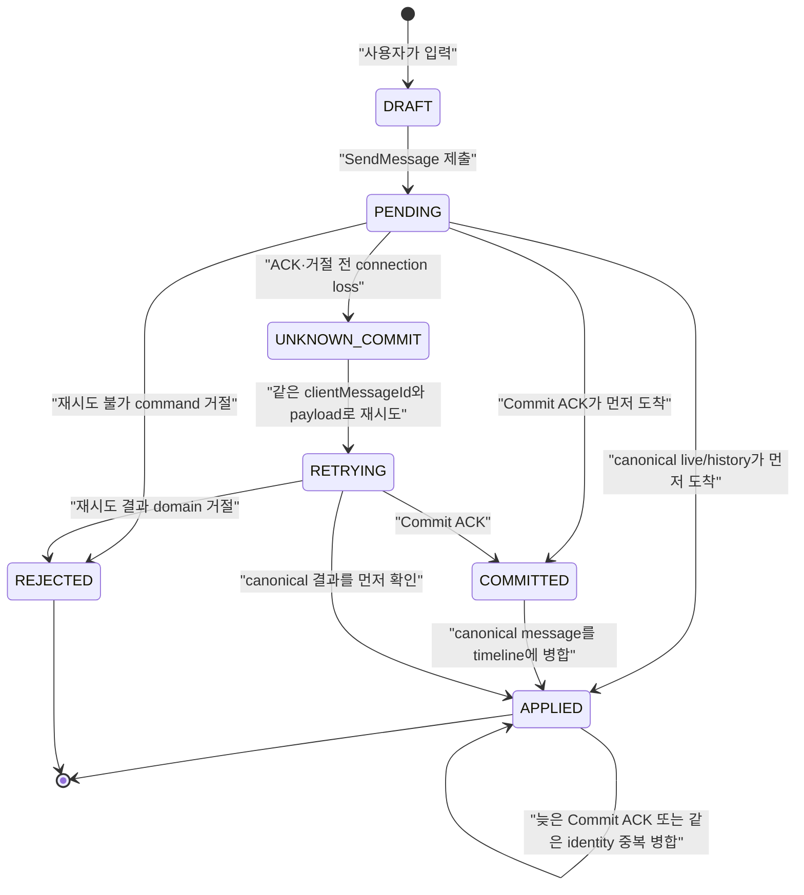
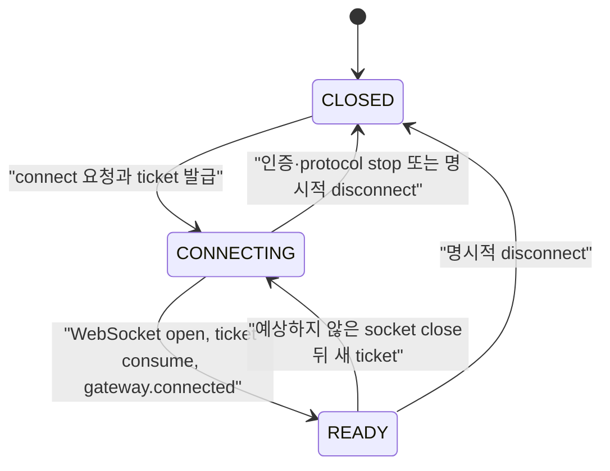
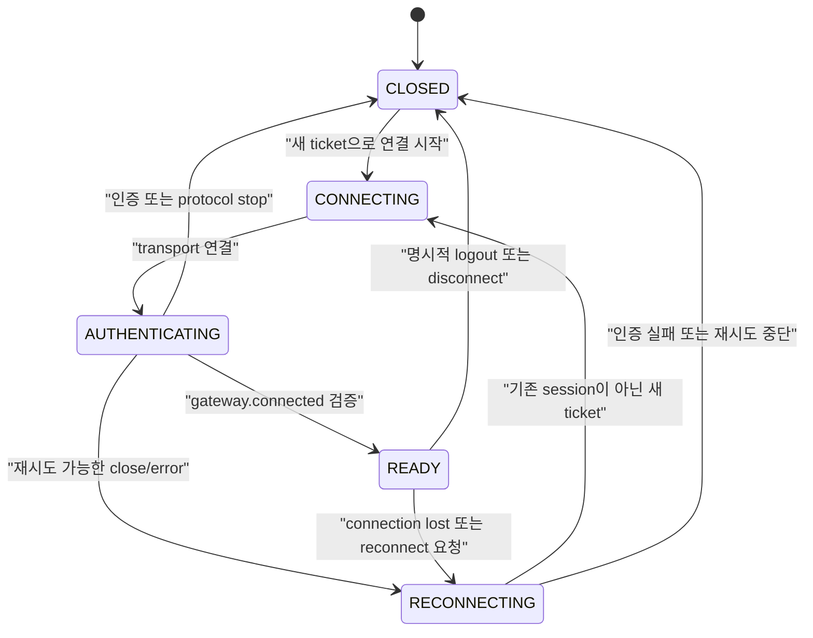
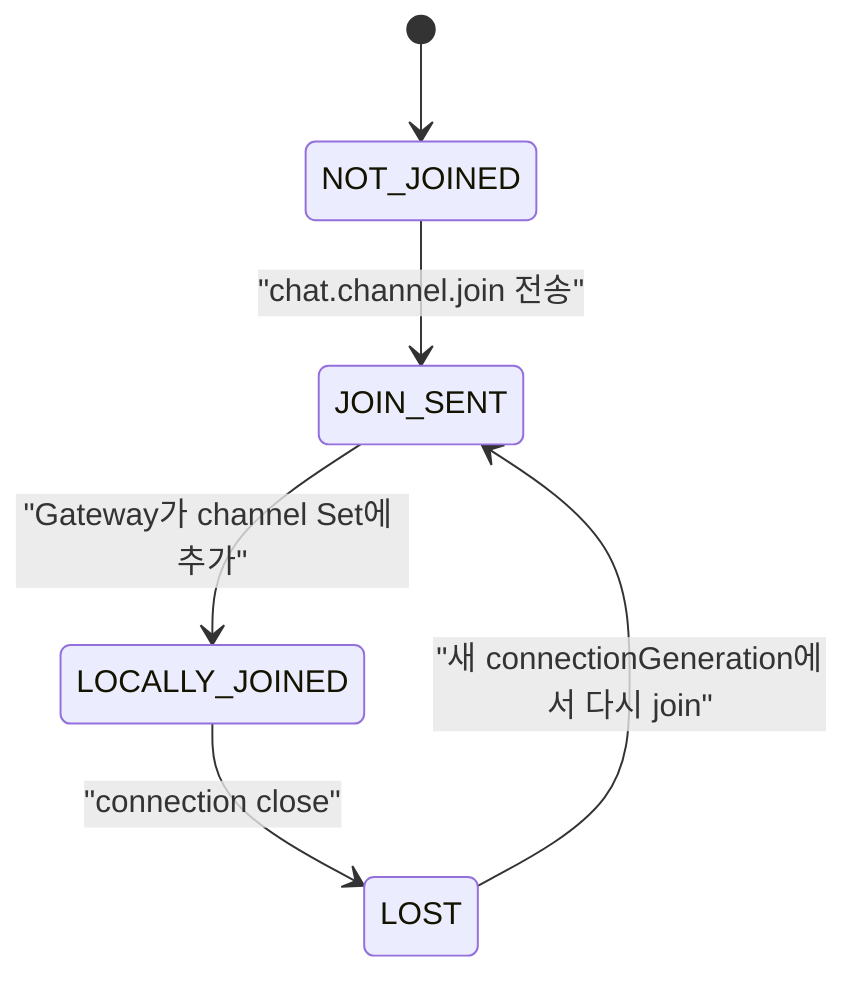
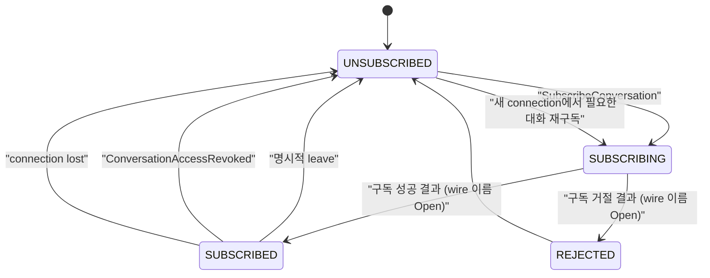
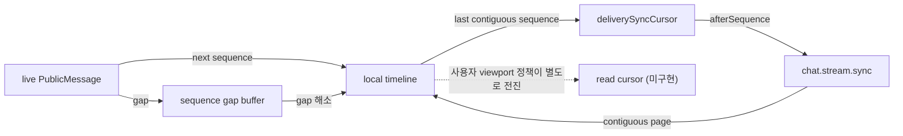

# 04. 문자 채팅 용어와 상태 머신

## 문서 목적

이 문서는 같은 단어가 연결 계층, domain, UI에서 서로 다른 뜻으로 사용되는 것을 막는다. 각 용어는
먼저 일반적인 의미를 정의하고, 이어서 wake-surfer **현행 구현**, 이미 채택한 **프로젝트 결정(`P`)**,
아직 답하지 않은 **미결정 항목**을 분리한다.

표기 규칙은 다음과 같다.

- `현행`: 현재 contracts와 runtime code로 확인한 의미
- `P`: 학습 목적에 맞게 프로젝트가 채택한 의미. 구현 완료 여부와는 별개다.
- `미결정` 또는 `탐색 후보`: 아직 채택하지 않은 의미
- `금지 해석`: 현재 값으로부터 추론하면 안 되는 의미

이 문서는 최종 기능 요구사항이나 성능 목표를 정하지 않는다.

---

## 핵심 용어

### Connection

실제 전송 채널 하나다. 이 프로젝트에서는 한 번 열린 WebSocket과 그 생명주기를 뜻한다.

- 현행:
  - ticket query를 포함한 WebSocket 하나가 connection 하나다.
  - Gateway가 인증을 마칠 때마다 새 `connectionGeneration`을 만든다.
  - connection이 닫히면 socket, local channel Set, Gateway local session도 사라진다.
- P:
  - Connection은 실제 WebSocket 하나이며 `gateway.connected`를 검증해야 Connection Ready가 된다.
  - 예상하지 않은 종료 뒤에는 기존 connection을 되살리지 않고 새 ticket으로 새 connection을 만든다.
- 미결정:
  - heartbeat 도입 여부, interval·deadline, close reason의 client 노출 계약
- 금지 해석:
  - connection이 유지된다고 인증·권한이 계속 유효하다는 뜻은 아니다.
  - 새 WebSocket connection이 이전 session을 자동 resume했다는 뜻도 아니다.

### Session

여러 connection에 걸쳐 이어질 수 있는 논리적 통신 문맥을 뜻한다. resume을 지원한다면 session은
connection보다 오래 살 수 있다.

- 현행:
  - `gateway.connected.sessionId`는 이름과 달리 **현재 connection에 묶인 Gateway local record ID**다.
  - 재접속할 때 이전 `sessionId`를 보내지 않고 새 값을 받는다.
  - server-side replay buffer나 resumable session store는 없다.
- P:
  - Gateway Session은 Connection 하나에 결합하며 재접속 때 재사용하지 않는다(`P-RS-001`).
  - 이 프로젝트의 Resume은 session 복원이 아니라 새 session에서 subscription과 delivery cursor를
    재구성하는 conversation state resume다.
- 금지 해석:
  - 현행 `sessionId`를 Discord식 resumable session ID로 보면 안 된다.

### Conversation

message가 흐르고 권한·구독·정렬 범위가 적용되는 논리적 대화 공간이다.

- 현행:
  - end-to-end 동작하는 conversation은 channel이다.
  - 공통 `MessageTarget`에는 `channel`, `dm`, `thread`가 있지만 Gateway와 API 임시 정책은
    non-channel 전송을 거절한다.
  - channel의 canonical stream ID는 `channel:{channelId}`다.
- P:
  - Conversation은 독립적인 message ordering과 recovery cursor를 갖는 범위다(`P-ORD-001`).
  - thread 메시지는 thread별 ordering을 적용하고 parent에는 reply summary를 투영한다(`SC-MSG-008`).
- 미결정:
  - DM과 thread의 canonical `streamId` 형식과 lifecycle
- 금지 해석:
  - target type이 contract에 존재한다는 사실만으로 해당 conversation 행동이 구현됐다고 보지 않는다.

### Subscription

특정 connection이 어떤 conversation의 실시간 event를 받을지 등록한 routing 상태다.

- 현행:
  - `chat.channel.join { channelId }`가 Gateway local session의 channel Set에 값을 추가한다.
  - 성공 ACK, 명시적 leave, permission 확인, durable subscription은 없다.
  - connection이 닫히면 모두 사라진다.
- P:
  - `UNSUBSCRIBED`, `SUBSCRIBING`, `SUBSCRIBED`, `REJECTED` 상태를 구분한다.
  - `conversation:view`와 `conversation:subscribe` 확인 뒤 routing을 활성화하며, reconnect 때
    재구독한다(`SC-CON-004`, `P-RS-003`).
  - 명시적 leave 또는 view 권한 회수는 해당 Conversation의 subscription을 끝낸다(`SC-CON-007`).
- 미결정:
  - 구독 성공·거절 control event의 구체적인 wire 이름과 correlation schema
- 금지 해석:
  - 현행 join 성공을 channel membership 생성이나 read 권한 승인으로 해석하지 않는다.

### Command

actor가 시스템에 어떤 상태 변화를 요청하는 의도다. 아직 발생한 사실이 아니며 거절될 수 있다.

- 현행 예:
  - `chat.message.send`
  - `chat.channel.join`의 subscription 요청
  - `chat.stream.sync`의 복구 요청
- 식별:
  - message command는 필수 `clientMessageId`와 선택적 `commandId`를 가진다.
  - 현재 web은 `commandId`를 보내지 않고 `clientMessageId`를 message correlation과 idempotency에
    사용한다.
- 금지 해석:
  - `SendMessage`를 `MessageCreated`와 같은 event로 부르지 않는다.

### Domain Event

domain에서 이미 발생한 사실을 과거형으로 표현한 값이다. 원칙적으로 사실 자체는 거절되지 않는다.

- 현행:
  - 저장된 canonical `PublicMessage`는 message가 생성됐다는 사실의 외부 value다.
  - `OutboundMessageDeliveryRequested` 타입은 존재하지만 현재 API runtime에는 publisher가 조립되지
    않았다.
  - 별도 durable domain event log나 일반 `eventId` sequence는 없다.
- P:
  - `MessageCreated`, `MessageEdited`, `MessageDeleted`, `ReadCursorAdvanced`처럼 command 결과의
    사실을 command와 분리해 명시적으로 catalog화한다(`06-core-scenarios.md`).
- 금지 해석:
  - WebSocket event name이 있다는 이유만으로 모두 domain event인 것은 아니다.

### Control Event

연결 준비, command 결과, 동기화, rate limit, protocol 오류처럼 통신 흐름을 제어하는 message다.

- 현행 예:
  - `gateway.connected`
  - `gateway.not_ready`
  - `chat.message.accepted`
  - `chat.message.rejected`
  - `chat.stream.synced`
  - `chat.stream.sync.rejected`
  - `chat.stream.sync.failed`
- P:
  - `chat.message.accepted`는 Commit ACK로 해석한다.
  - 구독 성공·거절과 Full Sync 요구는 domain fact와 분리된 control 결과로 다룬다.
- 미결정:
  - heartbeat ACK 도입 여부와 구독 control event의 구체적 wire 이름
- 금지 해석:
  - `chat.message.accepted`를 recipient delivery 사실로 보지 않는다.

### Ephemeral Event

현재 순간의 상태만 의미가 있고 일반 message history처럼 장기 저장·재생하지 않는 event다.

- 현행: typing과 presence event는 구현돼 있지 않다.
- P:
  - `TypingStarted(expiresAt)`와 `TypingStopped`는 저장·replay하지 않는 TTL 기반 ephemeral event로
    다룬다(`SC-EPH-001`, `SC-EPH-002`).
  - `PresenceChanged`도 message history·message sequence·message replay와 분리된 ephemeral 범주로
    다룬다(`SC-EPH-003`).
- 미결정:
  - presence 공개 범위·상태 집합·TTL과 별도 current-state snapshot 필요 여부
- 금지 해석:
  - ephemeral event를 message sequence 복구에 자동 포함하지 않는다.

### ACK

어떤 단계까지 처리됐는지를 확인하는 응답이다. ACK라는 이름만으로 저장·배포·소비 완료를 포괄하지
않는다.

현재 message 경로를 단계별로 나누면 다음과 같다.

| 단계 | 현행 신호 | 보장하는 것 | 보장하지 않는 것 |
| --- | --- | --- | --- |
| browser가 socket API에 write 요청 | 반환값 없음 | 현행 별도 ACK 없음 | Gateway 수신, API 처리 |
| Gateway가 frame 수신 | 별도 ACK 없음 | 없음 | API 수락, 저장 |
| API가 message 저장 결과 반환 | `chat.message.accepted` | validation·멱등성 처리 후 canonical message가 저장돼 반환됨 | 다른 connection fan-out 성공 |
| API가 command 거절 | `chat.message.rejected` | command가 accepted되지 않았음 | 연결 종료 필요 여부의 일반 규칙 |
| Gateway가 local socket으로 fan-out | `chat.message.created` | recipient connection에 send를 시도한 canonical message | recipient UI가 적용하거나 읽었음 |
| recipient가 UI에 적용 | ACK 없음 | client-local 상태 | server가 소비 사실을 알았음 |

프로젝트가 채택한 ACK 의미와 아직 정하지 않은 ACK를 다음처럼 분리한다.

| ACK | 결정 상태 | 의미 |
| --- | --- | --- |
| Transport ACK | 미결정 | Gateway가 유효한 frame을 수신했다는 별도 ACK는 현재 없으며 도입도 채택하지 않았다. |
| Command ACK | 개념 구분 | command 수락·거절 결과다. Message send에는 별도의 commit 전 수락 단계를 두지 않았다. |
| Commit ACK | `P` | 기준 상태에 반영돼 canonical 결과가 생겼다. `chat.message.accepted`의 채택된 의미다(`P-ACK-001`). |
| Delivery ACK | `P — 현재 도입하지 않음` | Commit ACK와 구분하지만 recipient 전송 완료 보장은 현재 정책에 넣지 않는다. |
| Heartbeat ACK | 미결정 | heartbeat 자체와 함께 도입 여부·deadline이 열려 있다. |

따라서 현행 `chat.message.accepted`를 recipient delivery ACK로 확장해서 해석하지 않는다.

### Cursor

정렬된 공간에서 client 또는 사용자가 마지막으로 처리한 위치다. cursor는 목적에 따라 별도 값이어야
한다.

| cursor | 소유자와 의미 | 현행 |
| --- | --- | --- |
| `deliverySyncCursor` | client가 끊김 없이 timeline에 반영한 마지막 message sequence | 있음 |
| `historyBeforeCursor` | 더 오래된 history page의 exclusive 조회 경계 | 있음 |
| `throughSequence` | 한 번의 sync 복구에서 고정하는 server watermark | 있음 |
| read cursor | 사용자가 실제로 읽었다고 확정한 마지막 위치 | 없음 |
| replay cursor | resumable session event log에서 마지막으로 적용한 event 위치 | 없음 |

`deliverySyncCursor`는 live message나 accepted message를 연속 반영하면 사용자 viewport와 무관하게
전진할 수 있다. 따라서 read cursor 또는 unread 계산에 사용하지 않는다.

현재 cursor persistence는 actor/channel key의 page-lifetime memory다. browser reload를 넘는 durable
cursor가 아니다.

Delivery sync cursor와 read cursor는 분리한다. 전자는 Client storage profile+Conversation의 복구
진행 상태이고, 후자는 사용자가 실제로 읽은 위치를 나타내는 domain state다. Background delivery만으로
read cursor를 전진시키지 않는다.

### Sequence

같은 ordering scope 안에서 상대적 순서를 표현하는 정수다.

- 현행:
  - `PublicMessage.sequence`는 `streamId` 안에서 1부터 증가한다.
  - 정렬 key는 `(streamId, sequence)`다.
  - 다른 stream의 같은 sequence는 서로 비교하지 않는다.
  - page 안의 message sequence는 연속 오름차순이어야 한다.
- 없음:
  - 모든 WebSocket event에 적용되는 connection-global sequence
  - 모든 domain event에 적용되는 global sequence
  - edit/delete/reaction까지 포함하는 conversation event sequence
- 금지 해석:
  - message sequence를 전체 서비스 event 순서로 확장하지 않는다.

### Replay

server가 resumable session 또는 event log에 보존한 누락 event를 원래 순서에 따라 다시 전달하는
행동이다.

- 현행:
  - server session replay는 없다.
  - `sync-after`는 RDB에 저장된 channel message를 조회해 빠진 message를 보충한다.
- P:
  - transport session과 server replay buffer를 복원하는 방식은 채택하지 않는다.
  - Resume은 새 Gateway Session에서 subscription을 복원하고 delivery cursor 이후 message를
    catch-up하는 방식이다(`P-RS-001`, `P-RS-003`).
- 미결정:
  - edit/delete/reaction까지 복구할 때 conversation event log를 둘지 authoritative state를 다시
    조회할지
- 금지 해석:
  - 현재 `sync-after`를 session resume 또는 모든 event의 replay라고 부르지 않는다.

### Full Sync

증분 cursor를 신뢰할 수 없을 때 현재 기준 상태를 권위 있는 source에서 다시 구성하는 행동이다.

- 현행:
  - 최초 `latest` 조회는 최근 최대 5개와 head watermark만 가져오므로 전체 conversation의 full sync가
    아니다.
  - `invalid_cursor` 이후 자동 full sync 정책은 없다.
- P:
  - `invalid_cursor`이면 같은 cursor를 반복하지 않고 해당 Conversation만 `FULL_SYNC_REQUIRED`로
    전환한다.
  - local recovery cursor를 무효화하고 authoritative latest baseline으로 새
    `deliverySyncCursor`를 세운 뒤 buffered event를 병합한다(`P-SYNC-001`~`P-SYNC-003`).
  - Full Sync는 전체 history archive 다운로드가 아니며 older pagination은 별도다.
- 미결정:
  - message 이외의 edit/delete/reaction projection이 생긴 뒤 authoritative baseline에 포함할 범위
- 금지 해석:
  - UI가 다시 loading됐다는 이유만으로 full sync가 수행됐다고 보지 않는다.

### Idempotency

같은 의도를 여러 번 처리해도 기준 상태 변화가 한 번만 일어나도록 하는 성질이다.

- 현행:
  - message key는 `(senderActorId, streamId, clientMessageId)`다.
  - 같은 key의 retry는 기존 `messageId`와 sequence를 반환한다.
  - 저장 exactly-once와 wire delivery exactly-once는 다르다. duplicate retry가 local
    `chat.message.created`를 다시 만들 수 있고 client가 identity로 제거한다.
- P:
  - message retry는 `(actorId, streamId, clientMessageId)`를 기준으로 같은 ID와 같은 payload를
    유지한다(`P-IDEM-001`, `P-IDEM-002`).
  - duplicate live message는 `messageId`와 stream `sequence` identity가 모두 같을 때만 한 번 적용한다
    (`P-IDEM-003`).
  - reaction은 actor+message+emoji 자연 key로 수렴시킨다(`SC-MSG-009`).
- 미결정:
  - edit·delete command와 read cursor update의 별도 idempotency key
- 금지 해석:
  - idempotent storage를 event 중복 부재나 recipient exactly-once 처리로 해석하지 않는다.

---

## 관련 식별자

| 식별자 | 현재 scope | 안정성 | 다른 값으로 해석하면 안 되는 것 |
| --- | --- | --- | --- |
| `actorId` | 인증된 application principal | ticket과 trusted header 경계에서 확정 | client body의 `userId` |
| `sessionId` | 한 Gateway connection의 local record | reconnect 시 변경 | resumable session |
| `connectionGeneration` | stale connection/response를 구분하는 opaque 값 | reconnect 시 변경 | message sequence |
| `gatewayId` | ticket이 할당되고 connection을 처리한 Gateway identity | deployment 설정 | actor 또는 session |
| `channelId` | channel target와 local subscription routing key | domain identity | canonical `streamId` 전체 |
| `streamId` | `channel:{channelId}` 형태의 ordering scope | message lifetime | client가 임의로 보내는 routing key |
| `clientMessageId` | actor가 만든 message command idempotency ID | retry 동안 유지 | server `messageId` |
| `commandId` | 선택적 command correlation | 현재 web 미사용 | message idempotency의 유일 기준 |
| `requestId` | HTTP/WS sync 요청·응답 correlation | 한 요청 동안 유지 | replay cursor |
| `messageId` | 저장된 canonical message identity | 전역 고유 | command identity |
| `eventId` | optional outbound delivery request 타입에만 존재 | 현재 runtime 미연결 | 모든 WS frame에 있는 공통 ID |

`userId`와 `actorId`의 관계는 현재 문서에서 동의어로 가정하지 않는다. 외부 인증·사용자 context가
추가될 때 mapping 규칙을 별도로 정의한다.

---

## 메시지 상태 머신

### 현행 client 상태

현재 web model은 세 상태만 저장한다.

현행 해석:

- `pending`: server commit 결과를 아직 timeline에 반영하지 못했다.
- `sent`: canonical `PublicMessage`를 timeline에 반영했다.
- `failed`: 현재 시도는 성공을 확인하지 못했다. DB에 저장되지 않았다는 보장은 없다.
- lost ACK 복구에서는 자기 message의 `senderActorId`, `sentAtClient`, text를 비교해 optimistic
  message를 제거한다. history item에는 `clientMessageId`가 없다.

### P 결정 상태

채택한 목표 상태는 사용자 편의 label과 protocol 의미를 분리한다. Commit ACK와 canonical live event의
도착 순서는 보장하지 않으므로 둘 중 어느 쪽이 먼저 와도 같은 identity로 수렴한다(`P-ORD-004`).

| P 상태 | 의미 | recipient delivery 의미 |
| --- | --- | --- |
| `DRAFT` | client-local 입력 | 없음 |
| `PENDING` | command 결과 미확정 | 없음 |
| `COMMITTED` | Commit ACK로 저장 또는 기존 멱등 결과를 확인했으나 local 적용은 아직 끝나지 않음 | 없음 |
| `APPLIED` | canonical message를 local timeline에 병합 | 다른 recipient 전달을 보장하지 않음 |
| `UNKNOWN_COMMIT` | ACK·거절 전에 연결을 잃어 저장 여부를 모름 | 없음 |
| `RETRYING` | 같은 idempotency ID로 재시도 중 | 없음 |
| `REJECTED` | 명시적인 terminal domain/validation 거절 | 해당 command는 commit되지 않음 |

UI가 계속 `sent`라는 label을 사용한다면 `APPLIED`의 표시 이름으로만 사용한다. “모든 recipient에게
전달됨”을 뜻하게 하지 않는다. delivery 상태가 필요하면 message command 상태와 별도의 delivery
projection으로 모델링한다.

---

## 연결 상태 머신

### 현행 client 상태

client connection model이 저장하는 상태는 `closed | connecting | ready`다. `ready`는
`gateway.connected`를 검증한 Connection Ready이며, Conversation recovery 완료 상태는 별도 model에
있다.

현행에는 `RESUMING`과 `REPLAYING`이 없다. reconnect는 새 connection을 만들며, stream recovery
model은 별도로 DB message sync를 수행한다. `recovery_pending`, `retryable_failure`,
`protocol_failure`는 Connection enum이 아니라 Conversation/UI 복구 분류다.

### P 결정 상태

이 상태 머신은 `P-RS-001`~`P-RS-003`을 반영한다.

- 이전 `sessionId`와 `connectionGeneration`을 복원하지 않는다.
- `READY`는 Connection Ready만 뜻하며 Conversation별 sync 완료를 뜻하지 않는다.
- Conversation recovery의 `CATCHING_UP`, `FULL_SYNC_REQUIRED`, `LIVE`는 connection 상태와 별도다.

미결정 항목은 heartbeat 도입 여부·timeout과 구체적인 reconnect delay 값이다.

---

## 구독 상태 머신

### 현행 설명 상태

현행 client/Gateway에는 구독 상태 enum과 ACK가 없다. 다음 diagram은 관찰 가능한 호출과 local Set을
설명하기 위한 모델이다.

`LOCALLY_JOINED`는 권한 승인 상태가 아니다. 명시적인 leave 전이도 없다.

### P 결정 상태

채택된 의미에서 구독 성공 결과는 view·subscribe capability 판정과 현재 connection의 routing 활성화를
확정한다. 다만 구체적인 wire event 이름과 schema는 미결정이며, 정할 때 다음을 명시해야 한다.

- 어떤 connection generation의 요청인지
- 어떤 conversation을 대상으로 하는지
- routing 등록과 read 권한 확인 중 어디까지 완료됐는지
- 중복 subscribe가 no-op인지 기존 결과 재반환인지
- 권한 회수 시 client가 history를 유지할 수 있는지

---

## cursor와 복구 상태 관계

핵심 규칙:

- timeline 적용은 delivery cursor를 전진시킬 수 있지만 read cursor를 자동 전진시키지 않는다.
- `throughSequence`는 한 recovery run의 snapshot watermark이며 저장 message의 영구 head가 아니다.
- `historyBeforeCursor`는 과거 pagination용이므로 live delivery cursor와 비교 목적이 다르다.
- cursor가 server head보다 앞선 경우는 조용히 되감지 않고 `invalid_cursor` 또는 full sync 판단으로
  보낸다.

---

## 현재 결정되지 않은 의미

후속 시나리오와 정책 문서에서 다음 질문에 명시적인 답이 필요하다.

1. `actorId`와 외부 user identity는 1:1인가, 별도 principal mapping인가?
2. Message 이외의 domain event 복구에 conversation event log가 필요한가, authoritative state
   재조회로 충분한가?
3. 채택된 구독 성공 의미를 어떤 wire event 이름, request correlation, generation 필드로 표현할 것인가?
4. Message send에서 Commit ACK 전에 별도의 Command ACK 단계를 둘 필요가 있는가?
5. delivery 상태를 사용자에게 보일 필요가 있는가? 있다면 recipient 범위를 어떻게 정의하는가?
6. edit/delete/reaction이 추가될 때 message sequence로 충분한가, conversation event sequence가 필요한가?
7. 어떤 cursor를 browser reload 이후에도 저장하며, actor 전환과 logout 때 언제 지우는가?
8. Full Sync baseline에 edit/delete/reaction projection을 어떤 형태로 포함할 것인가?
9. Presence를 도입한다면 reconnect 뒤 현재 상태 snapshot을 제공할 것인가?

## 공식 참고 자료의 적용 범위

- [Discord Gateway](https://docs.discord.com/developers/events/gateway)는 heartbeat, dispatch sequence,
  reconnect와 session resume를 설명하는 공식 개발자 문서다. 이 프로젝트의 목표 상태를 탐색하는
  참고 자료이며 wake-surfer의 현행 구현 설명이 아니다.
- [Slack Developer Docs — Using Socket Mode](https://docs.slack.dev/apis/events-api/using-socket-mode/)는
  Slack 앱이 Events API payload를 WebSocket으로 받고 `envelope_id`로 ACK하며 연결 종료·갱신을
  처리하는 방식의 참고 자료다. Slack 자체 client의 내부 protocol로 간주하지 않는다.
