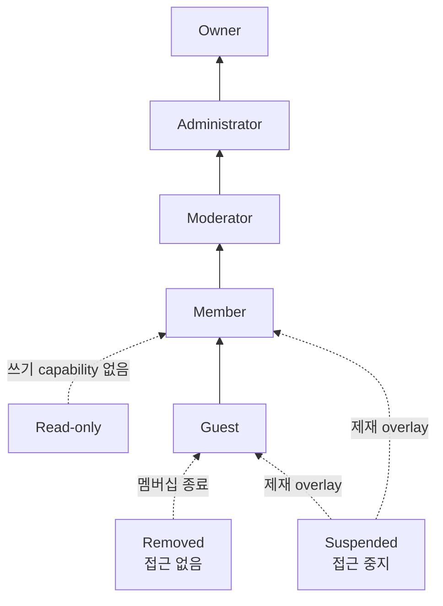
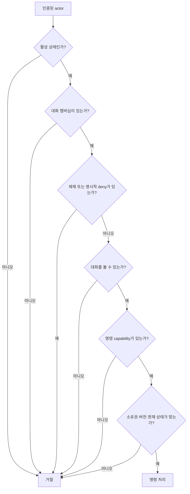

# 05. Actor·역할·권한 모델

## 목적과 지위

이 문서는 문자 채팅 행동을 capability 단위로 정규화한 선행 정책이다. 역할 자체의 생성·수정은 외부
Role/Membership 컨텍스트가 소유한다. Chat 컨텍스트는 연결, 구독, 조회, 메시지 명령을 처리할 때 외부
판정 결과를 집행한다.

아래 `P`는 프로젝트 결정이며 최종 제품 요구사항이 아니다. `현행`은 2026-07-28 코드 기준이다.

## Actor

| Actor | 설명 | 신뢰 근거 | Chat에서 하는 행동 |
| --- | --- | --- | --- |
| Human Member | 일반 사용자 | 검증된 Auth principal | 연결, 구독, 조회, 메시지·반응·읽음 명령 |
| Moderator | 대화 관리 capability를 받은 사용자 | Role/Membership 결과 | 일반 행동 + 다른 사용자의 메시지 삭제 |
| Administrator | Workspace 범위 관리 capability를 받은 사용자 | Role 결과 | 접근 가능한 전체 대화의 관리 행동 |
| Owner | Workspace 최상위 역할 | Role 결과 | Administrator baseline + 외부 역할 관리 |
| Guest | 제한된 대화 멤버 | Membership 결과 | 명시적으로 허용된 대화만 조회·전송 |
| Read-only Member | 쓰기가 제한된 멤버 | Role/Sanction 결과 | 조회·구독·읽음만 |
| Suspended Member | 일시 정지된 principal | Sanction 결과 | 새 연결·명령 불가 |
| Removed Member | 멤버십이 종료된 principal | Membership 결과 | Workspace 대화 접근 불가 |
| Gateway Service | 내부 relay 주체 | service credential + gateway identity | actor가 인증된 명령을 API로 전달 |
| System Actor | 외부 컨텍스트 사실을 채팅에 반영하는 주체 | service identity | 명시된 system message만 생성 |

`actorId`는 메시지를 수행한 주체의 불투명 식별자다. 현재 사용자와 같을 수 있지만 클라이언트가 보내는
`userId`를 그대로 신뢰하지 않는다. Gateway Service가 전달한 asserted actor도 service 인증과 ticket
소비 결과에 연결되어야 한다.

## 역할 계층

역할 이름은 capability 묶음의 편의 표현이다. 상위 역할이 하위 역할의 모든 행동을 무조건 우회한다는
뜻은 아니다. 명시적 대화 거부와 제재는 역할 baseline보다 우선한다.

`Suspended`와 `Removed`는 단순한 하위 역할이 아니라 모든 허용을 덮는 상태 overlay다.

## Capability

| Capability | 의미 | 추가 조건 |
| --- | --- | --- |
| `conversation:view` | 대화의 현재 상태를 볼 수 있음 | 활성 멤버십 |
| `conversation:subscribe` | 실시간 stream을 구독할 수 있음 | `conversation:view` 필요 |
| `history:read` | 과거 메시지 page를 읽을 수 있음 | `conversation:view`와 별도 회수 가능 |
| `message:create` | 새 메시지 생성 | 대화가 writable 상태 |
| `message:edit_own` | 자신의 미삭제 메시지 수정 | 소유권·버전 일치 |
| `message:delete_own` | 자신의 미삭제 메시지 삭제 | 소유권·현재 상태 |
| `message:delete_any` | 다른 actor의 미삭제 메시지 삭제 | 관리 범위 안의 대화 |
| `reaction:add` | 허용된 reaction 추가 | 대상 메시지 조회 가능 |
| `reaction:remove_own` | 자신이 추가한 reaction 제거 | reaction 소유권 |
| `reaction:remove_any` | 다른 actor의 reaction 제거 | 관리 범위 |
| `thread:create` | 메시지에서 thread 생성 | 원본 메시지 조회 가능 |
| `thread:reply` | thread에 메시지 작성 | thread 접근 + 쓰기 가능 |
| `mention:user` | 접근 가능한 사용자를 멘션 | 대상 공개 범위 |
| `mention:broadcast` | 대화 전체에 broadcast 멘션 | 별도 관리 capability |
| `read_cursor:update` | 자신의 읽음 위치 전진 | 대화 조회 가능 |
| `typing:publish` | 자신의 입력 상태 발행 | subscribe + create 가능 |

## 역할–capability baseline

기호는 `✓` 허용, `범위`는 할당된 대화에서만 허용, `—`는 baseline에 없음을 뜻한다. 실제 판정에는
멤버십, 대화별 override, 제재와 리소스 조건을 추가한다.

| Capability | Owner | Admin | Moderator | Member | Guest | Read-only | Suspended/Removed |
| --- | --- | --- | --- | --- | --- | --- | --- |
| `conversation:view` | ✓ | ✓ | 범위 | 범위 | 명시 범위 | 범위 | — |
| `conversation:subscribe` | ✓ | ✓ | 범위 | 범위 | 명시 범위 | 범위 | — |
| `history:read` | ✓ | ✓ | 범위 | 범위 | 명시 범위 | 범위 | — |
| `message:create` | ✓ | ✓ | 범위 | 범위 | 명시 범위 | — | — |
| `message:edit_own` | ✓ | ✓ | 범위 | 범위 | 명시 범위 | — | — |
| `message:delete_own` | ✓ | ✓ | 범위 | 범위 | 명시 범위 | — | — |
| `message:delete_any` | ✓ | ✓ | 범위 | — | — | — | — |
| `reaction:add/remove_own` | ✓ | ✓ | 범위 | 범위 | 명시 범위 | — | — |
| `reaction:remove_any` | ✓ | ✓ | 범위 | — | — | — | — |
| `thread:create/reply` | ✓ | ✓ | 범위 | 범위 | 명시 범위 | — | — |
| `mention:user` | ✓ | ✓ | 범위 | 범위 | 명시 범위 | — | — |
| `mention:broadcast` | ✓ | ✓ | 범위 | — | — | — | — |
| `read_cursor:update` | ✓ | ✓ | 범위 | 범위 | 명시 범위 | 범위 | — |
| `typing:publish` | ✓ | ✓ | 범위 | 범위 | 명시 범위 | — | — |

### 역할 행동 결정

- `P`: Moderator는 다른 actor의 메시지를 삭제할 수 있지만 수정할 수는 없다. 타인 명의 내용을 바꾸는
  대신 삭제 사실과 수행 actor를 감사 가능한 사실로 남긴다.
- `P`: 자기 메시지는 삭제되지 않았고 대화가 잠기지 않은 동안 수정·삭제할 수 있다. 별도의 시간 제한은
  이 학습 범위에서 두지 않는다.
- `P`: `conversation:view`와 `history:read`를 분리한다. 현재 실시간 상태는 보되 과거 기록 접근은 제한할
  수 있다.
- `P`: DM은 participant 멤버십이 역할 baseline을 대체한다. participant만 view/subscribe/history/create를
  얻으며 Workspace Moderator가 자동으로 DM 내용을 읽지는 않는다.

## 판정 우선순위

세부 우선순위는 다음 `P` 결정으로 고정한다.

1. `Removed`와 `Suspended` 같은 actor 상태 거부
2. 대화 멤버십 부재
3. 대화별 명시적 deny
4. 대화별 명시적 allow
5. Workspace 역할 baseline
6. 명령별 리소스 조건(소유권, 삭제 여부, version)

명시적 deny는 Owner에게도 적용된다. Owner는 외부 Role/Channel 컨텍스트에서 정책을 변경할 수 있지만,
현재 명령 안에서 거부를 우회하지 않는다.

## 명령별 확인 지점

| 명령 | 필요한 capability | 확인 시점 | 리소스 확인 | 권한 변경 뒤 처리 |
| --- | --- | --- | --- | --- |
| `AuthenticateConnection` | 활성 principal | ticket 발급과 소비 | token/session 상태 | 인증 무효면 연결 종료 |
| `SubscribeConversation` | `conversation:view`, `conversation:subscribe` | 구독 등록 직전 | 대화 존재·멤버십 | view 회수 시 즉시 구독 제거 |
| `UnsubscribeConversation` | 본인 connection의 subscription | routing 제거 직전 | 현재 구독 identity | 권한 회수 여부와 무관하게 해제 가능 |
| `LoadLatest/Older` | `conversation:view`, `history:read` | 매 Query | cursor·대화 상태 | 일반적으로 `stream_unavailable` |
| `SendMessage` | `conversation:view`, `message:create` | 저장 transaction 전 | target writable | 쓰기만 회수되면 구독 유지, 명령 거절 |
| `EditMessage` | `message:edit_own` | 변경 transaction 전 | 소유권·version·미삭제 | 충돌 또는 권한 거절 |
| `DeleteMessage` | own 또는 any delete | 변경 transaction 전 | 소유권·미삭제 | 충돌 또는 권한 거절 |
| `Add/RemoveReaction` | reaction capability | 변경 transaction 전 | 메시지 조회·reaction 소유권 | 명령 거절 |
| `StartTyping` | `typing:publish` | event 수신 시 | 활성 구독 | 즉시 중단 event 또는 TTL 만료 |
| `AdvanceReadCursor` | `read_cursor:update` | 매 update | 현재/이전 cursor | view 회수 시 update 거절 |
| `RestoreSubscription/CatchUp` | `conversation:view`, `history:read` | 각 새 session의 구독·stream sync | delivery cursor 범위 | 회수 stream은 replay하지 않음 |

## 멱등 재시도와 권한

현행 message send는 기존 `(senderActorId, streamId, clientMessageId)`를 권한 확인보다 먼저 반환한다. 같은
키의 payload가 다른지도 비교하지 않는다.

프로젝트 결정은 다음과 같다.

1. 재시도 actor를 다시 인증한다.
2. 최소한 현재 `conversation:view`를 확인한다. 조회 권한이 회수됐으면 기존 결과도 노출하지 않는다.
3. 같은 멱등 키가 이미 commit됐다면 원래 payload fingerprint와 비교한다.
4. fingerprint가 같으면 새로운 mutation이 아니므로 `message:create`가 회수됐더라도 기존 성공 결과를
   반환할 수 있다.
5. fingerprint가 다르면 `idempotency_conflict`로 거절한다.
6. 키가 없으면 현재 `message:create`를 확인한 뒤 새 mutation을 수행한다.

이는 ACK 유실 재시도를 안전하게 만드는 정책이며, 새 명령의 권한 우회 수단이 아니다.

## 접속 중 권한 변경

| 변경 | 기존 연결 | 기존 구독 | 이후 명령 | 제어/도메인 사실 |
| --- | --- | --- | --- | --- |
| 쓰기 권한 회수 | 유지 | 읽기 가능하면 유지 | write 명령 거절 | `ConversationPermissionChanged` 또는 다음 명령 거절 |
| history 권한 회수 | 유지 | live 구독은 유지 가능 | history/sync 거절 | catch-up 불가 상태 표시 |
| view 권한 회수 | 유지 가능 | 해당 대화 즉시 제거 | 대화 명령 전체 거절 | `ConversationAccessRevoked` |
| Read-only 전환 | 유지 | 유지 | mutation 거절 | 권한 projection 갱신 |
| Suspended | 종료 | 모두 제거 | 전체 거절 | `MemberSuspended`, connection close |
| Removed | 종료 | 모두 제거 | 전체 거절 | 접근 정보 최소화 후 close |
| DM participant 제거 | 유지 가능 | 해당 DM 제거 | DM 명령 거절 | `ConversationAccessRevoked` |

접근 회수 event에는 사용자가 더 이상 볼 수 없는 대화의 민감한 metadata를 싣지 않는다.

## Gateway 캐시 원칙

- Gateway의 `channels` Set은 fan-out 후보이며 authorization cache가 아니다.
- Gateway가 capability snapshot을 캐시하더라도 API 명령 판정을 대체하지 않는다.
- 접근 회수 event를 받으면 Gateway는 로컬 구독을 즉시 제거한다.
- 회수 event가 유실돼도 API가 이후 명령과 sync를 다시 거절해야 한다.
- stale cache 때문에 허용한 subscription은 기준 상태 조회 전까지 데이터를 보내지 않는다.

## 현행과 gap

| 항목 | 현행 | 목표 정책과의 차이 |
| --- | --- | --- |
| Actor 인증 | 개발용 trusted actor header, ticket consume actor | 실제 Auth principal 연결 미결정 |
| Gateway service | Bearer token + configured gateway ID | 서버 전용 secret·회전 절차는 P, 자동 교체는 미구현, 교체 주기·최종 service identity provider는 미결정 |
| Channel read | 모든 인증 actor 허용 | membership/role provider 미연결 |
| Channel write | 모든 인증 actor 허용 | capability provider 미연결 |
| DM/thread write | API와 Gateway에서 거절 | participant 정책 미구현 |
| Subscribe | nonblank channel ID를 local Set에 추가 | 존재·view·subscribe 판정과 ACK 없음 |
| 권한 회수 | 처리 없음 | 구독 제거·연결 종료·event 미구현 |
| 멱등 재시도 | 기존 결과를 권한보다 먼저 반환 | view 재검증·fingerprint 충돌 검사가 없음 |

## 완료 기준

- 모든 핵심 시나리오에 필요한 capability가 있다.
- 역할 baseline, 대화 override, 제재, 리소스 조건의 우선순위를 설명할 수 있다.
- Moderator의 타인 메시지 정책과 DM 권한을 설명할 수 있다.
- 권한 확인 시점과 접속 중 권한 회수 행동이 정해져 있다.
- 현재 임시 전면 허용 정책을 실제 권한 모델로 오해하지 않는다.
