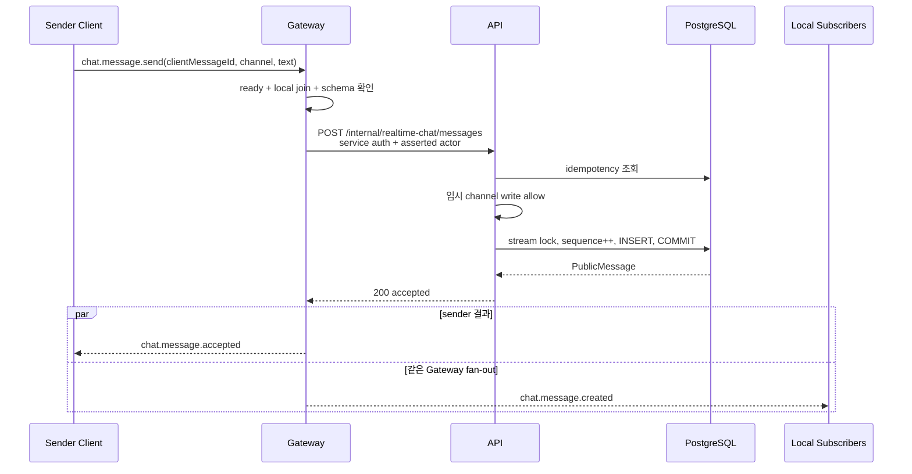
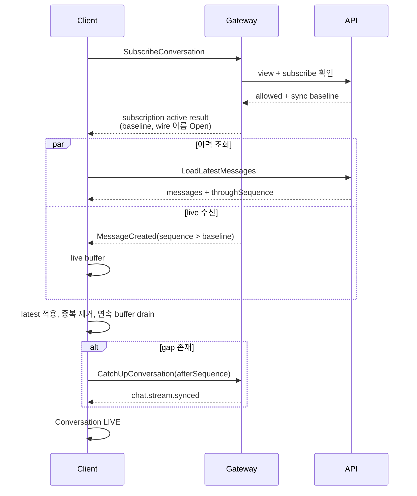

# 06. 핵심 사용자 시나리오

## 읽는 법

시나리오는 구현 방법이 아니라 사용자 행동과 네 경계의 상태 변화를 기록한다.

- `Client`: 사용자가 보는 상태와 로컬 모델
- `Gateway`: 연결·구독·wire 처리
- `API`: 권한·기준 상태·저장
- `Other`: 다른 구독 Client

`현행`은 현재 코드로 end-to-end 동작하고, `부분`은 일부 경로만 있으며, `미구현`은 선행 정책만 있다는
뜻이다. 외부 행동 근거는 `O/D/I/P`, 현재 코드 상태는 별도 열에 둔다.

## 공통 사전조건

| 코드 | 조건 |
| --- | --- |
| PC-ACTIVE | actor가 인증됐고 suspended/removed 상태가 아니다. |
| PC-READY | 인증된 WebSocket이 `READY`다. |
| PC-VIEW | actor가 대화를 볼 수 있다. |
| PC-SUB | 현재 connection이 대화를 구독한다. |
| PC-WRITE | actor가 `message:create`를 가진다. |
| PC-HISTORY | actor가 `history:read`를 가진다. |

## 연결과 초기화

### SC-CON-001 — 유효한 ticket으로 WebSocket 연결

| 필드 | 내용 |
| --- | --- |
| 주/보조 actor | Human Member / API, Gateway |
| 사전·시작 상태 | PC-ACTIVE, Client `IDLE` |
| 사용자 행동 | 채팅 화면을 열거나 재연결을 시작한다. |
| Client 변화 | `IDLE → CONNECTING → AUTHENTICATING` |
| Gateway 처리 | Origin/path를 검사하고 query ticket을 API consume endpoint로 전달한다. |
| API 처리 | P에서는 verified Auth actor에게 일회성 ticket을 발급한다. 현행 개발 경로는 nonblank trusted actor header를 사용하며, 할당 Gateway가 미사용·미만료 ticket을 원자 소비한다. |
| 사실·제어 | `GatewayTicketIssued`(논리 사실), `gateway.connected`는 SC-CON-002에서 전송 |
| 종료 상태 | ticket 소비 성공, 연결은 인증 완료 직전 |
| 권한·실패 | 활성 principal / FS-CON-001, 002 |
| 근거·구현 | `P`, 부분. ticket 발급·소비는 현행이나 verified Auth principal 연결은 미구현 |

### SC-CON-002 — 연결 인증 완료 후 READY

| 필드 | 내용 |
| --- | --- |
| 주/보조 actor | Human Member / Gateway |
| 사전·시작 상태 | SC-CON-001 성공, Gateway session `authenticating` |
| 사용자 행동 | 별도 행동 없음. 연결 완료를 기다린다. |
| Client 변화 | `AUTHENTICATING → READY` |
| Gateway 처리 | ticket actor로 새 `sessionId`와 `connectionGeneration`을 만들고 `gateway.connected` 전송 후 ready로 전환한다. |
| API 처리 | 추가 처리 없음 |
| 사실·제어 | `gateway.connected(protocolVersion, gatewayId, sessionId, connectionGeneration)` |
| 다른 Client | 변화 없음 |
| 종료 상태 | application event 전송 가능 |
| 권한·실패 | 활성 principal / FS-CON-003~005, 007, 008 |
| 근거·구현 | ticket actor 기반 ready는 `현행`. verified Auth principal 연결은 `P`이지만 미구현이며, heartbeat 도입 여부는 `미결정(Open)` |

### SC-CON-003 — 접근 가능한 대화 상태 조회

| 필드 | 내용 |
| --- | --- |
| 주/보조 actor | Human Member / Membership·Channel |
| 사전·시작 상태 | PC-ACTIVE |
| 사용자 행동 | 대화 목록을 연다. |
| Client 변화 | 목록 loading → ready |
| Gateway 처리 | 없음 또는 목록 갱신 event relay |
| API 처리 | 외부 컨텍스트 결과로 actor가 볼 수 있는 대화와 capability projection을 조립한다. |
| 사실·제어 | Query 결과이며 domain event를 만들지 않는다. |
| 종료 상태 | Client가 구독 후보와 권한 snapshot을 가짐 |
| 권한·실패 | `conversation:view` / FS-SUB-002 |
| 근거·구현 | `P`, 미구현 |

### SC-CON-004 — 특정 대화 구독

| 필드 | 내용 |
| --- | --- |
| 주/보조 actor | Human Member / Gateway, API |
| 사전·시작 상태 | PC-READY, PC-VIEW |
| 사용자 행동 | channel/DM/thread를 연다. |
| Client 변화 | `UNSUBSCRIBED → SUBSCRIBING → SUBSCRIBED` |
| Gateway 처리 | subscribe frame 검증 후 API에 view/subscribe 판정을 요청하고 성공한 stream을 로컬 라우팅 집합에 넣는다. |
| API 처리 | 대화 존재, 멤버십, capability를 확인한다. |
| 사실·제어 | 개념적인 구독 성공 또는 거절 결과. 구체 wire 이름은 미결정 |
| 종료 상태 | 해당 stream live event 수신 가능 |
| 권한·실패 | `conversation:view`, `conversation:subscribe` / FS-SUB-001~005 |
| 근거·구현 | `P`, 부분. 현행 `chat.channel.join`은 로컬 Set 추가만 하고 ACK·권한 확인이 없음 |

### SC-CON-005 — 초기 이력과 live event 결합

| 필드 | 내용 |
| --- | --- |
| 주/보조 actor | Human Member / Gateway, API |
| 사전·시작 상태 | PC-READY, PC-VIEW, PC-HISTORY |
| 사용자 행동 | 대화를 처음 연다. |
| Client 변화 | Conversation `INITIALIZING`; latest page 적용 중 live event를 buffer한 뒤 cursor 순서로 병합 |
| Gateway 처리 | 구독 event relay, `chat.stream.sync` 결과 relay |
| API 처리 | latest의 `throughSequence`와 sync-after의 고정 watermark를 반환한다. |
| 사실·제어 | `chat.stream.synced`; live `MessageCreated` |
| 종료 상태 | 연속 cursor까지 적용하고 Conversation `LIVE` |
| 권한·실패 | view, subscribe, history / FS-SYNC-001~006, FS-MSG-007~009 |
| 근거·구현 | `P`, 부분. cursor·buffer·dedupe는 현행이나 subscribe ACK와 원자 기준점은 없음 |

### SC-CON-006 — 정상 종료

| 필드 | 내용 |
| --- | --- |
| 주/보조 actor | Human Member / Gateway |
| 사전·시작 상태 | 연결이 열려 있음 |
| 사용자 행동 | 로그아웃, 화면 종료 또는 명시적 disconnect |
| Client 변화 | `READY → CLOSING → CLOSED`; pending 명령을 취소 또는 실패 표시 |
| Gateway 처리 | 로컬 session·구독 제거, 진행 중 sync 취소 |
| API 처리 | 로그아웃이면 Auth session 무효화; 단순 tab 종료면 없음 |
| 사실·제어 | `CloseConnection`; 정상 close |
| 종료 상태 | 해당 connection만 종료 |
| 권한·실패 | 본인 연결 / FS-CON-003, 006, 007 |
| 근거·구현 | `P`, 부분. socket close 정리는 현행, logout 범위 정책은 미구현 |

### SC-CON-007 — 특정 대화 구독 해제

| 필드 | 내용 |
| --- | --- |
| 주/보조 actor | Human Member / Gateway |
| 사전·시작 상태 | PC-READY, PC-SUB |
| 사용자 행동 | 대화 화면을 닫거나 더 이상 live event를 받지 않도록 나간다. |
| Client 변화 | `SUBSCRIBED → UNSUBSCRIBING → UNSUBSCRIBED` |
| Gateway 처리 | 현재 connection의 Conversation routing 집합에서 해당 구독을 제거한다. |
| API 처리 | durable membership 탈퇴가 아니므로 기본적으로 없음. 외부 membership 변경은 별도 명령이다. |
| 사실·제어 | domain fact 없음. 개념적인 구독 해제 결과의 구체 wire 이름은 미결정 |
| 종료 상태 | 같은 connection의 다른 Conversation은 유지되고, 해제한 Conversation의 새 live event는 받지 않음 |
| 권한·실패 | 본인 connection의 subscription / FS-SUB-006 |
| 근거·구현 | `P`, 미구현. 현행은 socket close 때 전체 local Set만 정리하고 명시적 leave event는 없음 |

## 메시지

### SC-MSG-001 — 텍스트 메시지 전송

| 필드 | 내용 |
| --- | --- |
| 주/보조 actor | Member / Gateway, API, Other Client |
| 사전·시작 상태 | PC-READY, PC-SUB, PC-WRITE |
| 사용자 행동 | nonblank text를 입력하고 전송한다. |
| Client 변화 | `DRAFT → PENDING`으로 optimistic item 생성 |
| Gateway 처리 | frame·session·target을 확인하고 ticket actor로 API에 명령 전달 |
| API 처리 | target resolve, idempotency 조회, 쓰기 권한, stream sequence 발급, 저장 commit |
| 사실·제어 | `SendMessage → MessageCreated`; sender `chat.message.accepted`, 구독자 `chat.message.created` |
| 종료 상태 | SC-MSG-002의 commit 결과와 SC-MSG-003의 live 수신으로 이어짐 |
| 권한·실패 | `message:create` / FS-MSG-001~006, 013, 014 |
| 근거·구현 | `P`, 현행(channel text만) |

### SC-MSG-002 — 발신자가 서버 확정 결과 수신

| 필드 | 내용 |
| --- | --- |
| 주/보조 actor | 발신자 / Gateway, API |
| 사전·시작 상태 | 같은 `clientMessageId`의 optimistic item이 `PENDING` |
| 사용자 행동 | 별도 행동 없음 |
| Client 변화 | accepted면 optimistic item을 서버 `messageId/sequence` item으로 대체해 `SENT`; rejected면 `FAILED` |
| Gateway 처리 | API accepted/rejected union을 wire event로 변환 |
| API 처리 | commit된 기존/신규 메시지 또는 도메인 거절을 반환 |
| 사실·제어 | Commit ACK 의미의 `chat.message.accepted` 또는 `chat.message.rejected` |
| 종료 상태 | 저장 확정. 타 Client delivery는 별도 |
| 권한·실패 | SC-MSG-001과 동일 / FS-MSG-004, 005 |
| 근거·구현 | `P`, 현행 |

### SC-MSG-003 — 다른 사용자의 새 메시지 수신

| 필드 | 내용 |
| --- | --- |
| 주/보조 actor | 구독 Member / Gateway |
| 사전·시작 상태 | PC-READY, PC-SUB, 현재 delivery cursor 존재 |
| 사용자 행동 | 별도 행동 없음 |
| Client 변화 | 다음 sequence면 즉시 삽입, 미래 sequence면 gap buffer, 중복이면 identity 확인 후 drop |
| Gateway 처리 | 해당 stream 구독 connection에 `chat.message.created` relay |
| API 처리 | 이미 SC-MSG-001에서 기준 상태 commit |
| 사실·제어 | `MessageCreated` projection |
| 종료 상태 | 연속 cursor가 전진하거나 recovery pending |
| 권한·실패 | `conversation:view` / FS-MSG-006~009 |
| 근거·구현 | `P`, 부분. 같은 Gateway local fan-out만 현행 |

### SC-MSG-004 — 자신의 메시지 수정

| 필드 | 내용 |
| --- | --- |
| 주/보조 actor | Author / API, 구독 Client |
| 사전·시작 상태 | PC-READY, 메시지 미삭제, 현재 version 인지 |
| 사용자 행동 | 자신의 text를 수정해 저장한다. |
| Client 변화 | edit pending → confirmed 또는 conflict |
| Gateway/API | Gateway relay; API가 view, `message:edit_own`, 소유권, version을 확인하고 변경 |
| 사실·제어 | `EditMessage → MessageEdited`; command accepted/rejected |
| 종료 상태 | 모든 구독 Client가 같은 version 반영 |
| 권한·실패 | `message:edit_own` / FS-MSG-010~012 |
| 근거·구현 | `D`, `P`, 미구현 |

### SC-MSG-005 — 자신의 메시지 삭제

| 필드 | 내용 |
| --- | --- |
| 주/보조 actor | Author / API, 구독 Client |
| 사전·시작 상태 | 메시지 미삭제 |
| 사용자 행동 | 삭제를 확인한다. |
| Client 변화 | delete pending → tombstone/제거 projection |
| Gateway/API | API가 view, `message:delete_own`, 소유권, 상태를 확인 |
| 사실·제어 | `DeleteMessage → MessageDeleted` |
| 종료 상태 | 삭제 사실과 sequence는 동기화 가능 |
| 권한·실패 | `message:delete_own` / FS-MSG-010, 012 |
| 근거·구현 | `D`, `P`, 미구현 |

### SC-MSG-006 — Moderator가 타인의 메시지 삭제

| 필드 | 내용 |
| --- | --- |
| 주/보조 actor | Moderator / API, Author, 구독 Client |
| 사전·시작 상태 | 관리 범위 안의 미삭제 메시지 |
| 사용자 행동 | 정책 위반 메시지를 삭제한다. |
| Client 변화 | 모든 Client에 tombstone/제거 반영 |
| Gateway/API | API가 `message:delete_any`와 관리 범위를 확인하며 타인 수정은 허용하지 않음 |
| 사실·제어 | `MessageDeleted(deletedByActorId, moderation=true)` |
| 종료 상태 | 원문 비노출, 수행 actor를 감사 가능하게 기록 |
| 권한·실패 | `message:delete_any` / FS-SUB-003, FS-MSG-010, 012 |
| 근거·구현 | `P`, 미구현 |

### SC-MSG-007 — 특정 메시지에 답글

| 필드 | 내용 |
| --- | --- |
| 주/보조 actor | Member / API, 구독 Client |
| 사전·시작 상태 | 원본 메시지 조회 가능, PC-WRITE |
| 사용자 행동 | reply 대상과 text를 전송한다. |
| Client 변화 | reply optimistic → confirmed |
| Gateway/API | API가 원본 존재·접근·삭제 상태를 확인하고 같은 대화에 reply relation 저장 |
| 사실·제어 | reply relation을 포함한 `MessageCreated` |
| 종료 상태 | 원본 참조와 새 메시지가 함께 표시 |
| 권한·실패 | `message:create` / FS-SUB-003, FS-MSG-013, FS-MSG-015 |
| 근거·구현 | `P`, 미구현 |

### SC-MSG-008 — thread 메시지 작성

| 필드 | 내용 |
| --- | --- |
| 주/보조 actor | Member / API, thread 구독 Client |
| 사전·시작 상태 | 원본 접근 가능, thread view/reply 가능 |
| 사용자 행동 | thread를 열고 답글을 전송한다. |
| Client 변화 | thread stream `PENDING → SENT` |
| Gateway/API | thread target resolve, participant/access 확인, thread별 ordering 적용 |
| 사실·제어 | `ThreadCreated`(최초라면), `MessageCreated` |
| 종료 상태 | parent의 reply summary와 thread stream 갱신 |
| 권한·실패 | `thread:create`, `thread:reply` / FS-SUB-003, FS-MSG-013, FS-MSG-015 |
| 근거·구현 | `D`, `P`, 미구현 |

### SC-MSG-009 — reaction 추가·제거

| 필드 | 내용 |
| --- | --- |
| 주/보조 actor | Member / API, 구독 Client |
| 사전·시작 상태 | 메시지 조회 가능 |
| 사용자 행동 | emoji reaction을 toggle한다. |
| Client 변화 | optimistic reaction → confirmed/rolled back |
| Gateway/API | actor+message+emoji 멱등 키, add/remove capability와 소유권 확인 |
| 사실·제어 | `ReactionAdded` 또는 `ReactionRemoved` |
| 종료 상태 | 집계와 자신의 reaction 여부 갱신 |
| 권한·실패 | `reaction:add`, `reaction:remove_own` / FS-SUB-003, FS-MSG-016 |
| 근거·구현 | `D`, `P`, 미구현 |

### SC-MSG-010 — 사용자 멘션

| 필드 | 내용 |
| --- | --- |
| 주/보조 actor | Member / API, Mentioned Member |
| 사전·시작 상태 | PC-WRITE, 대상이 멘션 가능한 범위 |
| 사용자 행동 | 구조화된 사용자 멘션을 포함해 전송한다. |
| Client 변화 | 일반 메시지 전송 상태 + mention 강조 |
| Gateway/API | text와 구조화 mention 대상을 검증하고 임의 actor ID 위조를 차단 |
| 사실·제어 | `MessageCreated`, 파생 `UserMentioned` |
| 종료 상태 | 메시지 저장; 알림 시스템 호출은 Chat 외부 |
| 권한·실패 | `mention:user` 또는 `mention:broadcast` / FS-SUB-003, FS-MSG-013 |
| 근거·구현 | `P`, 미구현 |

### SC-MSG-011 — 더 오래된 메시지 이력 조회

| 필드 | 내용 |
| --- | --- |
| 주/보조 actor | Member / API |
| 사전·시작 상태 | PC-VIEW, PC-HISTORY, 현재 timeline의 가장 오래된 history cursor 존재 |
| 사용자 행동 | 위로 스크롤하거나 “이전 메시지”를 요청한다. |
| Client 변화 | history loading 후 기존 timeline 앞에 중복 없이 과거 page를 추가 |
| Gateway 처리 | 없음. 현행 browser는 public HTTP로 API를 직접 호출한다. |
| API 처리 | `beforeSequence` exclusive 경계로 더 오래된 저장 메시지를 조회한다. |
| 사실·제어 | domain event 없음. `LoadOlderMessages` Query 결과 |
| 종료 상태 | delivery sync cursor는 유지되고 history pagination cursor만 과거 방향으로 이동 |
| 권한·실패 | `conversation:view`, `history:read` / FS-SUB-003, FS-SYNC-007 |
| 근거·구현 | channel history 조회와 pagination은 `현행`이지만 capability 집행은 `P`이며 미구현 |

## 임시 상태와 읽음

### SC-EPH-001 — 입력 시작

| 필드 | 내용 |
| --- | --- |
| Actor·조건 | Member, PC-READY, PC-SUB, `typing:publish` |
| 행동·상태 | 첫 입력에서 local idle → typing; Gateway가 rate/권한 확인 후 구독자에 전달 |
| Gateway/API | Gateway가 ephemeral 상태를 coalesce·fan-out하고, message API의 durable mutation은 만들지 않음 |
| 이벤트 | `StartTyping → TypingStarted(expiresAt)`; 저장·replay하지 않음 |
| 종료 | 다른 Client가 일시 표시 |
| 실패 | FS-CON-005, FS-SUB-003, FS-EPH-001 |
| 근거·구현 | `D`, `P`, 미구현 |

### SC-EPH-002 — 입력 종료 또는 만료

| 필드 | 내용 |
| --- | --- |
| Actor·조건 | typing 중인 Member 또는 server TTL |
| 행동·상태 | 전송/blur/timeout으로 typing → idle |
| Gateway/API | Gateway 또는 만료 주체가 stop을 fan-out하고, message API의 durable mutation은 만들지 않음 |
| 이벤트 | `StopTyping → TypingStopped`; 명시 종료가 유실돼도 TTL로 제거 |
| 종료 | 모든 Client에서 표시 제거 |
| 실패 | FS-CON-005, FS-EPH-002. stop 유실은 만료로 복구 |
| 근거·구현 | `D`, `P`, 미구현 |

### SC-EPH-003 — presence 상태 변경

| 필드 | 내용 |
| --- | --- |
| Actor·조건 | 같은 actor의 하나 이상 client runtime / presence owner, 허용된 viewer |
| 권한 | source는 active principal, recipient는 `conversation:view`; 추가 공개 범위는 미결정 |
| 행동·상태 | 연결·종료·background 전환 등으로 actor의 현재 presence 입력이 바뀐다. |
| Client 변화 | source의 현재 상태 입력과 viewer의 presence projection을 분리해 최신 허용 상태로 교체 |
| Gateway/API | presence owner가 허용된 viewer projection을 갱신하며, message API의 durable history에는 넣지 않음 |
| 이벤트 | `PresenceChanged`를 message history·sequence와 분리한 ephemeral event로 전달 |
| 다중 device | connection 하나의 종료를 actor 전체 offline으로 단정하지 않으며, merge 규칙은 미결정 |
| 종료 | 허용된 viewer의 presence projection이 최신 상태로 교체됨. 상태 집합·공개 범위는 미결정 |
| 실패 | FS-CON-005, 007, FS-FLOW-003. 과거 presence event를 message처럼 replay하지 않음 |
| 근거·구현 | `D`, `P`, 미구현 |

### SC-READ-001 — 읽은 위치 전진

| 필드 | 내용 |
| --- | --- |
| Actor·조건 | Member, PC-VIEW, 표시된 sequence 존재 |
| 행동·상태 | 대화를 실제로 본 위치까지 cursor를 전진 |
| Client 변화 | optimistic unread를 재계산하되 server 결과 전에는 authoritative read cursor를 확정하지 않음 |
| Gateway/API | API가 actor+stream cursor를 단조 증가시키고 감소 요청은 no-op/거절 |
| 이벤트 | `AdvanceReadCursor → ReadCursorAdvanced` |
| 종료 | unread projection 재계산 |
| 권한·실패 | `read_cursor:update` / FS-SUB-003, FS-READ-001 |
| 근거·구현 | `P`, 미구현 |

### SC-READ-002 — 새 메시지로 unread 변경

| 필드 | 내용 |
| --- | --- |
| Actor·조건 | Member의 read cursor보다 큰 `MessageCreated` |
| Client/Gateway/API | API가 이미 commit한 message를 live/history로 반영한 뒤 Client가 read cursor와 비교함. 사용자 행동은 없음 |
| 이벤트 | 새 domain fact 없음. `MessageCreated`와 cursor에서 계산한 Derived State |
| 종료 | badge/marker 갱신 |
| 권한·실패 | view 가능 / FS-MSG-007~009; 중복 event는 count를 중복 증가시키지 않음 |
| 근거·구현 | `P`, 미구현 |

### SC-READ-003 — 다른 기기의 읽은 위치 동기화

| 필드 | 내용 |
| --- | --- |
| Actor·조건 | 같은 actor의 Device A/B, 모두 대화 접근 가능 |
| 행동·상태 | A가 cursor 전진; B가 `ReadCursorAdvanced` 수신 |
| Client 변화 | A와 B가 같은 authoritative read cursor에서 각자의 unread projection을 다시 계산 |
| Gateway/API | 사용자 단위 cursor를 모든 활성 device에 fan-out |
| 종료 | B의 unread projection도 감소 |
| 권한·실패 | `read_cursor:update` / FS-CON-007, FS-READ-002; offline B는 다음 read-cursor sync에서 회복 |
| 근거·구현 | `P`, 미구현 |

## 권한과 다중 접속

### SC-AUTH-001 — 접속 중 쓰기 권한 회수

| 필드 | 내용 |
| --- | --- |
| Actor·조건 | 연결·구독 중인 Member |
| 외부 행동 | Role/Sanction 컨텍스트가 `message:create`를 회수 |
| Client/Gateway | 연결과 view 구독은 유지할 수 있으나 compose를 read-only로 전환 |
| API | 이후 새 write 명령을 거절; 멱등 재시도는 05의 정책 적용 |
| 이벤트 | `ConversationPermissionChanged` 또는 다음 command rejection |
| 종료 | 읽기는 가능, 새 메시지 쓰기는 불가 |
| 실패 | FS-AUTH-001, FS-MSG-004, 005. stale Gateway cache가 API 판정을 우회해서는 안 됨 |
| 근거·구현 | `P`, 미구현 |

### SC-AUTH-002 — 접속 중 view 권한 회수

| 필드 | 내용 |
| --- | --- |
| Actor·조건 | 대화를 구독 중인 Member |
| 외부 행동 | Membership/Channel 컨텍스트가 view를 회수 |
| Client/Gateway | `ConversationAccessRevoked`를 받은 뒤 해당 구독·화면·buffer를 제거 |
| API | history/sync/message 명령을 일반적인 unavailable/forbidden으로 거절 |
| 종료 | 다른 대화 연결은 유지 가능; suspended/removed면 전체 연결 종료 |
| 실패 | FS-SUB-003. 회수 event 유실 시 다음 API 판정이 방어 |
| 근거·구현 | `P`, 미구현 |

### SC-MULTI-001 — 같은 actor의 여러 device 연결

| 필드 | 내용 |
| --- | --- |
| Actor·조건 | 같은 인증 actor, 서로 다른 device session |
| 행동·상태 | 각 device가 독립 ticket·connection·connectionGeneration을 가짐 |
| Client 변화 | 각 device가 독립 connection·pending·delivery recovery 상태를 유지 |
| Gateway/API | 동일 actor의 복수 session 허용; pending command는 device-local |
| 이벤트 | 각 connection에 `gateway.connected` |
| 종료 | 두 연결 모두 ready |
| 실패 | FS-CON-007, 008. 한 connection 종료가 다른 connection을 자동 종료하지 않음 |
| 근거·구현 | `P`, 부분. 복수 연결은 가능하지만 stable device ID는 없음 |

### SC-MULTI-002 — 한 device의 메시지를 다른 device에 반영

| 필드 | 내용 |
| --- | --- |
| Actor·조건 | 같은 actor의 A/B가 같은 대화 구독 |
| 행동·상태 | A가 메시지를 전송; A는 accepted, A/B 모두 created 수신 |
| Client | B는 자신의 actor 메시지로 표시하되 A의 pending item을 소유하지 않음 |
| API/Gateway | 저장 메시지를 actor의 모든 구독 connection에 fan-out |
| 종료 | 두 timeline이 같은 sequence |
| 실패 | FS-MSG-006~009. 다른 Gateway에 있으면 현행 local fan-out으로 누락, cursor sync로 복구 |
| 근거·구현 | `P`, 부분 |

### SC-MULTI-003 — 한 device logout의 범위

| 필드 | 내용 |
| --- | --- |
| Actor·조건 | A/B 활성, A에서 logout |
| 행동·상태 | 기본 logout은 A의 device session과 connection만 무효화 |
| Client 변화 | A는 종료·로그인 필요 상태가 되고, B는 actor-wide logout이 아니면 READY를 유지 |
| Gateway/API | A 정리, B 유지. “모든 device에서 logout” 명령만 actor 전체 session 무효화 |
| 종료 | 선택한 범위와 UI 문구가 일치 |
| 실패 | FS-MULTI-001. 범위 불명확 상태에서 전체 session을 임의 종료하지 않음 |
| 근거·구현 | `P`, 미구현 |

## 구현 핵심 시퀀스

### 현재 메시지 전송

`chat.message.accepted`는 commit 결과이며 다른 Client의 수신 완료를 뜻하지 않는다. 현재 runtime은
durable outbound event publisher를 연결하지 않는다.

### 프로젝트가 채택한 초기 이력–live 결합

현행 `chat.channel.join`은 baseline을 가진 개념적 구독 성공 결과를 반환하지 않으므로 이 원자 기준점은
미구현이다. 구체 wire 이름도 아직 미결정이다. 현재 Client timeline의 buffering/cursor 검사는 이
정책을 구현할 토대다.

## 완료 기준

- 첨부의 최소 26개와 보완 3개를 합한 29개 핵심 시나리오에 actor, 사전조건, 상태 변화, Gateway/API
  처리, event, 권한, 실패 연결이 있다.
- message accepted와 타 Client delivery를 별도 시나리오로 다룬다.
- 미구현 edit/delete/reaction/typing/read/권한 회수를 현행처럼 서술하지 않는다.
- 초기 이력과 live event의 경합을 명시한다.
- 다중 device의 connection, pending message, logout 범위를 구분한다.
