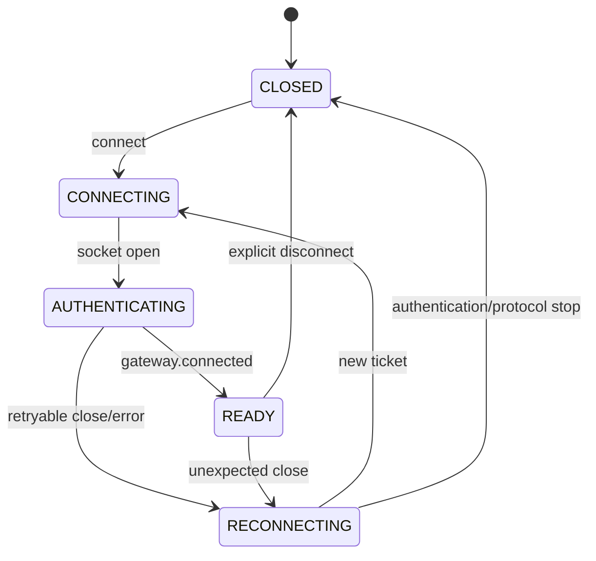
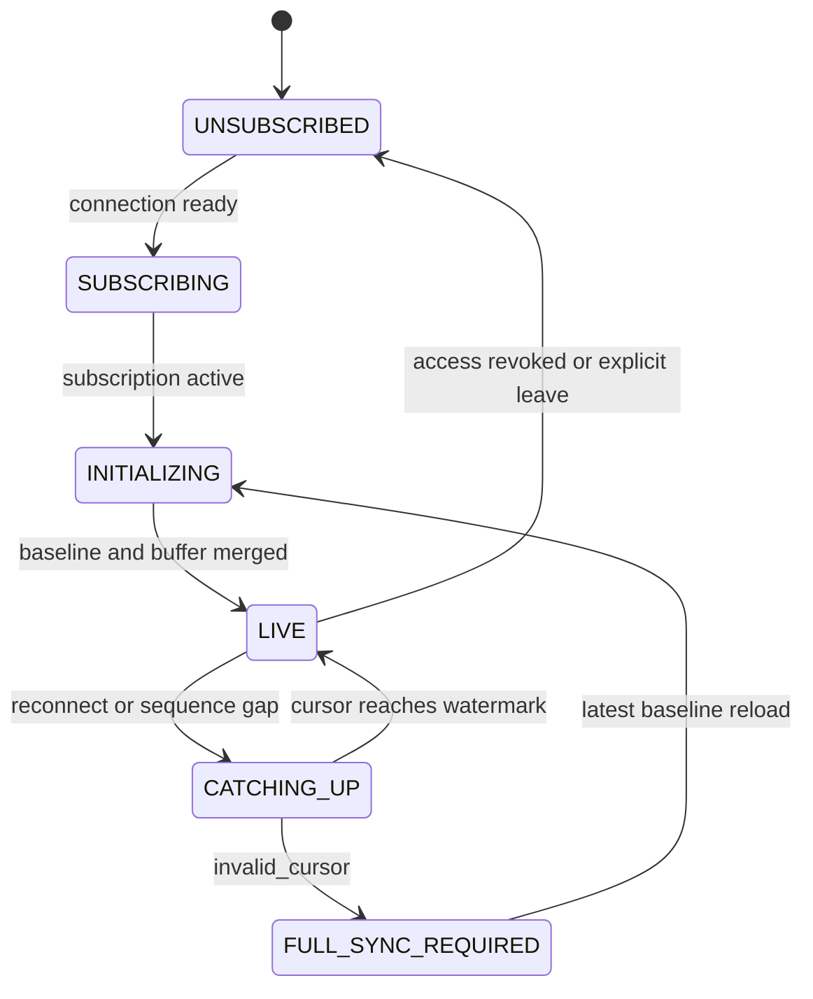
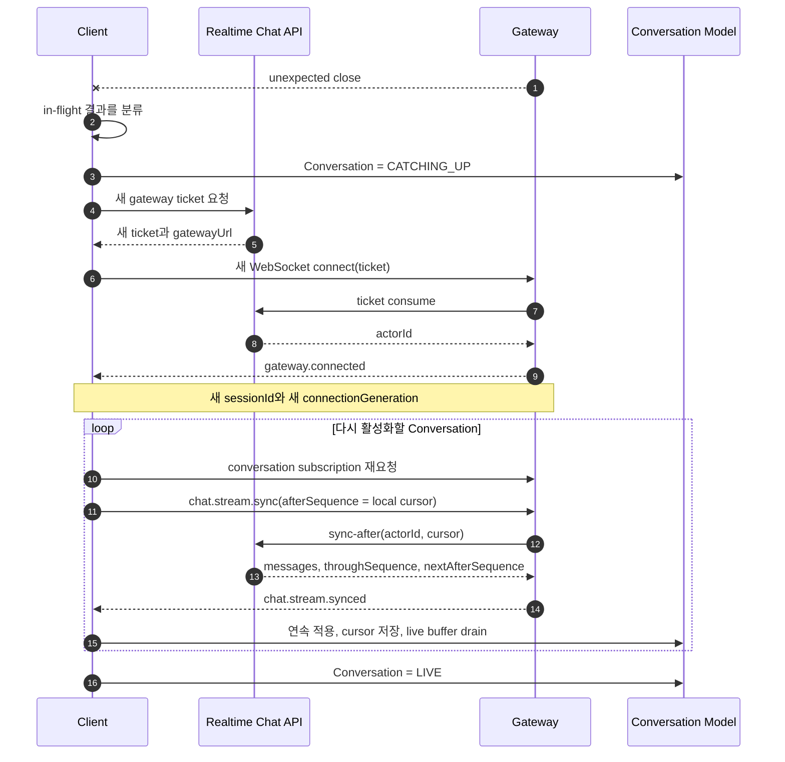
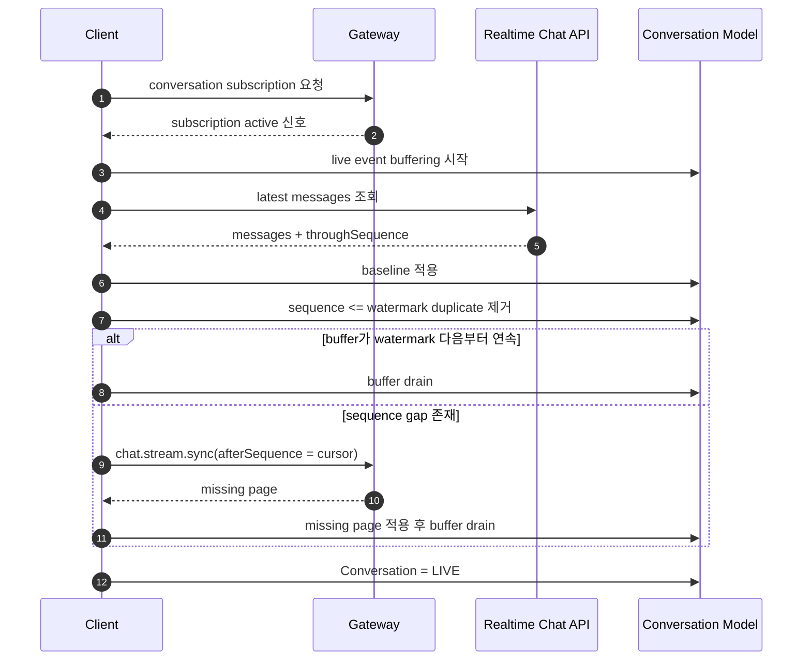

# 10. 재접속·재개·동기화 정책

## 1. 문서 목적과 표기

이 문서는 현재 구현에서 확인된 복구 수단을 출발점으로, 학습 프로젝트에서 사용할 재접속·동기화
행동을 정리한다. 최종 기능 요구사항이나 비기능 요구사항을 정의하지 않으며, 구현 상태를 과장하지
않는다.

문서 안의 표기는 다음과 같다.

| 표기 | 의미 |
| --- | --- |
| `Current` | 2026-07-28 저장소 코드와 contract에서 확인된 현행 |
| `P` | 학습 프로젝트가 이후 시나리오와 event 설계를 위해 채택하는 Project Decision |
| `Open` | 이 문서에서 수치나 세부 동작을 확정하지 않는 항목 |

`P`는 현재 구현 완료를 의미하지 않는다. `Current`와 다른 `P`는 후속 구현 또는 contract 변경이 필요한
결정이다.

## 2. 현행 기반

### 2.1 Current

- Gateway ticket은 일회성이며, 연결할 때 API를 통해 소비한다.
- 연결마다 새 `sessionId`와 `connectionGeneration`이 생긴다.
- Gateway session과 channel Set은 local memory이며 socket close나 프로세스 종료 시 사라진다.
- Gateway에는 heartbeat, resume command, resume token, stable logical session 저장소가 없다.
- Client realtime session model은 예상하지 않은 close 뒤 새 ticket과 새 socket으로 다시 연결할 수 있다.
- 현재 browser channel 흐름은 새 connection generation마다 join을 다시 보내고 page-lifetime cursor로
  latest 또는 sync-after 복구를 실행한다.
- Stream Messages는 channel별 `streamId`와 연속 `sequence`를 제공한다.
- Client는 `afterSequence`와 선택적인 `throughSequence`로 누락 message page를 요청할 수 있다.
- `clientMessageId`는 actor·stream 범위 message-send 멱등성에 사용된다.
- `chat.message.accepted`는 API가 저장된 message 또는 같은 멱등 키의 기존 message를 반환한 뒤 생성된다.
- `invalid_cursor` rejection은 존재하지만, 이를 받아 full sync로 전환하는 Gateway orchestration은 없다.
- Client timeline model에는 live message buffering, sequence gap 감지, duplicate identity 확인, cursor 저장
  재료가 있다. Connection generation bootstrap은 sync-after를 실행하지만, 연결 중 live gap만으로 새
  bootstrap을 자동 시작하지는 않는다.

### 2.2 현행과 정책 사이의 핵심 차이

현행 browser channel 흐름은 재연결, generation별 join, cursor sync를 부분적으로 조율한다. 다만 구독
ACK, 일반 Conversation 계약, browser reload 이후 cursor, `invalid_cursor` Full Sync까지 묶은 범용
resume protocol은 없다. 따라서 이 문서의 `P`는 “기존 Gateway session을 살린다”가 아니라 다음 조합을
복구의 기본 형태로 명명하고 일반화한다.

```text
새 ticket
→ 새 WebSocket connection
→ 새 Gateway session
→ 대화 재구독
→ 대화별 cursor catch-up
→ live 상태 복귀
```

## 3. 용어 결정

| 용어 | P에서의 의미 |
| --- | --- |
| Connection | 실제 WebSocket 연결 하나 |
| Gateway Session | 한 Connection에 결합된 현재 Gateway local session |
| Client Session Namespace | 한 Client runtime에서 인증된 realtime connection을 공유하는 local 범위 |
| Conversation | 독립적인 message ordering과 recovery cursor를 갖는 대화 |
| Subscription | 현재 Connection이 특정 Conversation의 live event를 받도록 등록된 상태 |
| Delivery Sync Cursor | 특정 Client storage profile이 해당 Conversation에서 연속 적용을 끝낸 sequence |
| Resume | 이전 Gateway Session 재사용이 아니라, 새 Session에서 subscription과 cursor state를 재구성하는 과정 |
| Full Sync | 사용할 수 없는 cursor를 버리고 authoritative latest baseline을 다시 세우는 과정 |
| Commit ACK | message가 저장되었거나 같은 멱등 키의 기존 저장 결과가 확인되었음을 알리는 응답 |

### P-RS-001 — transport session은 재사용하지 않는다

`P`: 재접속은 이전 `sessionId`나 `connectionGeneration`을 복원하지 않는다. 매번 새 ticket을 발급받고 새
Gateway Session을 만든다. 이전 generation은 늦은 응답을 버리는 경계로만 사용한다.

이 결정에서 `Resume`은 transport session resume가 아니라 **conversation state resume**다.

## 4. 연결과 대화 복구 상태

Connection 상태와 Conversation 동기화 상태를 분리한다. WebSocket이 ready여도 각 Conversation은 아직
복구 중일 수 있다.





### P-RS-002 — ready를 두 층으로 구분한다

`P`:

- Connection Ready는 `gateway.connected`를 검증한 상태다.
- Conversation Live는 subscription이 활성화되고 baseline·catch-up·buffer merge가 끝난 상태다.
- Connection Ready만으로 message timeline이 완전히 동기화되었다고 표시하지 않는다.

현재 `chat.channel.join`에는 ACK가 없으므로 `SUBSCRIBING → INITIALIZING`의 확정 신호가 부족하다. 이
지점은 후속 control event 설계에서 해결해야 하는 implementation gap이다.

## 5. 대화별 ordering 정책

### P-ORD-001 — ordering scope

`P`: Message ordering은 전역이 아니라 Conversation의 canonical `streamId` 안에서만 정의한다.

```text
ordering key = streamId + sequence
```

서로 다른 Conversation의 sequence는 비교하지 않는다. 한 Conversation 안에서는 API가 commit할 때
sequence를 부여하며, Client는 sequence가 연속으로 적용된 위치만 delivery sync cursor로 저장한다.

### P-ORD-002 — live message 적용 규칙

현재 cursor가 `c`일 때 live message `m`을 다음과 같이 처리한다.

| 조건 | P 처리 |
| --- | --- |
| `m.sequence <= c`이고 기존 identity와 일치 | duplicate로 보고 다시 적용하지 않음 |
| `m.sequence <= c`인데 같은 sequence의 `messageId`가 다름 | protocol identity conflict, 해당 Conversation 복구 중단 |
| `m.sequence == c + 1` | 즉시 적용하고 cursor를 전진 |
| `m.sequence > c + 1` | live buffer에 보관하고 `afterSequence=c` catch-up 시작 |
| 같은 `messageId`가 다른 sequence로 관찰됨 | protocol identity conflict |

Message를 socket에서 **받은 시점**이 아니라 timeline에 연속으로 **적용한 시점**에 cursor를 전진한다.

### P-ORD-003 — 유한 catch-up 구간

`P`: Catch-up 첫 응답에서 정해진 `throughSequence`를 복구 작업의 watermark로 고정한다. 후속 page는
같은 watermark를 사용한다. Watermark 이후 live message는 별도 buffer에 두고, catch-up이 끝난 뒤
연속 순서로 drain한다.

이 결정은 계속 증가하는 live tail 때문에 catch-up 종료 지점이 움직이는 것을 막는다.

### P-ORD-004 — ACK와 live event의 순서를 가정하지 않는다

`P`: Sender Client는 `chat.message.accepted`와 같은 message의 `chat.message.created` 중 어느 것이 먼저
도착해도 같은 `messageId`·`streamId`·`sequence`로 합친다. 수신 순서를 message state의 기준으로
사용하지 않는다.

현행 같은 Gateway의 단일 API 응답 경로는 sender `accepted` 전송 호출을 local `created` fan-out보다
먼저 시작한다. 그러나 이를 장기 wire 계약이나 application 적용 완료 보장으로 승격하지 않으며, 동시
command나 이후 durable delivery 경계를 포함한 Client 정책은 두 순서를 모두 처리한다.

## 6. Commit ACK 정책

### 6.1 ACK 단계 분리

| 단계 | 현재 관찰 신호 | P 이름 | 의미 |
| --- | --- | --- | --- |
| Socket 송신 호출 | Client 내부 send 성공 | Transport Send | frame을 local socket API에 넘김 |
| Gateway 수신 | 별도 event 없음 | Gateway Received | 현재는 관찰 불가 |
| API commit | `chat.message.accepted` | Commit ACK | 저장 완료 또는 같은 멱등 키의 기존 저장 결과 확인 |
| Gateway fan-out | `chat.message.created` | Live Delivery | 특정 connection으로 event 전송 |
| Client 적용 | Client local state | Applied | timeline에 sequence를 연속 적용 |
| 사용자 읽음 | 현행 신호 없음 | Read | 별도 Read Cursor domain state이며 delivery와 다른 의미 |

### P-ACK-001 — accepted의 의미

`P`: `chat.message.accepted`는 Commit ACK로 해석한다.

Commit ACK가 보장하는 것:

- 서버가 message identity와 stream sequence를 확정했다.
- message가 저장되었거나 동일 멱등 키의 기존 저장 message를 확인했다.
- 응답의 `PublicMessage`를 authoritative result로 사용할 수 있다.

Commit ACK가 보장하지 않는 것:

- 다른 Client에게 fan-out되었다.
- 특정 recipient가 event를 받거나 적용했다.
- 사용자가 message를 읽었다.

### P-ACK-002 — ACK 유실은 unknown outcome이다

`P`: Client가 send 뒤 Commit ACK나 명시적 rejection을 받기 전에 connection을 잃으면 결과를
`UNKNOWN_COMMIT`으로 본다. “실패했으므로 저장되지 않았다”고 단정하지 않는다.

재시도할 때는 같은 logical send의 `clientMessageId`를 그대로 사용한다. Accepted가 돌아오면 pending
item을 authoritative `messageId`와 `sequence`에 결합한다.

## 7. `clientMessageId` 멱등성 정책

### P-IDEM-001 — 실제 중복 제거 키

`P`: Message send의 중복 제거 기준은 현재 구현과 같이 다음 조합이다.

```text
actorId + streamId + clientMessageId
```

`commandId`는 선택 correlation 값이며 message 생성 멱등 키로 사용하지 않는다.

### P-IDEM-002 — 재시도 시 payload 불변

`P`: 같은 `clientMessageId`를 재사용하는 모든 retry는 같은 logical command여야 한다. Target이나 content를
바꾼 send는 새 `clientMessageId`를 만든다.

Client 동작은 다음과 같다.

```text
새 message 작성
→ 새 clientMessageId 생성
→ pending 저장
→ send
→ ACK 유실 또는 reconnect
→ 같은 clientMessageId와 같은 payload로 retry
→ 기존 또는 새로 commit된 같은 PublicMessage 수신
```

여러 device가 같은 actorId를 공유하므로 `clientMessageId`는 device 간에도 충돌하지 않는 값이어야 한다.
단순한 tab-local 증가 숫자를 actor-wide identity로 사용하지 않는다.

### P-IDEM-003 — 중복 live delivery

`P`: `chat.message.created`가 중복 도착해도 `messageId`와 stream `sequence`가 기존 identity와 같으면 한
번만 적용한다. 같은 ID가 다른 sequence를 가리키거나 같은 sequence가 다른 ID를 가리키면 조용히
덮어쓰지 않고 protocol failure로 분류한다.

## 8. 재접속과 cursor catch-up

### P-RS-003 — 기본 재접속 흐름



`P`:

1. 명시적인 logout·disconnect는 자동 재접속하지 않는다.
2. 예상하지 않은 close는 기존 ticket이나 session ID를 재사용하지 않는다.
3. HTTP 인증 상태로 새 one-time ticket을 요청한다.
4. `gateway.connected`가 오기 전 application command를 보내지 않는다.
5. 새 Connection에서 필요한 Conversation을 다시 구독한다.
6. Conversation마다 저장된 delivery sync cursor로 catch-up한다.
7. 각 Conversation은 독립적으로 `LIVE`가 된다.

재접속 지연 방식의 구체적인 횟수·시간 값은 이 문서에서 정하지 않는다. 재시도는 취소 가능해야 하고,
명시적 disconnect와 인증 실패 뒤에는 중단해야 한다.

### 8.1 in-flight 작업 분류

| close 시점의 작업 | P 처리 |
| --- | --- |
| Commit ACK를 받은 message | commit 완료로 유지, live duplicate는 identity로 병합 |
| 명시적 rejection을 받은 message | terminal rejected로 유지 |
| ACK도 rejection도 없는 message | `UNKNOWN_COMMIT`, 재연결 뒤 같은 `clientMessageId`로 retry 가능 |
| 진행 중 Stream sync | 이전 generation 결과를 폐기하고 새 session에서 cursor로 다시 시작 |
| 아직 연속 적용하지 않은 live event | memory buffer가 사라질 수 있으므로 저장 cursor부터 catch-up |

## 9. delivery sync의 `invalid_cursor`와 Full Sync

### 9.1 Current

sync-after API와 relay는 delivery cursor의 `invalid_cursor`를 domain rejection으로 구분해 반환한다.
현재 Gateway는 이 결과를 `chat.stream.sync.rejected`로 전달할 뿐 full sync를 시작하지 않는다.

### P-SYNC-001 — 같은 cursor를 반복하지 않는다

`P`: catch-up에서 `invalid_cursor`를 받으면 같은 delivery cursor로 sync를 반복하지 않는다. 해당 Conversation만
`FULL_SYNC_REQUIRED`로 바꾸고 저장된 delivery sync cursor를 더 이상 authoritative하게 사용하지 않는다.

### P-SYNC-002 — Full Sync 절차

```text
invalid_cursor
→ 해당 Conversation의 live 적용 일시 정지와 buffer 시작
→ local recovery cursor 무효화
→ latest authoritative baseline 조회
→ baseline의 throughSequence를 새 cursor로 설정
→ baseline 이하 buffered duplicate 검증 후 제거
→ baseline 이후 buffered event를 연속 적용
→ gap이 남으면 새 cursor에서 sync-after
→ LIVE
```

여기서 Full Sync는 전체 역사 archive를 모두 내려받는다는 뜻이 아니다. 현재 화면과 이후 delivery를
안전하게 다시 시작할 수 있는 authoritative latest baseline을 만드는 뜻이다. 더 오래된 history는
기존 older pagination으로 별도 조회한다.

### P-SYNC-003 — 폐기 범위

`P`: 한 Conversation delivery cursor의 `invalid_cursor` 때문에 다른 Conversation의 cursor나 timeline을 지우지 않는다.
Recovery cursor는 delivery state이며 사용자 read 상태와도 별개로 다룬다.

Baseline과 buffered event에서 message identity conflict가 발견되면 임의의 한 값을 선택하지 않는다.
해당 Conversation을 protocol failure로 유지하고 진단 가능한 상태로 남긴다.

## 10. 초기 이력과 live event 결합

초기 접속에도 “history 조회 중 생긴 새 message”라는 race가 있다. Snapshot과 live subscription을 단순히
이어 붙이면 누락이나 중복이 생길 수 있다.

### P-INIT-001 — subscribe, buffer, baseline, merge

`P`: 초기 Conversation 로드는 다음 순서를 사용한다.



현재 `chat.channel.join`에는 `subscription active` 응답이 없다. 따라서 위 정책을 완전하게 관찰 가능하게
하려면 후속 command/control event 설계에서 구독 성공·거절 결과를 정의해야 한다. 그 전에는 Client가
join frame을 보냈다는 사실과 실제 구독 활성화를 구분할 수 없다.

### P-INIT-002 — merge 규칙

- Baseline의 `throughSequence`를 초기 delivery sync cursor로 사용한다.
- Baseline에 포함된 각 message의 `streamId`, target, `messageId`, `sequence` identity를 검증한다.
- Buffered message의 sequence가 watermark 이하면 같은 identity인지 확인한 뒤 duplicate로 제거한다.
- Watermark보다 큰 message는 연속일 때만 적용한다.
- Gap이 있으면 buffer를 버리지 않고 cursor catch-up 결과와 합친다.
- Cursor는 연속 적용이 끝난 위치까지만 저장한다.

## 11. Multi-device 정책

### P-MULTI-001 — 연결과 session은 device runtime별로 독립적이다

`P`: 같은 actor가 여러 browser·device에서 접속하면 각 runtime은 별도의 Connection과 Gateway Session을
가진다. 한 device의 close, reconnect, sync 실패가 다른 device의 session을 직접 닫거나 되살리지 않는다.

Gateway가 stable device ID를 현재 wire에서 받지 않으므로, 서버는 `sessionId`를 device identity로
간주하지 않는다.

### P-MULTI-002 — 모든 구독 device는 live event 대상이다

`P`: 같은 actor의 다른 device도 Conversation을 구독 중이면 `chat.message.created`를 받을 수 있다.
Sender device는 Commit ACK와 live event를 둘 다 받을 수 있고, 다른 device는 live event로 같은 message를
반영한다. 어느 device에서도 같은 identity를 두 번 표시하지 않는다.

현재 Gateway fan-out은 같은 인스턴스의 local session에 한정된다. 서로 다른 Gateway에 연결된 device까지
전파하는 수단은 현행 implementation gap이다.

### P-MULTI-003 — delivery cursor와 read cursor를 분리한다

`P`:

- Delivery sync cursor는 각 Client storage profile과 Conversation의 복구 진행 상태다.
- Read cursor는 actor와 Conversation 범위에서 사용자가 어디까지 읽었는지를 나타내는 별도 domain
  state이며 뒤로 이동하지 않는다.
- 한 device가 background sync로 message를 받았다는 이유만으로 actor의 read cursor를 전진시키지 않는다.
- 명시적으로 전진한 read cursor는 같은 actor의 다른 활성 device에도 반영하고, offline device는 다음
  동기화에서 서버 기준 cursor를 적용한다.
- read cursor 갱신이 거절되거나 다른 device 전달이 유실돼도 delivery cursor를 폐기하거나 Conversation
  Full Sync를 시작하지 않는다. 서버의 actor+Conversation read cursor를 별도로 재조회한다.

현재 cursor storage는 actor·channel key를 쓰는 page-lifetime 메모리 Map이다. browser reload를 넘지
않으며, 서버 device identity나 read receipt가 아니다.

### P-MULTI-004 — device 간 `clientMessageId` 충돌을 피한다

`P`: Message send ID는 actor의 여러 device에서 동시에 생성해도 충돌하지 않는 방식으로 만든다. 같은
logical message retry에서만 같은 ID를 유지한다.

### P-MULTI-005 — logout 범위를 명령에서 구분한다

`P`: `LogoutDevice`는 선택한 Auth/device session과 연결만 취소하고, `LogoutAllDevices`는 actor의 모든
Auth session과 연결을 취소한다. 한 WebSocket의 정상 close는 그 자체로 actor-wide logout이 아니다.
stable device session identity, 취소 event의 provider 계약과 wire 표현은 `미결정(Open)`이다.

## 12. 결정표

| 주제 | Current | P | 상태 |
| --- | --- | --- | --- |
| 재접속 인증 | 새 ticket 발급이 가능한 Client model 존재 | 매 재접속마다 새 one-time ticket 사용 | 현행 기반 채택 |
| Gateway Session | 연결마다 새 session/generation | 이전 session을 resume하지 않음 | 현행 의미 고정 |
| Resume 의미 | channel Client가 새 session에서 join+cursor 복구를 부분 수행 | 새 session의 subscription+cursor 복구로 일반화 | 구독 ACK·Full Sync gap |
| Ordering 범위 | stream별 sequence 존재 | Conversation stream 안에서만 ordering | 현행 기반 채택 |
| Cursor 전진 | Client timeline에 연속 적용 로직 존재 | 수신이 아니라 연속 적용 뒤 저장 | 현행 의미 고정 |
| Catch-up watermark | `throughSequence` contract 존재 | 한 복구 작업 동안 watermark 고정 | 현행 기반 채택 |
| Commit ACK | accepted가 저장 결과 뒤 생성 | accepted를 Commit ACK로 명명 | 현행 의미 고정 |
| Delivery ACK | 없음 | Commit ACK와 구분하며 현재 도입하지 않음 | 명시적 비보장 |
| Message 멱등성 | actor+stream+clientMessageId 조회 | unknown outcome retry에 같은 ID 사용 | 현행 기반 채택 |
| `commandId` | optional echo | correlation 전용, dedupe에 사용하지 않음 | 현행 의미 고정 |
| ACK/live 순서 | 보장 없음 | 순서를 가정하지 않고 identity merge | 후속 Client 검증 필요 |
| Sequence gap | live gap buffer와 generation bootstrap의 sync-after 구현 | buffer 유지 후 cursor catch-up | live gap trigger는 미구현 P |
| catch-up `invalid_cursor` | rejection 전달만 함 | 해당 Conversation delivery state만 Full Sync | 미구현 P |
| 초기 history/live 결합 | 개별 latest·join·timeline 기능 존재 | subscribe→buffer→baseline→gap sync | 구독 ACK가 선행 gap |
| 재구독 | browser channel Client가 generation마다 join 재전송 | 필요한 Conversation을 다시 구독 | channel 부분 현행; ACK·일반화 gap |
| Multi-device session | actor 아래 여러 local session 가능 | 각 runtime connection·recovery 독립 | 정책 채택 |
| Multi-device delivery | 같은 인스턴스 구독 session fan-out | 모든 구독 device가 동일 identity 반영 | cross-Gateway gap 존재 |
| Delivery cursor | actor·channel page-lifetime 메모리 | Client 복구 state로 유지; reload 이후 지속 방식은 Open | read cursor와 분리 |
| Read cursor | 없음 | actor+Conversation 단위로 단조 증가하고 여러 device에 동기화 | 미구현 P |
| Read cursor 실패 | 없음 | authoritative read cursor만 재조회하고 delivery Full Sync와 분리 | 미구현 P |
| Logout 범위 | socket close만 존재 | device-only와 actor-wide 취소를 별도 명령으로 집행 | provider·stable identity Open |
| Heartbeat | 없음 | `—` (채택 여부부터 결정하지 않음) | 도입 여부·주체·interval·deadline 모두 Open |
| Reconnect delay | Client에 현재 기본 retry 구현 존재 | 취소 가능한 점진적 재시도만 결정 | 세부 값 Open |
| Stable device ID | wire에 없음 | sessionId로 대체하지 않음 | 필요성 Open |

## 13. 오류별 복구 결정

| 관찰 결과 | P 분류 | P 행동 |
| --- | --- | --- |
| 명시적 Client disconnect | 정상 종료 | 재접속하지 않음 |
| 예상하지 않은 socket close | transport interruption | 새 ticket과 새 session으로 재접속 |
| ticket rejection | authentication 경계 | 해당 ticket 폐기, HTTP 인증 상태를 확인한 뒤에만 새 ticket 요청 |
| `gateway.not_ready` | connection not ready | application command 중단, `gateway.connected`까지 대기 |
| message rejection | domain rejection | 같은 command 자동 retry하지 않음 |
| message ACK 전 close | unknown commit | 같은 `clientMessageId`·payload로 재확인 가능 |
| stream `rate_limited` | retry hint가 있는 일시 중단 | 해당 Conversation recovery를 보류한 뒤 같은 cursor에서 재개 |
| stream infrastructure failure | retryable sync failure | Connection과 분리해 해당 Conversation sync 재시도 가능 |
| catch-up의 `invalid_cursor` | delivery cursor unusable | 같은 cursor retry 금지, Conversation Full Sync |
| older history의 `invalid_cursor` | history pagination cursor unusable | delivery cursor는 유지하고 history pagination 경계만 재획득 |
| identity conflict | protocol failure | 자동 덮어쓰기 금지, 해당 Conversation 복구 중단 |
| 서버 정상 shutdown close | transport interruption | 명시적 logout이 아니라면 새 connection 경로 사용 가능 |

이 표는 사용자에게 보여 줄 최종 문구, 재시도 횟수, 시간 제한 또는 서비스 수준 목표를 정하지 않는다.

## 14. 후속 문서에서 연결할 항목

이 정책을 이후 시나리오와 event catalog에 연결할 때 다음 구분을 유지한다.

- 재접속 control flow: 새 ticket과 새 Gateway Session을 만들며 별도 `ReconnectConnection` command는
  두지 않음
- `RestoreSubscription`: 새 Connection에서 Conversation subscription을 다시 만드는 command
- `CatchUpConversation`: delivery sync cursor 이후 sequence를 재생하는 command
- `FullSyncConversation`: delivery sync의 invalid cursor 뒤 authoritative baseline을 다시 만드는 command
- `MessageCreated` + Commit ACK: 저장 사실과 sender 제어 결과
- `chat.message.created` Live Delivery: socket 전달 projection이며 Commit ACK와 다른 단계

Heartbeat control event, subscription ACK의 구체적 wire 이름, stable device ID 도입 여부는 이 문서에서
확정하지 않는다. 해당 항목을 후속 event catalog에서 결정할 때도 `Current`와 `P`를 혼합해 현재 구현인
것처럼 기록하지 않는다.

`Current` 항목의 상세 구현 근거와 line index는
`docs/realtime-chat/02-current-gateway-api-flow.md`의 “구현 근거 인덱스”를 따른다.
