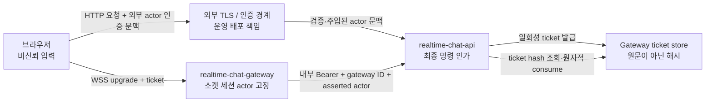

# 11. 실시간 채팅 보안 및 데모 데이터 정책

## 1. 문서 목적과 상태 표기

이 문서는 실시간 채팅 선행 작업에서 확인할 보안 경계, 데모 데이터 처리 원칙, 로그 및 비밀값 정책, 최소 보안 실패 시나리오를 정의한다. 제품 출시를 위한 최종 기능 요구사항(FR)이나 비기능 요구사항(NFR), 성능 목표를 확정하는 문서는 아니다.

본문에서는 다음 표기를 사용한다.

| 표기 | 의미 |
| --- | --- |
| **현행 (Current)** | 현재 저장소 구현 또는 설정 검증으로 확인된 동작 |
| **P** | 학습 프로젝트가 채택한 Project Decision. 후속 구현과 검증은 이 결정을 기준으로 한다. |
| **미구현 (Gap)** | `P`로 채택한 정책이 현재 코드 또는 운영 구성에 아직 반영되지 않은 상태 |
| **미결정 (Open)** | 후속 판단이 필요한 방식이나 값. 실제로 선택지가 열려 있는 항목에만 사용한다. |

위협 점검의 참고 자료는 사용자가 제공한 [OWASP WebSocket Security Cheat Sheet](https://cheatsheetseries.owasp.org/cheatsheets/WebSocket_Security_Cheat_Sheet.html)로 한정한다. 이 링크는 위협 누락을 줄이기 위한 체크리스트이며, 그 내용을 그대로 최종 FR/NFR이나 수치 목표로 채택하지 않는다.

## 2. 보호 대상과 신뢰 경계

보호 대상은 사용자 행위 주체(actor), 채널 및 메시지 접근 권한, 메시지 내용, 연결 티켓, 내부 서비스 인증 토큰, 세션 및 요청 식별자, 연결·오류 로그다.

신뢰 경계의 기본 원칙은 다음과 같다.

- **P:** 브라우저가 보낸 `actorId`, 사용자 ID, Conversation 식별자와 라우팅 키는 그 자체로 권한의
  근거가 아니다. `channelId`는 현행 식별자의 한 예다.
- **P:** 외부 actor 문맥은 인증된 엣지가 클라이언트의 동일 이름 헤더를 제거한 뒤 검증 결과로 새로 주입해야 한다.
- **P:** Gateway가 주장하는 actor는 내부 서비스 인증과 Gateway 식별 검증이 모두 성공한 뒤에만 신뢰한다.
- **P:** Gateway는 연결 actor를 ticket consume 결과로 고정하고, 클라이언트 메시지의 actor 필드로 교체하지 않는다.
- **P:** 데이터 조회·구독·작성·수정·삭제에 대한 최종 명령별 인가는 API가 담당한다. Gateway 연결
  성공만으로 Conversation 권한이 부여되지 않는다.

## 3. 현재 구현된 보안 통제

| 영역 | 현행 (Current) | 보안 의미와 한계 |
| --- | --- | --- |
| WebSocket upgrade 경로 | 설정된 경로와 정확히 일치해야 하며, 누락되거나 허용 목록에 없는 `Origin`은 거부한다. | 브라우저 기반 교차 출처 연결을 제한한다. 비브라우저 클라이언트의 신원 인증을 대체하지 않는다. |
| WebSocket 프레임 | `maxPayload`가 설정되며 `perMessageDeflate`는 꺼져 있다. 이진 프레임, 잘못된 JSON, 지원하지 않는 메시지 유형은 거부한다. | 무제한 단일 프레임과 일부 파서 공격 표면을 줄인다. 메시지 빈도와 송신 큐 제어는 별개다. |
| 메시지 스키마 | 지원 이벤트는 엄격한 스키마와 텍스트 바이트 한계를 적용한다. 서버 소유 필드를 일부 내부 요청 본문에서 거부한다. | 알 수 없는 필드와 actor·stream 등 서버 소유 값의 덮어쓰기를 제한한다. |
| Gateway ticket 저장 | 암호학적으로 생성한 원문 ticket의 SHA-256 해시, actor, 할당 Gateway, 발급·만료 시각과 nullable 소비 시각을 저장한다. consume 성공 시 소비 시각을 갱신한다. | 저장소 유출 시 사용 가능한 ticket 원문 노출을 줄인다. |
| Gateway ticket 소비 | 제시된 원문을 해시한 뒤, 할당 Gateway 일치·미소비·미만료 조건으로 원자적 consume 한다. 실패 이유는 외부에 세분화하지 않는다. | 정상적인 재사용과 경쟁 소비를 차단한다. consume 전 탈취와 URL 유출 위험까지 제거하지는 않는다. |
| 내부 API 인증 | 내부 경로에 Bearer 서비스 토큰을 먼저 확인하고, Gateway ID가 설정값과 일치하는지 확인한다. 메시지 전달에서는 asserted actor를 별도 헤더로 전달한다. | 서비스 호출자와 actor 주장을 분리한다. Gateway ID는 식별자이지 비밀값이나 독립 인증 수단이 아니다. |
| 운영 전송 설정 | production에서 내부 전송 보안을 `development`로 둘 수 없다. `direct-tls`는 HTTPS API URL을 요구하며, API는 외부 Gateway URL에 WSS를 요구한다. | 잘못된 평문 운영 설정을 시작 시 거부한다. `service-mesh-tls`는 배포 환경의 실제 TLS 구성을 신뢰하는 선언이며 애플리케이션 자체가 TLS를 구현하는 것은 아니다. |
| 로그 내용 | 명시적인 애플리케이션 로그는 주로 요청·세션 식별자, actor, generation, 오류와 건수·바이트를 남기며 raw ticket이나 전체 메시지 본문을 직접 기록하지 않는다. | 현재 관찰 결과일 뿐 중앙 redaction 정책은 없다. 오류 객체나 프록시 접근 로그를 통한 간접 유출 가능성을 별도로 통제해야 한다. |

외부 WSS는 애플리케이션의 HTTP 서버 자체가 아니라 운영 배포 계층에서 종료될 수 있다. 따라서 production 설정 검증이 실제 인증서 검증, TLS 종료, 프록시 헤더 정제까지 보장한다고 해석해서는 안 된다.

## 4. 개발·데모 편의 기능과 현재 공백

다음 항목은 운영 보안 통제로 오해하면 안 된다.

| 항목 | 현재 상태 | 구분 및 후속 정책 |
| --- | --- | --- |
| 브라우저 `?actor=` 및 `x-actor-id` | 웹 런타임이 query의 actor를 읽고 API 요청 헤더로 보낸다. | **P:** 로컬 개발·데모 전용이다. production 번들 및 경로에서는 제거하고, 인증된 엣지는 클라이언트가 보낸 동일 이름 헤더를 덮어쓴다. 환경별 차단은 **미구현**이다. |
| WebSocket `?ticket=` | 브라우저 소켓 URL query parameter로 일회성 ticket을 전달한다. | **P:** ticket은 짧게 존재하는 bearer secret으로 취급한다. 프록시·접근 로그·브라우저 진단 정보에서 query를 제거하거나 마스킹해야 한다. |
| 채널 권한 | 현재 MVP 권한 정책은 인증된 actor의 채널 읽기·쓰기를 전면 허용하고 DM·thread는 거부한다. | **P:** 실제 멤버십과 역할 기반 인가로 교체한다. 현재 전면 허용은 데모 범위를 벗어난 보안 통제가 아니다. |
| `chat.channel.join` | Gateway의 로컬 구독 집합에 채널을 추가하며 API 인가를 거치지 않는다. | **P:** 서버 데이터 전달 전에 Conversation 조회 권한을 검증하고, 권한 상실 시 구독을 회수한다. 이 인가·회수 연결은 **미구현**이며 join 성공 ACK 계약은 **미결정**이다. |
| heartbeat 및 세션 재검증 | ping/pong heartbeat, 장기 연결의 인증 재검증, logout·권한 변경에 따른 강제 종료가 연결되어 있지 않다. | 세션 취소·권한 회수 전파는 P지만 **미구현**이다. heartbeat 도입 여부와 주기·종료 규칙은 **미결정**이다. |
| rate limit | 일반 분산 rate limiter 구성 요소와 선택적 hook은 API/Gateway 런타임에 주입되지 않았다. Stream sync에는 같은 session+channel의 동시 요청을 막는 in-flight guard가 있다. | 일반 연결·actor·명령·메시지 빈도 제한은 **미구현**이다. 구체적인 키, 한계값, 저장소 장애 시 동작은 **미결정**이다. |
| backpressure | `bufferedAmount`, 연결별 송신 큐 상한, 느린 소비자 종료 정책이 없다. | inbound `maxPayload`는 outbound backpressure를 해결하지 않는다. bounded queue와 느린 소비자 종료는 **미구현**이고, 구체적인 한계값과 재동기화 방식은 **미결정**이다. |
| 로그 redaction | API와 Gateway logger에 중앙 민감 필드 redaction 설정이 없다. | **P:** 애플리케이션과 인프라 로그 모두 아래 로그 정책을 적용한다. 중앙 redaction 연결은 **미구현**이다. |

## 5. 인증·인가 및 라우팅 정책

### 5.1 actor 권위

actor 권위는 다음 순서로만 승격한다.

1. 브라우저 query, header, JSON body의 actor 값은 비신뢰 입력이다.
2. 외부 API 경계에서는 인증된 엣지가 검증하고 주입한 actor 문맥만 사용한다.
3. API가 발급한 ticket에는 actor와 할당 Gateway가 결합되며 원문은 저장하지 않는다.
4. Gateway는 ticket consume 결과의 actor를 연결 세션에 고정한다.
5. Gateway가 API를 호출할 때는 내부 Bearer 인증, Gateway ID 확인, asserted actor 전달을 서로 분리한다.
6. API는 각 명령의 리소스와 actor를 결합해 최종 인가한다.

`trusted-edge` 설정은 런타임에서 actor를 암호학적으로 검증하는 구현이 아니라 배포 경계가 올바르게 헤더를 정제·주입한다는 신뢰 선언이다. **P:** 운영 프록시는 외부에서 들어온 actor 및 내부 서비스용 헤더를 반드시 제거하고, 인증 결과와 내부 연결 문맥으로 다시 생성한다.

### 5.2 명령별 인가

- **P:** Conversation 구독과 읽기에는 현재 멤버십, 차단 상태, 공개 범위를 확인한다.
- **P:** 메시지 작성에는 Conversation 쓰기 권한과 actor 상태를 확인한다.
- **P:** 메시지 소유자는 자신의 메시지를 수정·삭제할 수 있다. Moderator는 관리 범위 안의 다른 actor 메시지를 삭제할 수 있지만 타인 명의의 내용을 수정할 수 없다. 현재 wire protocol에 없는 명령은 지원하지 않는 유형으로 거부한다.
- **P:** 권한 변경, Conversation 접근 회수, 계정 정지, logout이 기존 연결과 구독에 어떻게 전파되는지
  정의하고, 더 이상 허용되지 않는 구독은 제거한다.
- **P:** 현행 `channelId`와 향후 Conversation ID, `streamId`, `messageId` 같은 라우팅 키는 actor 권한
  범위 안에서 서버가 검증한다. 클라이언트가 보낸 값만으로 다른 사용자나 Conversation으로 라우팅하지
  않는다.
- **P:** 화면 출력은 메시지 텍스트를 신뢰하지 않고 안전하게 escape 또는 sanitize한다. Markdown·링크 기능을 추가한다면 허용 목록 기반 렌더링을 적용한다.
- **P:** 재시도 가능한 쓰기는 `clientMessageId` 등 멱등성 키를 actor 및 대상 리소스와 함께 검증한다. 같은 키로 다른 내용이나 대상을 덮어쓰지 못하게 한다.

## 6. Ticket과 장기 연결 정책

### 6.1 ticket

- **현행:** 원문 ticket은 발급 응답과 consume 요청 사이에서만 사용하며, 저장소에는 해시만 보관한다.
- **현행:** consume은 할당 Gateway, 미소비 상태, 만료 시각을 하나의 원자적 갱신 조건으로 확인한다.
- **P:** raw ticket은 로그, 분석 이벤트, 오류 메시지, 영속 저장소에 남기지 않는다.
- **P:** URL을 기록할 때는 path만 기록하고 query 전체를 버리거나 `ticket=[REDACTED]`로 대체한다.
- **P:** ticket은 WSS 구간에서만 전달하고, consume 성공 여부와 무관하게 재사용 가능한 자격 증명으로 취급하지 않는다.
- **P:** ticket 검증 실패 응답은 존재 여부, 만료, 이미 소비됨 등의 세부 상태를 공격자에게 구분해 주지 않는다.
- **미결정:** ticket URL 전달 방식을 유지할지, 제한된 수명의 다른 전달 채널로 바꿀지는 배포 로그·프록시 동작을 함께 검증한 뒤 결정한다.

### 6.2 장기 연결

- **현행:** 연결 시 확정된 actor는 해당 소켓 세션 동안 유지된다.
- **현행:** heartbeat, 세션 만료 재확인, logout 및 권한 취소 이벤트와 소켓 종료가 연결되어 있지 않다.
- **P:** 인증 만료, 계정 정지, logout, 권한 취소 후 기존 연결이 무기한 살아 있지 않도록 재검증 또는 취소 전파 방식을 둔다.
- **P:** 인증·권한 취소는 기존 연결과 구독에 전파되어야 하며, heartbeat를 도입하더라도 인증 갱신을
  대신하지 않는다.
- **미구현:** 인증·권한 취소 전파와 장기 연결 재검증은 현재 소켓 수명주기에 연결되지 않았다.
- **미결정:** heartbeat 도입 여부·간격·허용 누락 횟수, 재인증 시점, close code, 클라이언트 재연결
  동작은 복구 정책과 함께 정한다.

## 7. 입력 검증, 유량 제어 및 느린 소비자

### 7.1 입력 검증

- **현행:** 이진 프레임을 거부하고, JSON 파싱과 이벤트별 엄격한 스키마를 적용하며, 단일 WebSocket payload와 메시지 텍스트 크기를 제한한다.
- **P:** 알 수 없는 이벤트와 필드는 기본 거부한다.
- **P:** 크기 제한은 UTF-8 바이트 기준인지 문자 수 기준인지 계층별로 명시하고, HTTP·WebSocket·저장소 한계가 모순되지 않게 한다.
- **P:** 파싱 또는 검증 실패는 연결·명령 수준에서 일관된 오류로 처리하고 입력 원문을 로그에 복사하지 않는다.

### 7.2 rate limit

- **현행:** 재사용 가능한 일반 rate limiter 코드는 실제 API와 Gateway 호출 경로에 연결되지 않았다.
  다만 Stream sync는 같은 session+channel의 동시 요청을 in-flight guard로 거절할 수 있다.
- **P:** 최소한 연결 시도, ticket 발급·소비, actor별 쓰기, Conversation별 고비용 조회·동기화에 적합한
  키를 분리한다.
- **P:** 클라이언트가 임의로 보낸 IP 헤더를 rate-limit 키로 신뢰하지 않는다. 신뢰할 수 있는 프록시가 정제한 소스 정보만 사용한다.
- **P:** 제한 초과는 명령 거부 또는 연결 종료 중 해당 비용에 맞는 동작을 사용하며, 메시지 내용은 제한 상태 로그에 남기지 않는다.
- **미구현:** limiter를 API와 Gateway 런타임에 주입하고 위 키를 적용하는 작업이 남아 있다.
- **미결정:** 구체적인 한계값, burst, 분산 저장소, 저장소 장애 시 fail-open 또는 fail-closed 동작은 측정 후 결정한다.

### 7.3 backpressure

- **현행:** 송신 완료 callback은 사용하지만 연결별 outbound queue나 `bufferedAmount` 상한으로 느린 소비자를 제어하지 않는다.
- **P:** 연결별 대기 바이트 또는 메시지 수를 관찰하고, 한계를 넘는 느린 소비자는 오래된 데이터를 무한 적재하지 않도록 종료하거나 재동기화를 요구한다.
- **P:** 서버 전체 메모리 한계와 단일 연결 한계를 구분하고, 한 사용자가 다른 연결의 가용성을 고갈시키지 못하게 한다.
- **미구현:** 연결별 bounded queue, 관측 지표와 느린 소비자 종료가 송신 경로에 연결되지 않았다.
- **미결정:** 큐 상한, 드롭 가능 이벤트, close code, resume cursor와의 상호작용은 부하 및 복구 검증 뒤 결정한다.

## 8. 데모 데이터 및 개인정보 최소화 정책

데모 환경의 기본 문구는 다음과 같다.

> 실제 사용자 개인정보와 행동 분석 데이터를 수집하지 않는다. 서비스 동작에 필요한 데모 사용자 식별자, 합성 메시지, 연결 및 오류 로그만 제한적으로 처리한다.

| 데이터 유형 | P: 허용 및 금지 원칙 |
| --- | --- |
| 데모 계정 | 실제 개인과 연결되지 않는 고정 데모 사용자 ID와 역할만 사용한다. 운영 계정 자격 증명을 재사용하지 않는다. |
| 이메일·이름 | 실제 이메일 대신 예약된 예시 도메인 또는 명백한 가짜 주소를 사용하고, 이름은 합성 이름으로 구성한다. |
| 메시지 | 시연을 위해 작성한 합성 문구만 포함한다. 실제 대화, 고객 문의, 소스 코드 비밀값을 복사하지 않는다. |
| 이미지·첨부 | 직접 제작했거나 사용 권한이 확인된 자산만 사용한다. 실제 인물 사진, 연락처, 문서 메타데이터를 포함하지 않는다. |
| IP·User-Agent | 연결 운영과 오류 진단에 꼭 필요한 최소 범위만 처리하며, 장기 행동 프로필이나 사용자 간 결합 키로 사용하지 않는다. 보존 기간과 익명화 방식은 **미결정**이다. |
| 분석·추적 | 광고, 행동 분석, 제3자 tracking, 실제 사용자 데이터 import를 데모에 연결하지 않는다. |
| 초기화 | 데모 메시지와 세션을 합성 기준 데이터로 되돌리는 reset 절차를 둔다. reset 권한과 실행 주기는 **미결정**이다. |
| 데이터 분리 | 데모와 production의 데이터베이스, 서비스 token, secret, 로그 대상을 분리한다. |

## 9. 로그 마스킹 및 관측 정책

### 9.1 기록 금지 또는 마스킹 대상

**P:** 다음 값은 애플리케이션 로그, 프록시 접근 로그, tracing attribute, 분석 이벤트에 원문으로 기록하지 않는다.

- `Authorization`, `Cookie`, `Set-Cookie`
- `ticket`, access token, refresh token, API key, 내부 서비스 token, secret
- URL query 전체와 인증·actor 전달용 비신뢰 header
- 메시지 전체 본문, raw payload, 첨부 내용
- 세션 secret 또는 재사용 가능한 인증 재료
- 오류 객체에 포함된 요청 body, URL query, 자격 증명

민감 키는 대소문자와 중첩 위치에 관계없이 중앙 redaction 규칙으로 처리한다. 애플리케이션 logger뿐 아니라 reverse proxy, service mesh, APM과 container 수집기에도 같은 원칙을 적용한다.

### 9.2 제한적으로 허용하는 운영 정보

**P:** 진단에 필요한 경우 다음과 같은 최소 메타데이터만 기록한다.

- request ID, 내부 error code, route template, HTTP method, WebSocket close code
- 메시지 건수와 바이트 크기, 처리 시간 구간
- 배포 환경과 서비스·Gateway 식별자
- 보존 필요성이 확인된 actor·session·channel 식별자의 축약 또는 가명 값

actor, session, channel 식별자도 개인정보 또는 행동 결합 키가 될 수 있으므로 원문 기록을 기본값으로 삼지 않는다. 중앙 redaction 적용은 **미구현**이며 로그 보존 기간, 접근 권한, 가명화 키 회전은 **미결정**이다. 외부 오류 응답에는 stack trace나 내부 URL을 포함하지 않는다.

## 10. 비밀값 정책

- **P:** 내부 Bearer token, 서명 키, 데이터베이스 자격 증명은 서버 전용 환경 변수 또는 운영 secret store에서 주입한다.
- **P:** 비밀값을 저장소, 이미지 레이어, 브라우저 번들, `VITE_*` 공개 변수, 예제 로그, 테스트 fixture에 넣지 않는다.
- **P:** 개발·데모·production은 서로 다른 비밀값을 사용하며, 최소 권한과 서비스별 분리를 적용한다.
- **P:** 노출 의심 시 교체할 수 있도록 발급 주체, 소유자, 회전 절차와 폐기 절차를 둔다.
- **P:** Gateway ID, request ID, actor ID는 비밀값이 아니다. 이 값을 안다는 이유만으로 인증되거나 인가되지 않는다.
- **P:** raw ticket은 짧은 수명의 일회성 bearer secret으로 취급하며, 해시 저장이 전송 중 노출을 보완한다고 해석하지 않는다.
- **현행:** production 설정은 충분히 긴 내부 token과 안전한 전송 모드를 요구한다.
- **미구현:** 현재 정적 내부 Bearer token의 무중단 교체와 유출 폐기 자동화는 구현되어 있지 않다.
- **미결정:** 복수 키 수용 기간과 교체 주기는 운영 기준과 함께 정한다.

## 11. 최소 보안 실패 시나리오

아래 시나리오는 선행 작업에서 반드시 실패 동작을 확인할 최소 목록이다. 통과 기준은 최종 FR/NFR 수치가 아니라, 비신뢰 입력이 권한 상승·데이터 유출·무제한 자원 사용으로 이어지지 않는지 확인하는 것이다.

| ID | 공격 또는 실패 입력 | 현재 기대 동작 | P: 추가 확인 또는 미연결 공백 |
| --- | --- | --- | --- |
| SEC-CON-001 | ticket 없이 WebSocket 연결 | Gateway가 인증 실패 close code로 종료한다. | 응답과 로그에 ticket 존재 상세를 노출하지 않는다. |
| SEC-CON-002 | 허용되지 않은 또는 누락된 `Origin` | upgrade를 HTTP 오류로 거부한다. | 배포 프록시가 `Origin`을 덮어쓰지 않는지 확인한다. |
| SEC-CON-003 | 만료·재사용·다른 Gateway용 ticket | 원자적 consume 조건이 실패하고 연결을 종료한다. | raw ticket과 구체적인 실패 사유를 로그에 남기지 않는다. |
| SEC-INT-001 | 없거나 잘못된 내부 Bearer 또는 Gateway ID | 내부 API 호출을 인증 오류로 거부한다. | Gateway ID만 맞춘 호출이 통과하지 않아야 하며 token 회전도 검증한다. |
| SEC-ACTOR-001 | query·header·body에 다른 사용자의 actor를 위조 | 연결 뒤 payload actor는 consumed-ticket actor를 바꾸지 못한다. 그러나 개발 웹의 `?actor=`가 `x-actor-id`가 되고 API가 이를 신뢰해 ticket을 발급하므로 이 경계에서는 위조 가능하다. | production 엣지가 외부 actor·내부 헤더를 제거하고 인증 결과만 주입하는지 확인한다. |
| SEC-AUTHZ-001 | 멤버가 아닌 채널 구독·읽기·쓰기 | 현재 channel join과 채널 읽기·쓰기는 실질적인 멤버십 검증이 없다. | 명령별 멤버십 인가 연결 전에는 보안 완료로 판정하지 않는다. |
| SEC-AUTHZ-002 | 다른 사용자의 메시지 수정·삭제 | 현재 미지원 이벤트는 거부된다. | Moderator의 관리 범위 내 삭제만 허용하고, 다른 actor 명의의 수정은 관리자에게도 허용하지 않는다. |
| SEC-ROUTE-001 | actor, channel, stream, message 라우팅 키 조작 | 일부 내부 body의 서버 소유 필드는 엄격히 거부된다. | 모든 명령이 actor의 실제 권한 범위와 대상 리소스를 결합 검증하는지 확인한다. |
| SEC-PROTO-001 | 이진 프레임, 잘못된 JSON, 알 수 없는 type·field | protocol 위반으로 거부하거나 연결을 종료한다. | 입력 원문을 오류 로그에 복사하지 않는다. |
| SEC-SIZE-001 | WebSocket 한계를 넘는 프레임 또는 텍스트 | `maxPayload` 또는 스키마 바이트 한계에서 거부한다. | 압축·HTTP·저장소 경로에서도 우회가 없는지 확인한다. |
| SEC-FLOW-001 | 짧은 시간에 연결·ticket·메시지를 대량 요청 | 일반 목적 rate limit이 현재 런타임에 연결되지 않았다. | limiter 연결과 분산 장애 동작을 정하기 전에는 DoS 대응 완료로 보지 않는다. |
| SEC-FLOW-002 | 서버 전송을 읽지 않는 느린 소비자 | 현재 연결별 backpressure 종료 정책이 없다. | bounded queue와 종료·resume 동작을 검증한다. |
| SEC-SESSION-001 | 인증 만료·logout·권한 취소 뒤 기존 소켓 사용 | 현재 연결 actor와 구독이 자동 취소되지 않는다. | 재검증 또는 취소 이벤트가 연결과 구독을 회수하는지 확인한다. |
| SEC-REPLAY-001 | 같은 `clientMessageId` 재전송 또는 다른 내용으로 충돌 | 현행은 `(actorId, streamId, clientMessageId)`의 기존 결과를 반환하고 payload 불일치를 검사하지 않는다. | 같은 scoped key의 payload fingerprint가 다르면 기존 성공을 덮어쓰지 않고 `idempotency_conflict`로 거부한다. |
| SEC-XSS-001 | 메시지에 HTML·스크립트·위험한 링크 삽입 | 서버 입력 검증만으로 브라우저 렌더링 안전을 보장하지 않는다. | 모든 출력 경로의 escape·sanitize와 링크 정책을 확인한다. |
| SEC-LOG-001 | ticket·token·메시지 내용이 포함된 실패 요청 | 명시적 로그는 대체로 본문을 남기지 않지만 중앙 redaction은 없다. | 앱·프록시·APM·오류 stack 어디에도 원문이 남지 않는지 검증한다. |

## 12. 선행 작업 의사결정 요약

| 상태 | 항목 |
| --- | --- |
| **현행 (Current)** | Origin allowlist, WebSocket `maxPayload`, 엄격한 메시지 파싱, ticket 해시 저장과 일회성 consume, 내부 Bearer와 Gateway ID 확인, production WSS·내부 TLS 설정 검증 |
| **P** | actor 권위 분리, 엣지 header 정제, API 명령별 인가, raw ticket·메시지 로그 금지, 합성 데모 데이터만 사용, 서버 전용 비밀값 관리, 권한 취소 시 구독 회수 |
| **미구현 (Gap)** | 개발 actor 경로의 production 차단, 실제 Conversation 멤버십 인가 연결, 세션 취소·재검증, 일반 rate limit 주입, backpressure, 중앙 로그 redaction, 내부 token 무중단 교체 |
| **미결정 (Open)** | join ACK 계약, ticket 전달 채널, heartbeat 도입·세부 값, 재인증 세부 값, rate-limit·송신 큐 한계, 로그 보존·가명화, 내부 token 교체 주기 |

## 13. 구현 근거 인덱스

이 문서의 **현행 (Current)** 판단은 다음 코드 경계를 기준으로 한다.

- `apps/realtime-chat-gateway/src/connection/upgrade-policy.ts`: WebSocket 경로 및 Origin allowlist
- `apps/realtime-chat-gateway/src/app.ts`: `maxPayload`, ticket 추출·소비, 연결 actor 고정, frame·message 처리, 로컬 채널 구독과 relay wiring
- `apps/realtime-chat-gateway/src/config/env.ts`: Gateway token, payload, Origin, production 내부 전송 보안 검증
- `apps/realtime-chat-gateway/src/runtime/gateway-api-client.ts`: 내부 Bearer, Gateway ID, asserted actor 전달
- `apps/realtime-chat-gateway/src/runtime/logger.ts`: 현재 Gateway logger 구성
- `apps/realtime-chat-api/src/app.ts`: 내부 Bearer 선행 검증, Gateway 인증, actor assertion, CORS 경계
- `apps/realtime-chat-api/src/config/env.ts`: production `trusted-edge`, WSS, 내부 전송 보안 검증
- `apps/realtime-chat-api/src/runtime/auth-context.ts`: 현재 actor 및 Gateway header 신뢰 방식
- `apps/realtime-chat-api/src/runtime/create-runtime-deps.ts`: 현재 MVP 권한 정책과 runtime dependency wiring
- `apps/realtime-chat-api/src/features/stream-messages/routes.ts`: 선택적 rate limit과 내부 body의 서버 소유 필드 검증
- `apps/realtime-chat-api/src/runtime/logger.ts`: 현재 API logger 구성
- `apps/web/src/features/chat/transport/browserChatRuntime.ts`: 개발 actor query 및 `x-actor-id`
- `packages/realtime-chat-gateway-ticket/src/gateway-ticket.ts`: ticket 생성·해시
- `packages/realtime-chat-gateway-ticket/src/usecases/issue-gateway-ticket/issue-gateway-ticket.usecase.ts`: ticket 발급 저장 경계
- `packages/realtime-chat-gateway-ticket/src/usecases/consume-gateway-ticket/consume-gateway-ticket.usecase.ts`: ticket consume 경계
- `packages/realtime-chat-gateway-ticket/src/usecases/consume-gateway-ticket/consume-gateway-ticket.kysely.ts`: 원자적 소비 조건
- `packages/realtime-chat-stream-messages-client/src/browser-realtime-event-socket.ts`: WebSocket ticket query 전달
- `packages/realtime-chat-stream-messages-gateway/src/gateway-relay.ts`: 선택적 Gateway rate-limit hook
